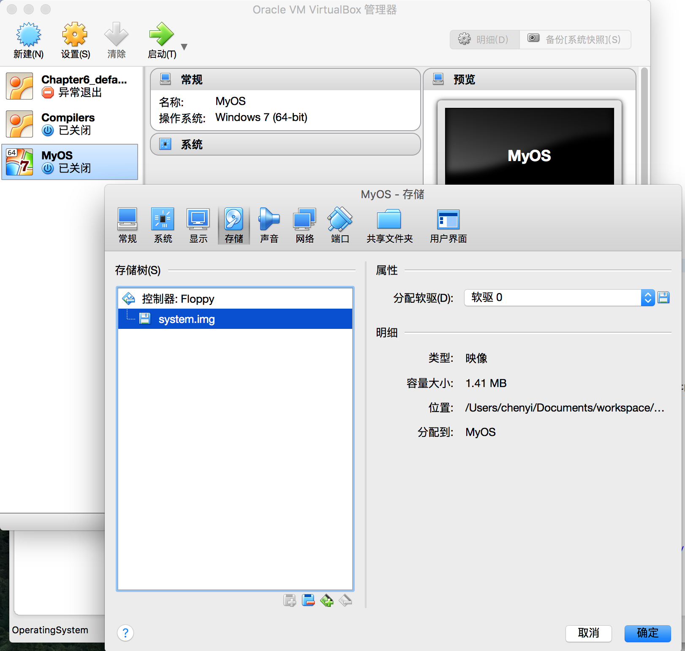
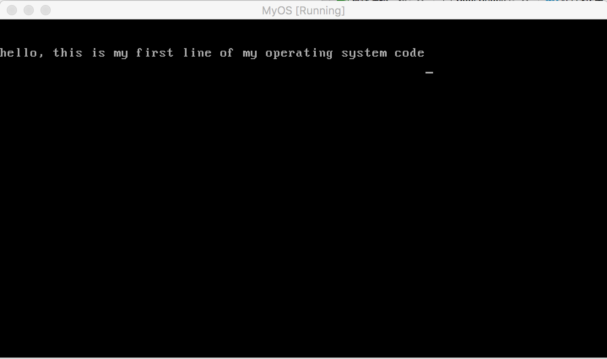

## 一个最小的操作系统内核

用java来做操作系统内核，太搞笑了吧。如果你这么想，同时嘴上发出呵呵一笑。那么我这篇文章的目的也算达到了，评判一篇文章好坏，不就在于它是否能让读者感觉到精神的愉悦吗。如果你笑了，那表明我写了一篇好文章。呵呵！

操作系统，是计算机科学中的皇冠，它作为一个平台，几乎集结了计算机科学里面的所有知识，如硬件，算法，架构，能够写出一个操作系统的人，无一不是行业里的翘楚或大神级人物，像Linux的创始人Torvalds，Android的创始人安迪·鲁宾，苹果早期电脑系统的开发者史蒂夫-沃兹尼亚克，哪一个不是牛逼的闪闪发光，让人膜拜。

我也想牛逼，我也想闪闪发光，所以我也要做一个操作系统，嘿嘿，你笑了吧，笑了的话，就表明我写了一篇好文章^_^!

说到这，我的能量槽已经蓄满，立马要放大招了，小心我的必杀技：

```java
import java.io.DataOutputStream;
import java.io.File;
import java.io.FileInputStream;
import java.io.FileNotFoundException;
import java.io.FileOutputStream;
import java.io.IOException;
import java.io.InputStream;
import java.util.ArrayList;


public class OperatingSystem {
    private int[] imgContent = new int[]{
        0xeb,0x4e,0x90,0x48,0x45,0x4c,0x4c,0x4f,0x49,0x50,0x4c,0x00,0x02,0x01,0x01,0x00,0x02,0xe0,
        0x00,0x40,0x0b,0xf0,0x09,0x00,0x12,0x00,0x02,0x00,0x00,0x00,0x00,0x00,0x40,0x0b,0x00,0x00,0x00,0x00,0x29,
        0xff,0xff,0xff,0xff,0x48,0x45,0x4c,0x4c,0x4f,0x2d,0x4f,0x53,0x20,0x20,0x20,0x46,0x41,0x54,0x31,0x32,
        0x20,0x20,0x20,0x00,0x00,0x00,0x00,0x00,0x00,0x00,0x00,0x00,0x00,0x00,0x00,0x00,0x00,0x00,0x00,0x00,0x00,0xb8,0x00,0x00,0x8e,
        0xd0,0xbc,0x00,0x7c,0x8e,0xd8,0x8e,0xc0,0xbe,0x74,0x7c,0x8a,
        0x04,0x83,0xc6,0x01,0x3c,0x00,0x74,0x09,0xb4,0x0e,0xbb,0x0f,0x00,0xcd,0x10,0xeb,0xee,0xf4,0xeb,0xfd
    };

    private ArrayList<Integer> imgByteToWrite = new ArrayList<Integer>();


    public OperatingSystem(String s) {
        for (int i = 0; i < imgContent.length; i++) {
            imgByteToWrite.add(imgContent[i]);
        }

        imgByteToWrite.add(0x0a);
        imgByteToWrite.add(0x0a);
        for (int j = 0; j < s.length(); j++) {
            imgByteToWrite.add((int)s.charAt(j));
        }
        imgByteToWrite.add(0x0a);

        int len = 0x1fe;
        int curSize = imgByteToWrite.size();
        for (int k = 0; k < len - curSize; k++) {
            imgByteToWrite.add(0);
        }

        //0x1fe-0x1f: 0x55, 0xaa
        //0x200-0x203: f0 ff  ff
        imgByteToWrite.add(0x55);
        imgByteToWrite.add(0xaa);
        imgByteToWrite.add(0xf0);
        imgByteToWrite.add(0xff);
        imgByteToWrite.add(0xff);

        len = 0x168000;
        curSize = imgByteToWrite.size();
        for (int l = 0; l < len - curSize; l++) {
            imgByteToWrite.add(0);
        }

    }

    public void makeFllopy()   {
        try {
            DataOutputStream out = new DataOutputStream(new FileOutputStream("system.img"));
            for (int i = 0; i < imgByteToWrite.size(); i++) {
                out.writeByte(imgByteToWrite.get(i).byteValue());
            }
        } catch (Exception e) {
            // TODO Auto-generated catch block
            e.printStackTrace();
        }

    }

    public static void main(String[] args) {
        OperatingSystem op = new OperatingSystem("hello, this is my first line of my operating system code");
        op.makeFllopy();
    }
}

```

上面的代码执行后，在工程目录下会生成一个system.img文件。接着利用virtualbox创建一个虚拟机，设置它为磁盘启动，并在配置中，将代码生成的system.img当做虚拟磁盘插入虚拟机：



然后点击启动，结果如下：



Java代码中，main函数里的字符串出现在了虚拟机屏幕里，然后虚拟机就卡死了。机器上电后就加载了我们的代码，这不就是一个操作系统的雏形吗。

真他妈搞笑，如果你心里这么想，那我必将这牛逼继续吹下去，因为我希望平淡的日子里，每天都能给你添加点愉快的笑料。哪天我把牛逼吹爆了，那我就成了大屎级人物^_^。
