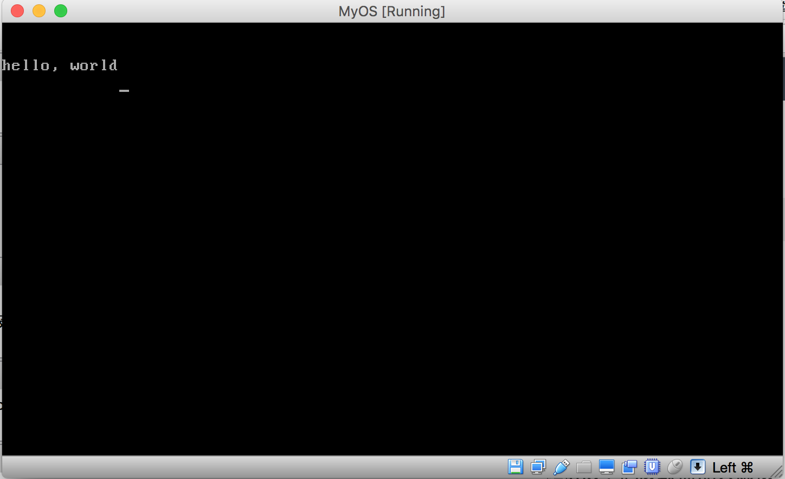

## 一个最小的操作系统内核2


上一节，我用java制作了一个虚拟软盘，当把软盘插入虚拟机，启动机器后，屏幕打印出java程序中设定的语句，然后卡死。

在java代码中，有一个二进制数组，imgContent, 它里面存储的实际上是一段二进制代码，当虚拟机设置为从软盘启动后，这段代码会被bios读取到内存中，然后指示cpu去执行imgContent 所存储的二进制代码。

那么这段二进制代码做了些什么呢，它主要是设置了一些初始化数据，然后调用bios中断，将某个缓冲区中的字符打印到屏幕上，然后进入一个死循环，实际上，这段二进制代码的功能，可以用汇编实现，然后用汇编编译器将其编译成二进制文件，然后再读入到imgConent缓冲区中，最后利用java程序生成虚拟软盘，最终也能实现相同的效果，我们先看看对应的汇编程序怎么写：

```asm
org  0x7c00;

jmp  entry
db   0x90
DB   "OSKERNEL"
DW   512
DB   1
DW   1
DB   2
DW   224
DW   2880
DB   0xf0
DW   9
DW   18
DW   2
DD   0
DD   2880
DB   0,0,0x29
DD   0xFFFFFFFF
DB   "MYFIRSTOS  "
DB   "FAT12   "
RESB  18

entry:
    mov  ax, 0
    mov  ss, ax
    mov  ds, ax
    mov  es, ax
    mov  si, msg

putloop:
    mov  al, [si]
    add  si, 1
    cmp  al, 0
    je   fin
    mov  ah, 0x0e
    mov  bx, 15
    int  0x10
    jmp  putloop

fin:
    HLT
    jmp  fin

msg:
    DB    0x0a,  0x0a
    db    "hello, world"
    db    0x0a
    db    0
```

上面的汇编代码，实际上就实现了将hello, world 打印到屏幕上，然后进入死循环的功能，一般而言，操作系统的研究和设计，理论上已经很成熟，也不难懂，就是系统内容被加载如内存前，所做的一系列操作需要汇编来编写，而卡死很多人的，就是搞不懂汇编，就是因为掌握不了汇编，于是很多人被挡在了操作系统精髓的大门之外，其实，汇编没什么难的，我们一句一句来理解，就像背单词。

上面的程序第一句是 org 0x7c00, org 的意思是origin, 中文意思是“起始，起源，” org 后面的7c00 是物理内存地址，假设物理内存是一个byte类型的大数组，例如byte[] memory, 如果你有2 G内容，换算成字节就是2097152， 也就相当于memory数组有2097152字节，于是当虚拟机上电，然后new一块内存 byte[] memory = new byte[2097152]. org 0x7c00 的意思是将本汇编编译后的二进制数据从memory[0x7c00]处写入memory.

jmp entry 中的jmp 其实就是c语言中的语句goto, jmp entry 其实是让cpu跳转到entry 处，执行entry下面的代码，如果entry是一个函数名字的话，jmp entry 相当于调用entry函数，类比于java就是函数调用：entry();

从db 0x90 到 RESB 18 这段代码做一些初始化工作，jmp entry 对应的机器代码，长度是3字节，那么db 0x90 的意思就是 memory[0x7c00+3] = 0x90, 也就是说db 0x90 实际上做的是赋值操作，db 0x90 表示将给定位置处的一个字节赋予数值0x90, 赋值的内存位置就在0x7c00+3处。

DB 和 db 是同一个意思， 那么DB “OSKERNEL” 意思是，strcpy(memory + 0x7c00 + 3 + 1, “OSKERNEL”); 也就是把”OSKERNEL”这个字符串拷贝到内存0x7c00 + 3 + 1 处， 3是什么意思呢，3就是jmp entry 编译成二进制代码后的数据长度， 1 就是db 0x90 所所赋值的那个字节的长度。DW 跟DB是一个意思， DB 是将数据赋值给一个字节，由于一个字节只有8位，那么赋值给这个字节的数据大小不能超过256， 512大于256，所以需要两个字节才能存储512这个数据，DD 0xFFFFFFFF 就是把0xFFFFFFFF存储到四个字节长的内存中， 语句RESB 18 表示把接下来的18个字节的内存全部初始化为0，转换为java代码就类似于:
byte[] block = new byte[18];
for (int i = 0; i < 18; i++) {
block[i] = 0;
}

接下来的是代码，首先做的是初始化一系列寄存器，寄存器其实相当于java程序中，我们定义的变量，ax 是一个2字节长的寄存器， mov ax, 0是把数值0放入到ax寄存器中，类比于java 就是:
char ax = 0;
char类型的数据在java中是两个字节长，跟寄存器ax的长度一样，类似的，语句： mov ss, ax 相当于java的 char ss = ax; 后面的语句意思类推。

我们要注意看语句 mov si, msg. msg 相当于一段内存，
msg:
DB 0x0a, 0x0a
db “hello, world”
db 0x0a
就类似于 C 语言中的char* msg = “\n\nhello,world\n”. 字符’\n’的ascii值就是0xa.

mov si, msg 就相当于把msg内存的其实地址放入到寄存器si里。如果用C语言做类比，那么就相当于： char* si = msg;

我们接着看下面的代码：
mov al, [si]
[si]表示读取si存储的内存地址处的一个字节长度的信息，
mov al, [si] ,把该字节的数据存储到寄存器al 中，ax是两个字节长度的寄存器，这样ax就可以分解成两部分，第一部分就对应于al, 第二部分就对应于ah,
也就是al, ah合起来就是ax, 对应于C语言就相当于 char ax[2], al 表示的是ax[0], ah 表示的就是 ax[1], mov al, [si], 转换成C语言就是 char al = *si;

add si, 1 表示将寄存器si中的数值加1，也就相当于C语言的 si++;
cmp al, 0 表示将al寄存器中的数据跟0比较，看al中的值是否等于0
je fin 中的 je 表示 jump if equal, 也就是如果al 的值确实等于0，那么就跳转到fin所表示的代码处去执行，转换成C语言就是 ：
if (al == 0) {
goto fin
}

mov ah, 0xe 就是把0xe赋值给寄存器 ah, mov bx ,15 同理。接下来要调用一个中断，中断其实就是一个函数调用，我们在写c语言或java程序时，往往需要调用一些系统库函数，例如printf, 或java的System.out.print. 中断就是bios提供给汇编语言的库函数，这些库函数都放入到一个数组里，int 0x10 意思是在库函数数组中取出第0x10个库函数，然后执行该库函数的代码。

我们知道，函数调用时需要传递参数，那么调用bios提供的函数时，怎么传递参数呢，做法是，把需要传递的参数放入到指定的寄存器中，例如想要在屏幕上输出字符，那么bios提供的编号为0x10的库函数可以实现这个功能，同时按规定，要把寄存器ah设置为0x0e, 把要输出的字符的ascii值放入到寄存器al, 同时要把寄存器设bh的值设置成0，字符的颜色可以通过寄存器bl的值来设定。看起来相当麻烦，这是由于我们做的是非常底层的编程，所以麻烦也就不可避免。

于是代码片段：
putloop:
mov al, [si]
add si, 1
cmp al, 0
je fin
mov ah, 0x0e
mov bx, 15
int 0x10
jmp putloop

就相当于C语言：
do {
char al = *si;
si++;
if (al == 0) {
goto fin
}

printf(“%c”, al);
} while(true);

fin处的代码就两条语句:
hlt 表示 halt, 也就是让cpu进入休眠状态，如果此时我们点击一下键盘，或动一下鼠标，那么cpu就被唤醒，然后执行hlt后面的语句:
jmp fin
也就是跳转到fin开始处去执行，也就是进入了死循环。

把上面的汇编语言存储成一个文件：boot.asm ,然后利用汇编编译器nasm来编译：
nasm boot.asm
编译后会得到一个二进制文件，内容如下:

```
e94e 0090 4f53 4b45 524e 454c 0002 0101
0002 e000 400b f009 0012 0002 0000 0000
0040 0b00 0000 0029 ffff ffff 4d59 4649
5253 544f 5320 2046 4154 3132 2020 2000
0000 0000 0000 0000 0000 0000 0000 0000
00b8 0000 8ed0 8ed8 8ec0 be73 7c8a 0481
c601 003c 0074 09b4 0ebb 0f00 cd10 ebed
f4eb fd0a 0a68 656c 6c6f 2c20 776f 726c
640a 00
```

把这个二进制文件改名为boot.bat,拷贝到我们上一个java程序的工程目录下，然后把java程序进行修改，将这段二进制数据读入到imgContent数组中, java代码如下：

```java
import java.io.DataOutputStream;
import java.io.File;
import java.io.FileInputStream;
import java.io.FileNotFoundException;
import java.io.FileOutputStream;
import java.io.IOException;
import java.io.InputStream;
import java.util.ArrayList;


public class OperatingSystem {
    private int[] imgContent = new int[]{
        0xeb,0x4e,0x90,0x48,0x45,0x4c,0x4c,0x4f,0x49,0x50,0x4c,0x00,0x02,0x01,0x01,0x00,0x02,0xe0,
        0x00,0x40,0x0b,0xf0,0x09,0x00,0x12,0x00,0x02,0x00,0x00,0x00,0x00,0x00,0x40,0x0b,0x00,0x00,0x00,0x00,0x29,
        0xff,0xff,0xff,0xff,0x48,0x45,0x4c,0x4c,0x4f,0x2d,0x4f,0x53,0x20,0x20,0x20,0x46,0x41,0x54,0x31,0x32,
        0x20,0x20,0x20,0x00,0x00,0x00,0x00,0x00,0x00,0x00,0x00,0x00,0x00,0x00,0x00,0x00,0x00,0x00,0x00,0x00,0x00,0xb8,0x00,0x00,0x8e,
        0xd0,0xbc,0x00,0x7c,0x8e,0xd8,0x8e,0xc0,0xbe,0x74,0x7c,0x8a,
        0x04,0x83,0xc6,0x01,0x3c,0x00,0x74,0x09,0xb4,0x0e,0xbb,0x0f,0x00,0xcd,0x10,0xeb,0xee,0xf4,0xeb,0xfd
    };

    private ArrayList<Integer> imgByteToWrite = new ArrayList<Integer>();

    private void readKernelFromFile(String fileName) {
        File file = new File(fileName);
        InputStream in = null;

        try {
            in = new FileInputStream(file);
            int tempbyte;
            while ((tempbyte = in.read()) != -1) {
                imgByteToWrite.add(tempbyte);
            }
        } catch(IOException e) {
            e.printStackTrace();
            return;
        }

        imgByteToWrite.add(0x55);
        imgByteToWrite.add(0xaa);
        imgByteToWrite.add(0xf0);
        imgByteToWrite.add(0xff);
        imgByteToWrite.add(0xff);

    }

    public OperatingSystem(String s) {
    /*  for (int i = 0; i < imgContent.length; i++) {
            imgByteToWrite.add(imgContent[i]);
        }

        imgByteToWrite.add(0x0a);
        imgByteToWrite.add(0x0a);
        for (int j = 0; j < s.length(); j++) {
            imgByteToWrite.add((int)s.charAt(j));
        }
        imgByteToWrite.add(0x0a);

        int len = 0x1fe;
        int curSize = imgByteToWrite.size();
        for (int k = 0; k < len - curSize; k++) {
            imgByteToWrite.add(0);
        }

        //0x1fe-0x1f: 0x55, 0xaa
        //0x200-0x203: f0 ff  ff
        imgByteToWrite.add(0x55);
        imgByteToWrite.add(0xaa);
        imgByteToWrite.add(0xf0);
        imgByteToWrite.add(0xff);
        imgByteToWrite.add(0xff);
      */

        readKernelFromFile("boot.bat");

        int len = 0x168000;
        int curSize = imgByteToWrite.size();
        for (int l = 0; l < len - curSize; l++) {
            imgByteToWrite.add(0);
        }

    }

    public void makeFllopy()   {
        try {
            DataOutputStream out = new DataOutputStream(new FileOutputStream("system.img"));
            for (int i = 0; i < imgByteToWrite.size(); i++) {
                out.writeByte(imgByteToWrite.get(i).byteValue());
            }
        } catch (Exception e) {
            // TODO Auto-generated catch block
            e.printStackTrace();
        }

    }

    public static void main(String[] args) {
        OperatingSystem op = new OperatingSystem("hello, this is my first line of my operating system code");
        op.makeFllopy();
    }
}

```

执行后，上面的代码会生成一个虚拟软盘system.img，把该软盘加入虚拟机，配置虚拟机从软盘启动，得到结果如下：

