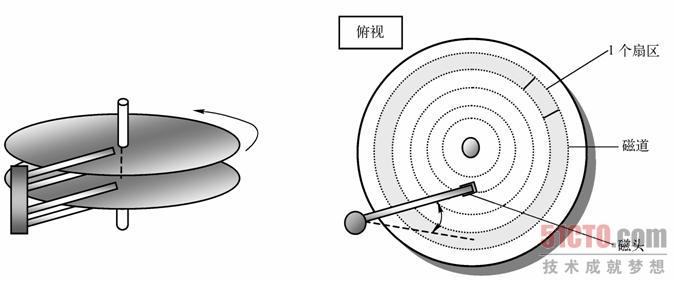
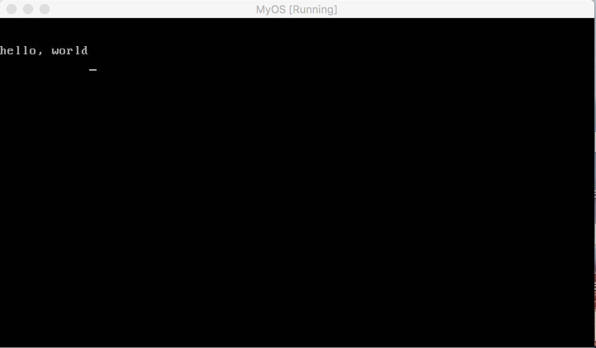
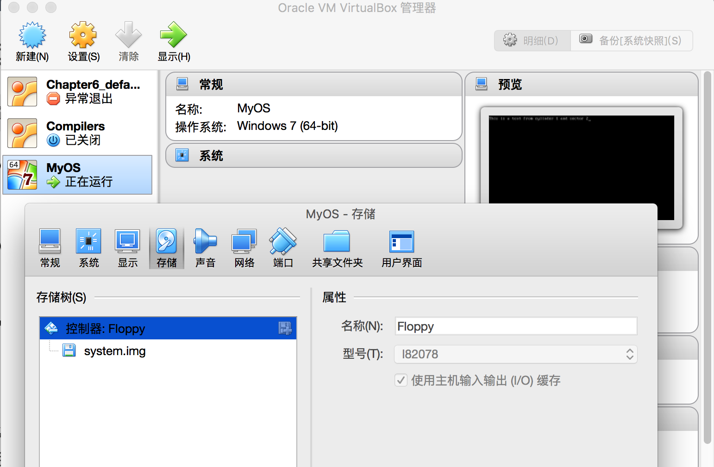
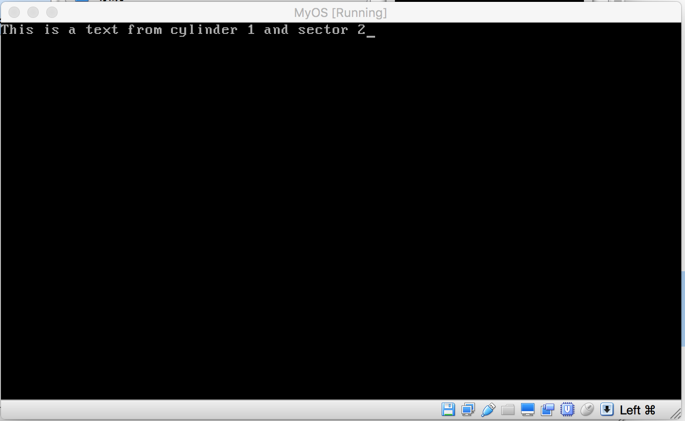

## 软盘读写


在前两节，我们将一段代码通过软盘加载到了系统内存中，并指示cpu执行加入到内存的代码，事实上，操作系统内核加载也是这么做的。只不过我们加载的代码，最大只能512 byte, 一个操作系统内核，少说也要几百兆，由此，系统内核不可能直接从软盘读入系统内存。

通常的做法是，被加载进内存的512 Byte程序，实际上是一个内核加载器，它运行起来后，通过读取磁盘，将存储在磁盘上的内核代码加载到指定的内存空间，然后再把cpu的控制权提交给加载进来的系统内核。

这就需要我们理解软盘的物理结构，以及软盘的数据读取方法。


软盘的物理结构如上图，一个盘面被划分成若干个圆圈，例如图中的灰色圆圈，我们称之为磁道，也可以称作柱面，一个磁道或柱面，又被分割成若干部分，每一部分，我们称之为一个扇区，一个扇区的大小正好是512k,从而，当我们把数据存储到软盘上时，数据会分解成若干个512Byte大小的块，然后写入到扇区里。

要读取数据时，磁头会挪动到扇区所在的磁道或柱面，然后盘面转动，当要读取的扇区转到磁头正下方时，磁头通电，通过电磁效应将扇区的数据读取到内存中。

从上图的左边图形可以了解，一个磁盘有两个盘面，每个盘面的组成跟右边图形一样，同时每个盘面对应一个磁头，所以当想从磁盘上读取数据时，需要确定数据在哪一个盘面，从而确定要用哪一个磁头来读取数据，然后确定哪一个磁道，最后再确定要读取的数据都存储在哪一个扇区。

对于我们要开发的系统，我们要模拟的是3.5寸软盘，这种软盘的特点是，它有两个盘面，因此就对应两个磁头，每个盘面有80个磁道，也就是柱面，编号分别为0-79. 每个柱面都有18个扇区，编号分别为1-18. 所以一个盘面可以存储的数据量大小为：
512 * 18 * 80
一个软盘有两个盘面，因此一个软盘可以存储的数据为：
2 * 512 * 18 * 80 = 1474560 Byte = 1440 KB = 1.5M

接下来，我们用java来模拟一个3.5寸软盘，以及它的读写逻辑。

Floppy.java 用于实现虚拟软盘

```java
import java.io.DataOutputStream;
import java.io.FileOutputStream;
import java.util.ArrayList;
import java.util.HashMap;


public class Floppy {
    enum MAGNETIC_HEAD {
        MAGNETIC_HEAD_0,
        MAGETIC_HEAD_1
    };


    public int SECTOR_SIZE = 512;
    private int CYLINDER_COUNT = 80; //80个柱面
    private int SECTORS_COUNT = 18;
    private MAGNETIC_HEAD magneticHead = MAGNETIC_HEAD.MAGNETIC_HEAD_0;
    private int current_cylinder = 0;
    private int current_sector = 0;

    private HashMap<Integer,ArrayList<ArrayList<byte[]>> > floppy = new HashMap<Integer,ArrayList<ArrayList<byte[]>> >(); //一个磁盘两个面

    public Floppy() {

        initFloppy();
    }

    private void initFloppy() {

        //一个磁盘有两个盘面
        floppy.put(MAGNETIC_HEAD.MAGNETIC_HEAD_0.ordinal(), initFloppyDisk());
        floppy.put(MAGNETIC_HEAD.MAGETIC_HEAD_1.ordinal(), initFloppyDisk());
    }

    private ArrayList<ArrayList<byte[]>> initFloppyDisk() {
        ArrayList<ArrayList<byte[]>> floppyDisk = new ArrayList<ArrayList<byte[]>>(); //磁盘的一个面
        //一个磁盘面有80个柱面
        for(int i = 0; i < CYLINDER_COUNT; i++) {
            floppyDisk.add(initCylinder());
        }

        return floppyDisk;
    }

    private ArrayList<byte[]> initCylinder() {
        //构造一个柱面，一个柱面有18个扇区
        ArrayList<byte[]> cylinder = new ArrayList<byte[]> ();
        for (int i = 0; i < SECTORS_COUNT; i++) {
            byte[] sector = new byte[SECTOR_SIZE];
            cylinder.add(sector);
        }

        return cylinder;
    }

    public void setMagneticHead(MAGNETIC_HEAD head) {
        magneticHead = head;
    }

    public void setCylinder(int cylinder) {
        if (cylinder < 0) {
            this.current_cylinder = 0;
        }
        else if (cylinder >= 80) {
            this.current_cylinder = 79;
        }
        else {
            this.current_cylinder = cylinder;
        }
    }

    public void setSector(int sector) {
        //sector 编号从1到18
        if (sector < 0) {
            this.current_sector = 0;
        }
        else if (sector > 18) {
            this.current_sector = 18 - 1;
        }
        else {
            this.current_sector = sector - 1;
        }
    }

    public byte[] readFloppy(MAGNETIC_HEAD head, int cylinder_num, int sector_num) {
        setMagneticHead(head);
        setCylinder(cylinder_num);
        setSector(sector_num);

        ArrayList<ArrayList<byte[]>> disk = floppy.get(this.magneticHead.ordinal());
        ArrayList<byte[]> cylinder = disk.get(this.current_cylinder);

        byte[] sector = cylinder.get(this.current_sector);

        return sector;
    }

    public void writeFloppy(MAGNETIC_HEAD head, int cylinder_num, int sector_num, byte[] buf) {
        setMagneticHead(head);
        setCylinder(cylinder_num);
        setSector(sector_num);

        ArrayList<ArrayList<byte[]>> disk = floppy.get(this.magneticHead.ordinal());
        ArrayList<byte[]> cylinder = disk.get(this.current_cylinder);
        cylinder.set(this.current_sector, buf);
    }

    public void makeFloppy(String fileName) {
        try {
            DataOutputStream out = new DataOutputStream(new FileOutputStream(fileName));
            for (int head = 0; head <= MAGNETIC_HEAD.MAGETIC_HEAD_1.ordinal(); head++) {
                for (int cylinder = 0; cylinder < CYLINDER_COUNT; cylinder++) {
                    for (int sector = 1; sector <= SECTORS_COUNT; sector++) {
                        byte[] buf = readFloppy(MAGNETIC_HEAD.values()[head], cylinder, sector);
                        out.write(buf);
                    }
                }
            }

        } catch (Exception e) {
            // TODO Auto-generated catch block
            e.printStackTrace();
        }
    }
}

```

读写虚拟软盘需要调用接口readFloppy 或 writeFloppy, 使用这些接口时必须指定磁头，柱面和扇区号，在主程序中，我将上节用汇编编译的操作系统内核写入到虚拟软盘中，然后将虚拟软盘写成磁盘文件, 具体代码如下：

```java
import java.io.DataOutputStream;
import java.io.File;
import java.io.FileInputStream;
import java.io.FileNotFoundException;
import java.io.FileOutputStream;
import java.io.IOException;
import java.io.InputStream;
import java.util.ArrayList;


public class OperatingSystem {

    private Floppy floppyDisk = new Floppy();


    private void writeFileToFloppy(String fileName) {
        File file = new File(fileName);
        InputStream in = null;

        try {
            in = new FileInputStream(file);
            byte[] buf = new byte[512];
            buf[510] = 0x55;
            buf[511] = (byte) 0xaa;
            if (in.read(buf) != -1) {
                //将内核读入到磁盘第0面，第0柱面，第1个扇区
                floppyDisk.writeFloppy(Floppy.MAGNETIC_HEAD.MAGNETIC_HEAD_0, 0, 1, buf);
            }
        } catch(IOException e) {
            e.printStackTrace();
            return;
        }
    }

    public OperatingSystem(String s) {
        writeFileToFloppy(s);
    }

    public void makeFllopy()   {
        floppyDisk.makeFloppy("system.img");
    }

    public static void main(String[] args) {
        OperatingSystem op = new OperatingSystem("boot.bat");
        op.makeFllopy();
    }
}

```

上面的代码运行后，在项目的根目录会生成一个system.img虚拟软盘文件，将该软盘加入虚拟机，我们制作的操作系统内核就能被虚拟机执行了：



上面代码可以通过如下git 命令下载：
git clone https://github.com/wycl16514/OS-kernel-development.git

用汇编语言实现软盘读写

使用汇编读取软盘的原理与上面描述的相同，我们要调用相应的BIOS中断，同时将要读取的磁头号，柱面，扇区号传给中断代码，读取软盘的汇编代码如下：
mov CH, 1 ;CH 用来存储柱面号
mov DH, 0 ;DH 用来存储磁头号
mov CL, 2 ;CL 用来存储扇区号

mov BX, msg ; ES:BX 数据存储缓冲区

mov AH, 0x02 ; AH = 02 表示要做的是读盘操作
mov AL, 1 ; AL 表示要练习读取几个扇区
mov DL, 0 ;驱动器编号，一般我们只有一个软盘驱动器，所以写死
;为0
INT 0x13 ;调用BIOS中断实现磁盘读取功能
JC error ; 如果读盘出现错误，跳转到error处执行相应代码

在计算机硬件中，有一个隐含的寄存器叫FLACS, 当BIOS调用出现错误时，FLACS寄存器的 CF 位会置1，同时把错误代码存入AH,如果没有错，那么FLACS寄存器的CF位会设置为0，所以 JC error 的意思是：
if (FLACS.CF == 1) {
error();
}

在前面，我们的内核加载到内存后,会打印出一条语句，而语句与内核代码都存储在同一个扇区中，这一次，我们将要打印的语句存储在第一柱面的第二扇区，内核加载如内存后，通过BIOS调用将要打印的语句从指定位置读出，然后再显示到屏幕上，代码如下：

```asm
org  0x7c00;

jmp  entry
db   0x90
DB   "OSKERNEL"
DW   512
DB   1
DW   1
DB   2
DW   224
DW   2880
DB   0xf0
DW   9
DW   18
DW   2
DD   0
DD   2880
DB   0,0,0x29
DD   0xFFFFFFFF
DB   "MYFIRSTOS  "
DB   "FAT12   "
RESB  18

entry:
    mov  ax, 0
    mov  ss, ax
    mov  ds, ax
    mov  es, ax
    mov  si, msg


readFloppy:
    mov          CH, 1        ;CH 用来存储柱面号
    mov          DH, 0        ;DH 用来存储磁头号
    mov          CL, 2        ;CL 用来存储扇区号

    mov          BX, msg       ; ES:BX 数据存储缓冲区

    mov          AH, 0x02      ;  AH = 02 表示要做的是读盘操作
    mov          AL,  1        ; AL 表示要练习读取几个扇区
    mov          DL, 0         ;驱动器编号，一般我们只有一个软盘驱动器，所以写死   
                               ;为0
    INT          0x13          ;调用BIOS中断实现磁盘读取功能

    jc           error

putloop:
    mov  al, [si]
    add  si, 1
    cmp  al, 0
    je   fin
    mov  ah, 0x0e
    mov  bx, 15
    int  0x10
    jmp  putloop

fin:
    HLT
    jmp  fin

error:
    mov si, errmsg   ;出现错误打印error
    jmp   putloop

msg:
    RESB   64
errmsg:
    DB "error"

```

在上面的汇编代码中，readFloppy将要打印的字符串从磁盘中读出来，放入到缓冲区msg中，大家注意，msg下面是语句 RESB 64, 这一句的意思是分配64个字节的缓冲区。

将上面的汇编代码存成文件boot.asm ,然后使用命令：
nasm boot.asm -o boot.bat

把上面代码编译成二进制文件boot.bat.接下来，我们在生成虚拟软盘的java代码中把把要输出的语句写入到虚拟软盘的1柱面，2扇区，代码如下：

```
   public void makeFllopy()   {
        String s = "This is a text from cylinder 1 and sector 2";
        floppyDisk.writeFloppy(Floppy.MAGNETIC_HEAD.MAGNETIC_HEAD_0, 1, 2, s.getBytes());

        floppyDisk.makeFloppy("system.img");
    }
```

上面的代码中，我们把s字符串写入虚拟软盘的0磁头，1柱面，2扇区。把上面编译好的boot.bat也放入到java工程目录下，然后运行java代码，运行后在目录下会生成一个system.img虚拟映像，然后将该文件作为启动软盘加入虚拟机：



然后启动虚拟机，可以看到，我们的系统内核将字符串从软盘的1柱面，2扇区中读出来，显示到屏幕上：



代码可以根据以下的git 命令获取：

git clone https://github.com/wycl16514/OS-kernel-development.git