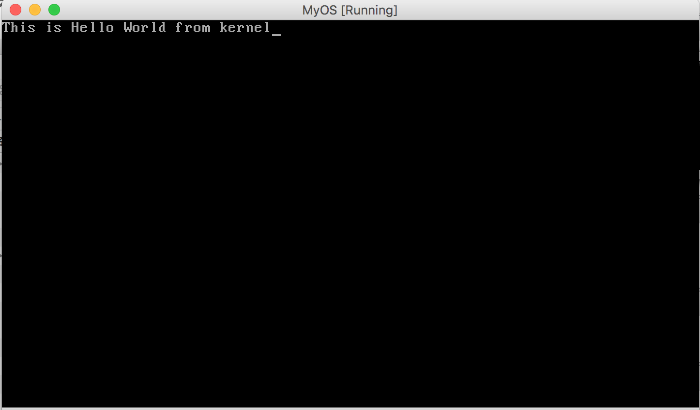

## 让内核突破512字节的限制


我们当前的系统内核，必须包含在虚拟软盘的第1扇区，由于一个扇区只有512字节，因此，系统内核的大小不可能超过512字节。但是，一个拥有完善功能的内核不可能只有512字节，因此要想越过512字节的限制，具体的做法就是做一个内核加载器，放入到第一扇区，加载器加载如内存后，再将内核从软盘加载到系统内存，然后，跳转到内核的加载地址。假定我们把编译好的内核代码写入软盘的第1柱面，第2扇区，那么加载器的代码如下，boot.asm：

```asm
org  0x7c00;

LOAD_ADDR  EQU  0X8000

entry:
    mov  ax, 0
    mov  ss, ax
    mov  ds, ax
    mov  es, ax
    mov  si, ax

readFloppy:
    mov          CH, 1        ;CH 用来存储柱面号
    mov          DH, 0        ;DH 用来存储磁头号
    mov          CL, 2        ;CL 用来存储扇区号

    mov          BX, LOAD_ADDR       ; ES:BX 数据存储缓冲区

    mov          AH, 0x02      ;  AH = 02 表示要做的是读盘操作
    mov          AL,  1        ; AL 表示要练习读取几个扇区
    mov          DL, 0         ;驱动器编号，一般我们只有一个软盘驱动器，所以写死   
                               ;为0
    INT          0x13          ;调用BIOS中断实现磁盘读取功能

    JC           fin

    jmp          LOAD_ADDR


fin:
    HLT
    jmp  fin

```

readFloppy 这段代码从软盘的1柱面，2扇区，将内核读取到系统内存的0x8000处，读取成功后，通过一个jmp 跳转到内核的加载地址，将机器的控制权转交给内核。我们看看内核代码,kernel.asm：

```asm
org   0x8000

entry:
    mov  ax, 0
    mov  ss, ax
    mov  ds, ax
    mov  es, ax
    mov  si, msg


 putloop:
    mov  al, [si]
    add  si, 1
    cmp  al, 0
    je   fin
    mov  ah, 0x0e
    mov  bx, 15
    int  0x10
    jmp  putloop

fin:
    HLT
    jmp  fin

  msg:

     DB   "This is Hello World from kernel"
```

我们的内核很简单，只不过打印出一条语句.

通过命令分别编译内核和加载器：
nasm kernel.asm -o kernerl.bat
nasm boot.asm -o boot.bat

编译好后，通过以下的java代码先将编译好的内核写入虚拟软盘：

```java
 public void makeFllopy()   {
        writeFileToFloppy("kernel.bat", false, 1, 2);

        floppyDisk.makeFloppy("system.img");
    }
```

上面的代码先将编译好的kernel.bat写入按软盘的1柱面，2扇区，然后生成虚拟软盘文件：system.img.

最后，我们将虚拟软件加载到虚拟机中，就可以看到如下效果：



如果内核大小超过512字节，我只要在加载器中多读取几个扇区，就可以将内核加载进系统内存了，由此，通过内核加载器这个二传手，我们能够有效的突破512字节的大小限制，今后我们在内核中添加各种操作系统功能时，系统内核肯定是远远不止512字节的。

本节代码可以通过以下命令下载：

git clone https://github.com/wycl16514/OS-Kernel-from-loader-to-kernel.git

在下一节，我们将实现新的突破，看看内核如何由时模式进入保护模式，也就是让内核从dos级别转变为win95级别。
