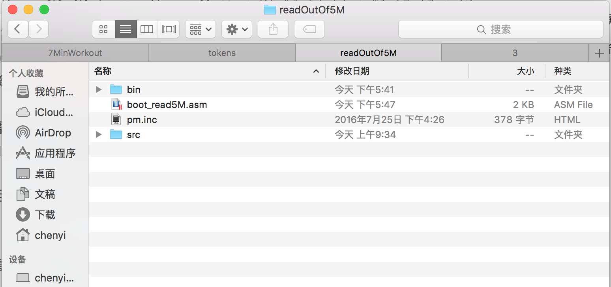
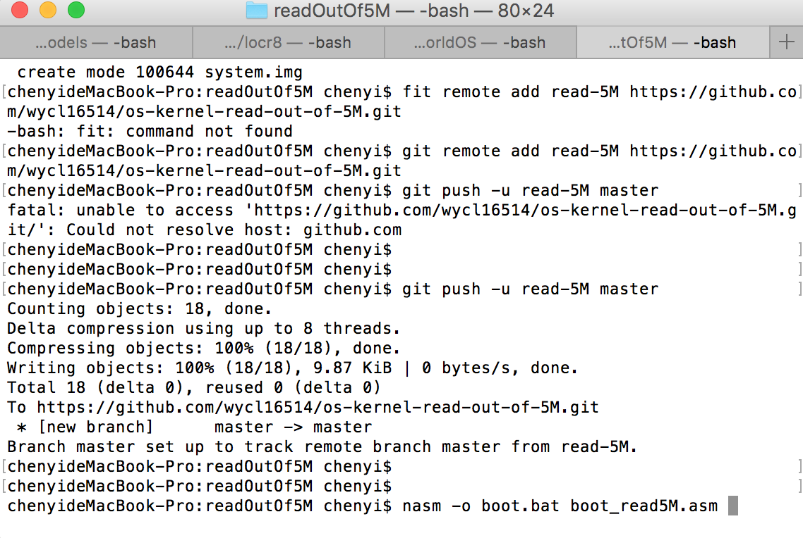
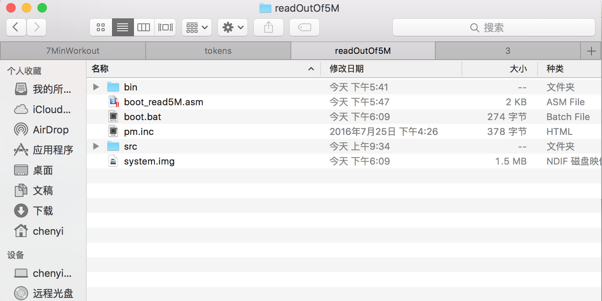
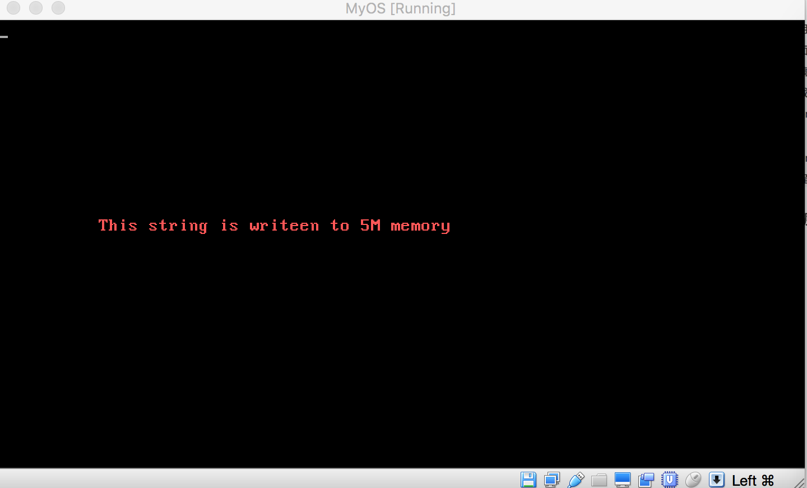

## 保护模式超强的寻址功能：天空任鸟飞


X86架构下，cpu 的运行模式分两种，一种是实模式，像早期Dos那种黑底白字的命令行操作界面，可以说是实模式最好表现形式，在实模式下也只能产生这种冰冷，呆板，机械的用户体验。后来Intel的CPU进一步发展，引入了保护模式，由此，操作系统的发展进入了新的时代，在保护模式下，CPU功能进一步增强，进而支撑的起计算量繁重的图形用户界面，我们这才有了温暖，炫酷，友好的图形操作系统，微软也正是靠80386处理器提供的保护模式功能，开发出win3.1,及后来享誉世界的win95,从而奠定其软件行业的垄断地位。

保护模式之所以能提供强大的处理能力，一方面要得益于增强了的寻址能力，在实模式下，cpu只能处理最多16位的数据，同时地址总线也就20位，因此能访问的最大内存也就2^20 字节，也就是1M多，在保护模式下，cpu可以处理32位的数据，同时地址总线也扩张到32位，这样，cpu能访问的内存就可以一下子达到4G.

Intel 8086 cpu,使用16位寄存器，16位数据总线，20位的地址总线，它的寻址方式是由段和偏移两部分组成，具体物理地址是这么计算的：

物理地址 = 段值 * 16 + 偏移

段值和偏移都只能用16位来表示，段值16位，16是等于2^4，所以段值*16也就相当于一个20位的数字，由此段值*16的数值不会超过1M,而偏移16位，能表示的地址范围也就不超过4K,因此整个物理地址能抵达的范围也就是1M + 4k.

在保护模式下，寻址方式完全就不同了，我们上一节讲过的GDT,全局描述符表，该表的表项就叫描述符(descriptor),在描述符中，专门抽出4个字节，也就是32位数据来表示内存的基地址，这样，内存访问一下子就达到了4G，在原来的实模式下，cs, ds这些16位的寄存器往往用来存储段值，在保护模式下，这些寄存器用来存储指向GDT某个描述符的索引。在保护模式下，访问某处的内存时，仍然使用寄存器:偏移 的方式，但是CPU的对地址的计算方法不再使用上面的公式，而是把寄存器中的值当做访问GDT的索引，在GDT中找到对应的描述符，从描述符中获得要访问内存的基地址，然后将基地址加上偏移，进而得到要访问的具体地址。由此，就突破了上面寻址公式的1M范围限制。如果我们在GDT中设置一个描述符，这个描述符所描述的基地址设置为5M,那么当我们用寄存器指向这个描述符时，系统就能够读取5M以上的内存了

根据上一节内容
（http://blog.csdn.net/tyler_download/article/details/52021120），

我们可以构造一个指向5M内存地址的描述符：

LABEL_DESC_5M: Descriptor 0500000h, 0ffffh, DA_DRW

0500000h = 5 * (2^20), 2^20 相当于1M, 于是0500000h相当于5M.接下来我们做一个实验，先将一段数据写入到5M的内存地址，然后再读取写入的数据，将读到的数据显示到屏幕上。下面就是我们要写的内核代码(boot_read5M.asm)：

```asm
 %include "pm.inc"

org   0x7c00

jmp   LABEL_BEGIN

[SECTION .gdt]
 ;                                  段基址          段界限                属性
LABEL_GDT:          Descriptor        0,            0,                   0  
LABEL_DESC_CODE32:  Descriptor        0,      SegCode32Len - 1,       DA_C + DA_32
LABEL_DESC_VIDEO:   Descriptor     0B8000h,         0ffffh,           DA_DRW
LABEL_DESC_5M:      Descriptor     0500000h,        0ffffh,           DA_DRW

GdtLen     equ    $ - LABEL_GDT
GdtPtr     dw     GdtLen - 1
           dd     0

SelectorCode32    equ   LABEL_DESC_CODE32 -  LABEL_GDT
SelectorVideo     equ   LABEL_DESC_VIDEO  -  LABEL_GDT
Selector5M        equ   LABEL_DESC_5M - LABEL_GDT

[SECTION  .s16]
[BITS  16]
LABEL_BEGIN:
     mov   ax, cs
     mov   ds, ax
     mov   es, ax
     mov   ss, ax
     mov   sp, 0100h

     xor   eax, eax
     mov   ax,  cs
     shl   eax, 4
     add   eax, LABEL_SEG_CODE32
     mov   word [LABEL_DESC_CODE32 + 2], ax
     shr   eax, 16
     mov   byte [LABEL_DESC_CODE32 + 4], al
     mov   byte [LABEL_DESC_CODE32 + 7], ah

     xor   eax, eax
     mov   ax, ds
     shl   eax, 4
     add   eax,  LABEL_GDT
     mov   dword  [GdtPtr + 2], eax

     lgdt  [GdtPtr]

     cli   ;关中断

     in    al,  92h
     or    al,  00000010b
     out   92h, al

     mov   eax, cr0
     or    eax , 1
     mov   cr0, eax

     jmp   dword  SelectorCode32: 0

     [SECTION .s32]
     [BITS  32]
LABEL_SEG_CODE32:
    mov   ax, SelectorVideo
    mov   gs, ax

    mov   si, msg
    mov   ax, Selector5M    ;用 es 指向5M内存描述符
    mov   es, ax
    mov   edi, 0

write_msg_to_5M:  ;将si指向的字符一个个写到5M内存处
    cmp   byte [si], 0
    je    prepare_to_show_char
    mov   al, [si]
    mov   [es:edi], al
    add   edi, 1
    add   si, 1
    jmp   write_msg_to_5M


prepare_to_show_char:
    mov   ebx, 10
    mov   ecx, 2
    mov   si, 0

showChar:
    mov   edi, (80*11)
    add   edi, ebx
    mov   eax, edi
    mul   ecx
    mov   edi, eax
    mov   ah, 0ch
    mov   al, [es:si]  ;由于es指向描述符LABEL_DESC_5M， 所以es:si 表示的地址是从5M开始的内存,si表示从5M开始后的偏移
    cmp   al, 0
    je    end
    add   ebx,1
    add   si, 1
    mov   [gs:edi], ax
    jmp   showChar
end: 
    jmp   $
    msg:
    DB     "This string is writeen to 5M memory", 0

SegCode32Len   equ  $ - LABEL_SEG_CODE32

```

首先，我们增加了一个描述符Selector5M，用来指向5M以外的内存地址，在 write_msg_to_5M 中，由于es存储的是描述符LABEL_DESC_5M在GDT中的偏移，同时edi 初始化为0， 因此[es:edi]表示从5M开始，偏移为0处的地址，mov [es:edi] , al, 就是将al的内容写入到5M偏移为0处的内存，也就是0500000h处的内存，每次循环edi都加1，于是第二次循环便将al的内容写入到内存0500001h处，依次类推。

在showChar中，语句al, [es:si] 就是将5M内存处的数据读入到al中，一开始si初始化为0，所以第一次运行showChar代码，这一句将0500000h内存处的1字节数据存入al, 然后si加1，那么第二次运行时，该语句将0500001h内存处的字节信息写入到al, 依次类推

这样，整个内核的逻辑是先将字符串写入到5M起始的内存处，然后再从5M内存处，将信息读取出来，显示到屏幕上。

整个项目的代码可以在以下github地址下载：
https://github.com/wycl16514/os-kernel-read-out-of-5M

项目下载后，内容如下：



整个项目是一个java项目，先把这个目录import到eclipse里面，cd到这个目录，使用命令行：

nasm -o boot.bat boot_read5M.asm

将汇编代码编译成可执行的二进制文件：



然后在eclipse中运行java工程，这样会在目录下生产虚拟软盘文件system.img, boot.bat的内容会写入到这个虚拟软盘的第一扇区，做完上面步骤后，在工程目录下回生成以下文件：




最后用虚拟机加载虚拟软盘文件system.img，运行虚拟机结果如下：




可见，我们的内核确实将数据写入到5M内存处，然后再将数据读取出来，显示到屏幕上。

本节，我们显示了保护模式下，强大的内存寻址功能，保护模式是一个很复杂的技术要点，保护模式的其他功能我们在后面开发系统内核用到时再详细学习。进入保护模式后，有一个巨大的好处是，我们可以引入C语言来开发内核，下一节的内容就是，如何使用C语言来开发操作系统的内核。

