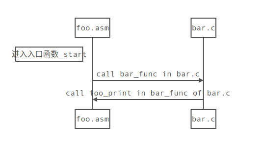
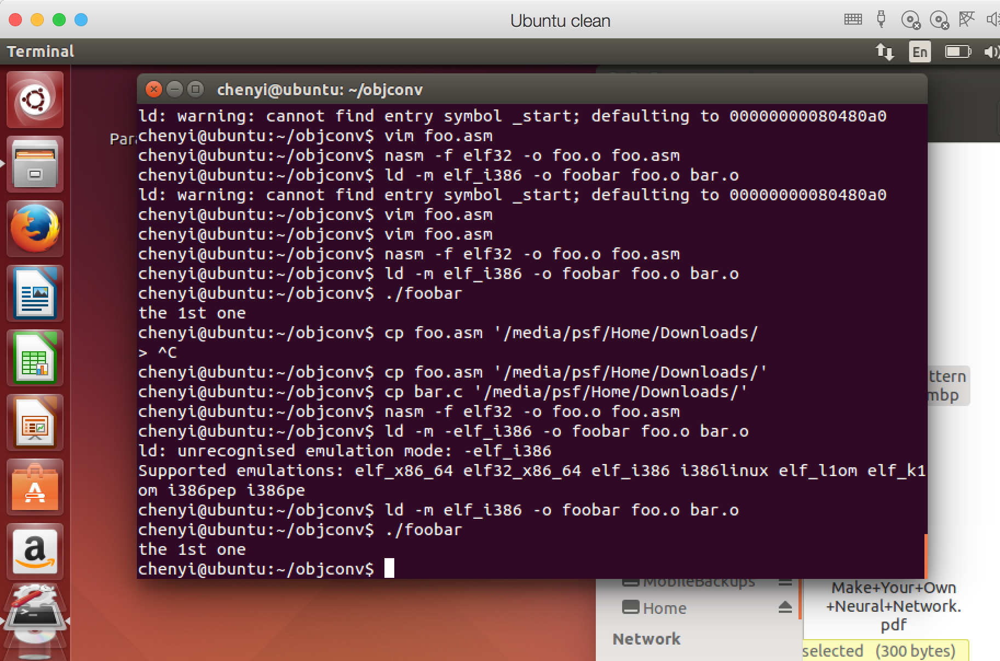

## C语言结合汇编开发系统内核


前几节，我们进入了保护模式，在保护模式下，除了寻址空间增大，运算能力增强外，还有一大好处就是能将C语言引入内核开发，因为C语言编译后的汇编代码，默认的运行环境就是保护模式，所以，只有进入保护模式，那么C语言才有可能介入到开发流程中，或许大家已经厌倦了汇编语言的晦涩，引入C语言，想必我们都能松口气。

下面，我们先看看，汇编如何与C结合，实现相互间的函数调用。

汇编与C的交合调用
在这个例子中，源代码包含两个文件：foo.asm, 和 bar.c.程序入口在foo.asm 中，程序先从foo.asm中的_start处开始执行，在_start中，调用一个函数叫bar_func, 而bar_func 函数由bar.c模块来实现，而bar.c实现的bar_func函数中，又调用一个来自foo.asm实现的函数，叫foo_print, 两个模块的相互交互如下：




接下来我们看看两个模块的实现，先看看foo.asm

```asm
extern bar_func;

[section .data]
arg1  dd 3
arg2  dd 4

[section .text]
global _start
global foo_print

_start:
mov   eax, dword[arg1]
push  eax
mov   eax, dword [arg2]
push  eax
call  bar_func
add   esp, 8

mov   ebx,0
mov   eax, 1
int   0x80

foo_print:
mov   edx, [esp + 8]
mov   ecx, [esp + 4]
mov   ebx, 1
mov   eax, 4
int   0x80
ret
```

由于需要调用另一个模块的函数，所以开始先要使用extern 声明，要不然编译时，编译器会报错。由于_start要导出作为整个可执行程序的入口，因此要用global关键字声明，同时，该模块中的foo_print要导出给其他接口使用，所以需要用global声明。

在_start中，在调用bar_func函数前，需要传入参数，C语言的参数传递是通过堆栈实现的，函数如果有多个参数的话，那么最右边的参数先压入堆栈，由于代码中，我们先压入arg1, 然后再压入arg2,所以就相当于以如下方式调用来自C语言模块的接口:

bar_func(arg2, arg1);

根据C语言的函数调用规则，堆栈的回收由调用者负责，所以在_start中，bar_func调用结束后，需要调整堆栈指针esp, add esp ，8 将堆栈指针往下移动8字节，这就将开头压入堆栈的两个4字节参数，arg1,arg2从堆栈上删除了。

在理解foo_print前，我们需要看看bar.c的实现：

```

void foo_print(char* a, int len);

int  bar_func(int a, int b) {
    if (a > b) {
       foo_print("the 1st one\n", 13);
    } else {
       foo_print("the 2nd one\n", 13);
    }

    return 0;
}

```

根据bar.c中，对foo_print的调用方式来看，最右边的参数是13，表示的是第一个输入参数，也就是字符串的长度。这么看来在foo.asm的foo_print中，[esp+8] 对应于第二个参数，也就是上面的13，[esp+4]对应第一个参数，也就是输入的字符串。

mov ebx, 1
mov eax, 4
int 0x80

上面三句实现Linux的一个系统调用，该调用的作用是将ecx寄存器中指向的内存地址中的字符信息打印到屏幕上。

上面两个文件的编译，需要在Linux系统上进行，我用的是ubuntu,先编译foo.asm:
nasm -f elf32 -o foo.o foo.asm

然后编译bar.c
gcc -m32 -c -o bar.o bar.c

接下来就可以将两个模块连接在一起了：
ld -m elf_i386 -o foobar foo.o bar.o

于是在目录下便会生成一个可执行文件 foobar, 通过下面指令可将生成的可执行文件加载执行：

./foobar

运行后结果如下：




上面代码可通过地址下载:
http://pan.baidu.com/s/1kVlmQGn

虽然，我们基本实现了将汇编和C语言模块结合的目的，但这种做法有一个问题，就是最终编译成的可执行文件是elf格式，但我们要开发的是系统内核，如果将内核编译成elf格式，那么就不能直接将内核加载到内存直接执行。所以需要想新的办法。

我的做法是，将C语言编译或的.o模块反汇编，将反汇编的代码贴到foo.asm里面，从而形成单个asm文件，最后编译这个整合在一起的汇编文件，直接生成二进制可执行代码。

用反汇编结合C语言和汇编语言
新的做法是这样的：
1. 先写好汇编代码和对应的C代码。
2. 用以下命令编译C代码模块，以便后面反汇编：gcc -m32 -fno-asynchronous-unwind-tables -s -c -o bar.o bar.c
3. 下载一个好用的反汇编工具objconv，通过如下命令下载：git clone https://github.com/vertis/objconv.git
4. 下载后进入objconv目录，编译该工具，运行下面的命令：g++ -o objconv -O2 src/*cpp ， -O2中的圆圈是大写字母O.
5. 用objconv 反汇编C语言生成的目标文件bar.o,命令如下：objconv -fnasm bar.o -o bar.asm,于是目录下便有一个反汇编文件bar.asm
6. 打开foo.asm, 将里面的_start, 修改成main, 这一步在后面我们编译系统内核时可以不用，现在这么做，主要是想编译成linux可执行文件
7. 在foo.asm末尾，通过语句：%include “bar.asm” 将第五步反汇编的C模块代码引入foo.asm。
8. 运行命令编译foo.asm: nasm -f elf32 foo.asm, 执行这一步后，目录上会出现foo.o二进制文件
9. 执行命令：gcc -m32 foo.o -o foo. 这一步将foo.o与系统模块连接成可执行文件，编译系统内核时，这一步就不需要。
10. 运行结果：./foo, 就可以看到运行结果了。

在后面的章节中，我们将主要依赖C语言进行内核的开发，只有当C语言力不能逮，特别是需要操作硬件时，才会使用汇编语言，下一节，我们看看如何使用C语言绘制操作系统GUI.
