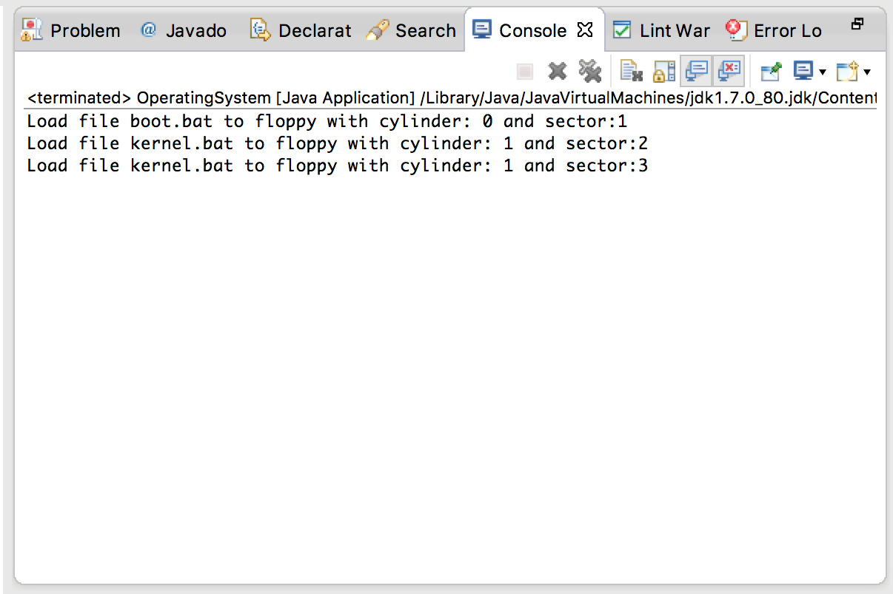
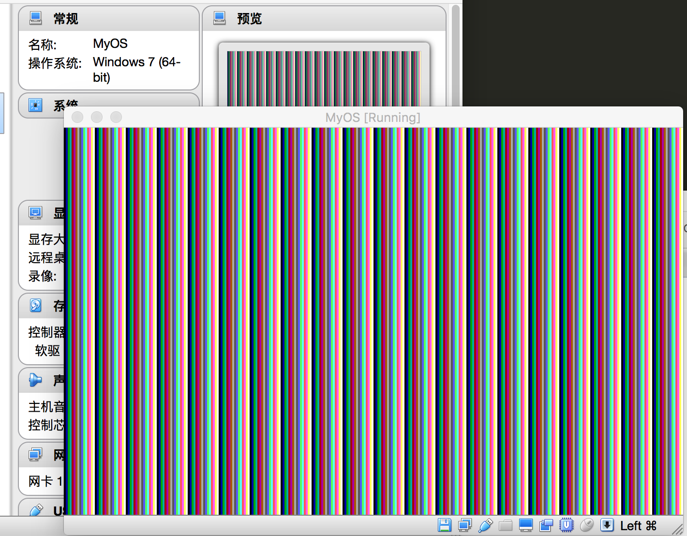

## 利用C语言绘制操作系统图像界面

有了C语言这一利器后，不多多拿来用，那就太对不起前面的一系列努力了。那么怎么表现C语言的强大功能呢，如果还只是一味的在界面上输出几行字符，那太没意思，考虑到，我们的目标是做出像windows那样具备舒心的图像用户界面那样的系统，所以在这一节，我们由字符模式切换入画面模式，初步体验下，那些绚丽多彩的图像界面是如何发展而成的。

要想由字符模式转入图形模式，我们需要操作硬件，特别是向显卡发送命令，让其进入图形显示模式，就如同前面我们所做的，要操作硬件，一般需要使用BIOS调用，以下几行就是打开VGA显卡色彩功能的代码：

```
mov  al, 0x13h
mov  ah, 0x00
int  0x10
```

其中al 的值决定了要设置显卡的色彩模式，下面是一些常用的模式设置：
1. 0x03, 16色字符模式
2. 0x12, VGA图形模式, 640 * 480 * 4位彩色模式，独特的4面存储模式
3. 0x13, VGA图形模式, 320 * 200 * 8位彩色模式，调色板模式
4. 0x6a, 扩展VGA图形模式， 800 * 600 * 4彩色模式

我们采用的是0x13模式，其中320*200*8 中，最后的数值8表示的是色彩值得位数，也就是我们可以用8位数值表示色彩，总共可以显示256种色彩。

系统显存的地址是0x000a0000，当我们执行上面几句代码后，望显存地址写入数据，那么屏幕就会出现相应的变化了。

我们先看看内核的汇编代码部分(kernel.asm)：

```
%include "pm.inc"

org   0x9000

jmp   LABEL_BEGIN

[SECTION .gdt]
 ;                                  段基址          段界限                属性
LABEL_GDT:          Descriptor        0,            0,                   0  
LABEL_DESC_CODE32:  Descriptor        0,      SegCode32Len - 1,       DA_C + DA_32
LABEL_DESC_VIDEO:   Descriptor        0B8000h,         0ffffh,            DA_DRW
LABEL_DESC_VRAM:    Descriptor        0,         0ffffffffh,            DA_DRW
LABEL_DESC_STACK:   Descriptor        0,             TopOfStack,        DA_DRWA+DA_32

GdtLen     equ    $ - LABEL_GDT
GdtPtr     dw     GdtLen - 1
           dd     0

SelectorCode32    equ   LABEL_DESC_CODE32 -  LABEL_GDT
SelectorVideo     equ   LABEL_DESC_VIDEO  -  LABEL_GDT
SelectorStack     equ   LABEL_DESC_STACK  -  LABEL_GDT
SelectorVram      equ   LABEL_DESC_VRAM   -  LABEL_GDT


[SECTION  .s16]
[BITS  16]
LABEL_BEGIN:
     mov   ax, cs
     mov   ds, ax
     mov   es, ax
     mov   ss, ax
     mov   sp, 0100h

     mov   al, 0x13
     mov   ah, 0
     int   0x10

     xor   eax, eax
     mov   ax,  cs
     shl   eax, 4
     add   eax, LABEL_SEG_CODE32
     mov   word [LABEL_DESC_CODE32 + 2], ax
     shr   eax, 16
     mov   byte [LABEL_DESC_CODE32 + 4], al
     mov   byte [LABEL_DESC_CODE32 + 7], ah

     ;set stack for C language
     xor   eax, eax
     mov   ax,  cs
     shl   eax, 4
     add   eax, LABEL_STACK
     mov   word [LABEL_DESC_STACK + 2], ax
     shr   eax, 16
     mov   byte [LABEL_DESC_STACK + 4], al
     mov   byte [LABEL_DESC_STACK + 7], ah

     xor   eax, eax
     mov   ax, ds
     shl   eax, 4
     add   eax,  LABEL_GDT
     mov   dword  [GdtPtr + 2], eax

     lgdt  [GdtPtr]

     cli   ;关中断

     in    al,  92h
     or    al,  00000010b
     out   92h, al

     mov   eax, cr0
     or    eax , 1
     mov   cr0, eax

     jmp   dword  SelectorCode32: 0

     [SECTION .s32]
     [BITS  32]
     LABEL_SEG_CODE32:
     ;initialize stack for c code
     mov  ax, SelectorStack
     mov  ss, ax
     mov  esp, TopOfStack

     mov  ax, SelectorVram
     mov  ds,  ax

C_CODE_ENTRY:
     %include "write_vga.asm"


     io_hlt:  ;void io_hlt(void);
      HLT
      RET

SegCode32Len   equ  $ - LABEL_SEG_CODE32

[SECTION .gs]
ALIGN 32
[BITS 32]
LABEL_STACK:
times 512  db 0
TopOfStack  equ  $ - LABEL_STACK
```

解释下上面代码，我们设置了一个描述符,LABEL_DESC_VRAM, 这个描述符对应的内存起始地址是0，长度是0xffffffff，也就是我们把整个4G内存当做一段可读可写的内存，有了这个设置后，我们在C语言里就可以随意读写内存的任何地方。

LABEL_DESC_STACK 这个描述符用来设置一段可读可写的内存，它的起始地址是LABEL_STACK， 可以看到，程序通过语句：times 512 db 0
初始化了512字节的内存。C语言的运行，特别是函数调用时，是需要一个堆栈来传递参数的，所以，要运行C语言，我们首先需要为其配置一个堆栈，该描述符所对应的这512自己内存就是给C语言使用的，由于堆栈只有512字节，在后面我们使用C语言写的代码中，函数的局部变量大小不能超过512字节，例如下面的代码可能就要出错了：

```
void fun() {
  char buf[513];
}
```

语句%include write_vga.asm”， 表明，我们要开发的C代码文件叫write_vga.c, 我们写完C代码后，会使用上一节的步骤将它编译成汇编，然后include到我们当前的汇编文件里，统一编译成可执行内核。

最后一小块代码：
io_hlt: ;void io_hlt(void);
HLT
RET
作用是进入死循环，HLT指令会让系统进入休眠状态。

导入C语言
硬件，堆栈等基层设施通过汇编准备就绪后，我们可以使用C语言开发图形功能了。显示器的每一个像素对应一个点，一个点可以显示256种不同的颜色，因此，只要我们给每个点设置成相应的颜色，那么最终就可以绘制出特定的图像。

我们看看如何用C语言写入显存从而操作屏幕图像，write_ram.c:

```
void CMain(void) {
    int i;
    char*p = 0;

    for (i = 0xa0000; i <= 0xaffff; i++) {
        p = i;
        *p = i & 0x0f;  
    }

    for(;;) {
       io_hlt();
    }

}

```

代码中，我们将指针P指向地址0xa0000, 这个地址正好就是vga显存地址，vga显存地址从0xa0000开始，直到0xaffff结束，总共64k.接着语句:
*p = i & 0x0f 将一个数值写入显存，这个值可以是0-256中任意一个数值，我们代码里是将i的最后4位作为像素颜色写入显存，这个值是任意的，大家可以随意设置。

在Ubuntu中写出上面代码后，通过命令编译成二进制文件：
gcc -m32 -fno-asynchronous-unwind-tables -s -c -o write_vga.asm write_vga.c

于是在目录下会生成write_vga.o二进制文件，接着使用objconv进行反汇编：
./objconv -fnasm write_vga.asm write_vga.o
反汇编后代码如下:

```
; Disassembly of file: write_vga.o
; Tue Sep 13 10:30:14 2016
; Mode: 32 bits
; Syntax: YASM/NASM
; Instruction set: 80386


global CMain: function

extern io_hlt                                           ; near


SECTION .text   align=1 execute                         ; section number 1, code

CMain:  ; Function begin
        push    ebp                                     ; 0000 _ 55
        mov     ebp, esp                                ; 0001 _ 89. E5
        sub     esp, 24                                 ; 0003 _ 83. EC, 18
        mov     dword [ebp-0CH], 0                      ; 0006 _ C7. 45, F4, 00000000
        mov     dword [ebp-10H], 655360                 ; 000D _ C7. 45, F0, 000A0000
        jmp     ?_002                                   ; 0014 _ EB, 17

?_001:  mov     eax, dword [ebp-10H]                    ; 0016 _ 8B. 45, F0
        mov     dword [ebp-0CH], eax                    ; 0019 _ 89. 45, F4
        mov     eax, dword [ebp-10H]                    ; 001C _ 8B. 45, F0
        and     eax, 0FH                                ; 001F _ 83. E0, 0F
        mov     edx, eax                                ; 0022 _ 89. C2
        mov     eax, dword [ebp-0CH]                    ; 0024 _ 8B. 45, F4
        mov     byte [eax], dl                          ; 0027 _ 88. 10
        add     dword [ebp-10H], 1                      ; 0029 _ 83. 45, F0, 01
?_002:  cmp     dword [ebp-10H], 720895                 ; 002D _ 81. 7D, F0, 000AFFFF
        jle     ?_001                                   ; 0034 _ 7E, E0
?_003:  call    io_hlt                                  ; 0036 _ E8, FFFFFFFC(rel)
        jmp     ?_003                                   ; 003B _ EB, F9
; CMain End of function


SECTION .data   align=1 noexecute                       ; section number 2, data


SECTION .bss    align=1 noexecute                       ; section number 3, bss

```

在上面代码中去掉以section 开始的指令，这些指令会影响我们把当前汇编结合入内核kerne.asm.
同时去掉开头的两句：

global CMain: function
extern io_hlt

因为我们要把两个汇编文件结合成一个，所以这两句声明是多余的。做完这些后，再用nasm编译kernel.asm:
nasm -o kernel.bat kernel.asm
于是本地目录下，内核文件就编译好了。

接着运行java工程，生成虚拟软盘，运行结果如下：




大家注意看，kernel.bat写入了两个扇区，也就是说，我们内核的大小已经超过了512字节。此时我们需要修改一下内核加载器，让内核加载器一次读入两个扇区才能把内核完全加载入内存，打开boot.asm，将readFloppy中的：
mov ah, 0x02
mov al, 1
改成：
mov al, 2
也就是一次读取两个扇区的内容，修改后再次编译boot.asm:
nasm -o boot.bat boot.asm

最后再次运行java程序，此时生成的虚拟软盘中，才会包含完整的内核文件。启动虚拟机，加载虚拟软盘后，运行情况如下：



大家可以看到，屏幕显示出了条纹状图像。

本节所以代码均可在网易云课堂上下载：
[Linux kernel Hacker, 从零构建自己的内核](http://study.163.com/course/courseMain.htm?courseId=1003169025)