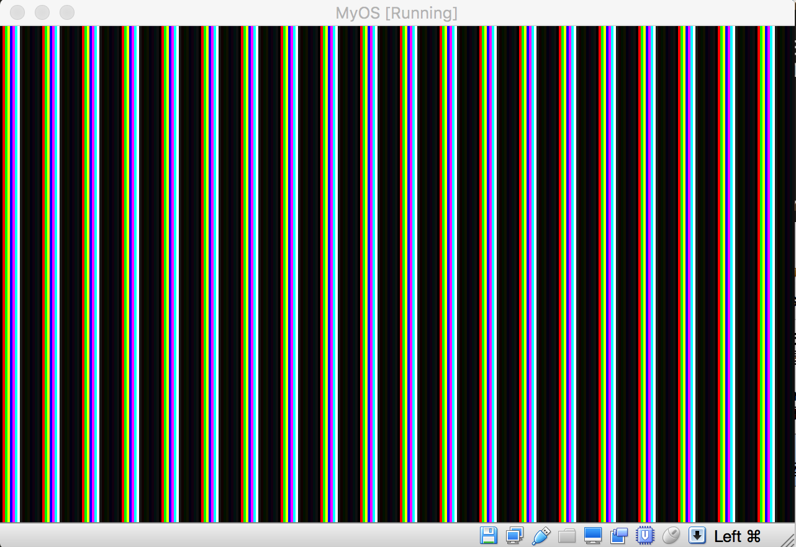
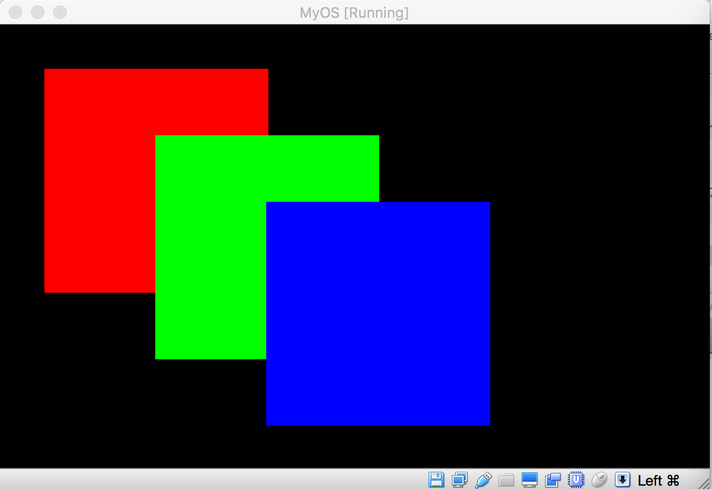
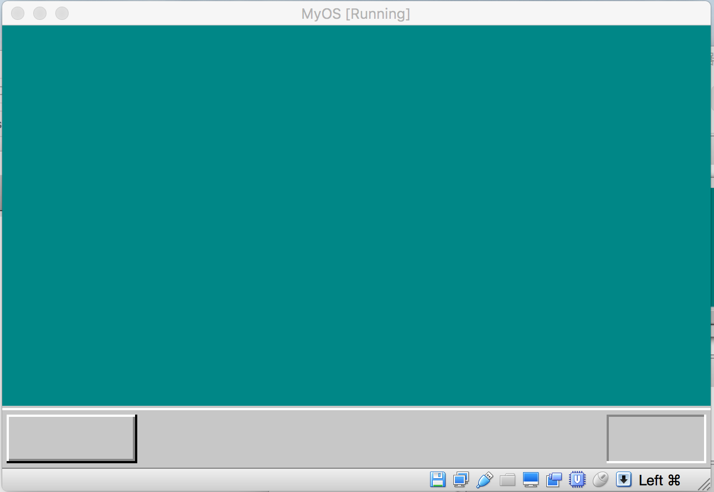

## 使用调色板绘制系统界面

上一节，我们已经可以使用C语言实现图像绘制，但操作系统的用户界面不可能是那种扎眼的条纹图案，这一节，我们要改进图形绘制的方法，做一个像某像样的系统界面。

上一节，我们实现图像绘制的办法是，给每一个像素设定指定的数值，这个数值只能位于0-256这个范畴，以现在绚丽多彩的UI效果来说，256种颜色显然是不够用的，而且还不论颜色的亮度，饱和度等这些成分呢。能够比较好的表示颜色的，一般都使用RGB模式，表示一个RGB颜色需要24位数，原先我们使用的八位数，显然不能满足要求，为了在八位数下使用RGB模式色彩模式，大牛们便开发了调色板系统。

调色板系统其实不能，就是把多种RGB颜色的24位数值放入到一个数组中，原来的八位数不再对应一个颜色值，而是变成这个数组的下标，硬件在显示像素颜色时，从像素对应的显存读取这个八位数，然后把这个数当做下标，在RGB颜色素组中找到对应的RGB颜色值，再把这个颜色值显示到对应的像素上。

为了简单起见，我们使用的RGB颜色不对，只有16种，编号0-15，分别为：
0x000000 全黑
0xff0000 亮红
0x00ff00 亮绿
0xffff00 亮黄
0x0000ff 亮蓝
0xff00ff 亮紫
0x00ffff 浅亮
0xffffff 全白
0xc6c6c6 亮灰
0x840000 暗红
0x008400 暗绿
0x848400 暗黄
0x000084 暗蓝
0x840084 暗紫
0x008484 浅暗蓝
0x848484 暗灰

要想使得显存系统将颜色的显示模式转换成调色板模式，我们必须给系统发生指令，通知它改变运作方式。这种发命令的方式有点像餐厅点餐，点餐员把客户决定的菜单放入到一个小窗口，然后厨师从窗口拿到菜单，再根据菜单去做相应的饭菜。计算机硬件有个类似于这个小窗口的对应物，叫端口，要给硬件发送命令，只要想发送命令时，给某个指定的端口写入特定数值就可以，硬件接收到命令后，可能会产生一些反馈，这些反馈也会存入某些指定的端口，要想得知反馈，程序只要读取某些端口的数据就可以了。

在汇编语言中，从指定端口读取数据的指令叫in, 假设我们把要读取的端口的编号写入到寄存器dx中，那么指令 in al, dx 就把指定端口的数据读入寄存器al. 如果要想往某个端口中写入数据，假设我们把要写入的端口编号放入dx, 把要写入端口的数据放入寄存器al, 那么指令 out dx, al就可以把数据写入指定端口了。

由于C语言无法直接操作硬件，因此，写入和读取端口的代码仍然需要汇编语言来完成：

```asm
io_in8:
      mov  edx, [esp + 4]
      mov  eax, 0
      in   al, dx

    io_in16:
      mov  edx, [esp + 4]
      mov  eax, 0
      in   ax, dx

    io_in32:
      mov edx, [esp + 4]
      in  eax, dx
      ret

    io_out8:
       mov edx, [esp + 4]
       mov al, [esp + 8]
       out dx, al
       ret

    io_out16:
       mov edx, [esp + 4]
       mov eax, [esp + 8]
       out dx, ax
       ret

    io_out32:
        mov edx, [esp + 4]
        mov eax, [esp + 8]
        out dx, eax
        ret

    io_cli:
      CLI
      RET
    io_load_eflags:
        pushfd
        pop  eax
        ret

    io_store_eflags:
        mov eax, [esp + 4]
        push eax
        popfd
        ret

```

io_in8 是向al指定的端口读入一个8位的数值，io_in16 是向al指定的端口读入16位的数值。in_out8 是向指定的端口写入8位的数值汇编提供硬件操作功能，那么C语言就可以直接使用了，如果在C语言代码中，要想从某个端口读取数据，可以使用代码：

byte portValue = io_in8(portNum);

根据C语言的调用规定，如果函数有返回值，那么返回值必须存储在寄存器al,ah, 或ax, eax中，所以大家可以发现，io_in8 或相关的调用，从端口读出的数据都会被存储到寄存器al, 或ax中。

C语言要想将数据写入某个端口，可以使用代码：

io_out8(portNum, portValue);

调用io_cli 的作用是关闭中断，cpu在计算时，如果接收到中断信号，它会放下当前的任务，然后去处理相关的事件，但如果当前处理的任务不允许做到一半就放下来的话，那么我们必须关闭中断信号的发生机制，以避免CPU被干扰。

在CPU上，还有一个专门的寄存器叫EFLAGS, 这是一个16位的寄存器，这个寄存器的某一位如果设置成1，那么对应的某种硬件功能就可以使用，如果设置为0，那么该功能，CPU就禁止使用。中断功能对应该寄存器的第9位，也就是说，第9位如果设置为1，那么中断功能就会被打开，如果设置为0，中断功能就会被关闭。CLI指令实际上，就是通过把这个寄存器的第9位设置成0，从而实现禁止中断功能的。

这样一来，如果我们在执行CLI语句前，先把EFLAGS寄存器的数值保留起来，这个值第9位肯定是1，执行CLI语句后，ELFAGS寄存器的第9位就会被设置成0，如果想恢复中断功能，只要把第9位设置成1就可以了，我们可以把执行CLI语句前所保留的数值重新写入EFLAGS寄存器，这样，中断功能就可以恢复了。

io_load_eflags, 这个调用功能就是要把EFLAGS寄存器的数据保存在寄存器eax中，有一个问题是，就算汇编语言，也不能直接访问EFLAGS寄存器，因为汇编中没有 “mov eax, EFLAGS” 这种指令，但是pushfd 这个指令是专门把EFLAGS寄存器的内容压入堆栈的，所以，要把EFLAGS的数据保留到eax中，必须先使用指令 pushfd把EFLAGS的数据压入堆栈，然后再从堆栈中，把压入的数据弹出到eax寄存器里面。

同理，汇编也没有专门讲数据写入到EFLAGS寄存器的指令，但却有一条专门指令叫popfd, 它专门把堆栈顶部16字节的内容写入到EFLAGS寄存器，所以要想把信息写入EFLAGS寄存器，就必须把信息压入堆栈，然后执行popfd语句，汇编调用io_store_eflags就是专门做这个事情的。

操作硬件就是这么奇怪，操作系统开发难就难在这里，你必须面对很多奇奇怪怪的硬件逻辑。

由于调色板的RGB素组是我们程序设定的，因此就必须要把我们设定的调色板素组的数据传递给硬件显示系统，这样它才能使用我们设定的颜色来描绘每一个像素点。把调色板的数据发送给硬件需要以下操作步骤：
1. 关闭中断，防止CPU被干扰
2. 将调色板的号码写入端口0x03c8, 由于我们现在只有一个调色板，因此调色板的编号默认为0，如果要设置多个调色板，那么其他调色板的编号可以一次为1，2…等
3. 将RGB的颜色数值依次写入端口0x3c9, 假设我们要写入的RGB颜色值是
0x848484 暗灰
那么在C语言中，要分3次调用io_out8, 例如：
io_out(0x3c9, 0x84);
io_out(0x3c9, 0x84);
io_out(0x3c9, 0x84);

解释完硬件原理，接下来我们看看C语言如何设置调色板:

```c
void io_hlt(void);
void io_cli(void);
void io_out(int port, int data);
int  io_load_eflags(void);
void io_store_eflags(int eflags);

void init_palette(void);
void set_palette(int start, int end, unsigned char *rgb);

void CMain(void) {
    int i;
    char*p = 0;

    init_palette();

    for (i = 0xa0000; i <= 0xaffff; i++) {
        p = i;
        *p = i & 0x0f;  
    }

    for(;;) {
       io_hlt();
    }

}

void init_palette(void) {
    static  unsigned char table_rgb[16 *3] = {
        0x00,  0x00,  0x00,
        0xff,  0x00,  0x00,
        0x00,  0xff,  0x00,
        0xff,  0xff,  0x00,
        0x00,  0x00,  0xff,
        0xff,  0x00,  0xff,
        0x00,  0xff,  0xff,
        0xff,  0xff,  0xff,
        0xc6,  0xc6,  0xc6,
        0x84,  0x00,  0x00,
        0x00,  0x84,  0x00,
        0x84,  0x84,  0x00,
        0x00,  0x00,  0x84,
        0x84,  0x00,  0x84,
        0x00,  0x84,  0x84,
        0x84,  0x84,  0x84,
    };

    set_palette(0, 15, table_rgb);
    return;
}

void set_palette(int start,  int end,  unsigned char* rgb) {
    int i, eflags;
    eflags = io_load_eflags();
    io_cli();
    io_out8(0x03c8,  start);  //set  palette number
    for (i = start; i <=end; i++ ) {
        io_out8(0x03c9,  rgb[0] );
        io_out8(0x03c9,  rgb[1] );
        io_out8(0x03c9,  rgb[2] );

        rgb += 3;
    }

    io_store_eflags(eflags);
    return;
}

```

在init_palette中，先定义一个调色板数组，在set_palette中，把调色板的信息传递给硬件显存系统，首先调用io_load_eflags保持EFLAGS寄存器的值，然后关中断，接着把调色板的编号写入端口0x03c8, 接下来把调色板的RGB数值通过端口0x3c9写入显存系统。

完成上面代码后，按照前几节的办法编译，和反汇编，在反汇编中，去掉含有SECTION的指令，以及开头的函数声明，最后结合到kernel.asm中，编译出内核，然后运行java程序构建出虚拟软盘，利用虚拟机加载虚拟软盘运行系统后结果如下：




有了调色板功能，我们不多加使用，怎对得起开始的辛苦，接下来我们再绘制其他图形看看效果，下面的C语言代码将在屏幕上显示几个矩形(write_vga_retangle.c)：

```c
#define  COL8_000000  0
#define  COL8_FF0000  1
#define  COL8_00FF00  2
#define  COL8_FFFF00  3
#define  COL8_0000FF  4
#define  COL8_FF00FF  5
#define  COL8_00FFFF  6
#define  COL8_FFFFFF  7
#define  COL8_C6C6C6  8
#define  COL8_840000  9
#define  COL8_008400  10
#define  COL8_848400  11
#define  COL8_000084  12
#define  COL8_840084  13
#define  COL8_008484  14
#define  COL8_848484  15

void io_hlt(void);
void io_cli(void);
void io_out(int port, int data);
int  io_load_eflags(void);
void io_store_eflags(int eflags);

void init_palette(void);
void set_palette(int start, int end, unsigned char *rgb);
void boxfill8(unsigned char *vram,int xsize,  unsigned char c, int x, int y,
int x0, int y0);

void CMain(void) {
    char*p = (char*)0xa0000;

    init_palette();

    boxfill8(p, 320, COL8_FF0000, 20, 20, 120, 120);
    boxfill8(p, 320, COL8_00FF00, 70, 50, 170, 150);
    boxfill8(p, 320, COL8_0000FF, 120, 80, 220, 180);

    for(;;) {
       io_hlt();
    }

}

void init_palette(void) {
    static  unsigned char table_rgb[16 *3] = {
        0x00,  0x00,  0x00,
        0xff,  0x00,  0x00,
        0x00,  0xff,  0x00,
        0xff,  0xff,  0x00,
        0x00,  0x00,  0xff,
        0xff,  0x00,  0xff,
        0x00,  0xff,  0xff,
        0xff,  0xff,  0xff,
        0xc6,  0xc6,  0xc6,
        0x84,  0x00,  0x00,
        0x00,  0x84,  0x00,
        0x84,  0x84,  0x00,
        0x00,  0x00,  0x84,
        0x84,  0x00,  0x84,
        0x00,  0x84,  0x84,
        0x84,  0x84,  0x84,
    };

    set_palette(0, 15, table_rgb);
    return;
}

void set_palette(int start,  int end,  unsigned char* rgb) {
    int i, eflags;
    eflags = io_load_eflags();
    io_cli();
    io_out8(0x03c8,  start);  //set  palette number
    for (i = start; i <=end; i++ ) {
        io_out8(0x03c9,  rgb[0] );
        io_out8(0x03c9,  rgb[1] );
        io_out8(0x03c9,  rgb[2] );

        rgb += 3;
    }

    io_store_eflags(eflags);
    return;
}

void boxfill8(unsigned char* vram, int xsize, unsigned char c, 
int x0, int y0, int x1, int y1) {
    int  x, y;
    for (y = y0; y <= y1; y++)
     for (x = x0; x <= x1; x++) {
         vram[y * xsize + x] = c;
     }

}

```

boxfill8函数的作用就是将给定的区域填充成矩形，将上面的代码编译，然后反编译成汇编，反编译后的汇编代码中，记住去掉开头的global extern声明语句，并去掉含有SECTION的语句，最后%include到kernel.asm中，编译出kernel.bat 后，运行java程序，生成虚拟软盘，加载执行后效果如下：




最后，我们再深入一步，画一个桌面背景看看(write_vga_desktop.c):


```c
#define  COL8_000000  0
#define  COL8_FF0000  1
#define  COL8_00FF00  2
#define  COL8_FFFF00  3
#define  COL8_0000FF  4
#define  COL8_FF00FF  5
#define  COL8_00FFFF  6
#define  COL8_FFFFFF  7
#define  COL8_C6C6C6  8
#define  COL8_840000  9
#define  COL8_008400  10
#define  COL8_848400  11
#define  COL8_000084  12
#define  COL8_840084  13
#define  COL8_008484  14
#define  COL8_848484  15

void io_hlt(void);
void io_cli(void);
void io_out(int port, int data);
int  io_load_eflags(void);
void io_store_eflags(int eflags);

void init_palette(void);
void set_palette(int start, int end, unsigned char *rgb);
void boxfill8(unsigned char *vram,int xsize,  unsigned char c, int x, int y,
int x0, int y0);

void CMain(void) {
    char*vram = (char*)0xa0000;
    int xsize = 320, ysize = 200;

    init_palette();

    boxfill8(vram, xsize, COL8_008484, 0, 0, xsize-1, ysize-29);
    boxfill8(vram, xsize, COL8_C6C6C6, 0, ysize-28, xsize-1, ysize-28);
    boxfill8(vram, xsize, COL8_FFFFFF, 0, ysize-27, xsize-1, ysize-27);
    boxfill8(vram, xsize, COL8_C6C6C6, 0, ysize-26, xsize-1, ysize-1);

    boxfill8(vram, xsize, COL8_FFFFFF, 3, ysize-24, 59, ysize-24);
    boxfill8(vram, xsize, COL8_FFFFFF, 2, ysize-24, 2, ysize-4);
    boxfill8(vram, xsize, COL8_848484, 3, ysize-4,  59, ysize-4);
    boxfill8(vram, xsize, COL8_848484, 59, ysize-23, 59, ysize-5);
    boxfill8(vram, xsize, COL8_000000, 2, ysize-3, 59, ysize-3);
    boxfill8(vram, xsize, COL8_000000, 60, ysize-24, 60, ysize-3);

    boxfill8(vram, xsize, COL8_848484, xsize-47, ysize-24, xsize-4, ysize-24);
    boxfill8(vram, xsize, COL8_848484, xsize-47, ysize-23, xsize-47, ysize-4);
    boxfill8(vram, xsize, COL8_FFFFFF, xsize-47, ysize-3, xsize-4, ysize-3);
    boxfill8(vram, xsize, COL8_FFFFFF, xsize-3,  ysize-24, xsize-3, ysize-3);
    for(;;) {
       io_hlt();
    }

}

void init_palette(void) {
    static  unsigned char table_rgb[16 *3] = {
        0x00,  0x00,  0x00,
        0xff,  0x00,  0x00,
        0x00,  0xff,  0x00,
        0xff,  0xff,  0x00,
        0x00,  0x00,  0xff,
        0xff,  0x00,  0xff,
        0x00,  0xff,  0xff,
        0xff,  0xff,  0xff,
        0xc6,  0xc6,  0xc6,
        0x84,  0x00,  0x00,
        0x00,  0x84,  0x00,
        0x84,  0x84,  0x00,
        0x00,  0x00,  0x84,
        0x84,  0x00,  0x84,
        0x00,  0x84,  0x84,
        0x84,  0x84,  0x84,
    };

    set_palette(0, 15, table_rgb);
    return;
}

void set_palette(int start,  int end,  unsigned char* rgb) {
    int i, eflags;
    eflags = io_load_eflags();
    io_cli();
    io_out8(0x03c8,  start);  //set  palette number
    for (i = start; i <=end; i++ ) {
        io_out8(0x03c9,  rgb[0] / 4);
        io_out8(0x03c9,  rgb[1] / 4);
        io_out8(0x03c9,  rgb[2] / 4);

        rgb += 3;
    }

    io_store_eflags(eflags);
    return;
}

void boxfill8(unsigned char* vram, int xsize, unsigned char c, 
int x0, int y0, int x1, int y1) {
    int  x, y;
    for (y = y0; y <= y1; y++)
     for (x = x0; x <= x1; x++) {
         vram[y * xsize + x] = c;
     }

}

```

大家注意看，上面代码中，set_palette调用中，将RGB值写入端口时，如下：
io_out8(0x03c9, rgb[0] / 4);
这里为什么要除以4呢，这是一种颜色显示调整，大家可以暂时不用关心。

将上面的代码编译，并运行java程序生成虚拟软盘，运行后结果如下：



看，是不是有点windows的影子了^^!