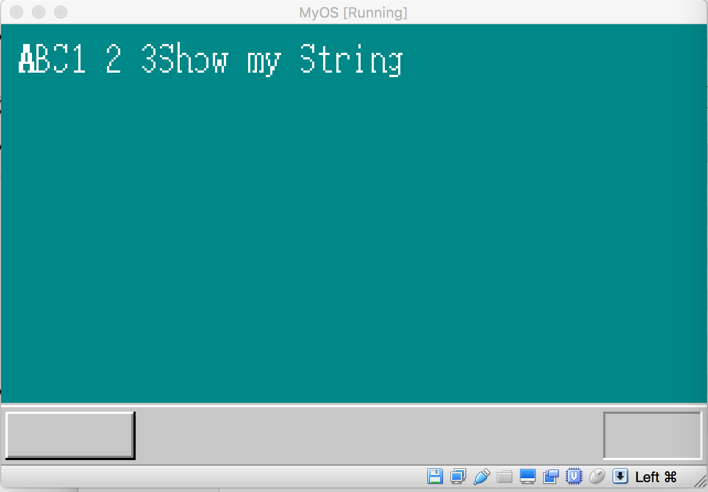

## 绘制系统内核字体

我们已经有了系统桌面，但还缺少一个重要因素，那就是字体，没有字体就无法有效的传递信息，因此，本节，我们看看，系统的字体是如何绘制的。

字体的绘制跟其他图形一样，都是通过将指定位置的像素点设置成给定颜色而形成的最终图形，如下图：


我们看到，要绘制给定的字母，我们可以把一块图形区域先全部染成白色，然后在将某个位置的像素点的颜色设置成黑色，那么，字体就显示出来了。如果我们把字体的大小限定在一个8*16的长方形区域，那么我们在这个区域内，将特定位置的像素点设置成黑色，其他点设置成白色，那么我们就可以得到一个白底黑色的字体：


依据上图，如果我们把8*16区域当做一个二维数组，白色的像素我们用0表示，黑色像素我们用1表示，那么上图的字符A, 最顶层的一行全是白色，所以用8个0表示，第二行，8个像素中，中间两个像素设置成黑色，于是对应的二进制数就是000 11 000, 对应的16进制数就是0x18, 依次类推，这样对整个字符A, 我们就有可以设置一个对应的数组：

```c
static char fontA[16] = {
0x00, 0x18, 0x18, 0x18,0x18,0x24,0x24,0x24,
0x24, 0x7e, 0x42, 0x42,0x42, 0xe7, 0x00, 0x00
};
```

拿到字体数组后，绘制时，把数组中的每一个数值取出来，看该数值的二进制形式中，哪一位设置成1，那么就给对应的像素赋予黑色，如果设置成0，就给对应的像素设置成白色，代码如下：

```c
void showFont8(char *vram, int xsize, int x, int y, char c, char* font) {
    int i;
    char d;

    for (i = 0; i < 16; i++) {
        d = font[i]; 
        if ((d & 0x80) != 0) {vram[(y+i)*xsize + x + 0] = c;}
        if ((d & 0x40) != 0) {vram[(y+i)*xsize + x + 1] = c;}
        if ((d & 0x20) != 0) {vram[(y+i)*xsize + x + 2] = c;}
        if ((d & 0x10) != 0) {vram[(y+i)*xsize + x + 3] = c;}
        if ((d & 0x08) != 0) {vram[(y+i)*xsize + x + 4] = c;}
        if ((d & 0x04) != 0) {vram[(y+i)*xsize + x + 5] = c;}
        if ((d & 0x02) != 0) {vram[(y+i)*xsize + x + 6] = c;}
        if ((d & 0x01) != 0) {vram[(y+i)*xsize + x + 7] = c;}
    }
```

大家注意，上面的代码为什么要乘以 xsize 呢，xsize对应屏幕的宽度，相隔一行的同一列上的像素点，他们之间的距离正好是屏幕一行的宽度，如果把屏幕看成是一个320*200 的二维数组screen[320][200], 那么点screen[1][1]和点screen[2][1] 之间的距离，就等于320.

在write_vga_desktop.c的主函数中，在for(;;)死循环前加入一句：
showFont8(vram, xsize, 20, 20, COL8_FFFFFF, fontA);

将上面的代码结合进write_vga_desktop.c，编译反编译，结合到内核后，运行效果如下：


我们看到，一个”A”字体就出现在屏幕做上方了。

#### 增加更多字体

当前我们只绘制了一个字符，要绘制一系列字符的话，就需要相应的数组，我们的做法是，使用设计好的字体文件，将字体文件转换为二进制数据，先向大家展示这个字体文件的内容样式：


字体文件就是如上图所示，对每一个字符样式进行进行设计，一个“.”就代表0，*代表1，同时，我们会有一个附件工具程序叫makeFont,该程序将此字体文件读入，然后转换成对应的16进制数据。如下图是makeFont工程的目录，该目录下有字体文件font.txt:


启动makeFont程序，并运行之，完成后，该工程目录下会多出一个二进制文件:fontData.inc:


该二进制文件的局部内容如下：

```
systemFont:
db 00H ,00H ,00H ,00H ,00H ,00H ,00H ,00H ,00H ,00H ,00H ,00H ,00H ,00H ,00H ,00H
db 00H ,00H ,070H ,088H ,04H ,054H ,054H ,04H ,04H ,054H ,024H ,088H ,070H ,00H ,00H ,00H
db 00H ,00H ,070H ,0f8H ,0fcH ,0acH ,0acH ,0fcH ,0fcH ,0acH ,0dcH ,0f8H ,070H ,00H ,00H ,00H
db 00H ,00H ,00H ,00H ,0d8H ,0fcH ,0fcH ,0fcH ,0f8H ,070H ,020H ,00H ,00H ,00H ,00H ,00H
db 00H ,00H ,00H ,00H ,020H ,070H ,0f8H ,0fcH ,0f8H ,070H ,020H ,00H ,00H ,00H ,00H ,00H
db 00H ,00H ,00H ,00H ,020H ,070H ,0a8H ,0fcH ,0a8H ,020H ,070H ,00H ,00H ,00H ,00H ,00H
db 00H ,00H ,00H ,00H ,020H ,070H ,0f8H ,0fcH ,0acH ,020H ,070H ,00H ,00H ,00H ,00H ,00H
db 00H ,00H ,00H ,00H ,00H ,00H ,030H ,078H ,078H ,030H ,00H ,00H ,00H ,00H ,00H ,00H
```

makeFont程序的逻辑简单，只是把一行一行的文件读入，把一行中的”.”当做0，”*”当做1，然后转换成16进制数写入文件fontData.inc即可。

有了上面的字体二进制文件后，我们直接将它include到内核文件kernel.asm里，然后在我们的C语言程序中直接使用即可，在C语言中，我们先声明一个外部变量数组:

```
extern char systemFont[16]
```

要想绘制某个字符，例如字符B,我们可以使用以下调用

```C
showFont8(vram, xsize, 20, 20, COL8_FFFFFF, systemFont+'A'*16);1
```

接下来我们给出显示字符A,B,C,1,2,3的C语言部分代码：

```
extern char systemFont[16];

void showFont8(char *vram, int xsize, int x, int y, char c, char* font);

void CMain(void) {
    struct BOOTINFO bootInfo;
    initBootInfo(&bootInfo);
    char*vram = bootInfo.vgaRam;
    int xsize = bootInfo.screenX, ysize = bootInfo.screenY;

    init_palette();

    boxfill8(vram, xsize, COL8_008484, 0, 0, xsize-1, ysize-29);
    boxfill8(vram, xsize, COL8_C6C6C6, 0, ysize-28, xsize-1, ysize-28);
    boxfill8(vram, xsize, COL8_FFFFFF, 0, ysize-27, xsize-1, ysize-27);
    boxfill8(vram, xsize, COL8_C6C6C6, 0, ysize-26, xsize-1, ysize-1);

    boxfill8(vram, xsize, COL8_FFFFFF, 3, ysize-24, 59, ysize-24);
    boxfill8(vram, xsize, COL8_FFFFFF, 2, ysize-24, 2, ysize-4);
    boxfill8(vram, xsize, COL8_848484, 3, ysize-4,  59, ysize-4);
    boxfill8(vram, xsize, COL8_848484, 59, ysize-23, 59, ysize-5);
    boxfill8(vram, xsize, COL8_000000, 2, ysize-3, 59, ysize-3);
    boxfill8(vram, xsize, COL8_000000, 60, ysize-24, 60, ysize-3);

    boxfill8(vram, xsize, COL8_848484, xsize-47, ysize-24, xsize-4, ysize-24);
    boxfill8(vram, xsize, COL8_848484, xsize-47, ysize-23, xsize-47, ysize-4);
    boxfill8(vram, xsize, COL8_FFFFFF, xsize-47, ysize-3, xsize-4, ysize-3);
    boxfill8(vram, xsize, COL8_FFFFFF, xsize-3,  ysize-24, xsize-3, ysize-3);

    showFont8(vram, xsize, 8, 8, COL8_FFFFFF, systemFont + 'A'*16);
    showFont8(vram, xsize, 16, 8, COL8_FFFFFF, systemFont + 'B'*16);
    showFont8(vram, xsize, 24, 8, COL8_FFFFFF, systemFont + 'C'*16);
    showFont8(vram, xsize, 32, 8, COL8_FFFFFF, systemFont + '1'*16);
    showFont8(vram, xsize, 48, 8, COL8_FFFFFF, systemFont + '2'*16);
    showFont8(vram, xsize, 64, 8, COL8_FFFFFF, systemFont + '3'*16);

    for(;;) {
       io_hlt();
    }

}
```

将代码编译并结合如内核后，运行效果如下


字体C的显示好像有点问题，后面我会查查代码，并及时更新。

#### 显示字符串

我们能够显示单个字符，只要稍加加工，我们就可以显示一个字符串，显示字符串只不过是将字符连在一起显示罢了，具体代码如下：

```c
void showString(char* vram, int xsize, int x, int y, char color, unsigned char *s ) {
    for (; *s != 0x00; s++) {
       showFont8(vram, xsize, x, y,color, systemFont+ *s * 16);
       x += 8;
    }
}
```

编译结合进内核后，运行效果如下：




