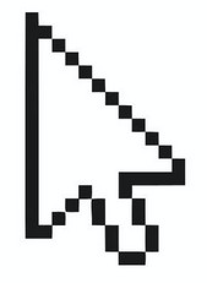
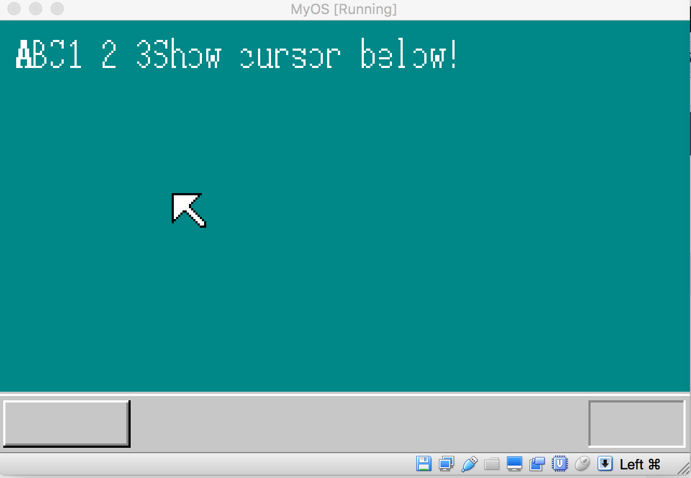

## 在系统内核中绘制鼠标指针

有了桌面背景，能够显示字符串，现在在图形界面上还少了点东西，那就是鼠标指针，如果有个鼠标能在桌面里动来动去，那系统就有点意思了。

就像前几节说的那样，任何图像都是二维平面上点的集合，把不同位置的点设置成不同颜色，那么我们想要的图像就显示出来了，我们先来看看一个用来表示二维图标的数组：

```
static char cursor[16][16] = {
        "**************..",
        "*OOOOOOOOOOO*...",
        "*OOOOOOOOOO*....",
        "*OOOOOOOOO*.....",
        "*OOOOOOOO*......",
        "*OOOOOOO*.......",
        "*OOOOOOO*.......",
        "*OOOOOOOO*......",
        "*OOOO**OOO*.....",
        "*OOO*..*OOO*....",
        "*OO*....*OOO*...",
        "*O*......*OOO*..",
        "**........*OOO*.",
        "*..........*OOO*",
        "............*OO*",
        ".............***"
    };
```

大家看上面的数组是不是有个鼠标的模样了，只要把*对应的像素点画成黑色，0代表的像素点画成白色，. 代表的像素点设置成背景色，那么一个鼠标的图像就出来了：



我们接下来就通过代码设置相关像素点的颜色

```c
void init_mouse_cursor(char* mouse, char bc) {
    static char cursor[16][16] = {
        "**************..",
        "*OOOOOOOOOOO*...",
        "*OOOOOOOOOO*....",
        "*OOOOOOOOO*.....",
        "*OOOOOOOO*......",
        "*OOOOOOO*.......",
        "*OOOOOOO*.......",
        "*OOOOOOOO*......",
        "*OOOO**OOO*.....",
        "*OOO*..*OOO*....",
        "*OO*....*OOO*...",
        "*O*......*OOO*..",
        "**........*OOO*.",
        "*..........*OOO*",
        "............*OO*",
        ".............***"
    };

      int x, y;
      for (y = 0; y < 16; y++) {
          for (x = 0; x < 16; x++) {
             if (cursor[y][x] == '*') {
                 mouse[y*16 + x] = COL8_000000;
             }
             if (cursor[y][x] == 'O') {
                mouse[y*16 + x] = COL8_FFFFFF;
             }
             if (cursor[y][x] == '.') {
                 mouse[y*16 + x] = bc;
             }
          }
      }
}
```

代码中把*设置成黑色，O设置成白色，. 设置成背景色。有了上面的颜色二维数组后，我们需要把该数组的数值写入显存，但显存是一维数组，所以需要将上面的16*16二维数组转换为一个256字节的数组然后写入显存，代码如下：

```c
void putblock(char* vram, int vxsize, int pxsize,
int pysize, int px0, int py0, char* buf, int bxsize) {
    int x, y;
    for (y = 0; y < pysize; y++)
      for (x = 0; x < pxsize; x++) {
          vram[(py0+y) * vxsize + (px0+x)] = buf[y * bxsize + x];
      }
}
```

上面代码中，vxsize是整个屏幕的宽度，也就是320，pxsize,pysize, bxsize 等于16，也就是二维数值的行和列值， px0,py0是鼠标所在的左上角坐标，有了上面代码后，在主函数中通过以下调用就能画出鼠标：

```c
void CMain() {
....
init_mouse_cursor(mcursor, COL8_008484);
putblock(vram, xsize, 16, 16, 80, 80, mcursor, 16);
for(;;){
io_hlt();
}
```

上面代码把鼠标画到左上角坐标为80，80的屏幕处，运行上面代码，反编译后加入内核汇编代码，最后编译内核，用虚拟机加载后结果如下：



虽然鼠标画出来，但动不了，那是因为我们还没有在内核中建立相关机制，要想让鼠标动起来，我们需要设置中断处理，当我们触摸鼠标硬件，硬件会向CPU发送信号，CPU接收信号后引发中断，放下手中正在处理的任务，去执行中断代码，如果这段中断代码是我们写的话，那么我们可以乘此机会重新绘制鼠标，改变鼠标位置，这样鼠标就动起来了。设置中断由于涉及到硬件，所以将会是一个难度比较大的技术点，我们又需要操作类似GDT这种数据结构，在后面的时间里，我们会就这些问题深入研究。


