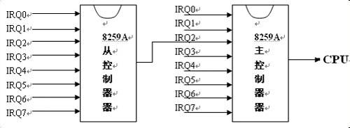
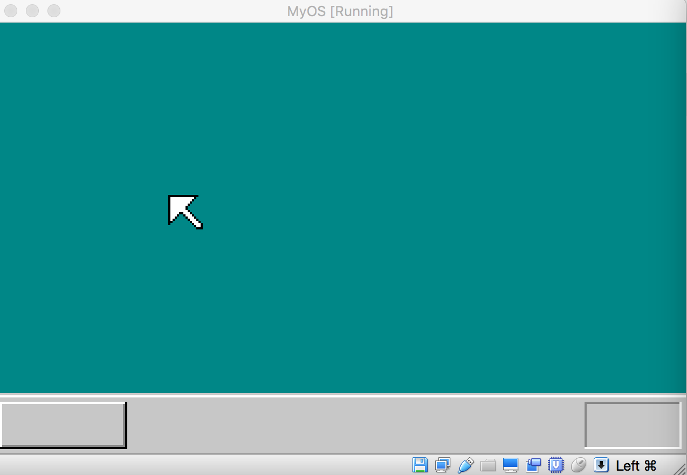
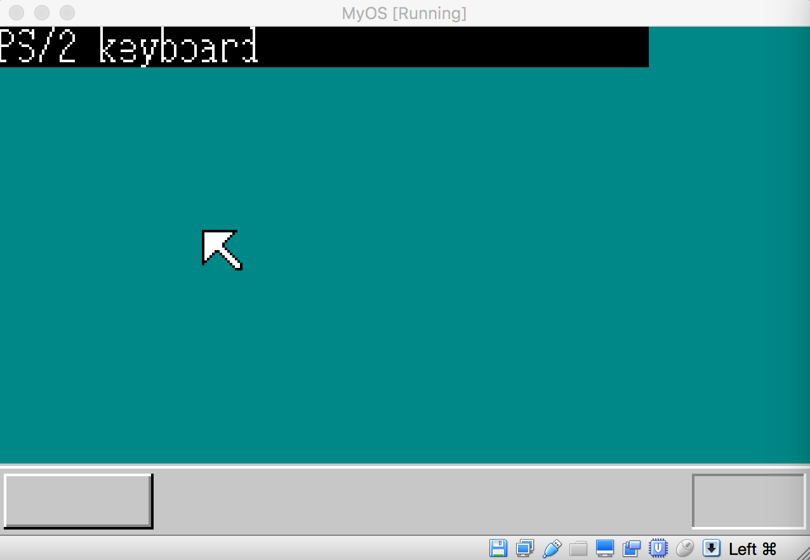

## 为系统内核建立中断机制


上一节，我们绘制了鼠标图案，遗憾的是，鼠标箭头是死的，动不了，要想让鼠标移动，我们需要为内核建立中断机制。当我们移动鼠标时，鼠标会给CPU发送信号，CPU接收到信号后，终止当前的运算，执行内核给定的代码以处理鼠标发送的信号，在这段代码中，内核根据鼠标发送过来的相关信息，重新绘制鼠标图像，那么，屏幕中的鼠标就可以根据鼠标硬件的挪动而发送改变了。

这样，我们就面临两个问题，一是鼠标如何给CPU发送信号，二是CPU在接收信号后，怎么去执行内核提供的一段代码。我们先看第一个问题的处理，外设硬件要给CPU发送信号，需要通过专门的处理芯片，这个芯片叫可编程控制器，俗称8259A:

中断信号的发送机制




从上图可以得知，每一个8259A控制器有8根中断信号线，总共可以接入15个外设硬件，一般情况下，鼠标接入的是从8259A所对应的IRQ4这根信号线，鼠标发送信号时，先通过管线IRQ4将信号传递到从8259A,然后通过管线IRQ2传递到主8259A,最后信号再传递给CPU，键盘产生的中断通过主8259A的IRQ1管线向CPU发送信号.

既然有硬件，那就需要对其初始化后才能使用，对硬件的控制我们前面已经说过，需要通过端口发送命令来完成，要配置这两个控制器，我们需要对指定端口发送1字节的数据，这个一字节(8 bit)的数据，我们称之为ICW(initialization control word).主8259A对应的端口地址是20h,21h, 从8259A对应的端口是A0h和A1h. 对端口发送数据时，顺序是定死的，不能违背：
1. 往端口20h（主片）或A0h（从片)发送ICW1
2. 往端口21h（主片）或A1h（从片)发送ICW2
3. 往端口21h（主片）或A1h（从片)发送ICW3
4. 往端口20h（主片）或A0h（从片)发送ICW4

接下来我们可以看看每个ICW的结构和意义：
ICW1[0…7]:
ICW1[0] 设置为1表示需要发送ICW4,0表示不需要发送ICW4.
ICW1[1] 设置为1表示单个8259, 0表示级联8259
ICW1[2] 设置为1表示4字节中断向量，0表示8字节中断向量
ICW1[3] 设置为1表示中断形式是水平触发，0表示边沿触发
ICW1[4] 必须设置为1
ICW1[5,6,7] 必须设置为0

ICW2[0…7]:
ICW2[0,1,2] 对于80X86架构必须设置为0
ICW2[3…7]: 80X86中断向量

ICW3[0…7](主片):
ICW3[0] 设置为1， IR0级联从片，0无从片
ICW3[1] 设置为1， IR1级联从片，0无从片
ICW3[2] 设置为1， IR2级联从片，0无从片
ICW3[3] 设置为1， IR3级联从片，0无从片
ICW3[4] 设置为1， IR4级联从片，0无从片
ICW3[5] 设置为1， IR5级联从片，0无从片
ICW3[6] 设置为1， IR6级联从片，0无从片
ICW3[7] 设置为1， IR7级联从片，0无从片

ICW3[0…7](从片)：
ICW3[0,1,2] 从片连接主片的IR号
ICw3[3…7] 必须是0

ICW4[0…7]:
ICW4[0] 设置为1，表示x86模式，0表示MCS 80/85模式
ICW4[1] 设置为1，自动EOI；0 正常EOI
ICW4[2,3] 表示主从缓冲模式
ICW4[4] 1表示SFNM模式; 0 sequential 模式
ICW4[5,6,7] 设置为0

上面一些概念大家可能不明白，不用担心，继续往下走，后面我再对应解释。下面我们通过代码配置两个中断控制器：
1: 先向主8259A发生ICW1:
mov al, 011h
out 020h, al

011h 对应的二进制是00010001,对应ICW1的说明，由于ICW1[0]=1表示需要发送ICW4, ICW1[1] = 0,说明有级联8259A（我们买来的电脑都是级联的），
ICW1[2] =0 表示用8字节来设置中断向量号，ICW1[3]=0表示中断形式是边沿触发，ICW[4]必须设置为1，ICW[5,6,7]必须是0.

2: 向从8259A发送ICW1:
out A0h, al
3: 向主8259A发送ICW2:
mov al, 20h
out 021h, al

20h 分解成ICW2 是, ICW2[0,1,2] = 0, 这是强制要求的，也就是ICW2的值不能是0x21,0x22之类，只要前三位不是0就不行，整个ICW2 = 0x20,这样的话，当主8259A对应的IRQ0管线向CPU发送信号时，CPU根据0x20这个值去查找要执行的代码，IRQ1管线向CPU发送信号时，CPU根据0x21这个值去查找要执行的代码，依次类推。

4: 向从8259A发送ICW2:
mov al, 028h
out A1h, al

028h分解成ICW2是ICW[0,1,2]=0,这是强制要求，整个ICW2为0x28，表示当从8259A的IRQ0管线发送信号时，CPU根据数据0x28去查找要执行的代码，IRQ1管线发送信号时，CPU根据数据0x29去查询要执行的代码，以此类推。

5: 向主8259A发送ICW3
mov al, 04h
out 21h, al

04h 分解成ICW3 相当于ICW[2] = 1, 这表示从8259A通过主IRQ2管线连接到
主8259A控制器，如上图所示
6： 向从8259A 发送 ICW3
mov al, 02h
out Alh , al
根据从片的ICW3, 将02h对应过来是， ICW[0,1,2] = 2, 表示当前从片是从IRQ2管线接入主8259A芯片的，如上图。

7： 向主8259A发送ICW4:
mov al, 003h
out 021h, al

001h 对应的ICW4为，ICW4[0]=1表示当前CPU架构师80X86，ICW4[1]=1表示自动EOI, 如果这位设置成0的话，那么中断响应后，代码要想继续处理中断，就得主动给CPU发送一个信号，如果设置成1，那么代码不用主动给CPU发送信号就可以再次处理中断。

8: 向从8259A发送ICW4,原理同上：
out 0A1h, al

当上面的配置完成后，我们还需要再向两个芯片分别发送一个字节，叫OCW(operation control word), 一个OCW是一字节数据，也就是8bit,每一bit设置作用是，当OCW[i] = 1 时,屏蔽对应的IRQ(i)管线的信号，例如OCW[0]=1, 那么IRQ0管线的信号将不会被CPU接收，以此类推。配置代码如下：

mov al, 11111101b
out 21h, al

表示CPU只接收主8259A, IRQ1管线发送的信号，其他管线发送信号一概忽略，IRQ1对应的是键盘产生的中断。

mov al, 11111111b
out 0A1h, al

上面代码使得CPU忽略所有来自从8259A芯片的信号。
当我们移动鼠标时，鼠标是通过从8259A的IRQ4管线向CPU发送信号。
综合以上，我们得到的初始化代码如下：

```asm
init8259A:
 init8259A:
     mov  al, 011h
     out  02h, al
     call io_delay

     out 0A0h, al
     call io_delay

     mov al, 020h
     out 021h, al
     call io_delay

     mov  al, 028h
     out  0A1h, al
     call io_delay

     mov  al, 004h
     out  021h, al
     call io_delay

     mov  al, 002h
     out  0A1h, al
     call io_delay

     mov  al, 002h
     out  021h, al
     call io_delay

     out  0A1h, al
     call io_delay

     mov  al, 11111101b;允许接收键盘中断
     out  021h, al
     call io_delay

     mov  al, 11111111b
     out  0A1h, al
     call io_delay

     ret

io_delay:
     nop
     nop
     nop
     nop
     ret

```

#### 中断代码的执行机制

前面我们处理了硬件如何发送信号的问题，接下来，我们看看，当CPU接收到信号后，如何执行内核指定的代码。要执行相应代码，CPU必须知道代码所在的内存位置，这个信息是通过中断描述符表来实现的，我们看看中断描述符的数据结构：

```c
struct GATE_DESCRIPTOR {
short offset_low;
short selector;
char dw_count;
char attribute;
short offset_high;
};
```

中断描述符跟前面说到的全局描述符类似，也是用于描述内存性质的，只不过它专门用于描述可执行代码所在的内存， offset_low 和 offset_high 合在一起作为中断函数在代码执行段中的偏移，selector 用来指向全局描述符表中的某个描述符，中断函数的代码就处于该描述符所指向的段中，dw_count设置为0，attribute设置为08Eh，我们看看如何在内核中加载中断描述符表：

```c
;Gate selecotor, offset, DCount, Attr
%macro Gate 4
  dw  (%2 & 0FFFFh)
  dw  %1
  dw  (%3 & 1Fh) | ((%4 << 8) & 0FF00h)
  dw  ((%2>>16) & 0FFFFh)
%endmacro
```

上面汇编代码中，%2对应的是4字节的地址偏移，把地址偏移的低2字节放到中断门的前两字节，接下来的一字节是宏定义的第一个参数，是中断代码所在的代码段的全局描述符，第三行设置中断描述符的属性，当前写死为08Eh,最后一行设置中断代码偏移的高二字节。

在内核代码里，当全局描述符表加载到CPU后，就是我们加载中断描述符表的时机了，首先我们要初始化一个中断描述符：

```asm
LABEL_IDT:
%rep  255
    Gate  SelectorCode32, SpuriousHandler,0, DA_386IGate
%endrep

IdtLen  equ $ - LABEL_IDT
IdtPtr  dw  IdtLen - 1
        dd  0
```

上面代码中，我们通过指令%rep 255 重复定义255个中断描述符，这么说来，CPU其实可以支持255种中断，其中两个8259A芯片的15个中断信号就包含在255个中断中，SpuriousHandler是中断代码的入口，我们把255个中断的处理代码都设置成SpuriousHandler,也就是无论哪个中断发生，都调用这个函数来处理:

```asm
     xor   eax, eax
     mov   ax,  ds
     shl   eax, 4
     add   eax, LABEL_IDT
     mov   dword [IdtPtr + 2], eax
     lidt  [IdtPtr]
```

上面代码跟以前我们加载全局描述符表是一样的,由于加载全局描述符时我们使用指令cli关闭了中断功能，因此我们需要回复中断功能，CPU才能相应来自8259A芯片的信号：

```asm
  [SECTION .s32]
     [BITS  32]
     LABEL_SEG_CODE32:
     ;initialize stack for c code
     mov  ax, SelectorStack
     mov  ss, ax
     mov  esp, TopOfStack

     mov  ax, SelectorVram
     mov  ds,  ax

     mov  ax, SelectorVideo
     mov  gs, ax

     sti
     %include "write_vga_desktop.asm"

     jmp  $
```

上面的代码通过运行指令sti 恢复中断功能。最后再看看SpuriousHandler的实现：

```asm
_SpuriousHandler:
SpuriousHandler  equ _SpuriousHandler - $$
call intHandlerFromC
iretd
```

当点击键盘，引发中断时，_SpuriousHandler的代码被调用，它又调用了C模块实现的函数intHandlerFromC。我们看看C语言怎么实现intHandlerFromC的：

```c
void intHandlerFromC(char* esp) {
    char*vram = bootInfo.vgaRam;
    int xsize = bootInfo.screenX, ysize = bootInfo.screenY;
    boxfill8(vram, xsize, COL8_000000, 0,0,32*8 -1, 15);
    showString(vram, xsize, 0, 0, COL8_FFFFFF, "PS/2 keyboard"); 
    for (;;) {
        io_hlt();
    }
    show_char();
}
```

上面函数先绘制一个背景为黑色的矩形，在矩形里用白色的字体显示字符串”PS/2 keyboard”。当上面的代码编译后，启动虚拟机加载内核，初始画面如下：



然后随便点击键盘一个按钮，结果如下：




可见，我们中断机制的设置完全正确，CPU能够接收8259A芯片，同时CPU能够正确的执行内核提交的中断处理函数。