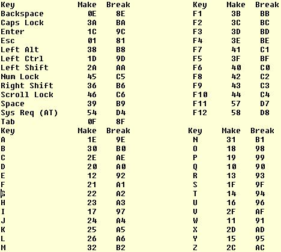
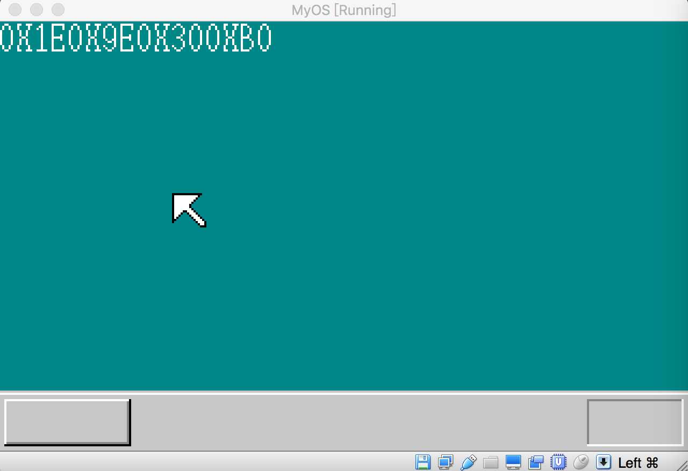
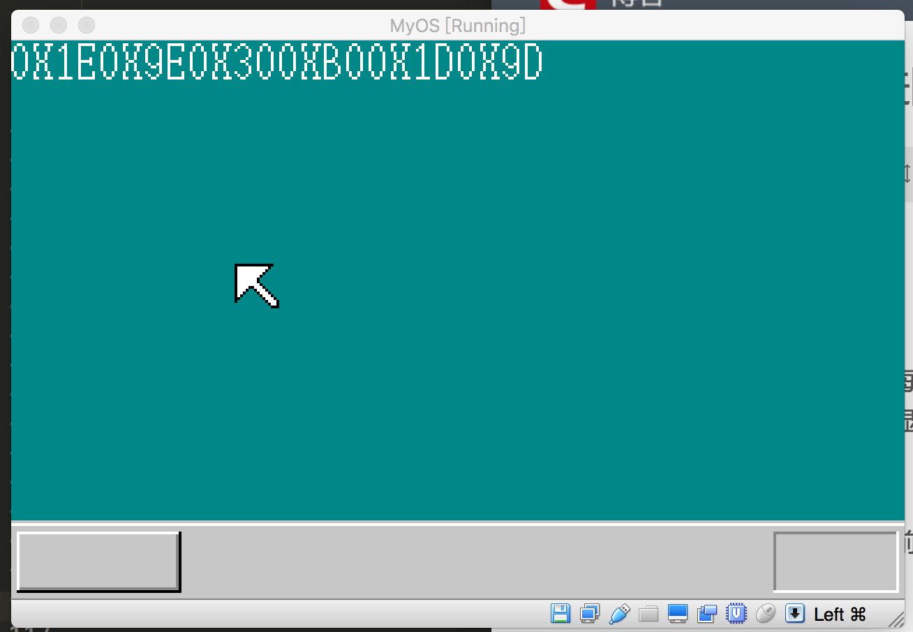

## 内核键盘中断处理进阶


上一节，我们实现了键盘中断的响应，但响应的处理比较简单，只是向界面打印一条字符串而已，本节，我们将在屏幕上输出键盘中断更多的相关信息。当键盘上的一个按键按下时，键盘会发送一个中断信号给CPU,与此同时，键盘会在指定端口(0x60) 输出一个数值，这个数值对应按键的扫描码(make code)，当按键弹起时，键盘又给端口输出一个数值，这个数值叫断码(break code).我们以按键按键’A’为例，当按键’A’按下时，键盘给端口0x60发出的扫描码是0X1E, 当按键’A’弹起时，键盘会给端口0x60发送断码0x9E。

以下显示的就是键盘每一个按键扫描码和断码列表：



从上图可以看到，当按键 ‘A’按下时，键盘向端口发送数值0x1E, 弹起时发送数值0x9e, 同理按键’B’按下时，键盘向端口0x60发送数值0x30,弹起时向端口发送0xB0, 我们更改上一节的中断处理代码，使得键盘按键按下和弹起时，在界面上显示出按键的make code 和 break code:

```c
void intHandlerFromC(char* esp) {
    char*vram = bootInfo.vgaRam;
    int xsize = bootInfo.screenX, ysize = bootInfo.screenY;
    io_out8(PIC_OCW2, 0x21);
    unsigned char data = 0;
    data = io_in8(PORT_KEYDAT);
    char* pStr = charToHexStr(data);
    static int showPos = 0;
    showString(vram, xsize, showPos, 0, COL8_FFFFFF, pStr);
    showPos += 32;
}

char   charToHexVal(char c) {
    if (c >= 10) {
        return 'A' + c - 10;
    } 

    return '0' + c;
}

char*  charToHexStr(unsigned char c) {
    int i = 0;
    char mod = c % 16;
    keyval[3] = charToHexVal(mod);
    c = c / 16;
    keyval[2] = charToHexVal(c);

    return keyval;
}
```

intHandlerFromC 是C语言处理中断的函数，我们注意看语句：
io_out8(PIC_OCW2, 0x21);
其中PIC_OCW2 的值是0x20, 也就是主PIC芯片的控制端口，上一节我们解释过，0x21对应的是键盘的中断向量。当键盘中断被CPU执行后，下次键盘再向CPU发送信号时，CPU就不会接收，要想让CPU再次接收信号，必须向主PIC的端口再次发送键盘中断的中断向量号。

PORT_KEYDAT 的值是0x60, io_in8 是内核汇编部分提供的函数，它从指定端口读入数据，并返回。charToHexStr 作用是将键盘输出的数值转换为16进制的字符串。

当一个按键被按下然后弹起时，上面的intHandlerFromC会调用两次，从而一次按键使得界面上会连续打印两个16进制数值, 上面代码编译进入内核后，加载入虚拟机，然后按下按键’A’,和’B’, 结果显示如下：




0x1E 和 0x9E是按键’A’的扫描码和断码，0x30和0xB0是按键’B’的扫描码和断码。

中断的优化处理
中断，实际上是将CPU当前正在执行的任务给打断，让CPU先处理中断任务，然后再返回处理原先的任务，这时会有一个问题，就是，如果中断处理过久，就会对CPU原来的任务造成负面影响。

就以键盘中断为例，我们处理键盘中断时，要获取按键的扫描码和断码的数值，同时将数值转换为字符串，最后再将字符串的每一个字符绘制到界面上。这一系列其实是很耗时的计算。假设这时候有网络数据抵达系统，但是CPU忙于处理键盘中断，不能及时接收网络数据，这样，系统便会丢失网络数据。

所以，对于中断，我们要尽可能快的处理，然后把控制器交还给原来的任务。对于键盘中断，我们可以把键盘发送的扫描码和断码数值缓存起来，然后把控制器交换给原来任务，等到CPU稍微空闲时再处理键盘事件。因此我们为键盘中断设置一个缓冲区：

```c
struct KEYBUF {
    unsigned char key_buf[32];
    int next_r, next_w, len;
};

struct KEYBUF keybuf;
```

我们设置了长为32字节的缓冲区，当键盘中断接收到数据时，从next_w指向的位置开始写入，len用来表示当前缓冲区中的有效数据长度，例如，当我们按下’A’和’B’两个按键时，我们会向缓冲区写入4个字节，于是len就等于4.

以下是改进后键盘中断的代码逻辑：

```c
void intHandlerFromC(char* esp) {
    char*vram = bootInfo.vgaRam;
    int xsize = bootInfo.screenX, ysize = bootInfo.screenY;
    io_out8(PIC_OCW2, 0x21);
    unsigned char data = 0;
    data = io_in8(PORT_KEYDAT);
    if (keybuf.len < 32) {
       keybuf.key_buf[keybuf.next_w] = data;
       keybuf.len++;
       keybuf.next_w = (keybuf.next_w+1) % 32;
    }

}
```

每次键盘中断，代码都将相应的扫描码和断码写入缓冲区，如果缓冲区写满后，也就是next_w的值达到32，那么通过一次求余，next_w会重新设置为0，也就是说一旦缓冲区写满后，下次写入将从头开始。

键盘数据的输出转移到内核的主函数CMain中，

```c
void CMain(void) {
   ...

   int data = 0;
    for(;;) {
       io_cli();
       if (keybuf.len == 0) {
           io_stihlt();
       } else {
           data = keybuf.key_buf[keybuf.next_r];
           keybuf.next_r = (keybuf.next_r + 1) % 32;
           io_sti();

           char* pStr = charToHexStr(data);
           static int showPos = 0;
           showString(vram, xsize, showPos, 0, COL8_FFFFFF, pStr);
           showPos += 32;           
       }
    }
}
```

主函数不再单纯的死循环，而是每次循环的时候查看键盘缓冲区是否有数据，有数据的话就把缓冲区中的数据显示到屏幕上，同时next_r增加，以指向下一个要输出的数据。

上面代码编译如内核后，效果跟前一节一样，以下结果是按下按键’A’, ‘B’, 和’Ctrl’后的结果：




‘Ctrl’ 按键的扫描码和断码分别为: 0x1D 和 0x9D.

通过这两节研究，我们对中断有了进一步的认识，下一节，我们将让鼠标动起来。