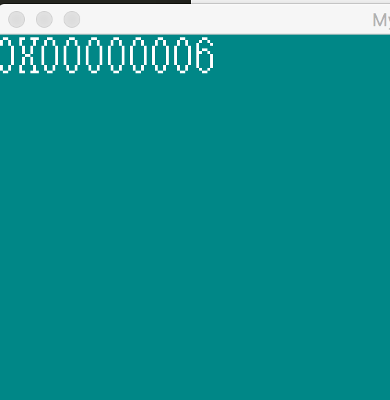

## 检测可用内存


操作系统的一大功能就是为运行程序分配资源，早期Dos系统时常死机或程序奔溃，一大原因就在于应用程序不能以有序合理的方式访问系统资源。在众多系统资源中，内存是系统内核必须小心处理的一块，内存分配算法，也是操作系统内核理论和开发上的重点和难点，从本节开始，我们看看内核如何有效的管理和控制内存。

要实现内存管理模块，首要任务就是先坚持总共有多少可用内存，知道了总内存容量，我们才好实现相关的内存分配算法。如何知道系统运行的硬件有多少可用内存呢，一种通用性比较好的办法是，使用15h中断。其具体步骤如下：

1： 将寄存器ax 赋值为 0E820h
2 : 将寄存器ebx 初始化为0，该寄存器的内容会被BIOS修改，修改成什么数值，我们不用关心，但必须保证内存查询过程中，该寄存器不会被修改。
3： es:di 指向一块足够大的内存地址，BIOS会把有关内存的信息写到这个地址，内存信息是一种数据结构，称之为地址范围描述符。
4： ecx 寄存器存储es:di所指向的内存大小，以字节为单位，BIOS最多会填充ecx个字节的数据，通常情况下，无论ecx的数值是多少，BIOS都只填充20字节，有些BIOS直接忽略ecx的值，总是填充20字节。
5： edx寄存器的值设置为0534D4150h, 这个数值其实对应的是字符组合”SMAP”,其作用我们可以暂时忽略。

做完上面的配置后，执行int 15h 中断，中断结果的分析如下：

1： 判断CF位，如果CF位设置为1，则表示出错
2： eax 会被设置为0534D4150h， 也就是字符串’SMAP’
3 : es:di 返回地址范围描述符结构指针，跟输入时相同
4：如果ebx的值为0，表明查询结束，如果不为0，则继续调用15h获取有关内存的信息

我们看看内存范围描述符的结构：

```c
struct AddrRangeDesc {
    unsigned int  baseAddrLow ;  //内存基地址的低32位
    unsigned int  baseAddrHigh;  //内存基地址的高32位
    unsigned int  lengthLow;     //内存块长度的低32位
    unsigned int  lengthHigh;    //内存块长度的高32位
    unsigned int  type;          //描述内存块的类型
}
```

我们需要留意type的取值， type 等于1，表示当前内存块可以被内核使用。
type等于2，表示当前内存块已经被占用，系统内核绝对不能使用，type等于3，保留给未来使用，内核也不能用当前内存块。

我们看看，内存查询代码如何实现：

```c
MemChkBuf: times 256 db 0
dwMCRNumber:   dd 0
```

MemChkBuf 是256字节的缓冲区，es:di将指向它，BIOS将会把地址范围描述符结构体写入这块内存。每次调用一次int 15h中断，BIOS成功填充地址描述符后后，我们把dwMCRNumber 这个变量加1.

我们看看如何通过汇编代码查询内存信息：

```asm
ComputeMemory:
     mov   ebx, 0
     mov   di, MemChkBuf
.loop:
     mov   eax, 0E820h
     mov   ecx, 20
     mov   edx, 0534D4150h
     int   15h
     jc    LABEL_MEM_CHK_FAIL
     add   di, 20   
     inc   dword [dwMCRNumber]
     cmp   ebx, 0
     jne   .loop
     jmp   LABEL_MEM_CHK_OK
LABEL_MEM_CHK_FAIL:
    mov    dword [dwMCRNumber], 0
```

开始我们先把di指向内存块MemChkBuf，这样BIOS可把内存地址描述符数据结构填充到这块内存，寄存器eax, edx的值我们在前头步骤描述中已经说过。int 15h执行后，如果调用失败，程序会跳转到分支LABEL_MEM_CHK_FAIL，在这里会把dwMCRNumber的值设置为0，如果这段代码执行成功的话，dwMCRNumber的值肯定不是0. 由于内存地址描述符结构的大小是20字节，因此每次填充后，要把di的值增加20，以便BIOS在下次填充时，不会把上一节填充的数据给覆盖掉。如果ebx的值变为0的话，表明所有内存块的信息都已经被BIOS填充到MemChkBuf所指向的内存中了。

```asm
get_memory_block_count:
        mov  eax, [dwMCRNumber]
        ret
```

get_memory_block_count是汇编导出给C语言的函数接口，该函数把BIOS填充的地址描述符结构的个数返回给C语言模块。

我们再看看C语言模块中，相关代码的实现：

```c
char*  intToHexStr(unsigned int d) {
    static char str[11];
    str[0] = '0';
    str[1] = 'X';
    str[10] = 0;

    int i = 2;
    for(; i < 10; i++) {
        str[i] = '0';
    }

    int p = 9;
    while (p > 1 && d > 0) {
        int e = d % 16;
        d /= 16;
        if (e >= 10) {
           str[p] = 'A' + e - 10;
        } else {
            str[p] = '0' + e;
        }         
    } 

    return str;
}
```

上面的函数用于将一个32位整形数值转换为16进制的字符串。

```c
void CMain() {
...
    int memCnt = get_memory_block_count();
    char* pStr = intToHexStr(memCnt);
    showString(vram, xsize, 0, 0, COL8_FFFFFF, pStr);
...
}
```

在内核入口函数，我们调用get_memory_block_count(),获取dwMCRNumber的值，如果内核成功获取到所有内存模块的信息的话，这个值就肯定不是0，我们将这个值显示到系统桌面上。完成上面的代码后，编译成虚拟软盘，加载到虚拟机后，结果如下：



从运行结果可以看到，BIOS总共填充了6个struct AddrRangeDesc 结构体信息。也就是说，我这个虚拟机的内存块总共有6个，当然不可能每一个内存块所表示的内存都可以被我们的操作系统内核使用，对于如何解析AddrRangeDesc所表示的内存，进而获得内核可用的内存信息，我们将在下一节详细解释。
