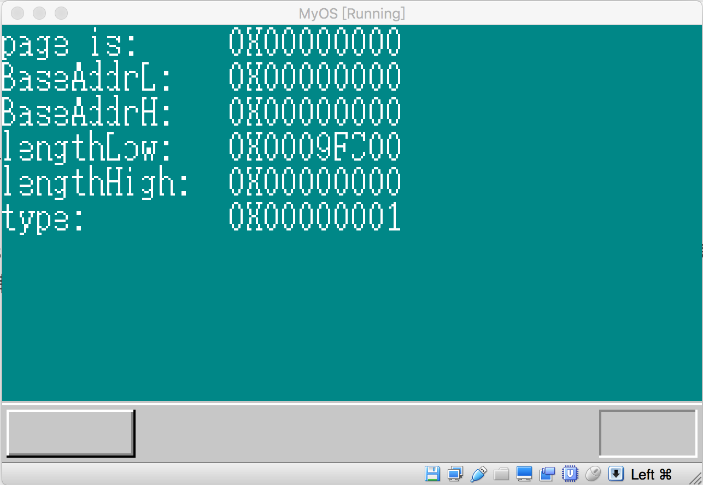

## 解析内存状态信息


上一节，我们成功调用BIOS，获取内存信息，现在，我们可以显示和分析获得的相关信息，为下一步实现内存管理做准备。首先我们把BIOS填充好的数据缓冲过去导出给C语言模块，以便使用C语言来实现分析功能：

```c
get_adr_buffer:
        mov  eax, MemChkBuf
        ret
```

MemChkBuf 是BIOS填充好的数据缓冲区地址，C语言模块通过调用接口get_adr_buffer,获得该地址，以便对内存分布状况进行深入的解析。

我们看看在C语言模块中，是怎么做的：

```c
struct AddrRangeDesc {
    unsigned int baseAddrLow;
    unsigned int baseAddrHigh;
    unsigned int lengthLow;
    unsigned int lengthHigh;
    unsigned int type;
};

char* get_adr_buffer(void);
void  showMemoryInfo(struct AddrRangeDesc* desc, char* vram, int page, int xsize,int color);

```

首先根据BIOS填充的地址描述符，设计一个对应的结构体，以便对地址描述符进行分析。showMemoryInfo函数的作用是将地址描述符的信息显示到桌面上。

```c
void CMain(void) {
...

struct AddrRangeDesc* memDesc = (struct AddrRangeDesc*)get_adr_buffer();

for(;;) {
  ....
else if(fifo8_status(&keyinfo) != 0){
           io_sti();
           data = fifo8_get(&keyinfo);

           if (data == 0x1C) {
               showMemoryInfo( memDesc + count, vram, count, xsize, COL8_FFFFFF);
               count = (count+1);
               if (count > memCnt) {
                  count = 0;
               }
           }
  ....
}
...
}
```

在C入口函数中，先通过调用汇编模块导出的接口，获得地址描述符的内存地址，在主循环中，当键盘又按键按下时，如果按键的扫描码是0x1C,也就是回车键被按下的时候，内核就在桌面上显示地址描述符的信息。每按一次回车键，就显示下一个描述符的信息，当所有描述符都显示完毕后，重新从第一个描述符开始循环显示。

```c
void  showMemoryInfo(struct AddrRangeDesc* desc, char* vram, int page,int xsize, int color) {
    int x = 0, y = 0, gap = 13*8,  strLen = 10* 8;

    boxfill8(vram, xsize, COL8_008484, 0, 0,  xsize, 100);

    showString(vram, xsize, x, y, color, "page is: ");
    char* pPageCnt = intToHexStr(page);
    showString(vram, xsize, gap, y, color, pPageCnt);
    y += 16;

    showString(vram, xsize, x, y, color, "BaseAddrL: ");
    char* pBaseAddrL = intToHexStr(desc->baseAddrLow);
    showString(vram, xsize, gap, y, color, pBaseAddrL);
    y += 16;

    showString(vram, xsize, x, y, color, "BaseAddrH: ");
    char* pBaseAddrH = intToHexStr(desc->baseAddrHigh);
    showString(vram, xsize, gap, y, color, pBaseAddrH);

    y += 16;
    showString(vram, xsize, x, y, color, "lengthLow: ");
    char* pLengthLow = intToHexStr(desc->lengthLow);
    showString(vram, xsize, gap, y, color, pLengthLow);

    y+= 16;
    showString(vram, xsize, x, y, color, "lengthHigh: ");
    char* pLengthHigh = intToHexStr(desc->lengthHigh);
    showString(vram, xsize, gap, y, color, pLengthHigh);

    y+= 16;
    showString(vram, xsize, x, y, color, "type: ");
    char* pType = intToHexStr(desc->type);
    showString(vram, xsize, gap, y, color, pType);
}
```

showMemoryInfo实现不难，就是把地址描述符每个成员的数值转换成16进制字符串显示到桌面上。上面的代码编译后加载到虚拟机，运行情况如下：



每按一次回车键，桌面上的信息就会更新。我虚拟机的内存信息如下：
1:
BaseAddrL: 0x00000000
BaseAddrH:0x00000000
lengthLow: 0x0009FC00
lengthHigh: 0x00000000
type: 0x00000001

2:
BaseAddrL: 0x0009FC00
BaseAddrH: 0x00000000
lengthLow: 0x00000400
lengthHigh: 0x00000000
type: 0x00000002

3:
BaseAddrL: 0x000F0000
BaseAddrH: 0x00000000
lengthLow: 0x00010000
lengthHigh: 0x00000000
type: : 0x00000002

4:
BaseAddrL: 0x00100000
BaseAddrH: 0x00000000
lengthLow: 0x3FEF0000
lengthHigh: 0x00000000
type: 0x00000001

5:
BaseAddrL: 0x3FEF0000
BaseAddrH: 0x00000000
lengthLow: 0x00010000
lengthHigh: 0x00000000
type: 0x00000003

6:
BaseAddrL: 0xFFC00000
BaseAddrH: 0x00000000
lengthLow: 0x00040000
lengthHigh: 0x00000000
type: 0x00000002

由于我们开发的是32位系统，所以baseAddrH, lengthHigh 全部为0，从上面显示的内存信息可以得知，我虚拟机的可用内存是1G,但是可以被内核使用的内存只要两块，一块的地址是从0开始，长度为：0x0009FC00， 另一块起始地址为：0x00100000，长度为0x3FEF0000， 基于这些信息，下一步我们就可以开发内存管理分配算法了。
————————————————
版权声明：本文为CSDN博主「tyler_download」的原创文章，遵循 CC 4.0 BY-SA 版权协议，转载请附上原文出处链接及本声明。
原文链接：https://blog.csdn.net/tyler_download/article/details/52954543