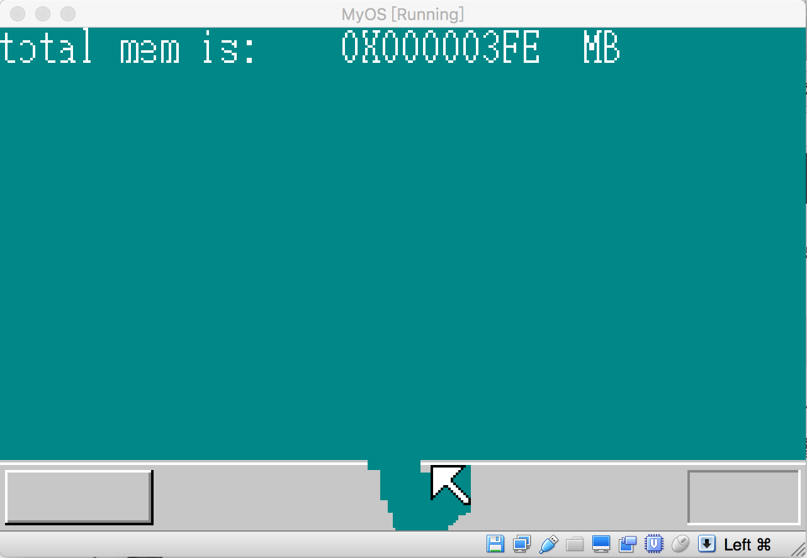
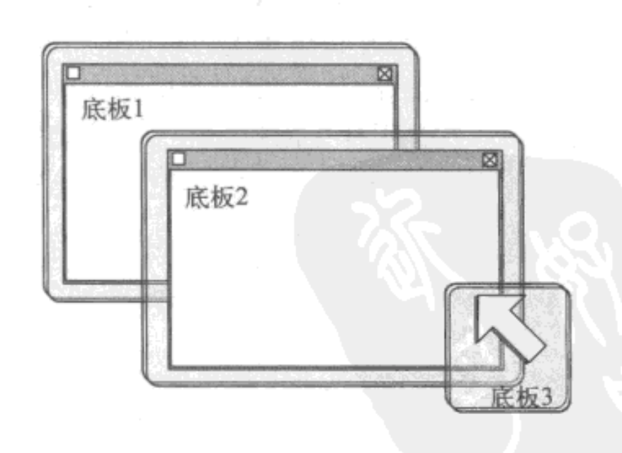

## 使用图片分层技术实现窗口叠加


在前面的章节中，我们完成了鼠标的绘制，但存在一个严重的问题是，当鼠标移动的时候，鼠标下方的窗口或图案会因为内核重绘鼠标而被擦除掉，情况如下：




解决这个问题的办法是，每当鼠标移动时，我们先把底下的图案绘制一遍，然后把鼠标在移动后的新坐标处再绘制一遍。由此，我们引出一个叫图层的概念，鼠标下面的背景是一个图层，鼠标自己处于一个图层，图层间有高度差别，作为背景的图层，它的高度就要比鼠标所在的图层低，因此内核每次重绘时，先绘制高度低的图层，再绘制高度高的图层，我们使用的操作系统，用鼠标挪动窗口时，窗口底部的图案不受影响，就是使用了图层分层技术，基本原理如下图的：



有了基本原理后，我们可以编码实现了，首先定义图层的数据结构：

```c
struct SHEET {
    unsigned char *buf;
    int bxsize, bysize, vx0, vy0, col_inv, height, flags;
};
```

buf对应的是窗口的像素信息，bxsize, bysize 是窗口的长和高，vx0, vy0是窗口移动后的左上角坐标，col_inv 用来表示窗口中不显示的部分，height表示图层的高度，flags用来表示图层状态。这里需要解释一下的变量是col_inv. 我们看看用来表示鼠标的buf, 有就是绘制鼠标的像素数组：

```
static char cursor[16][16] = {
        "**************..",
        "*OOOOOOOOOOO*...",
        "*OOOOOOOOOO*....",
        "*OOOOOOOOO*.....",
        "*OOOOOOOO*......",
        "*OOOOOOO*.......",
        "*OOOOOOO*.......",
        "*OOOOOOOO*......",
        "*OOOO**OOO*.....",
        "*OOO*..*OOO*....",
        "*OO*....*OOO*...",
        "*O*......*OOO*..",
        "**........*OOO*.",
        "*..........*OOO*",
        "............*OO*",
        ".............***"
    };
```

上面的数组对应的就是SHEET结构中的buf, 我们绘制鼠标时，是按照数组中的元素对应到像素点的，如果某个元素的值是 *, 那么对应的像素点是黑色，如果元素的值是0, 那么对应像素的颜色就是白色，如果元素的值是 . ,那么这些点对应的像素颜色不做任何改变，这样的话，下面图层的相关图案就可以“透视”出来。这些点对应的值就是SHEET中的col_inv.

有了图层后，我们还要定义图层管理器对象：

```c
#define MAX_SHEETS  256
struct SHTCTL {
    unsigned char *vram;
    int xsize, ysize, top;
    struct SHEET *sheets[MAX_SHEETS];
    struct SHEET sheets0[MAX_SHEETS];
};

#define SIZE_OF_SHEET  32
#define SIZE_OF_SHTCTL 9232
```

其中vram 对应的是显存地址，也就是0xa0000, xsize, ysize 代表整个显示界面的宽和高，我们当前系统显示界面的大小是320 * 320. top 表示当前要显示几个图层， sheets0 是用来存储图层对象的数组，sheets 是指针数组，用来指向下面图层数组中的对应图层对象。根据图层数据结构，我们定义用来操作他们的相关函数接口：

```c
struct SHEET *sheet_alloc(struct SHTCTL *ctl);
struct SHTCTL *shtctl_init(struct MEMMAN *memman, unsigned char *vram,
  int xsize, int ysize);
void sheet_setbuf(struct SHEET *sht, unsigned char *buf, int xsize, int ysize,
    int col_inv);
void sheet_updown(struct SHTCTL *ctl, struct SHEET *sht, int height);

int sheet_refresh(struct SHTCTL *ctl);


void sheet_slide(struct SHTCTL *ctl, struct SHEET *sht, int vx0, int vy0);
```

上面所有代码都定义在文件win_sheet.h中。我们继续看看相关代码的实现：

```c
#include "mem_util.h"
#include "win_sheet.h"

struct SHTCTL *shtctl_init(struct MEMMAN *memman, unsigned char *vram,
  int xsize, int ysize) {
    struct SHTCTL *ctl;
    int i;
    ctl = (struct SHTCTL *)memman_alloc_4k(memman, SIZE_OF_SHTCTL);
    if (ctl == 0) {
        return 0;
    }

    ctl->vram = vram;
    ctl->xsize = xsize;
    ctl->ysize = ysize;
    ctl->top = -1;
    for (i = 0; i < MAX_SHEETS; i++) {
        ctl->sheets0[i].flags = 0;
    }

    return ctl;
}

#define SHEET_USE  1
struct SHEET *sheet_alloc(struct SHTCTL *ctl) {
    struct SHEET *sht;
    int i;
    for (i = 0; i < MAX_SHEETS; i++) {
        if (ctl->sheets0[i].flags == 0) {
            sht = &ctl->sheets0[i];
            ctl->sheets[i] = sht;
            sht->flags = SHEET_USE;
            sht->height = -1;
            return sht;
        }
    }

    return 0;
}
```

上面是两个初始化函数，分别初始化图层管理器和图层对象。在这两个函数中，使用到一个来自内存管理器的接口memman_alloc_4k， 顾名思义，就是向管理器申请一块大小为4k整数倍的内存，即使你只使用1字节，分配到的内存大小仍然是4k,一下子分配4k是为了防止内存碎片化过于严重，以造成浪费。我们看看memman_alloc_4k的实现，该函数的代码在文件mem_util.c中：

```c
unsigned int memman_alloc_4k(struct MEMMAN *man, unsigned int size) {
    unsigned int a;
    size = (size + 0xfff) & 0xfffff000;
    a = memman_alloc(man, size);
    return a;
}
```

它的实现逻辑是这样的，4k对应的16进制数是0x1000, 如果你申请大小是1字节，那么 size + 0xfff 就等于是 0x1000, 跟0xfffff000 做与操作后，结果任然是0x1000, 如果你申请的内存大小是 0xfff, 也就是差1字节到4k, 那么size + 0xfff的结果是0x1FFE, 做与运算后结果也是0x1000, 所以这种计算方法能够在你申请任何大小内存的情况下，将大小圆整到大于所申请内存的最小4k倍数。

sheet_alloc用来分配一个图层对象给指定窗口，同时我们把图层的高设置成-1时，表示图层对应的窗口处于最小化状态。

```c
void sheet_setbuf(struct SHEET *sht, unsigned char *buf, int xsize, int ysize,
    int col_inv) {
    sht->buf = buf;
    sht->bxsize = xsize;
    sht->bysize = ysize;
    sht->col_inv = col_inv;
    return;
}
```

sheet_setbuf将窗口对应的二位数组与图层对象关联起来，例如上面的数组cursor就是鼠标绘制数值，cursor数组将会跟通过上面的函数跟其图层对象关联起来。下面我们看的将是最为复杂的一个函数：

```c
void sheet_updown(struct SHTCTL *ctl, struct SHEET *sht, int height) {
    int h, old = sht->height;
    if (height > ctl->top + 1) {
        height = ctl->top + 1;
    }

    if (height < -1) {
        height = -1;
    }

    sht->height = height;

    if (old > height) {
        if (height >= 0) {
            for (h = old; h > height; h--) {
                ctl->sheets[h] = ctl->sheets[h-1];
                ctl->sheets[h]->height = h;
            }

            ctl->sheets[height] = sht;
        } else {
            if (ctl->top > old) {
               for (h = old; h < ctl->top; h++) {
                   ctl->sheets[h] = ctl->sheets[h+1];
                   ctl->sheets[h]->height = h;
               }
            }

            ctl->top--;
        }

        sheet_refresh(ctl);
    } else if (old < height) {
        if (old >= 0) {
            for (h = old; h < height; h++) {
               ctl->sheets[h] = ctl->sheets[h + 1];
               ctl->sheets[h]->height = h;
            }

            ctl->sheets[height] = sht;
        } else {
            for (h = ctl->top; h >= height; h--) {
                ctl->sheets[h + 1] = ctl->sheets[h];
                ctl->sheets[h + 1]->height = h + 1;
            }

            ctl->sheets[height] = sht;
            ctl->top++;
        }

        sheet_refresh(ctl);
    }

}
```

这个函数比较大，我们分块分析。总体来说sheet_updown 是用来调整每个窗口图层的高度的，某个窗口被点击后，它会从底部冒到顶部，也就是原来被遮住看不到的部分会全部显示出来，这种情况就是up, 如果窗口被其他拖过来的窗口给遮住，这种情况就是down.

第一部分代码如下：

```c
 int h, old = sht->height;
    if (height > ctl->top + 1) {
        height = ctl->top + 1;
    }

    if (height < -1) {
        height = -1;
    }

    sht->height = height;
```

如果是up, 也就是传进来的参数height比图层对应的高度要高，那么就改变图层的高度值，如果调整的高度过大，比如当前只桌面上只有三个窗口(ctl->top == 3)，但你要把新增窗口设置成100， 那么前面这段代码会把当前窗口的高度设置为4。

如果窗口下降高度，例如当前有三个窗口图层：
sheet1{height = 1;}
sheet2{height = 2;}
sheet3{hegiht = 3;}

现在最高的窗口sheet3高度要降为最低，那么就把sheet1, sheet2分别往后挪一个位置，然后将sheet3 放到最上面：
sheet3{hegiht = 1;}
sheet1{height = 2;}
sheet2{height = 3;}

这对应代码：

```c
 if (old > height) {
        if (height >= 0) {
            for (h = old; h > height; h--) {
                ctl->sheets[h] = ctl->sheets[h-1];
                ctl->sheets[h]->height = h;
            }

            ctl->sheets[height] = sht;
        } else {
            ....
        }
    sheet_refresh(ctl);
 }
```

如果当前窗口最小话，那么该窗口对应的图层对象就从图层数组中去掉，例如sheet3的窗口最小化，那么图层数组由原来的：
sheet1{height = 1;}
sheet2{height = 2;}
sheet3{hegiht = 3;}
变为：
sheet1{height = 1;}
sheet2{height = 2;}

这个逻辑对应于代码：

```c
if (old > height) {
        if (height >= 0) {
           。。。。
        } else {
            if (ctl->top > old) {
               for (h = old; h < ctl->top; h++) {
                   ctl->sheets[h] = ctl->sheets[h+1];
                   ctl->sheets[h]->height = h;
               }
            }

            ctl->top--;
        }
    sheet_refresh(ctl);
 }
```

sheet_refresh(ctl); 的作用是根据图层数组绘制图层，后面再详细分析。

如果当窗口的高度变高，底层的窗口激活后要在最上头显示，例如有下面三个图层对应的窗口：
sheet1{height = 1;}
sheet2{height = 2;}
sheet3{hegiht = 3;}

如果sheet1对应的窗口从最低位置转换到最前端显示，那么图层数组就做如下变得：
sheet2{height = 1;}
sheet3{hegiht = 2;}
sheet1{height = 3;}

这个逻辑对应的代码是：

```c
else if (old < height) {
        if (old >= 0) {
            for (h = old; h < height; h++) {
               ctl->sheets[h] = ctl->sheets[h + 1];
               ctl->sheets[h]->height = h;
            }

            ctl->sheets[height] = sht;
        } else {
            。。。。
        }

        sheet_refresh(ctl);
    }
```

如果某个窗口原来处于最小化，现在要把它的高度设置为2，那么原来高度大于2的窗口，他们的高度就要相应的增加，然后再把空出来的图层位置让给新改变的图层，例如当前有三个窗口对应的图层如下：
sheet1{height = 1;}
sheet2{height = 2;}
sheet3{hegiht = 3;}

新窗口对应的图层是sheet4,它的高度从-1，也就是最小化形态转为高度为2，那么就需要把原来高度为2以上的图层在图层数组中往后挪，并改变高度：
sheet1{height = 1;}

sheet2{height = 3;}
sheet3{hegiht = 4;}

再把sheet4图层插入挪动后空出来的位置：
sheet1{height = 1;}
sheet4{height = 2;}
sheet2{height = 3;}
sheet3{hegiht = 4;}

这个逻辑对应的代码为：

```c
else if (old < height) {
        if (old >= 0) {
           。。。。。
        } else {
            for (h = ctl->top; h >= height; h--) {
                ctl->sheets[h + 1] = ctl->sheets[h];
                ctl->sheets[h + 1]->height = h + 1;
            }

            ctl->sheets[height] = sht;
            ctl->top++;
        }

        sheet_refresh(ctl);
    }
```

我们再看看图层绘制函数：

```c
int sheet_refresh(struct SHTCTL *ctl) {
    int h, bx, by, vx, vy;
    unsigned char *buf, c , *vram = ctl->vram;
    struct SHEET *sht;
    for (h = 0; h <= ctl->top; h++) {

        sht = ctl->sheets[h];
        buf = sht->buf;
        for (by = 0; by < sht->bysize; by++) {

            vy = sht->vy0 + by;
            for (bx = 0; bx < sht->bxsize; bx++) {

                vx = sht->vx0 + bx;
                c = buf[by * sht->bxsize + bx];
                if (c != sht->col_inv) {
                    vram[vy * ctl->xsize + vx] = c;
                }
            }
        }
    }

    return 0;
}
```

代码中vram 对应的是显存起始地址，也就是0xa0000, 接着遍历图层数组，按照每个图层绘制数组给显存对应的像素点设置对应的颜色，从而画出该图层对应的窗口。处于图层数组前面的图层先绘制，数组后面的图层后绘制，后绘制的图层窗口可能覆盖先绘制的窗口。

当某个窗口被移动后，内核会根据窗口移动后的新坐标重新绘制整个图层数组，代码如下：

```c
void sheet_slide(struct SHTCTL *ctl, struct SHEET *sht, int vx0, int vy0) {
    sht->vx0 = vx0;
    sht->vy0 = vy0;
    if (sht->height >= 0) {
         sheet_refresh(ctl);
    }
}
```

把上面的代码编译入内核，（还有不少代码没有在本文说明，所以相关代码的讲解和调试过程请参看视频），加载后效果如下：


鼠标属于最顶图层，它的移动不会再对地步的窗口图层产生破坏作用。具体代码讲解和演示请参看视频：