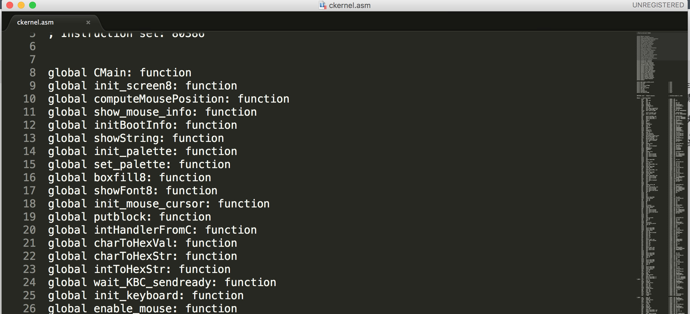

## 内核编译自动化


在前面的章节中，我们内核的编译始终是手动的，例如编译内核的C语言部分时，都是手动编译各个模块，然后手链接成一个二进制文件，然后再手动反汇编。要想成为一个合格的技术人员，这种手动模式是很不专业的，一是手动处理很容易出错，假如我们更新了某个模块，却忘了重新编译链接的话，那么最后的内核就会出现一些难以排除的诡异bug；二是，自动化程度是菜鸟和大牛的区别，我们可以发现，那些技术大牛，都是依赖脚步自动化来加速开发流程的，因此，不懂得将业务逻辑进行自动化实现，就无法真正的提升自己的技术内核。

从本节开始，我们将把以前手动处理的业务流程，全面自动化。第一个要自动化的，是内核C模块部分的编译，反汇编，以及从虚拟机拷贝到实体机。现在我们C内核有以下几部分组成，write_vga_desktop.c, mem_util.c, mem_util.h, win_sheet.c, win_sheet.h。我们将通过下面的makefile文件实现这些源代码文件编译，链接，反汇编，以及拷贝等流程，makefile内容如下：

```
ckernel : ckernel_u.asm
    cp ckernel_u.asm win_sheet.h win_sheet.c mem_util.h mem_util.c write_vga_desktop.c makefile '/media/psf/Home/Documents/操作系统/文档/19/OS-kernel-win-sheet/'
ckernel_u.asm : ckernel.o
    ./objconv -fnasm ckernel.o ckernel_u.asm
ckernel.o : write_vga_desktop.o win_sheet.o mem_util.o
    ld -m elf_i386 -r write_vga_desktop.o mem_util.o win_sheet.o -o ckernel.o
write_vga_desktop.o : write_vga_desktop.c win_sheet.c win_sheet.h mem_util.c mem_util.h
    gcc -m32 -fno-asynchronous-unwind-tables -s -c -o write_vga_desktop.o write_vga_desktop.c
win_sheet.o : win_sheet.c win_sheet.h
    gcc -m32 -fno-asynchronous-unwind-tables -s -c -o win_sheet.o win_sheet.c
mem_util.o : mem_util.h mem_util.c
    gcc -m32 -fno-asynchronous-unwind-tables -s -c -o mem_util.o mem_util.c

```

makefile 由以下文法格式组成：
target : prerequest
command

target 指要实现的目标，prerequest 是指完成目标要具备的先前条件，command指的是实现目标需要运行的指令。以上面内容为例，ckernel是一个目标，一个目标可以任意命名，实现ckernel这个目标的前提是ckernel_u.asm这个文件必须存在，如果这个文件存在，则执行cp拷贝命令，把指定的文件拷贝到指定目录。如果ckernel_u.asm 这个文件不存在，那么make程序则执行下面的命令，以便生成ckernel_u.asm这个文件，这个规则以此类推。

有了上面的makefile文件后，每次我们修改相关文件，或增添新的模块，只要把makefile做一些小更改，然后只要直接运行命令make就可以了，不用再像以前一样，对每个单独模块各自编译，然后再统一链接，这么做不但容易出错，而且消耗不必要的宝贵精力。

反编译好内核的C模块后，把该模块反汇编，要想结合近内核汇编模块，我们还需要做的，就是把反汇编文件内的一些不必要的语句给删除，前面章节我们提到过，要删除那些带有 global, extern, SECTION 等指令语句，才能正常对结合后的汇编代码进行编译，例如下面是反汇编后的代码中需要删除的部分：




原来我在视频中，给大家展示的是手动删除这些语句，手动删除很容易出错，而且很累，现在，我们用java开发这种功能，以实现删除自动化，算法原理很简单，读入ckernlen_u.asm文件，然后每次获取一行，如果改行含有关键字global, extern, SECTION, 那么程序就把这一行给删除，代码如下：

```java
public void process() {
        String lineText = null;
        try {
            while ((lineText = fileReader.readLine()) != null) {
                String line = lineText.toLowerCase();
                if (line.contains("global") || line.contains("extern") || line.contains("section")) {
                    continue;
                }

                fileBuffer.append(lineText).append("\r\n");
            }

            fileReader.close();
            BufferedWriter bw = new BufferedWriter(new FileWriter("ckernel.asm"));
            bw.write(fileBuffer.toString());
            bw.close();
        } catch (IOException e) {
            // TODO Auto-generated catch block
            e.printStackTrace();
        }
    }
```

上面这段代码运行后，反汇编源码文件里带有global , extern, SECTION等关键字的语句就可以自动被删除了。

剩下还需要处理的是，反汇编后的代码文件，编译起来会出现下面这种错误：

ckernel.asm:192: error: short jump is out of range

此类错误主要是因为跳转指令后面的目的地所在的距离跟当前指令的距离超过了127个字节，解决这种问题的办法也很简单，只要找到出错行，在对应的跳转指令后面加上near关键字就可以了，这个过程也可以自动化，实现代码如下：

```java
private void handleOutOfRangeError() {
        try {
            ArrayList<String> jumps = new ArrayList<String>();
            jumps.add("jz");
            jumps.add("jnz");
            jumps.add("jc");
            jumps.add("jne");
            jumps.add("jg ");
            jumps.add("jle");
            jumps.add("jge");


            fileReader = new BufferedReader(new FileReader("ckernel.asm"));
            File f = new File("ckernenl.asm");
            fileBuffer = new StringBuffer((int)f.length()); 
            String lineText = null;

            while ((lineText = fileReader.readLine()) != null) {
                String line = lineText.toLowerCase();
                for(int i = 0; i < jumps.size(); i++) {
                    if (line.contains(jumps.get(i))) {
                        int pos = line.indexOf(jumps.get(i));
                        String strFirst = line.substring(0, pos + jumps.get(i).length());
                        String strSecond = line.substring(pos + jumps.get(i).length(), line.length());
                        lineText = strFirst + " near " + strSecond;
                        break;
                    }
                }

                fileBuffer.append(lineText).append("\r\n");
            }

            fileReader.close();
            BufferedWriter bw = new BufferedWriter(new FileWriter("ckernel.asm"));
            bw.write(fileBuffer.toString());
            bw.close();

        } catch (IOException e) {
            // TODO Auto-generated catch block
            e.printStackTrace();
        }
    }
```

我们的做法是，把汇编代码文件一行一行的读入，然后判断改行是否含有跳转关键字，例如jg, jge 等，如果有的话就将该行断成两部分，前半部分包含跳转关键字，后半部分包含跳转关键字后面的内容，然后程序在这两部分中间加上 “near”, 这样就能实现在跳转关键字后面添加near的功能，从而就能解决jump out of range 的错误。

最后，我们再通过java调用nasm程序来编译修改好的内核代码，做法如下：

```java
 public void createKernelBinary() {
        handleOutOfRangeError();

        try {
            Process process = Runtime.getRuntime().exec("nasm -o kernel.bat kernel.asm");
            readProcessOutput(process);
        } catch (IOException e) {
            // TODO Auto-generated catch block
            e.printStackTrace();
        }

    }

    private void readProcessOutput(Process process) {
        read(process.getInputStream(), System.out);
        read(process.getErrorStream(), System.err);
    }

    private void read(InputStream inputStream, PrintStream out) {
        try {
            BufferedReader reader = new BufferedReader(new InputStreamReader(inputStream));
            String line;
            while ((line = reader.readLine()) != null) {
                out.println(line);
            }
        } catch(IOException e) {
            e.printStackTrace();
        } finally {
            try {
                inputStream.close();
            } catch(IOException e) {
                e.printStackTrace();
            }
        }
    }
```

运行上面代码后，原来需要手动编译的kernel.bat二进制内核文件，就可以通过程序生成了。

通过这一系列步骤，原来需要手动操作，繁琐无比的内核编译流程，现在，我们只需要运行两个命令就可以自动化完成了，有了这个自动化流程，不但能减轻我们的开发负担，而且能极大的避免手动所可能产生的错误，进而为我们后面开发功能更强大，逻辑更复杂的内核打下良好的基础。
