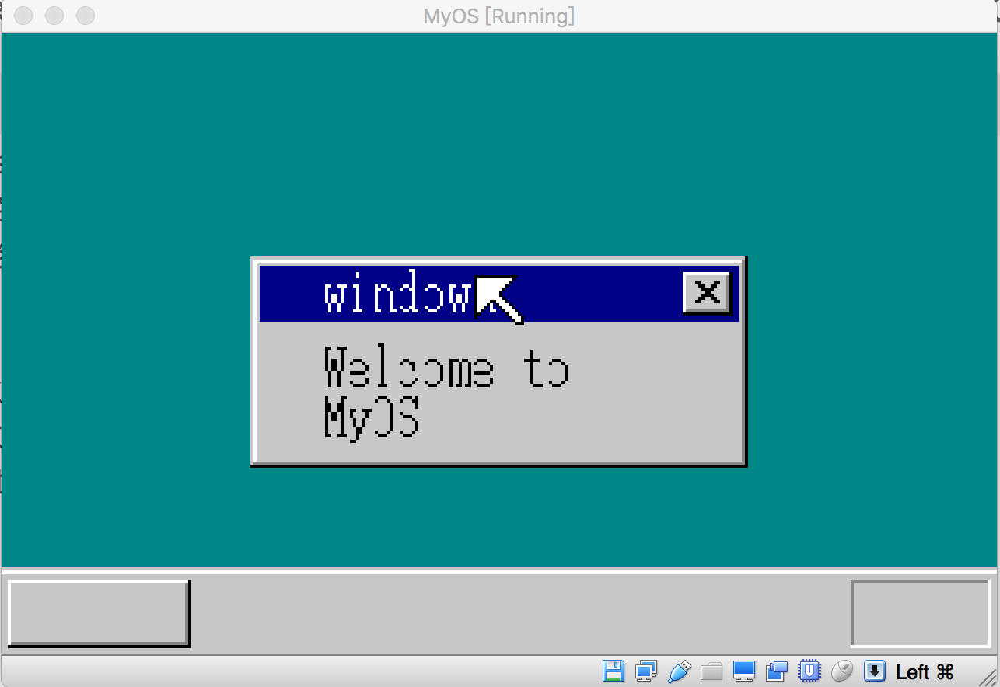
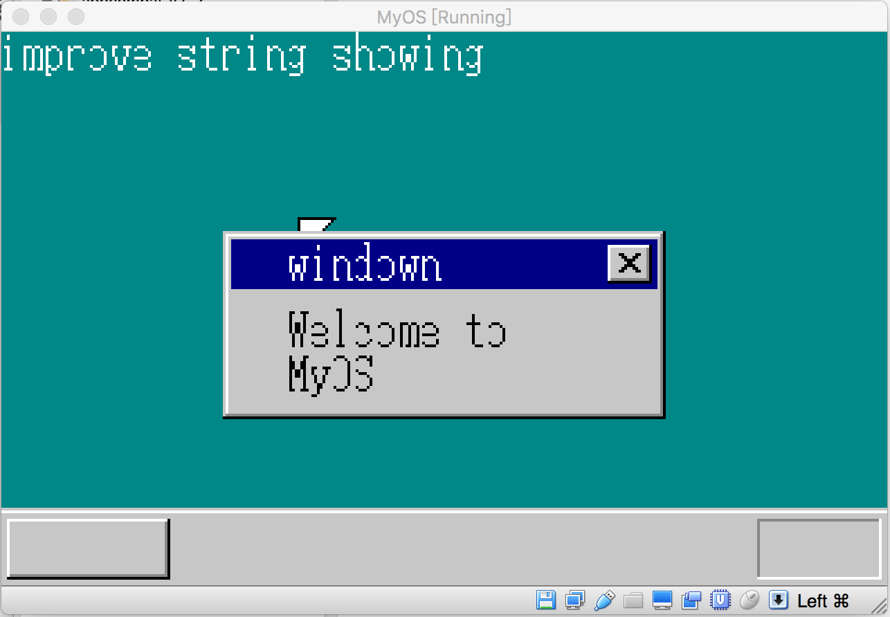

## 使用图层技术开发一个MessageBox

我还记得，早年学习win32 GUI编程，通过调用一个API 叫MessageBox, 使得程序能快速弹出一个小窗口，当看到这个小窗口出现在屏幕上时，开心得不得了，觉得非常不可思议，它生动形象，跟原来在控制台上运行的，只能给出黑底白色结果的dos程序完全不同，从此，我从黑色单调的世界进入了称之为“图形界面“的色彩斑斓的绝妙空间。

一直以来，我心中困惑着，这些形象生动而又具有立体感的小窗口到底是怎么实现的，知道现在，有能力，有条件，开发一个系统内核时，我才能从底层原理上，理解这些动人小窗口的前世今生，这里，我想和大家分享一下，他们是怎么来到这个世界的。

前面几节，我们花了不少精力去实现图层的技术效果，现在，我们可以基于图层的基础上，看看那些花哨的界面是如何制作出来的，这节，我们看看，小小的MessageBox是怎么创造出来的，先让大家看看本节代码运行后的效果：




一个小巧可爱的MessageBox跃然于桌面上，下面我们看看它的实现代码：


```c
void make_window8(struct SHTCTL *shtctl, struct SHEET *sht,  char *title) {

    static char closebtn[14][16] = {
        "OOOOOOOOOOOOOOO@", 
        "OQQQQQQQQQQQQQ$@",
        "OQQQQQQQQQQQQQ$@",
        "OQQQ@@QQQQ@@QQ$@",
        "OQQQQ@@QQ@@QQQ$@",
        "OQQQQQ@@@@QQQQ$@",
        "OQQQQQQ@@QQQQQ$@",
        "OQQQQQ@@@@QQQQ$@",
        "OQQQQ@@QQ@@QQQ$@",
        "OQQQ@@QQQQ@@QQ$@",
        "OQQQQQQQQQQQQQ$@",
        "OQQQQQQQQQQQQQ$@",
        "O$$$$$$$$$$$$$$@",
        "@@@@@@@@@@@@@@@@"
    };

    int x, y;
    char c;
    int bxsize = sht->bxsize;
    int bysize = sht->bysize;
    boxfill8(sht->buf, bxsize, COL8_C6C6C6, 0, 0, bxsize - 1, 0);
    boxfill8(sht->buf, bxsize, COL8_FFFFFF, 1, 1, bxsize - 2, 1);
    boxfill8(sht->buf, bxsize, COL8_C6C6C6, 0, 0, 0,         bysize - 1);
    boxfill8(sht->buf, bxsize, COL8_FFFFFF, 1, 1, 1,         bysize - 1);
    boxfill8(sht->buf, bxsize, COL8_848484, bxsize - 2, 1, bxsize - 2, bysize - 2);
    boxfill8(sht->buf, bxsize, COL8_000000, bxsize - 1, 0, bxsize - 1, bysize - 1);
    boxfill8(sht->buf, bxsize, COL8_C6C6C6, 2, 2, bxsize - 3, bysize - 3);
    boxfill8(sht->buf, bxsize, COL8_000084, 3, 3, bxsize - 4, 20);
    boxfill8(sht->buf, bxsize, COL8_848484, 1, bysize - 2, bxsize - 2, bysize - 2);
    boxfill8(sht->buf, bxsize, COL8_000000, 0, bysize - 1, bxsize - 1, bysize - 1);

    showString(shtctl, sht, 24, 4, COL8_FFFFFF, title);

    for (y = 0; y < 14; y++) {
        for (x = 0; x < 16; x++) {
            c = closebtn[y][x];
            if (c == '@') {
                c = COL8_000000;
            } else if (c == '$') {
                c = COL8_848484;
            } else if (c == 'Q') {
                c = COL8_C6C6C6;
            } 
            else {
                c = COL8_FFFFFF;
            }

            sht->buf[(5+y) * sht->bxsize + (sht->bxsize - 21 + x)] = c;
        }

    }

    return;
}
```

make_window8 函数是专门用来绘制这个小窗口的，大家可以猜到，closebtn这个数组，对应的是小窗口右上角的X按钮，这个数组中，@元素所对应的就是图像中关闭按钮的小叉叉。该调用函数中，参数sht对应的就是该小窗口的图层，代码中，boxfill8这几个函数的调用，作用是绘制窗口的主窗体，showString调用用来显示小窗口上方的小标题，下面的两个for循环这是用来绘制小窗台右上角的关闭按钮。

接下来，我们再看看这个函数是如何被调用的：

```c
void message_box(struct SHTCTL *shtctl,  char *title) {
    struct SHEET *sht_win;
    unsigned char *buf_win;

    sht_win = sheet_alloc(shtctl);
    buf_win = (unsigned char *)memman_alloc_4k(memman, 160 * 68);
    sheet_setbuf(sht_win, buf_win, 160, 68, -1);

    make_window8(shtctl, sht_win, title);

    showString(shtctl, sht_win, 24, 28, COL8_000000, "Welcome to");
    showString(shtctl, sht_win, 24, 44, COL8_000000, "MyOS");

    sheet_slide(shtctl, sht_win, 80, 72);
    sheet_updown(shtctl, sht_win, 1);
}
```

message_box函数中，首先为我们的小窗台分配一个图层对象sht_win, 并通过内存分配接口，分配一块4k可用内存，这块内存将用于存储小窗台的像素信息，同时把这块内存跟图层对象关联起来，两个showString的调用用来显示窗体中间的字符串内容，sheet_slide使得窗体的左上角坐标为(80, 72),并且设置该窗体的高度为1，我们还记得，前一节我们将桌面的高度设置为0，把窗体高度设置为1，这样它才能显示在桌面之上。

我们看看主入口函数的改变：

```c
void CMain(void) {
   ....
   message_box(shtctl, "windown");

   sheet_updown(shtctl, sht_back, 0);

   sheet_updown(shtctl, sht_mouse, 100);

   io_sti();
   ....
}
```

在入口函数中，我们调研message_box,这样，一旦系统启动之后，小窗口就会出现，注意到 sheet_updown(shtctl, sht_mouse, 100); 这一句，我们把鼠标的高度设置成100，这样鼠标就可以出现在当前所有窗体的上方，我们可以做个有趣的小实验，把鼠标的高度改成1，把小窗台的高度改成2，我们可以得到下面的效果：




我们看到，鼠标移动到小窗台区域时，它跑到了窗体的底部而不是上头，这个效果也充分显示了图层高度的相应效果。

经过一系列的努力，我们已经成功进入到了色彩斑斓的GUI世界，这个世界还有很多奇妙秘密等待我们开发和挖掘，让我们继续努力吧^_^!