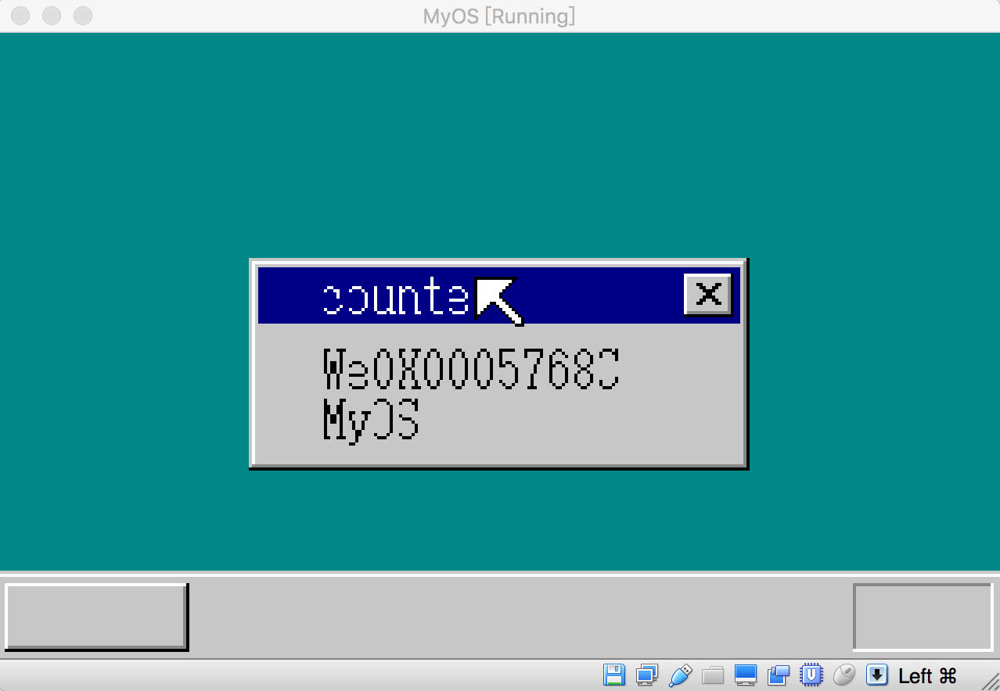

## 突破BIOS无法连续读取软盘72扇区的限制

一直以来，我们的操作系统加载器，秉承简单够用的原则，只要能把编译好的二进制内核送进内存就可以了，所以加载器的算法是，连续读取软盘扇区，将扇区的内容写入到从0x8000 开始的内存中。以下是我们内核加载器的代码：

```asm
org  0x7c00;

LoadAddr EQU  08000h   


entry:
    mov  ax, 0
    mov  ss, ax
    mov  ds, ax
    mov  es, ax


    mov          BX, LoadAddr       ; ES:BX 数据存储缓冲区
    mov          CH, 1        ;CH 用来存储柱面号
    mov          DH, 0        ;DH 用来存储磁头号

readFloppy:

    cmp          byte [load_count], 0
    je           beginLoad


    mov          CL, 1        ;CL 用来存储扇区号

    mov          AH, 0x02      ;  AH = 02 表示要做的是读盘操作
    mov          AL,  18        ; AL 表示要练习读取几个扇区
    mov          DL, 0         ;驱动器编号，一般我们只有一个软盘驱动器，所以写死   
                               ;为0
    INT          0x13          ;调用BIOS中断实现磁盘读取功能

    inc          CH
    dec          byte [load_count]
    JC           fin
    add          bx, 512 * 18
    jmp          readFloppy

beginLoad:
    jmp          LoadAddr


load_count db 3 ;连续读取几个柱面

fin:
    HLT
    jmp  fin

```

load_count 指的是要读取的软盘柱面数。一个1.44M软盘，其中一个磁面有80个柱面，一个柱面有有两面，上面和背面，每面对应一个磁道，一个磁道有18个扇区，一个扇区有512字节。上面代码中，load_cout 的值设置为3， 也就是程序要连续读取3个柱面，也就是要将软盘中大约 3* 18 * 512 字节，也就是27k的内容写入地址为08000h的内存中。

随着我们开发的操作系统功能越来越强大，其代码量也越来越大，现在内核编译后，已经接近15k了，超过27k是迟早的事情，一旦超过27k,那么我们的软盘在往内存拷贝内核时，就需要连续将4个柱面，也就是72扇区的数据写入到内存中。按照设想，我们只要把上面load_cout的值改成4就可以了。

然而一旦改成4，问题就出现了，因为读取4个柱面，也就要连续向内存读入18*4 = 72个扇区的内容，现在大多数BIOS提供的int 013h软盘读取中断功能，一旦发现调用代码要读取的内容有72扇区以上，它就会返回失败，如果有同学尝试着把上面代码的load_cout该成4，然后再运行程序，就会发现内核加载失败，也就是int 03h 的中断调用返回失败，这样一来，一旦我们的内核大小超过27k, 的话，我们现在的加载器就无法正确加载了。

如果你使用的是虚拟机Bochs 来运行上面的加载器代码，那么连续读取软盘超过72扇区时，Bochs提供的Bios调用会返回失败。我们看看Bochs源码中有个Bios功能的函数如下(rombios.c)：

```asm
 void
 7273 int13_diskette_function(DS, ES, DI, SI, BP, ELDX, BX, DX, CX, AX, IP, CS, FLAGS)
 7274   Bit16u DS, ES, DI, SI, BP, ELDX, BX, DX, CX, AX, IP, CS, FLAGS;
 7275 {
            ......

 7337       if ((drive > 1) || (head > 1) || (sector == 0) ||
 7338           (num_sectors == 0) || (num_sectors > 72)) {
 7339         BX_INFO("int13_diskette: read/write/verify: parameter out of range\n");
 7340         SET_AH(1);
 7341         set_diskette_ret_status(1);
 7342         SET_AL(0); // no sectors read
 7343         SET_CF(); // error occurred
 7344         return;
 7345       }
            ....
    }

```

这个函数模拟的就是软盘读取BIOS int 013h中断功能，当我们的代码连续读取几个柱面的扇区时，我怀疑Bochs会把这些要读的扇区请求积累起来，然后把要读取的扇区一次性进行写入，而不是请求一次就执行一次读取动作，因此代码中的条件判断num_sectors > 72 就会成立，于是连续读取超过4个柱面也就是72扇区，Bochs模拟器就会返回失败。由于当前很多虚拟机都大量使用Bochs的源代码，或是实现机制类似，我在mac上用的是parallels ,它的反应跟Bochs一样，也是连续读取软盘超过72扇区时，返回了错误，因此在前面的加载器代码中，一旦连续读取4个柱面以上时，读取请求就会返回失败。

为了绕过这个限制，现在我们加载器的做法是，不再一次连续读取18个扇区，而是一次读取一个扇区，把这个扇区的数据先读入一个给定的，大小为512字节的缓冲区内，然后再把该缓冲区的内容，拷贝到指定的内存中，也就是我们要多做一次没有意义的拷贝工作。

由于我们的内核要加载到内存08000h, 因此，我将08000h前512字节，也就是起始地址为07E00h开始的512字节内存作为软盘一个扇区数据的缓冲区，每次从软盘读入一个扇区数据时，先把数据写入到这个缓冲区，然后再把这个缓冲区的数据拷贝到08000h之后的地址，代码如下：

```asm
org  0x7c00;

LoadAddr EQU  08000h 
BufferAddr EQU 7E0h

BaseOfStack     equ 07c00h

entry:
    mov  ax, 0
    mov  ss, ax
    mov  ds, ax

    mov  ax, BufferAddr
    mov  es, ax

    mov  ax, 0
    mov  ss, ax
    mov  sp, BaseOfStack
    mov  di, ax
    mov  si, ax


    mov          BX, 0       ; ES:BX 数据存储缓冲区
    mov          CH, 1        ;CH 用来存储柱面号
    mov          DH, 0        ;DH 用来存储磁头号
    mov          CL, 0        ;CL 用来存储扇区号


;每次都把扇区写入地址 07E00处

readFloppy:

    cmp          byte [load_count], 0
    je           beginLoad

    mov          bx, 0
    inc          cl
    mov          AH, 0x02      ;  AH = 02 表示要做的是读盘操作
    mov          AL,  1        ; AL 表示要读取几个扇区
    mov          DL, 0         ;驱动器编号，一般我们只有一个软盘驱动器，所以写死   
                               ;为0
    INT          0x13          ;调用BIOS中断实现磁盘读取功能
    JC           fin


;把刚写入07E00的一个扇区的内容写入从08000h开始的地址

copySector:
    push si
    push di
    push cx

    mov  cx, 0200h  ;缓冲区数据大小，也就是512字节
    mov  di, 0
    mov  si, 0
    mov  ax, word [load_section];es
    mov  ds, ax

copy:
    cmp  cx, 0
    je   copyend

    mov  al, byte [es:si] ;es:si指向07E00
    mov  byte [ds:di], al

    inc  di
    inc  si
    dec  cx
    jmp  copy

copyend:
    pop cx
    pop di
    pop si

    mov bx, ds
    add bx, 020h
    mov ax, 0
    mov ds, ax
    mov word [load_section], bx
    mov bx, 0

    ;end of copySector

    cmp          cl, 18
    jb           readFloppy

    inc          CH
    mov          cl, 0
    dec          byte [load_count]
    jmp          readFloppy

beginLoad:

    mov  ax, 0
    mov  ds, ax

    jmp          LoadAddr


load_count db 10 ;连续读取几个柱面
load_section dw 0800h

fin:

    HLT
    jmp  fin

```

这段代码跟开头的代码，不同之处在于，第一段代码，是连续从软盘读取扇区数据到指定的内存里，这么做可能存在一个隐性的难以发现的问题：

一是编译器可能会对代码进行优化，最终编译出来的二进制代码可能给汇编代码的原意有所不同，编译后的代码可能会把所以读请求积攒起来，然后一次发出读取命令，由于代码要读取4个柱面，每次读取18个扇区，最终编译的代码可能是把4个柱面，总共72个扇区积攒起来，然后一次读取，这样的话，就可能违反了Bochs虚拟机的读取限制。

二是，在读取数据时，只要读取的数据不需要立刻使用的话，CPU可能会将数据读取的请求积累起来，当有数据请求时，才把所有积攒起来的数据读取请求一次发出，从而提高读写效率。

无论是那种情况，都有可能造成一次读取超过72扇区的请求，从而被虚拟机拒绝。改动后的代码是，当读取一个扇区的数据后，程序立马进行数据拷贝，这样的话，上面提到的优化机制就不能产生作用，数据的读取请求就不会被积攒起来，因此就不会遭遇Bochs虚拟机的读取限制。

我们分析下第二段代码，BufferAddr 指的是软盘扇区的数据读取后要写入的缓冲区地址，注意它的值是0x7E0, 为什么是0x7E0,而不是0x7E00呢，这是因为这个值会直接付给段寄存器es, 在实模式下，寻址方式是 段地址:段偏移，转换成直接地址就是 段地址16 + 段偏移，由于0x7E0 16 = 0x7E00, 因此把0x7E00付给段寄存器，就需要把最后一个0去掉，也就是0x7E00 要除以16.

readFloppy 这段代码通过int 013h调用，让BIOS从软盘中读取一个扇区的数据，然后把数据写入到起始地址为0x7E00的缓冲区，接着copySector这段代码把刚写入缓冲区的数据拷贝到内核的加载地址，也就是08000h之后，变量load_section 用来存储的是内核加载的起始地址，由于这个值要付给段寄存器ds,所以它的实际值是0800h而不是08000h，每次往这个地址写入512字节的数据后，下次写入时，地址要往下偏移512字节，512除以16等于32，因此要把load_section的值加上32，也就是020h.

有了上面改动后，加载代码能读取任意多个扇区数据到内存而不用担心Bochs虚拟机的限制，虽然我用的是Virtual Box, 但据说Virtual Box使用的也是Bochs代码，所以当我连续加载扇区超过72时，Virtual Box对代码的数据读取请求也返回识别，使用上面的修改后，数据的读取问题也能得到解决了。

### Message Box的计时器效果
最后，我们实现一个计数器效果，在write_vga_desktop.c里，根据下面代码进行更改：

```asm
void CMain(void) {
...

for(;;) {
       char* pStr = intToHexStr(counter);
       counter++;
       boxfill8(shtMsgBox->buf, 160, COL8_C6C6C6, 40, 28, 119, 43);
       showString(shtctl, shtMsgBox, 40, 28, COL8_000000,pStr);

       io_cli();
       if (fifo8_status(&keyinfo) + fifo8_status(&mouseinfo)  == 0) {

           io_sti();
       }
...
}
```

我们在主循环里，让一个变量从0开始自加，然后把其结果显示在Message Box的主窗体里，如果大家按照上面代码更改后，会发现界面有明显的闪烁效果。这是我们当前图层的刷新机制导致的，在后面课程中，我将与大家研究如何消除这种令人痛苦的闪烁现象。

