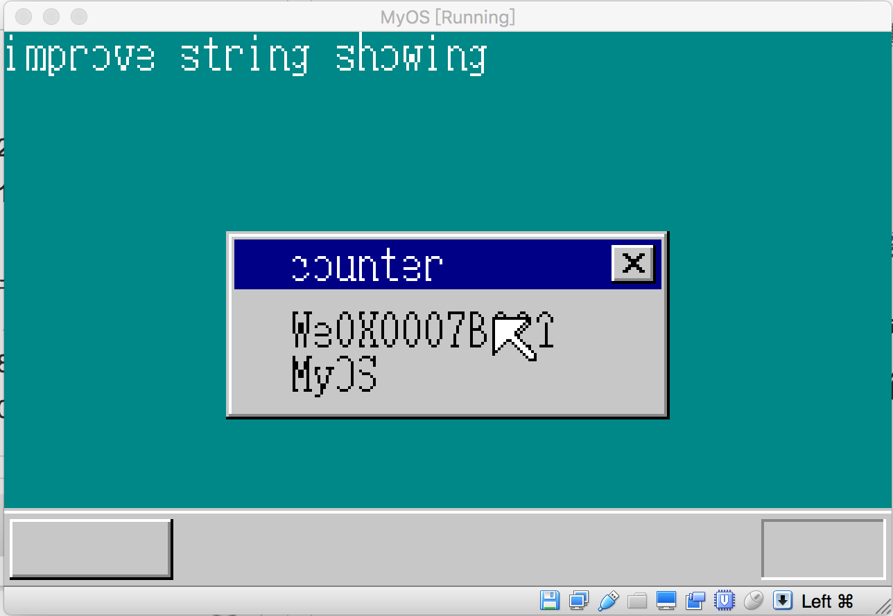

## 消除图层刷新而导致的严重闪烁-2

上一节，我们消除了因刷新而导致的严重闪烁，但问题并没有从根子上解决，因为当我们把鼠标挪动不断刷新自己的Message Box上面时，发现鼠标居然变得闪动起来，这是因为，当窗体自身刷新时，它会把处于它上方的窗体也进行刷新，而这种操作其实是没有必要的。我们看下面这种情况：

1 1 1 1 1 1 1 1 1 1 1 1 1 1 1 1
1 1 1 1 1 1 1 1 1 1 1 1 1 1 1 1
1 1 1 1 1 1 1 1 1 1 1 1 1 1 1 1
1 1 1 1 1 1 1 1 2 2 2 2 2 2 2 2 2 2 2 2 2 2 2 2
1 1 1 1 1 1 1 1 2 2 2 2 2 2 2 2 2 2 2 2 2 2 2 2
1 1 1 1 1 1 1 1 2 2 2 2 2 2 2 2 2 2 2 2 2 2 2 2
1 1 1 1 1 1 1 1 2 2 2 2 2 2 2 2 2 2 2 2 2 2 2 2
……………………..2 2 2 2 2 2 2 2 2 2 2 2 2 2 2 2
……………………. 2 2 2 2 2 2 2 2 2 2 2 2 2 2 2 2
……………………..2 2 2 2 2 2 2 2 2 2 2 2 2 2 2 2

所以数字1代表的是标号为1的窗口所对应的像素点，数字2所代表的是编号为2的窗口所对应的像素点，显然，窗口1的右下边部分被窗口2所覆盖，并且窗口2比窗口1的高度还要高，当窗口1的像素进行刷新时，如果窗口2的内容没有变化的话，那么窗口2 完全不需要进行刷新，这就要求窗口1只能更新那些没有被窗口2覆盖的点，也就是说，窗口1只能更新一下部分像素点：

1 1 1 1 1 1 1 1 1 1 1 1 1 1 1 1
1 1 1 1 1 1 1 1 1 1 1 1 1 1 1 1
1 1 1 1 1 1 1 1 1 1 1 1 1 1 1 1
1 1 1 1 1 1 1 1
1 1 1 1 1 1 1 1
1 1 1 1 1 1 1 1
1 1 1 1 1 1 1 1

也就是右下角那部分，他是不能去更新的，这就要求，当我们去刷新显存时，必须知道哪一个像素点属于窗口1，哪一个像素点属于窗口2，刷新时，属于窗口1的像素点，我就更新，属于窗口2的像素点，我就忽略，这样才能解决上节看到的鼠标闪烁的问题。这样我们就需要在图层的数据结构中引入新的变量，用来记录该图层像素点所对应的窗体编号，代码如下，win_sheet.h：

```
struct SHTCTL {
    unsigned char *vram, *map;
    int xsize, ysize, top;
    struct SHEET *sheets[MAX_SHEETS];
    struct SHEET sheets0[MAX_SHEETS];
};
```

上面的结构体定义中，多增加了一个变量map, 它的作用就是用来记录图层每一个像素点所对应的窗体编号的。在win_sheet.c中做如下更改：

```
struct SHTCTL *shtctl_init(struct MEMMAN *memman, unsigned char *vram,
  int xsize, int ysize) {
  ....
   //为图层像素编号数值分配内存
    ctl->map = (unsigned char*)memman_alloc_4k(memman, xsize * ysize);
    if (ctl->map == 0) {
        memman_free_4k(memman, (int)ctl, SIZE_OF_SHTCTL);
        return 0;
    }
  .....
}
```

在初始化图层信息时，为map变量分配内存，以便用来记录图层像素点的窗口编号。如何确定每个窗体图层所对应的编号呢，很简单，所有的图层都是从图层控制器SHTCTL 的图层数组sheets0中分配的，我们把图层对象在这个数值中的下标作为它的窗体编号，我们在win_sheet.c里面添加一个函数叫refresh_map，用来记录当前需要刷新的窗口的像素所对应的编号。

```
void sheet_refreshmap(struct SHTCTL *ctl, int vx0, int vy0, int vx1, int vy1, int h0) {
    int h, bx, by, vx, vy, bx0, by0, bx1, by1;
    unsigned char *buf, sid, *map = ctl->map;
    struct SHEET *sht;

    if (vx0 < 0) {vx0 = 0;}
    if (vy0 < 0) {vy0 = 0;}

    if (vx1 > ctl->xsize) {vx1 = ctl->xsize;}
    if (vy1 > ctl->ysize) {vy1 = ctl->ysize;}

    for (h = h0; h <= ctl->top; h++) {
        sht = ctl->sheets[h];
        //获取图层编号，也就是图层对象在图层数组中的下标
        sid = sht - ctl->sheets0;
        buf = sht->buf;
        bx0 = vx0 - sht->vx0;
        by0 = vy0 - sht->vy0;
        bx1 = vx1 - sht->vx0;
        by1 = vy1 - sht->vy0;

        if (bx0 < 0) { bx0 = 0;}
        if (by0 < 0) { by0 = 0;}
        if (bx1 > sht->bxsize) {bx1 = sht->bxsize;}
        if (by1 > sht->bysize) {by1 = sht->bysize;}

        for (by = by0; by < by1; by++) {
            vy = sht->vy0 + by;
            for (bx = bx0; bx < bx1; bx++) {
                vx = sht->vx0 + bx;
                if (buf[by * sht->bxsize + bx] != sht->col_inv) {
                    //将图层标号设置到map变量里
                    map[vy * ctl->xsize + vx] = sid;
                }
            }
        }

    }

    return;
}

```

这个函数跟以前的刷新函数refresh_sub几乎一模一样，是用来设置像素对应的图层编号的，假如窗口1的某个像素位于坐标（20， 30），那么我就在map[30*xsize + 20] 处设置为1， xsize 是桌面的宽度，如果窗口2移动后，有像素点也移动到了坐标(20,30), 那么上面的代码就会把map[30*xsize + 20] 处设置为2，也就是窗口1的像素被窗口2所覆盖了。

有了像素所在位置对应的窗口号后，我们就可以只刷新对应窗口的像素点，于是我们对窗口刷新函数做下列修改:

```
void sheet_refreshsub(struct SHTCTL *ctl, int vx0, int vy0, int vx1, int vy1, int h0, int h1) {
    int h, bx, by, vx, vy;
    unsigned char *buf, c, *vram = ctl->vram, *map = ctl->map, sid;
    struct SHEET *sht;
    if (vx0 < 0) {vx0 = 0;}
    if (vy0 < 9) {vy0 = 0;}
    if (vx1 > ctl->xsize) {vx1 = ctl->xsize;}
    if (vy1 > ctl->ysize) {vy1 = ctl->ysize;}

    for (h = h0; h <= h1; h++) {
        sht = ctl->sheets[h];
        buf = sht->buf;

        //获得当前图层对应的窗口号
        sid = sht - ctl->sheets0;

        for (by = 0; by < sht->bysize; by++) {
            vy = sht->vy0 + by;
            for (bx = 0; bx < sht->bxsize; bx++) {
                vx = sht->vx0 + bx;
                if (vx0 <= vx && vx < vx1 && vy0 <= vy && vy < vy1) {
                    c = buf[by * sht->bxsize + bx];
                    //确定当前坐标对应的素点是否属于要刷新的窗口
                    if (map[vy * ctl->xsize + vx] == sid && c != sht->col_inv) {
                        vram[vy * ctl->xsize + vx] = c;
                    }
                }
            }
        }
    }
}
```

refresh_sub在刷新时，会遍历给定高度(h0)以上的所有图层，如果某个高度比当前要刷新的窗口高度高，并且它覆盖了当前窗体的某部分，那么两个窗体的对应像素就会重合，高度高的窗体会把对应坐标处的像素标号设置成自己的窗体标号，也就是在上面的循环中，map[vy * ctl->xsize + vx] 所对应的窗体标号与当前窗体的标号就会不一样，于是vram[vy * ctl->xsize + vx] = c;这一句就不会执行，于是与当前刷新窗体重合的，但高度更高的窗体就不用做没必要的刷新。

其他对应的图层刷新函数也做相应改动：

```

void sheet_slide(struct SHTCTL *ctl, struct SHEET *sht, int vx0, int vy0) {
    int old_vx0 = sht->vx0, old_vy0 = sht->vy0;
    sht->vx0 = vx0;
    sht->vy0 = vy0;
    if (sht->height >= 0) {
         sheet_refreshmap(ctl, old_vx0, old_vy0, old_vx0 + sht->bxsize, old_vy0 + sht->bysize, 0);
         sheet_refreshmap(ctl, vx0, vy0, vx0+sht->bxsize, vy0+sht->bysize, sht->height);
         sheet_refreshsub(ctl, old_vx0, old_vy0, old_vx0 + sht->bxsize, 
                          old_vy0 + sht->bysize, 0, sht->height - 1);
         sheet_refreshsub(ctl, vx0, vy0, vx0+sht->bxsize, vy0+sht->bysize, sht->height, 
                          sht->height);
    }
}

void sheet_updown(struct SHTCTL *ctl, struct SHEET *sht, int height) {
 ....
 if (old > height) {
    ....
     if (height >= 0) {
     ....
    //窗体高度更新后，要更改像素点所在位置的窗体标号
            sheet_refreshmap(ctl, sht->vx0, sht->vy0, sht->vx0+sht->bxsize, sht->vy0+sht->bysize,
        height+1);
            sheet_refreshsub(ctl, sht->vx0, sht->vy0, sht->vx0+sht->bxsize, sht->vy0+sht->bysize,
        height+1, old);
        } else {
          ....
              //窗体高度更新后，要更改像素点所在位置的窗体标号
            sheet_refreshmap(ctl, sht->vx0, sht->vy0, sht->vx0+sht->bxsize, sht->vy0+sht->bysize,
        0);
            sheet_refreshsub(ctl, sht->vx0, sht->vy0, sht->vx0+sht->bxsize, sht->vy0+sht->bysize,
        0, old - 1);
        }
 } else {
    ....
    //窗体高度更新后，要更改像素点所在位置的窗体标号
        sheet_refreshmap(ctl, sht->vx0, sht->vy0, sht->vx0+sht->bxsize, sht->vy0+sht->bysize,
        height);       

        sheet_refreshsub(ctl, sht->vx0, sht->vy0, sht->vx0+sht->bxsize, sht->vy0+sht->bysize,
        height, height);
   }


}
```

做完上面的修改后，鼠标闪烁的问题就可以消失了。

