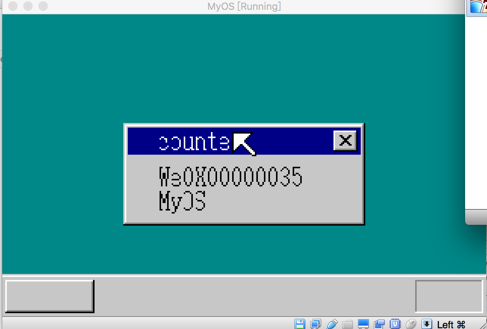
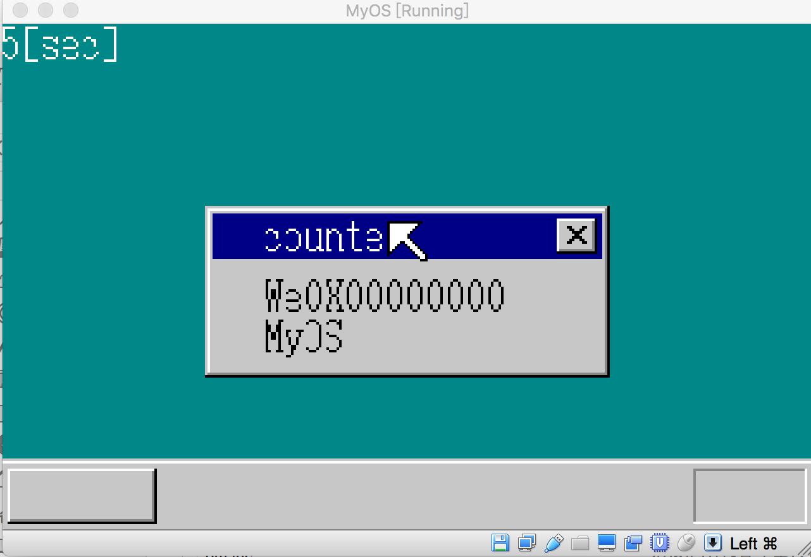

## 实现定时器功能

以前在windows的GUI编程中，让我印象最深刻的MFC里面的onTimer回调。也就是你设置一个定时器，当指定的时间过去后，系统会触发你给定的回调函数。Timer功能实在是太重要了，如果没有定时器，操作系统很多任务都做不了，至少你编程画个时钟，搞个闹钟程序什么的，你就没法实现。从这节开始，我们看看timer功能是怎么实现的。

下图是用于实现中断功能的8259A芯片：


主控制器的IRQ0对应的就是时钟中断，只要我们做好相关配置，那么在指定间隔内，IRQ0导线就会像CPU发送中断信号。首先我们代码要做的是初始化8259A时，打开这一中断功能，在内核实现的汇编部分做如下修改(kernel.asm)：

```
init8259A:
....
mov  al, 11111000b ;允许键盘和时钟中断
     out  021h, al
     call io_delay
....
```

注意看，三个0表示打开主8259A的IRQ0, IRQ1, IRQ2三根信号线，IRQ0对应的就是时钟中断，打开IRQ0后，当中断信号发送到CPU时，我们需要CPU调用我们提供的中断程序，因此还需做以下修改：

```

LABEL_IDT:
%rep  32
    Gate  SelectorCode32, SpuriousHandler,0, DA_386IGate
%endrep

;响应时钟中断的中断描述符
.020h:
    Gate SelectorCode32, timerHandler,0, DA_386IGate

.021h:
    Gate SelectorCode32, KeyBoardHandler,0, DA_386IGate

%rep  10
    Gate  SelectorCode32, SpuriousHandler,0, DA_386IGate
%endrep

.2CH:
    Gate SelectorCode32, mouseHandler,0, DA_386IGate

```

我们在中断向量表中，增加了一个用于调用时钟中断的描述符，该描述符对应的中断调用，名字叫timerHandler。

我们继续看timerHandler的实现：

```
_timerHandler:
timerHandler equ _timerHandler - $$
     push es
     push ds
     pushad
     mov  eax, esp
     push eax

     call intHandlerForTimer


     pop  eax
     mov  esp, eax
     popad
     pop  ds
     pop  es
     iretd
```

这段代码的实现跟以前的中断处理方法一样，先把寄存器压到堆栈上保存起来，然后调用C语言实现的中断处理函数intHandlerForTimer。

在查看C语言对intHandlerForTimer的实现之前，我们需要搞清楚的是，如何配置时钟中断，使其在一秒内发生几次中断合适？我们这里暂定1秒内产生100次中断，这种中断频率足以满足我们系统开发需求。于是我们需要做相应配置，配置的方法是，像8259A芯片的对应端口发送指定数据，首先需要向端口0x43发送一个数值0x34, 紧接着向端口0x40发送两个数据0x9c,0x2d, 这样时钟中断就能在1秒内发生100次了。

配置代码如下（Timer.h）：

```
#define PIT_CTRL   0x0043
#define PIT_CNT0   0x0040


void init_pit(void);

struct TIMERCTL {
    unsigned int count;
    unsigned int timeout;
    struct FIFO8 *fifo;
    unsigned char data;
};

struct TIMERCTL* getTimerController();

void settimer(unsigned int timeout, struct FIFO8 *fifo, unsigned char data);

```

init_pit(void) 就是用来实现时钟中断配置的，它的作用是向指定端口发送指定数据，TIMERCTL 数据结构叫时钟管理器，其中的count用来记录时钟中断发送了多少次， timeout用来计时，一旦timeout为0，管理器将触发指定动作，其他的数据在后面我们会详细解释。我们看看时钟中断的初始化实现：

```
void  init_pit(void) {
    io_out8(PIT_CTRL, 0x34);
    io_out8(PIT_CNT0, 0x9c);
    io_out8(PIT_CNT0, 0x2e);

    timerctl.count = 0;
    timerctl.timeout = 0;
}
```

我们可以看到，初始化就如同前面我们所说的，向指定端口发送一些指定数据而已。

设置好中断机制后，我们可以实现超时功能，也就是通过时钟管理器设置一个时间片，一旦时间片结束后，让时钟管理器触发我们提供的一个函数,这个时间片的大小对应的就是TIMECTRL结构体里面的timeout.

我先看看C语言模块是怎么响应中断信号的：

```
void intHandlerForTimer(char *esp) {
    io_out8(PIC0_OCW2, 0x60);
    timerctl.count++;

    if (timerctl.timeout > 0) {
        timerctl.timeout--;
        if (timerctl.timeout == 0) {
            fifo8_put(timerctl.fifo, timerctl.data);
        }
    }
    return;
}
```

每次响应中断信号时，先向8259A发送一个命令，命令的数值是0x60，要求8259A下次继续发送中断信号，如果不这么做，下次芯片就不给我们发送信号了。然后把时钟管理器的count计数加一，对应中断响应的次数。每次中断发送，我们都把时间片对应的数值减一，如果时间片减少到0，表明超时，此时向时钟管理器附带的FIFO队列写入一个数据。FIFO队列我们在实现鼠标响应的章节介绍过，这个队列的作用主要用来通知内核，超时发生了，在内核的主循环里面会不停的监控时钟管理器这个队列是否为空，如果是空，那么内核就认为没有超时事件发生，如果队列里面有数据，那表明超时事件发生了。

那么怎么设定超时对应的时间片呢？我们在时钟管理器的实现中，增加一个settimer函数：

```
void settimer(unsigned int timeout, struct FIFO8 *fifo, unsigned char data) {
    int eflags;
    eflags = io_load_eflags();
    io_cli();//暂时停止接收中断信号
    timerctl.timeout = timeout;//设定时间片
    timerctl.fifo = fifo;//设定数据队列，内核在主循环中将监控这个队列
    timerctl.data = data;
    io_store_eflags(eflags);//恢复接收中断信号
    return;
}

struct TIMERCTL* getTimerController() {
    return &timerctl;
}
```

io_load_eflags() 和 io_store_eflags()这两个函数我们以前提到过，CPU会根据一系列状态信息来调整自己的运行状况，例如当前中断功能是否打开，是否有计算溢出等等，这些状态信息都存储在指定寄存器的指定比特位中（CPU上的相关硬件），io_load_eflags()就是获取这些信息，把他们存储到变量eflags中,io_store_eflags(eflags)是把前面存储的状态信息重新设置回去, io_cli()的作用是让CPU停止接收一切中断信号，也就是设置对应的比特位让CPU运行时忽略到来的中断请求，io_store_eflags作用就是重新恢复原来状态，让CPU重新接收中断信号。

我们再看看内核主循环的处理：

```
....
static struct FIFO8 timerinfo;
static char timerbuf[8];
....
void CMain(void) {
    ....
    init_pit();
    fifo8_init(&timerinfo, 8, timerbuf);
    settimer(500, &timerinfo, 1);
    ....
}
```

内核启动时，初始化时钟控制器，并初始化一个FIFO队列和用于该队列的缓冲区，通过settimer函数，设置一个5秒的超时时间片，数值1对应TIMERCTL结构体里面的data, 这个数据的作用在后面我们会看到。

```
void CMain(void) {
    ....
    int data = 0;
    int count = 0;
    struct TIMERCTL *timerctl = getTimerController();

    for(;;) {
       char* pStr = intToHexStr(timerctl->timeout);
       boxfill8(shtMsgBox->buf, 160, COL8_C6C6C6, 40, 28, 119, 43);
       showString(shtctl, shtMsgBox, 40, 28, COL8_000000,pStr);

       io_cli();
       if (fifo8_status(&keyinfo) + fifo8_status(&mouseinfo) +
 fifo8_status(&timerinfo)  == 0) {

           io_sti();
       } ....

      else {
      //超时发生后进入这里
           io_sti();
           showString(shtctl, sht_back, 0, 0, COL8_FFFFFF, "5[sec]");
      }
}
```

在进入内核主循环前，先获取时钟控制器，然后把控制器对应的时间片信息转换成字符串后，显示到Message Box 窗体里。每次循环时，看看控制器对应的数据队列里面是否有数据，如果有数据表明超时发送，于是进入最后的else 部分，在else 里面， 我们在桌面的左上角打印出一个字符串”5[sec]”。

上面代码编译后，系统启动时画面如下，一开始时Message Box窗体里的计数一直减小：



五秒后，Message Box 里面的数值变为0，然后桌面左上角的字符串会显示出来，表示超时发送了：


