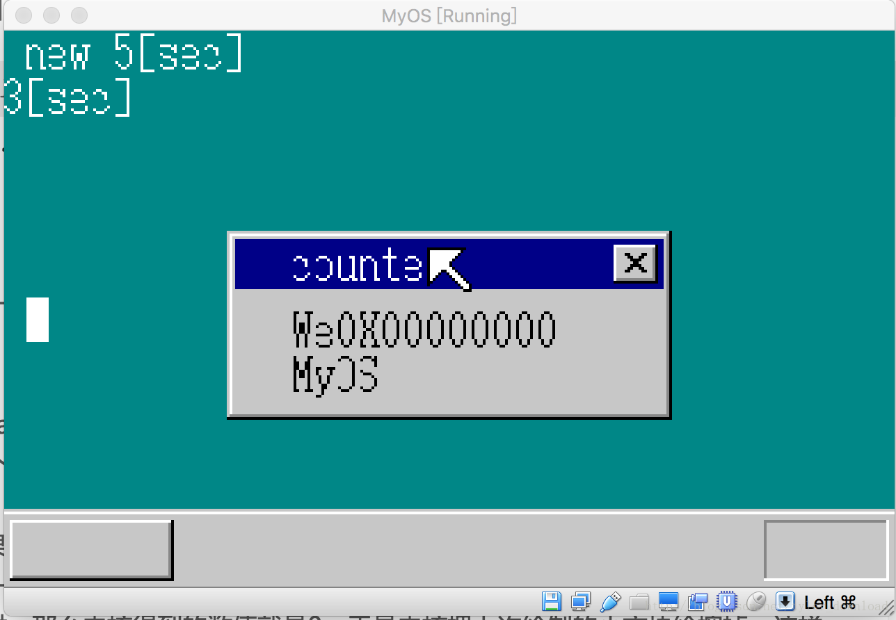

## 利用时钟中断实现光标闪烁特效


上一节，我们已经实现了时钟超时功能，但一个操作系统，肯定是能支持多个时钟的，本节，我们就看看如何从上一节的单时钟向多时钟转变，同时利用时钟超时机制实现光标的闪烁特效。

上节，我们的时钟控制器对象只对应于一个时钟，现在，我们要把有个时钟的信息抽取出来，这样的话，就使得一个控制器能对应管理很多个时钟对象，因此我们对timer.h 做如下改动：

```
#define PIT_CTRL   0x0043
#define PIT_CNT0   0x0040

#define MAX_TIMER  500

void init_pit(void);

struct TIMER {
    unsigned int timeout, flags;
    struct FIFO8 *fifo;
    unsigned char data;
};

struct TIMERCTL {
    unsigned int count;

    struct TIMER timer[MAX_TIMER];

};

struct TIMER* timer_alloc(void);

void timer_free(struct TIMER *timer);

void timer_init(struct TIMER *timer, struct FIFO8 *fifo, unsigned char data) ;

void timer_settime(struct TIMER *timer, unsigned int timeout);

```

大家看到，原来在TIMERCTL中的一些信息已经抽取出来，独立成为一个TIMER对象，而在控制器里包含的是一组TIMER数组，这样，一个控制器就能对应很多个时钟对象了。timer_alloc用来分配一个TIMER对象，一个TIMER对象被分配出来后，需要用timer_init初始化，然后使用timer_settime设置时间片。

我们看看相关函数的对应实现，在timer.c中：

```
struct TIMER* timer_alloc(void) {
    int i;
    for (i = 0; i < MAX_TIMER; i++) {
        if (timerctl.timer[i].flags == 0) {
            timerctl.timer[i].flags = TIMER_FLAGS_ALLOC;
            return &timerctl.timer[i];
        }
    }

    return 0;
}

void timer_free(struct TIMER *timer) {
    timer->flags = 0;
    return;
}

void timer_init(struct TIMER *timer, struct FIFO8 *fifo, unsigned char data) {
    timer->fifo = fifo;
    timer->data = data;
    return;
}

void timer_settime(struct TIMER *timer, unsigned int timeout) {
    timer->timeout = timeout;
    timer->flags = TIMER_FLAGS_USING;
    return;
}
```

TIMER对象的分配，其实就是从时钟控制器的TIMER数组中找到一个还没有被使用的对象，将其它的状态从free 转换为alloc, 也就是表明当前时钟对象已经被占用，然后从数组中直接返回时钟对象。

timer_settime 就是把时间片信息设置到对应的TIMER对象而已。需要注意的是intHandlerForTimer函数的更改：

```
void intHandlerForTimer(char *esp) {
    io_out8(PIC0_OCW2, 0x60);
    timerctl.count++;

    int i;
    for (i = 0; i < MAX_TIMER; i++) {
        if (timerctl.timer[i].flags == TIMER_FLAGS_USING) {
            timerctl.timer[i].timeout--;
            if (timerctl.timer[i].timeout == 0) {
                timerctl.timer[i].flags = TIMER_FLAGS_ALLOC;
                fifo8_put(timerctl.timer[i].fifo, timerctl.timer[i].data);
            }
        }
    }

    return;
}
```

每次时钟中断发生是，我们的中断处理函数会变量时钟控制器中的时钟数组，把数组中时钟对象的时间片减一，如果有哪个时钟的时间片已经消耗完毕，那么就往对应时钟的数据队列里写入一个数据，用于通知内核触发对应的超时操作。

有了多时钟功能后，内核就可以利用该机制，创建多个时钟，然后响应多个超时事件了，内核的改动如下，在write_vga_desktop.c中：

```
void CMain(void) {
   .....
struct TIMER *timer, *timer2, *timer3;
    static struct FIFO8 timerfifo2, timerfifo3;
    static char timerbuf2[8], timerbuf3[8];

    init_pit();
    fifo8_init(&timerinfo, 8, timerbuf);
    timer = timer_alloc();
    timer_init(timer, &timerinfo, 1);
    timer_settime(timer, 500);

    fifo8_init(&timerfifo2, 8, timerbuf2);
    timer2 = timer_alloc();
    timer_init(timer2, &timerfifo2, 1);
    timer_settime(timer2, 300);

    fifo8_init(&timerfifo3, 8, timerbuf3);
    timer3 = timer_alloc();
    timer_init(timer3, &timerfifo3, 1);
    timer_settime(timer3, 50);
   ....
}
```

我们看到，内核入口函数申请了三个时钟对象，并将他们初始化，第一个时钟的时间片是5秒，第二个时钟的时间片是3秒，第三个时钟的时间片是0.5秒。有了三个时钟，我们就需要对三个时钟的超时做不同处理。继续看代码：

```
void CMain(void) {
   .....

for(;;) {
       char* pStr = intToHexStr(timer->timeout);
       boxfill8(shtMsgBox->buf, 160, COL8_C6C6C6, 40, 28, 119, 43);
       showString(shtctl, shtMsgBox, 40, 28, COL8_000000,pStr);

       io_cli();
       if (fifo8_status(&keyinfo) + fifo8_status(&mouseinfo) +
           fifo8_status(&timerinfo) + fifo8_status(&timerfifo2) 
           + fifo8_status(&timerfifo3) == 0) {

           io_sti();
       }
       ....
       else if (fifo8_status(&timerinfo) != 0) {
           io_sti();
           fifo8_get(&timerinfo);
           showString(shtctl, sht_back, 0, 0, COL8_FFFFFF, " new 5[sec]");
       } else if (fifo8_status(&timerfifo2) != 0) {
           fifo8_get(&timerfifo2);
           io_sti();
           showString(shtctl, sht_back, 0, 16, COL8_FFFFFF, "3[sec]");
       }else if (fifo8_status(&timerfifo3) != 0) {
           int i = fifo8_get(&timerfifo3);
           io_sti();
           if (i != 0) {
              timer_init(timer3, &timerfifo3, 0);
              boxfill8(buf_back, xsize, COL8_FFFFFF, 8, 96, 15, 111);
           } else {
              timer_init(timer3, &timerfifo3, 1);
              boxfill8(buf_back, xsize, COL8_008484, 8, 96, 15, 111);
           }

           timer_settime(timer3, 50);
           sheet_refresh(shtctl, sht_back, 8, 96, 16, 112);
       }
   ....   
}
```

第一个时钟超时时，我们还是在桌面左上角显示一个字符串，第二个时钟超时时，我们也同样在左上角显示一个字符串，对于第三个时钟的处理，需要我们注意，在初始化第三个时钟是，我们会传入一个数值，也就是上一节描述的时钟data, 当超时后，这个数值会被放入回时钟对应的队列里面，那么我们可以根据这个值采取不同的动作去处理超时。

如果第三个时钟超时了，同时在队列里面的数值不等于0，那么我们就在桌面上画一个白色的小方块，然后再次初始化该时钟，并把数值0传进去，下次时钟再超时，那么内核得到的数值就是0，于是内核把上次绘制的小方块给擦掉，这样的话，就形成一个效果，就是一个白色小方块在桌面上闪来闪去，就好像一个光标一样。

上面代码编译成内核运行后，效果如下（动态效果请参看视频）：

