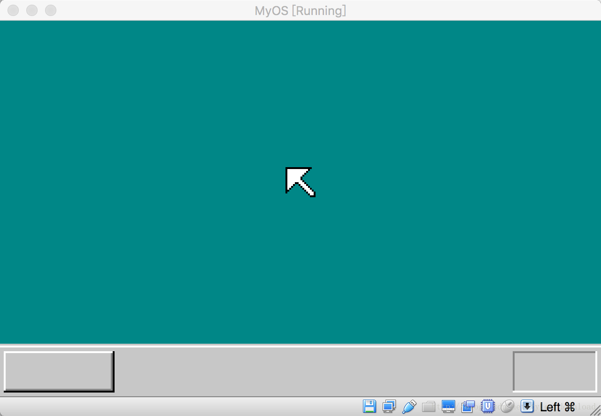
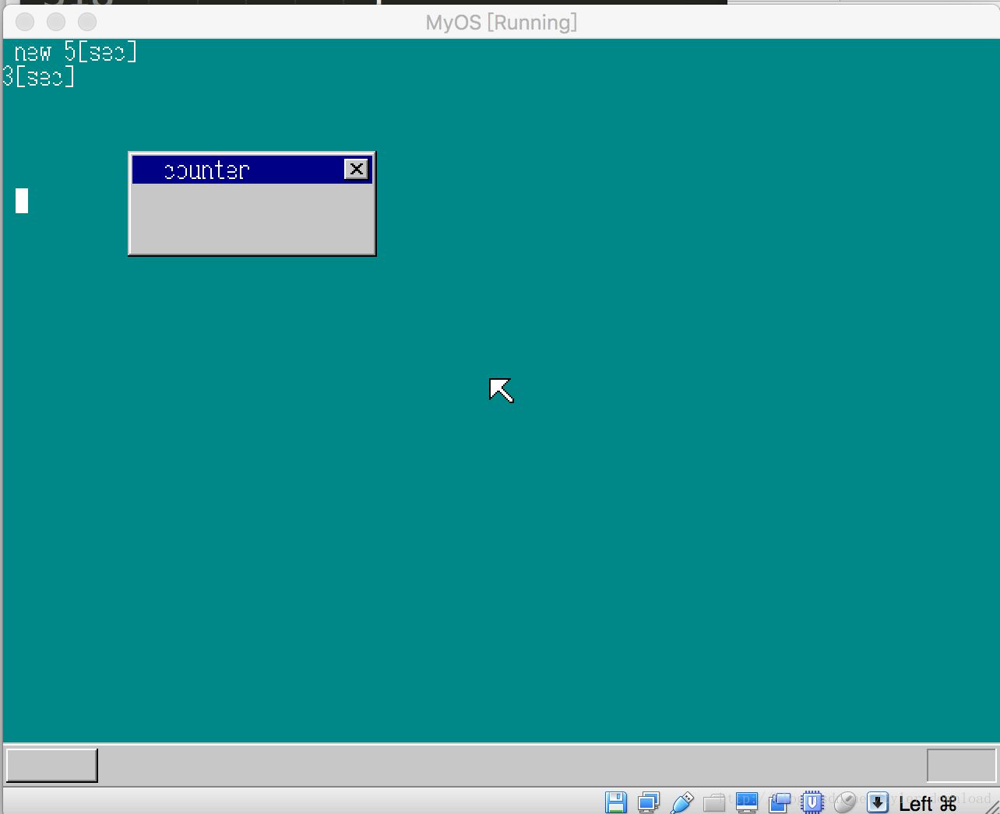
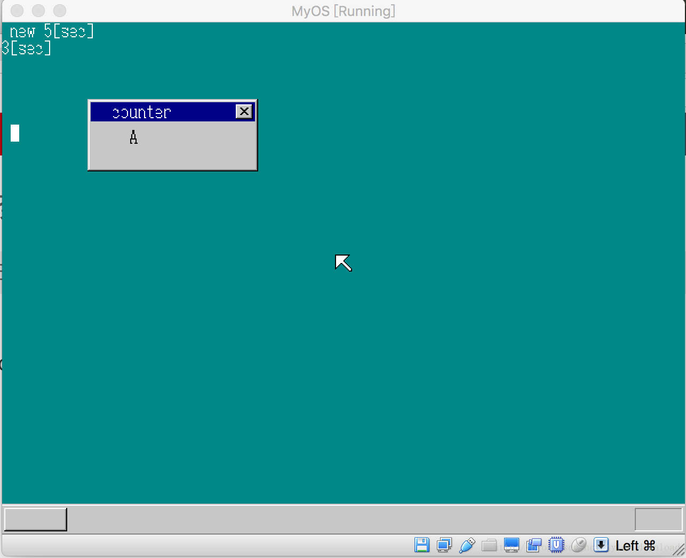

## 改进分辨率和按键响应

当前，我们系统的分辨率是320*480， 这种分辨率太小，绘制出来的系统界面看起来很大条，也很粗糙，跟我们现实使用的操作系统比起来，差别太大，因此，本节，我们就在分辨率上做一些改进。

以前，设置显示分辨率是在内核的汇编部分实行的，代码如下(kernel.asm)：

```
LABEL_BEGIN:
    .....
     mov   al, 0x13
     mov   ah, 0
     int   0x10
     ....

```

执行上面三条语句后，显存地址就从0xa00000开始，但是此时显卡的分辨率只能是320*200，要想进一步改进，需要把上面三句换成下面这样：

```
LABEL_BEGIN:
    .....
     mov   bx, 0x4101
     mov   ax, 0x4f02
     int   0x10
     ....
```

执行上面代码后，分辨率会从320*200转换为480*640，并且显存地址起始地址将不再是0xa00000, 而是转变为0xe0000000.

在新的显卡模式下，指定分辨率有以下几种方式：
bx = 0x4101 表示分辨率为 640*480
bx = 0x4103 表示分辨率为800*600
bx = 0x4105 表示分辨率为1024*768
bx=0x4107 表示分辨率为1280*1024

上面的显示形式都才有8位色彩模式。

由于显存地址改变了，所以内核的C语言部分也要做些修改，代码如下(write_vga_desktop.c):

```
void initBootInfo(struct BOOTINFO *pBootInfo) {
    pBootInfo->vgaRam = (char*)0xe0000000;
    pBootInfo->screenX = 640;
    pBootInfo->screenY = 480;
}
```

改进前，系统显示如下：



改进后，系统显示如下：




很明显，改进后，界面精致细腻了很多。

## 键盘响应的改进
我们原来响应键盘中断时，会把按键的扫描码和断码数值打印在屏幕上，这节我们做一些改进，把按键对应的字符显示出来，因此我们需要做一张表，每当按键按下后，根据扫描码去查表，找到对应的字符，进而显示出来。

由此代码改动如下，在write_vga_desktop.c中：

```c
static char keytable[0x54] = {
        0,   0,   '1', '2', '3', '4', '5', '6', '7', '8', '9', '0', '-', '^', 0,   0,
        'Q', 'W', 'E', 'R', 'T', 'Y', 'U', 'I', 'O', 'P', '@', '[', 0,   0,   'A', 'S',
        'D', 'F', 'G', 'H', 'J', 'K', 'L', ';', ':', 0,   0,   ']', 'Z', 'X', 'C', 'V',
        'B', 'N', 'M', ',', '.', '/', 0,   '*', 0,   ' ', 0,   0,   0,   0,   0,   0,
        0,   0,   0,   0,   0,   0,   0,   '7', '8', '9', '-', '4', '5', '6', '+', '1',
        '2', '3', '0', '.'
    };
void CMain(void) {
    。。。。。
    for(;;) {
    。。。。。。
        else if(fifo8_status(&keyinfo) != 0){
           io_sti();
           data = fifo8_get(&keyinfo);

           if (data == 0x1C) {
               showMemoryInfo(shtctl, sht_back,  memDesc + count, buf_back, count, xsize, COL8_FFFFFF);
               count = (count+1);
               if (count > memCnt) {
                  count = 0;
               }

           } else if (keytable[data] != 0) {
               char buf[2] = {keytable[data], 0};
               showString(shtctl,  shtMsgBox, 40, 28, COL8_000000, buf);
           }

       } 
       。。。。
    }
    。。。。
}
```

上面代码先定义了一个扫描码的转换表，按键按下后，内核根据扫描码到上面的表中查找对应字符。同时，当按键发送时，内核主循环检测到按键事件，得到按键扫描码，如果按键的扫描码不等于0x1c, 也就是按键不是回车键，那么我们就用按键的扫描码在表中查找，得到对应的字符后，把它绘制到message box的窗体中间，上面代码编译后，效果如下：


按下按钮A后，字符A显示在窗体中央。