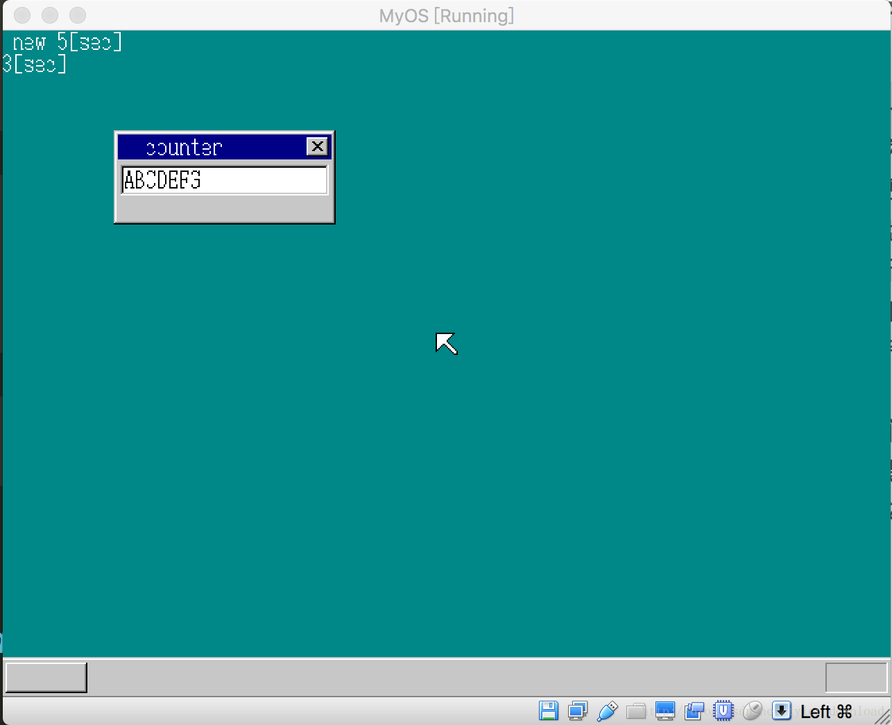
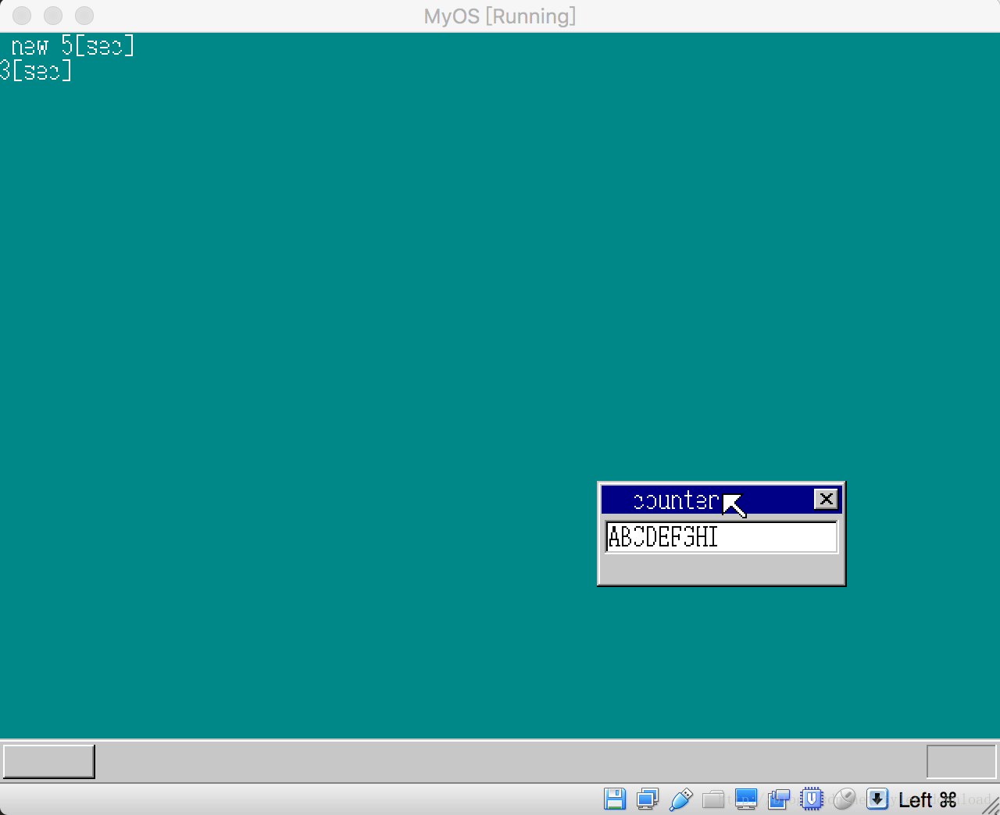

## 输入文本框和鼠标移动窗体


上一节，我们实现了按键转换成字符的功能，这一节，我们更近一步，在message box中实现一个输入文本框，按键时，字符显示在文本框内，并且输入光标在文本框中不断闪动。

在内核的C语言部分，也就是write_vga_desktop.c中做如下改动：

```
void make_textbox8(struct SHEET *sht, int x0, int y0, int sx, int sy, int c) {
    int x1 = x0 + sx, y1 = y0 + sy;
    boxfill8(sht->buf, sht->bxsize, COL8_848484, x0 - 2, y0 - 3, x1 + 1, y0 - 3);
    boxfill8(sht->buf, sht->bxsize, COL8_848484, x0 - 3, y0 - 3, x0 - 3, y1 + 1);
    boxfill8(sht->buf, sht->bxsize, COL8_FFFFFF, x0 - 3, y1 + 2, x1 + 1, y1 + 2);
    boxfill8(sht->buf, sht->bxsize, COL8_FFFFFF, x1 + 2, y0 - 3, x1 + 2, y1 + 2);
    boxfill8(sht->buf, sht->bxsize, COL8_000000, x0 - 1, y0 - 2, x1 + 0, y0 - 2);
    boxfill8(sht->buf, sht->bxsize, COL8_000000, x0 - 2, y0 - 2, x0 - 2, y1 + 0);
    boxfill8(sht->buf, sht->bxsize, COL8_C6C6C6, x0 - 2, y1 + 1, x1 + 0, y1 + 1);
    boxfill8(sht->buf, sht->bxsize, COL8_C6C6C6, x1 + 1, y0 - 2, x1 + 1, y1 + 1);
    boxfill8(sht->buf, sht->bxsize, c, x0 - 1, y0 - 1, x1 + 0, y1 + 0); 
}
```

我们增加了一个函数叫make_textbox8, 它的作用是绘制一个有边框的白色方块，这个方块其实就模拟了输入文本框。然后我们对绘制message box的实现方法做一些修改，以便文本框能输入到message box的主窗体里：

```
struct SHEET*  message_box(struct SHTCTL *shtctl,  char *title) {
    struct SHEET *sht_win;
    unsigned char *buf_win;

    sht_win = sheet_alloc(shtctl);
    buf_win = (unsigned char *)memman_alloc_4k(memman, 160 * 68);
    sheet_setbuf(sht_win, buf_win, 160, 68, -1);

    make_window8(shtctl, sht_win, title);
    make_textbox8(sht_win, 8, 28, 144, 16, COL8_FFFFFF);    

    sheet_slide(shtctl, sht_win, 80, 72);
    sheet_updown(shtctl, sht_win, 2);

    return sht_win;
}
```

上面的窗体绘制函数中，在绘制好message box的主窗体后，里面把白色文本框画到主窗体的中央。有了文本框后，我们可以接着实现字符输入功能。

```
void CMain(void) {
    ....
    int cursor_x = 8, cursor_c=COL8_FFFFFF
    ....
    for(;;) {
    ....
    else if (keytable[data] != 0 && cursor_x < 144) {
               boxfill8(shtMsgBox->buf, shtMsgBox->bxsize, COL8_FFFFFF,cursor_x,
              28, cursor_x + 7, 43);
              sheet_refresh(shtctl, shtMsgBox, cursor_x, 28, cursor_x+8, 44);

                   char buf[2] = {keytable[data], 0};
                   showString(shtctl,  shtMsgBox, cursor_x, 28, COL8_000000, buf);
                   cursor_x += 8;


              boxfill8(shtMsgBox->buf, shtMsgBox->bxsize, cursor_c, cursor_x,
              28, cursor_x + 7, 43);
              sheet_refresh(shtctl, shtMsgBox, cursor_x, 28, cursor_x+8, 44);
           }

       }
    ....
    else if (fifo8_status(&timerinfo) != 0) {
           io_sti();
           int i = fifo8_get(&timerinfo);
           if (i == 10) {
               showString(shtctl, sht_back, 0, 0, COL8_FFFFFF, " new 5[sec]");
           } else if (i == 2) {
               showString(shtctl, sht_back, 0, 16, COL8_FFFFFF, "3[sec]");
           } else {
               if (i != 0) {
                  timer_init(timer3, &timerinfo, 0);
                  cursor_c = COL8_000000;
               } else {
                  timer_init(timer3, &timerinfo, 1);
                  cursor_c = COL8_FFFFFF;
               }

               timer_settime(timer3, 50);
               boxfill8(shtMsgBox->buf, shtMsgBox->bxsize, cursor_c, cursor_x,
               28, cursor_x + 7, 43);
               sheet_refresh(shtctl, shtMsgBox, cursor_x, 28, cursor_x+8, 44);

           }
       }

     ......
    }
    ....
}
```

一旦有键盘事件时，内核先把扫描码转换成对应的字符，然后绘制到message box窗体的文本框中，cursor_x是字符输入的位置，没输入一个字符，它的值增加8，因为一个字符的像素宽度是8.为何在输入字符前，需要调用boxfill8，和sheet_refresh这两个函数呢，这是因为光标闪烁时，会由黑色变成白色，如果光标变成黑色时，我们正好按下键盘的话，那么字符显示时的背景将是黑色的，但是我们的字体本身就是黑色的，所以一旦这种情况发生的时，如果不调用这两个函数先把字体要显示的位置刷成白色的话，字体就显示不出来，而显示的是一个黑色小方块，具体情形，大家参考视频讲解会更明白。

在主循环中，当timer3 超时时，我们可以变换光标的颜色，如果原来是白色，那么把它转换成黑色，如果原来是黑色，则转换成白色，需要注意的是，此时光标显示的位置是在message box的文本框内。

上面代码编译运行后，效果如下：




#### 鼠标移动窗体

接下来，我们看看如何实现鼠标移动message box的效果，这个实现很简单，在内核的C语言部分做如下改动：

```
void  show_mouse_info(struct SHTCTL *shtctl, struct SHEET *sht_back,struct SHEET *sht_mouse) {
    char*vram = buf_back;
    unsigned char data = 0;

    io_sti();
    data = fifo8_get(&mouseinfo);
    if (mouse_decode(&mdec, data) != 0) {
         computeMousePosition(shtctl, sht_back, &mdec);

         sheet_slide(shtctl, sht_mouse, mx, my);
         if ((mdec.btn & 0x01) != 0) {
            sheet_slide(shtctl, shtMsgBox, mx - 80, my - 8); 
         }
    }
}
```

在鼠标事件发生后，硬件会给端口发送鼠标相关数据，内核拿到数据后会进行解析，如果结构体mdec.btn的第0位设置成1的话，就表明，此时鼠标的左键按下了，这样，当我们绘制鼠标时，把message box 窗体同步移动到鼠标的相应位置，这样就能实现窗体随鼠标移动了，当然，当前做法存在一个问题是，我们没有判断鼠标左键按下时，鼠标是否在message box的窗体范围内，这个功能往后我们再添加上，上面的代码编译后运行效果如下：



窗体被从左上角移动到了右下角，具体效果，参看视频会更加明显。