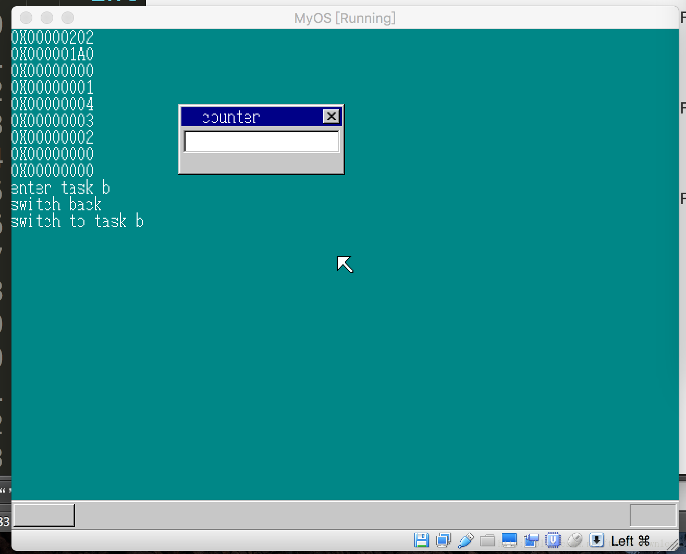

## 进程初体验


操作系统内核开发，一个及其重要的模块是进程以及进程调度。在大学的操作系统课堂上，研究进程和相关调度算法，是一块耗时耗力的内容。市面上，讲解操作系统进程概念以及调度算法的内容可谓是汗牛充栋，记得我以前读相关内容时，看到很多算法流程图，伪码说明等等，说了一大堆，但我就是无法动手实践，由此感觉那些树都是说大话的假把式，无论描述的如何详细，但只要我无法动手实践，那么也只能是隔靴搔痒，心中困顿，始终无法排解，从本节开始，我们看看，如何通过代码实践的方式，把各种天花乱坠的进程算法落地实现。

进程的创建，主要是为了实现多任务，就算只有一个CPU, 我们也应该可以一边听歌，一边写邮件。既然需要多个任务“同时进行”，那么就需要每个任务在运行时，不能互相干扰，一个任务对数据的读取，绝对不可以影响别的进程的数据。一般而言，对于单CPU硬件来说，多任务其实是一种假象，他们同时运行，其实不过是CPU快速在各个任务间切换的结果而已，当一个任务从前台切换到后台时，需要把当前进程运行所需要的各种信息保存好，当下次进程重新切换回前台时，需要把当时保存好的信息重新加载，这样进程就能顺利的”死灰复燃“了。

### 基本数据结构的说明
我们先看一个用户切换进程的数据结构，就能大概了解进程的相关特性，以及切换时需要保存什么内容了，(代码文件multi_task.h)：

```asm
struct TSS32 {
    int backlink, esp0, ss0, esp1, ss1, esp2, ss2, cr3;
    int eip, eflags, eax, ecx, edx, ebx, esp, ebp, esi, edi;
    int es, cs, ss, ds, fs, gs;
    int ldtr, iomap;
};
```

上面的数据结构，称为一个任务门描述符，是intel X86架构的CPU专门供给的。当发生任务切换时，CPU通过加装上面给定的数据结构，将当前进程的相关信息写入TSS32, 从而实现当前进程的运行环境保护。我们看看里面的相关字段。

eflags 是进程运行时的状态字段，这个字段用于决定当前硬件中断是否打开，是否有运算溢出等信息，在我们内核的汇编代码部分，有一个专门的函数叫io_load_eflags，这个函数就是专门用来加载或存储这个字段的。

当前进程需要保留的还有各个用于运行时的通用寄存器，像eax,ebx等等。需要关注的是cs, ss ,ds, 等段寄存器。这些寄存器指向的是全局描述符表中的相关表项，cs指向的全局描述符，说明的是一段内存的起始地址和大小，这段内存是当前进程代码所在地。ds指向的描述符，说明的内存是当前进程用于存储数据的内存，ss指向的描述符也说明一段内存，这段内存用来当做进程运行时的栈来使用，因此这一系列段寄存器必须小心保存，一旦他们的数值错误，进程的运行就会产生混乱甚至奔溃。

其他的字段我们暂时用不上，先不必花费精力来了解。TSS32数据结构，长度为104字节，但是我们的结构体总共有104字节，这多出的一字节，是为了使用方便而已，没有多余意义。

当我们初始化了TSS32后，在全局描述符表中，需要专门分配一个描述符来指向这块TSS32内存,这种描述符，成为任务门。

在代码文件multi_task.h中，还包含了对全局描述符数据结构的定义：

```c
struct SEGMENT_DESCRIPTOR {
    short limit_low, base_low;
    char base_mid, access_right;
    char limit_high, base_high;
};

void set_segmdesc(struct SEGMENT_DESCRIPTOR *sd, unsigned int limit, int base, int ar);

#define AR_TSS32        0x0089
```

我们在内核的汇编部分，有对全局描述符的数据结构定义，这两个定义完全是等价的，只不过一个用汇编来写，一个用C语言来写，相比较来看，可见C语言比汇编更加容易理解。

set_segmdesc这个函数用来实现对一个描述符的设置，同样，在内核的汇编部分，也存在对描述符进行设置的代码，这个函数其实就是把汇编部分的逻辑用C语言重新实现了一遍。

每一个全局描述符，都有一个字段，用于记录该描述符描述的对象是什么性质，例如用0x9a来说明，描述符指向的内存是一段代码，那么0x89用于说明描述符用于指向一块内存，这块内存就是一个TSS32数据结构。

### 进程切换代码说明
我们再看看multi_task.c的实现：

```c
#include "multi_task.h"

void set_segmdesc(struct SEGMENT_DESCRIPTOR *sd, unsigned int limit, int base, int ar)
{
    if (limit > 0xfffff) {
        ar |= 0x8000; /* G_bit = 1 */
        limit /= 0x1000;
    }
    sd->limit_low    = limit & 0xffff;
    sd->base_low     = base & 0xffff;
    sd->base_mid     = (base >> 16) & 0xff;
    sd->access_right = ar & 0xff;
    sd->limit_high   = ((limit >> 16) & 0x0f) | ((ar >> 8) & 0xf0);
    sd->base_high    = (base >> 24) & 0xff;
    return;
}
```

上面这段代码，作用是设置一个全局描述符，它的功能跟我们在内核汇编部分实现的一模一样。

当我们初始化好一个TSS32数据结构，同时构造一个全局描述符指向这个TSS32数据块后，然后通过一条CPU指令，把这个数据库加载到CPU中，这条指令是LTR，我们在内核的汇编部分专门封装了这条指令，以便内核的C语言部分调用，代码如下(kernel.asm)：

```
load_tr:
        LTR  [esp + 4]
        ret
```

这条指令执行后，当有任务切换时，CPU会把当前进程的相关信息写入到TSS32数据结构中，这个结构就是通过上面指令存入CPU的。同时，我们的内核创建一个新的TSS32数据结构，把要切换的进程的相关信息写入到这个数据结构中，CPU把老进程的信息存储到第一个TSS32中，从第二个TSS32中把新进程的信息加载起来，这样就实现了进程的新老交替。

我们现在内核的汇编部分添加几个描述符用于指向不同的TSS32结构，代码如下(kernel.asm)：

```
LABEL_GDT:
....

LABEL_DESC_6:       Descriptor        0,      0fffffh,       0409Ah

LABEL_DESC_7:       Descriptor        0,      0,       0

LABEL_DESC_8:       Descriptor        0,      0,       0

LABEL_DESC_9:       Descriptor        0,      0,       0

```

LABEL_DESC_6, LABEL_DESC_7, LABEL_DESC_8,LABEL_DESC_9这几个描述符是为了实现任务切换而新增的，具体使用，我们下面会详细说明，Descriptor是内核的汇编部分对全局描述符的定义，其跟C语言部分的SEGMENT_DESCRIPTOR是完全等价的。

我们看内核的C语言部分，在CMain函数里：

```c
void CMain(void) {
....
static struct TSS32 tss_a, tss_b;
    struct SEGMENT_DESCRIPTOR *gdt = (struct SEGMENT_DESCRIPTOR *)get_addr_gdt();
    tss_a.ldtr = 0;
    tss_a.iomap = 0x40000000;
    tss_b.ldtr = 0;
    tss_b.iomap = 0x40000000;
    set_segmdesc(gdt + 7, 103, (int) &tss_a, AR_TSS32);

    set_segmdesc(gdt + 8, 103, (int) &tss_a, AR_TSS32);

    set_segmdesc(gdt + 9, 103, (int) &tss_b, AR_TSS32);

    set_segmdesc(gdt + 6, 0xffff, task_b_main, 0x409a);

    load_tr(7*8);

    taskswitch8();
....
}
```

我们先定义了两个TSS32结构，分别是tss_a, tss_b,这两个结构将分别对应两个不同的任务。然后初始化两个字段ldtr 和 iomap.这两个字段的作用我们先不用关心，但它们的值不能乱写。gdt是全局描述符表的头地址，根据首地址片偏移7，对应的就是前面我们说的LABEL_DESC_7，其余的同理。接着，通过seg_segmdesc把tss_a的起始地址写入到描述符中，注意，我们对LABEL_DESC_8也同样写入tss_a, 这是一个小技巧，纯粹是为了进行技术说明，下面我们会看到它的使用。

set_segmdesc(gdt + 9, 103, (int) &tss_b, AR_TSS32);

把tss_b的地址写入到描述符LABEL_DESC_9。然后把描述符LABEL_DESC_7通过ltr指令加载到CPU中，我们知道LABEL_DESC_7对应的是tss_a, 所以通过调用

load_tr(7*8);

CPU就知道tss_a的存在了。需要说明的是，上面代码中的7对应的就是描述符在整个表中的下标，为什么要乘以8呢？乘以8相当于把下标数值左移3位,这是x86架构的规定，当要访问全局描述符表中的某个表项时，必须把下标左移3位，这样就会空出3个比特位，这3个位是有重要用处的，以后我们会涉及到。

接着通过调用taskswitch8(); 这时将进行一次任务切换，也就是进程的调度，这里需要我们注意理解，先看taskswitch8的代码实现，它的实现在内核的汇编部分kernel.asm：

```
taskswitch8:
        jmp  8*8:0
        ret

    taskswitch7:
        jmp  7*8:0
        ret

    taskswitch6:
        jmp  6*8:0
        ret

    taskswitch9:
        jmp 9*8:0
        ret
```

我们最开始实现从实模式向保护模式跳转的时候，就使用过
jump 全局描述符下标*8 : 偏移地址
这种格式的代码指令，taskswitch8 的实现，就是让CPU跳转到下标为8的描述符所指向的内存，乘以8的原因，我们在前面解释了。

下标为8的描述符对应的就是LABEL_DESC_8，我们前面曾经用代码：
set_segmdesc(gdt + 8, 103, (int) &tss_a, AR_TSS32);
来设置过，也就是说，这个描述符指向的就是tss_a结构，并且这个描述符的属性是AR_TSS32, 当CPU把该描述符加载后，读取该描述符的属性，发现属性是AR_TSS32，于是CPU知道当前这个描述符是指向一个TSS32结构的，那么加载这样的描述符就意味着要进行一次任务切换，于是它把当前任务的运行环境，也就是，当前的各个寄存器的值，先存储到早先通过ltr加载的tss32结构中，然后再从此次加载的tss32结构中读取相关信息，进而执行新的任务。

这里要注意了，先前加载的TSS32结构是tss_a, 此次加载的TSS32结构还是tss_a, 也就是说，CPU会把当前进程的运行环境相关信息写入到tss_a, 然后再从tss_a中把信息重新装载进CPU, 也就是说，CPU先把当前运行着CMain函数的任务的相关信息写入到tss_a中，然后在把写入信息后的tss_a加载，从写入信息后的tss_a中得到新任务的信息，这样的话，老任务的信息和新任务的信息是完全一样的。

也就是说，我们先把当前运行着CMain的任务切换到后台，然后通过读取tss_a中的数据，再次把切换回后台的任务重新加载执行。这样我们就是实现了一个任务的自我切换。

那么怎么证明一个任务从自己切换到自己呢，我们知道，当我们定义了tss_a结构时，只初始化了两个字段，分别是ldtr 和iomap, 其他字段默认为0，由于发生了任务切换，CPU会把相关寄存器信息写入到tss_a的对应字段，这样，我们只要把其他字段打印出来，如果他们的值不再是0的话，那就意味着曾经有任务切换过，并且CPU把被切换的任务的相关信息写入到了tss_a数据结构中，于是我们通过代码打印出tss_a的相关字段：

```
char *p = intToHexStr(tss_a.eflags);
    showString(shtctl, sht_back, 0, 0, COL8_FFFFFF, p);

    p = intToHexStr(tss_a.esp);
    showString(shtctl, sht_back, 0, 16, COL8_FFFFFF, p);

    p = intToHexStr(tss_a.es / 8);
    showString(shtctl, sht_back, 0, 32, COL8_FFFFFF, p);

    p = intToHexStr(tss_a.cs / 8);
    showString(shtctl, sht_back, 0, 48, COL8_FFFFFF, p);

    p = intToHexStr(tss_a.ss / 8);
    showString(shtctl, sht_back, 0, 64, COL8_FFFFFF, p);

    p = intToHexStr(tss_a.ds / 8);
    showString(shtctl, sht_back, 0, 80, COL8_FFFFFF, p);

    p = intToHexStr(tss_a.gs / 8);
    showString(shtctl, sht_back, 0, 96, COL8_FFFFFF, p);

    p = intToHexStr(tss_a.fs / 8);
    showString(shtctl, sht_back, 0, 112, COL8_FFFFFF, p);

    p = intToHexStr(tss_a.cr3);
    showString(shtctl, sht_back, 0, 128, COL8_FFFFFF, p);

```

上面代码执行后，在桌面上打印出的信息如下：




大家看做上角的一排数字，对应的就是tass_a相关字段的内容，tss_a初始化时，这些字段都是默认为0的，但打印出来的时候，有一些不是0，我们又没有在代码里主动进行设置，这么说来，这些字段的设置，只能是CPU亲手写入的，也就是说，我们实现了一次当前任务到其自身的切换！