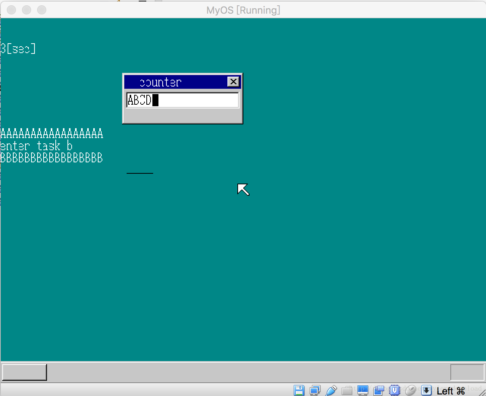

## 实现进程自动切换


Linux 操作系统内核于1991年10月5日被Linus Benedict Torvalds 所开发，从此后，世界软件史揭开了新的帷幕，我们现在很多伟大的软件项目，都构建在Linux的基础之上，不说用于支撑谷歌，阿里，百度等巨头业务的后台大型服务器，现在风靡世界的安卓操作系统，也是构建在Linux之上的，可以说，没有当年Linux内核诞生的那一刻，就没有现在方兴未艾的移动互联网。

Linus当时完成的内核有什么特点呢？当时的内核功能简单，但最重要的是其具有了进程调度功能，它启动了两个进程，一个进程打印出一串”AAAA…”, 另一个进程打印出一串”BBBB….”

既然我们现在的系统内核已经具备了进程的切换功能，因此，我们更近一步，将现在进程间的主动切换升级为进程间的自动切换，然后每个进程各种打印一个字符，这样就可以再现当时Linus的辉煌一刻了。

如何实现进程的自动切换呢，或许你已经想到了，那就是利用时钟中断。好，让我们来开始实现相应代码，首先要改动的是multi_task.h 和 multi_task.c:

```

struct TSS32 {
    int backlink, esp0, ss0, esp1, ss1, esp2, ss2, cr3;
    int eip, eflags, eax, ecx, edx, ebx, esp, ebp, esi, edi;
    int es, cs, ss, ds, fs, gs;
    int ldtr, iomap;
};

struct SEGMENT_DESCRIPTOR {
    short limit_low, base_low;
    char base_mid, access_right;
    char limit_high, base_high;
};

void set_segmdesc(struct SEGMENT_DESCRIPTOR *sd, unsigned int limit, int base, int ar);

#define AR_TSS32        0x0089

void mt_init();

struct TIMER *mt_timer;

void mt_taskswitch();

```

我们多加了两个函数接口和一个定时器指针，他们将用来实现进程间的自动切换。我们看看具体实现（multi_task.c）：

```
static int mt_tr;

void mt_init(void) {
    mt_timer = timer_alloc();

    timer_settime(mt_timer, 100);
    mt_tr = 7*8;
    return;
}

void mt_taskswitch() {
    if (mt_tr == 7*8) {
        mt_tr = 9*8;
    } else {
        mt_tr = 7 * 8;
    }

    timer_settime(mt_timer, 100);
    farjmp(0, mt_tr);
    return;
}
```

mt_init 首先初始化用于进程调度的时钟对象，然后把mt_tr设置为7*8，也就是CMain函数所对应的任务门描述符的下标。

mt_taskswitch 一旦被调用，那么则把mt_tr在7*8 和 9*8 直接切换，然后通过调用farjmp 跳转到对应的任务门，下标7对应的是CMain的任务门，9对应的是task_b_main函数的任务门，在这两个任务吗间跳转，就可以实现两个进程的相互切换。

我们再看看farjmp的实现，它的实现是在内核的汇编部分：

```
farjmp:
        jmp FAR [esp + 4]
        ret
```

在汇编中，跳转执行分两种情况，一种叫近跳转，如果跳转不涉及到让CPU更改当前加载的代码段描述符，也就是cs寄存器所存储的描述符下标，那么我们就可以使用近跳转，如果要改变cs寄存器的内容，也就是要让CPU加载新的描述符，那么我们可以使用远跳转，就像上面的代码一样，由于我们任务切换时，要从一个任务门描述符切换到另一个任务门描述符，所以我们可以使用远跳转。

如果jmp 指令后面跟着FAR 关键字的话，那么CPU会把当前指定的内存地址处的4字节当做eip的值，然后再连续读入2字节的数据存入cs寄存器。对于调用far(0, 7*8), [esp + 4] 对应的4字节就是数值0，接下来的2字节对应的就是7*8.
所以当我们通过调用farjmp(0, 7*8) 的时候，其效果跟我们以前调用taskswitch7是一样的。

有了进程切换代码后，我们就可以在时钟中断里进行调用，进而实现进程切换了，看timer.c：

```
void intHandlerForTimer(char *esp) {
    io_out8(PIC0_OCW2, 0x20);

    timerctl.count++;
    char ts = 0;
    int i;
    for (i = 0; i < MAX_TIMER; i++) {
        if (timerctl.timer[i].flags == TIMER_FLAGS_USING) {
            timerctl.timer[i].timeout--;
            if (timerctl.timer[i].timeout == 0) {
                timerctl.timer[i].flags = TIMER_FLAGS_ALLOC;
                fifo8_put(timerctl.timer[i].fifo, timerctl.timer[i].data);
                if (&timerctl.timer[i] == mt_timer) {
                    ts = 1;
                }
            }
        }

        if (ts != 0) {
            mt_taskswitch();
        }
    }


    return;
}
```

每次时钟中断发送，上面intHandlerForTimer函数会被调用，该函数先减少每个时钟的时钟片，如果有时钟超时的话，它会看看，超时的时钟是否是mt_timer,如果是的话，表示将变量ts 设置为1，后面如果判断到ts不等于0时，就表示进程切换的时间到了，便调用mt_taskswitch进行进程切换。

再看看内核C语言部分的修改：

```
void CMain(void) {
...
    fifo8_init(&timerinfo, 8, timerbuf);
    timer = timer_alloc();
    timer_init(timer, &timerinfo, 10);
    timer_settime(timer, 100);
...

    for(;;) {
       ....
       else if (fifo8_status(&timerinfo) != 0) {
           io_sti();
           int i = fifo8_get(&timerinfo);
           if (i == 10) {
                showString(shtctl, sht_back, pos, 144, COL8_FFFFFF,
                 "A"); 
                //switch task 
              //  farjmp(0, 9*8);
                timer_settime(timer, 100);
                pos += 8;
           }
       ....
    }
}
```

在CMain中，先构造了一个时间片是1秒的时钟，每当时钟超时，就在屏幕上打印一个字符”A”, 然后再次初始化新的时间片为1秒的时钟。我们看看task_b_main的实现：

```
void task_b_main(void) {
   showString(shtctl, sht_back, 0, 160, COL8_FFFFFF, "enter task b");

    struct FIFO8 timerinfo_b;
    char timerbuf_b[8];
    struct TIMER *timer_b = 0;

    int i = 0;

    fifo8_init(&timerinfo_b, 8, timerbuf_b);
    timer_b = timer_alloc();
    timer_init(timer_b, &timerinfo_b, 123);

    timer_settime(timer_b, 100);


    int pos = 0;
    for(;;) {
       io_cli();
        if (fifo8_status(&timerinfo_b) == 0) {
            io_sti();
        } else {
           i = fifo8_get(&timerinfo_b);
           io_sti();
           if (i == 123) {
               showString(shtctl, sht_back, pos, 176, COL8_FFFFFF, "B");
              // farjmp(0, 8*8);
               timer_settime(timer_b, 100);
               pos += 8;
           }

        }

    }

}
```

task_b_main同样构造了一个1秒的时钟，每次时钟超时的时候，就在桌面上打印出字符B,上面的代码编译后，加载到虚拟机，实现的效果如下（请通过视频观看动态效果）：




字符A和B在没有任何干预的情况下，交替显示出来，当前Linus实现的第一版Linux内核就是这个效果，如今，我们重现了当前激动人心的一刻，不知此时的你是否也能体验到大牛Linus当时喜悦的心情呢？