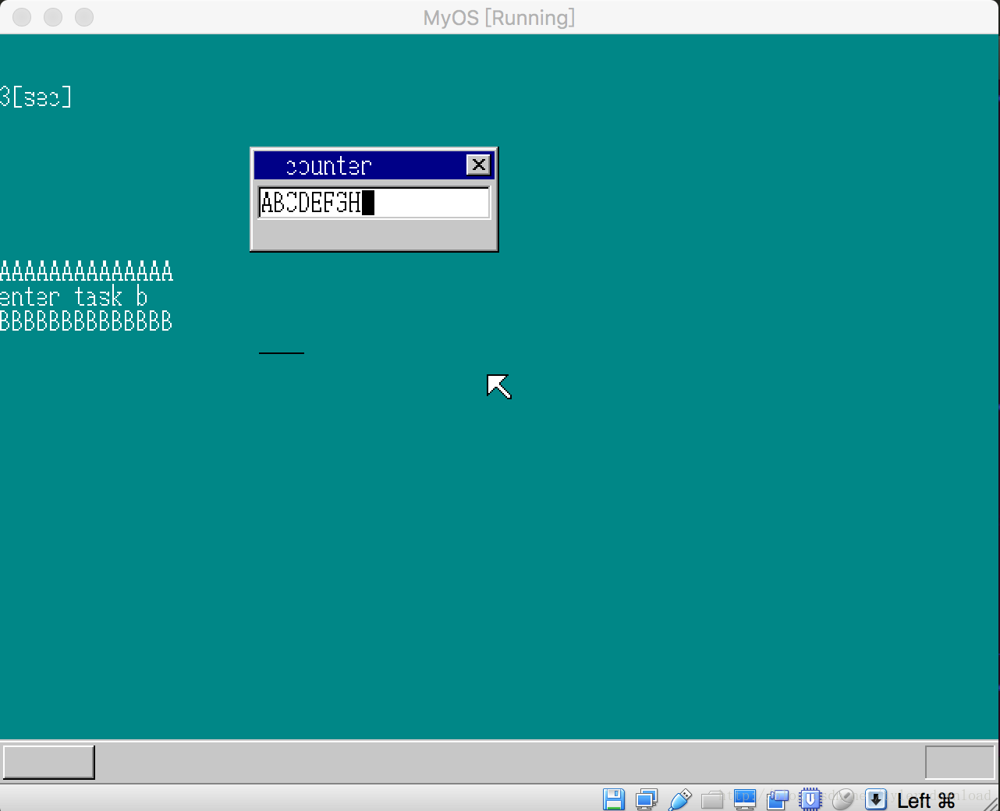

## 自动化进程切换


我们已经通过时钟中断完成了两个进程间的相互切换。但当前实现有很大的缺陷，例如我们只能在两个指定的进程间切换，如果要想增添新的进程，那么，没增加一个进程，按照当前模式，我们只能再增加相应代码，这显然是不可接受的。因此，这节，我们希望完成进程的切换机制，使得有新进程时，我们无需改动代码，进程的管理机制会自动把新进场添加进切换机制。

我们看看新修改的代码，首先是multi_task.h:

```
struct TASK {
    int sel, flags;
    struct TSS32 tss;
};

#define  MAX_TASKS  2
#define  TASK_GDT0  7
#define  SIZE_OF_TASK  112

struct TASKCTL {
    int  running;
    int  now;
    struct TASK  *tasks[MAX_TASKS];
    struct TASK tasks0[MAX_TASKS];
};

struct TASK *task_init(struct MEMMAN *memman);

#define SIZE_OF_TASKCTL  (4 + 4 + 4*MAX_TASKS + SIZE_OF_TASK*MAX_TASKS)

struct TASK *task_alloc(void);

```

TASK 结构体用来表示一个进程，其中的sel表示该进程的TSS32结构所对应的段描述符下标，flag用来表示当前任务状态，例如是空闲还是占用。

TASKCTL 是任务控制器，它包含了TASK数组，也就是TASKCTL是一组进程的集合，runnging表示当前有多少个正在运行的进程，now表示下一个将被切换到前台的进程编号。

我们再看看对应函数的具体实现，在multi_task.c中：

```
static struct TIMER *task_timer;
static struct TASKCTL *taskctl;

struct TASK  *task_init(struct MEMMAN *memman) {
    int  i;
    struct TASK *task;
    struct SEGMENT_DESCRIPTOR *gdt = (struct SEGMENT_DESCRIPTOR *)get_addr_gdt();
    taskctl = (struct TASKCTL *)memman_alloc_4k(memman, SIZE_OF_TASKCTL);
    for (i = 0; i < MAX_TASKS; i++) {
        taskctl->tasks0[i].flags = 0;
        taskctl->tasks0[i].sel = (TASK_GDT0 + i) * 8;
        set_segmdesc(gdt + TASK_GDT0 + i, 103, (int)&taskctl->tasks0[i].tss,
        AR_TSS32);
    }

    task = task_alloc();
    task->flags = 2;  //active
    taskctl->running = 1;
    taskctl->now = 0;
    taskctl->tasks[0] = task;
    load_tr(task->sel);
    task_timer = timer_alloc();
    timer_settime(task_timer, 100);
    return task;
}

struct TASK *task_alloc(void) {
    int i;
    struct TASK *task;
    for (i = 0; i < MAX_TASKS; i++) {
        if (taskctl->tasks0[i].flags == 0) {
            task = &taskctl->tasks0[i];
            task->flags = 1;
            task->tss.eflags = 0x00000202;
            task->tss.eax = 0;
            task->tss.ecx = 0;
            task->tss.edx = 0;
            task->tss.ebx = 0;
            task->tss.ebp = 0;
            task->tss.esp = 512*(i+1);
            task->tss.esi = 0;
            task->tss.edi = 0;
            task->tss.es = 0;
            task->tss.ds = 0;
            task->tss.fs = 0;
            task->tss.gs = 0;
            task->tss.ldtr = 0;
            task->tss.iomap = 0x40000000;
            return task;
        }
    }

    return 0;
}

void task_run(struct TASK *task) {
    task->flags = 2;
    taskctl->tasks[taskctl->running] = task;
    taskctl->running++;
    return;
} 

void task_switch(void) {
    timer_settime(task_timer, 100);
    if (taskctl->running >= 2) {
        taskctl->now++;
        if (taskctl->now == taskctl->running) {
            taskctl->now = 0;
        }

        farjmp(0, taskctl->tasks[taskctl->now]->sel);
    }

    return;
}
```

task_init主要是初始化任务控制器对象，同时创建一个时钟，用于进程调度，同时为每个任务分配一个全局描述符，这个描述符指向该任务所对应的TSS32结构，并且将第一个任务的TSS32加载进CPU.

当有新的进程需要调度时，需要调用task_alloc为该进程创建一个任务对象，有了任务对象才能加入调度队列，与其他进程一起参与调度。

一旦为新进程分配任务对象后，需要调用task_run,将其加入调度队列，这样，新添加的任务会在调度队列中等待，当排在前面的任务运行后，它才会被切换到前台。

task_switch 是由时钟中断调用的，目前我们的任务调度算法很简单，就是排队处理，排在前面的先调度，运行1秒后，切换到下一个，如果队列中所有的任务都调度过了，那么重新回到队列头，再开启新一轮的调度。

我们看看中断响应函数的更改，timer.c:

```
void intHandlerForTimer(char *esp) {
    io_out8(PIC0_OCW2, 0x20);

    timerctl.count++;
    int i;
    char ts = 0;

    for (i = 0; i < MAX_TIMER; i++) {
        if (timerctl.timer[i].flags == TIMER_FLAGS_USING) {
            timerctl.timer[i].timeout--;
            if (timerctl.timer[i].timeout == 0) {
                timerctl.timer[i].flags = TIMER_FLAGS_ALLOC;
                fifo8_put(timerctl.timer[i].fifo, timerctl.timer[i].data);
                if (&timerctl.timer[i] == task_timer) {
                    ts = 1;
                }
            }
        }

        if (ts != 0) {
           task_switch();
        }
    }


    return;
}

```

这个函数的逻辑跟以前是一样的，只不过是用task_switch更换了原来的调度函数。

最后是主入口函数的更改，在write_vga_desktop.c中：

```
void CMain(void) {
    ....
int addr_code32 = get_code32_addr();
    struct SEGMENT_DESCRIPTOR *gdt = (struct SEGMENT_DESCRIPTOR *)get_addr_gdt();

    struct TSS32 tss_a;
    static struct TASK *task_a;
    static struct TASK *task_b;


    task_a = task_init(memman);
    task_b = task_alloc();
    task_b->tss.ldtr = 0;
    task_b->tss.iomap = 0x40000000;
    task_b->tss.eip =  (int)(task_b_main - addr_code32);
task_b->tss.es = 0;
    task_b->tss.cs = 1*8;//6 * 8;
    task_b->tss.ss = 4*8;
    task_b->tss.ds = 3*8;
    task_b->tss.fs = 0;
    task_b->tss.gs = 2*8;

    task_run(task_b);
    ....
}
```

它先调用task_init 初始化任务调度器，启动整个任务调度的流程，然后通过task_alloc分配一个新的任务对象，并把该任务对应的进程初始化为task_b_main,其中对TASK对象中的tss，初始化的逻辑跟以前是一样的，最后通过task_run, 把新分配的任务添加到任务调度流程中。

上面的代码完成后，运行结果跟以前一样，虽说结果变化不大，但我们进程调度的机制变了，由原来的手段机制转变为自动机制，一个进程调度模块的大体框架已经形成，以后如果我们想要实现更复杂的任务调度算法打下了扎实的基础。

