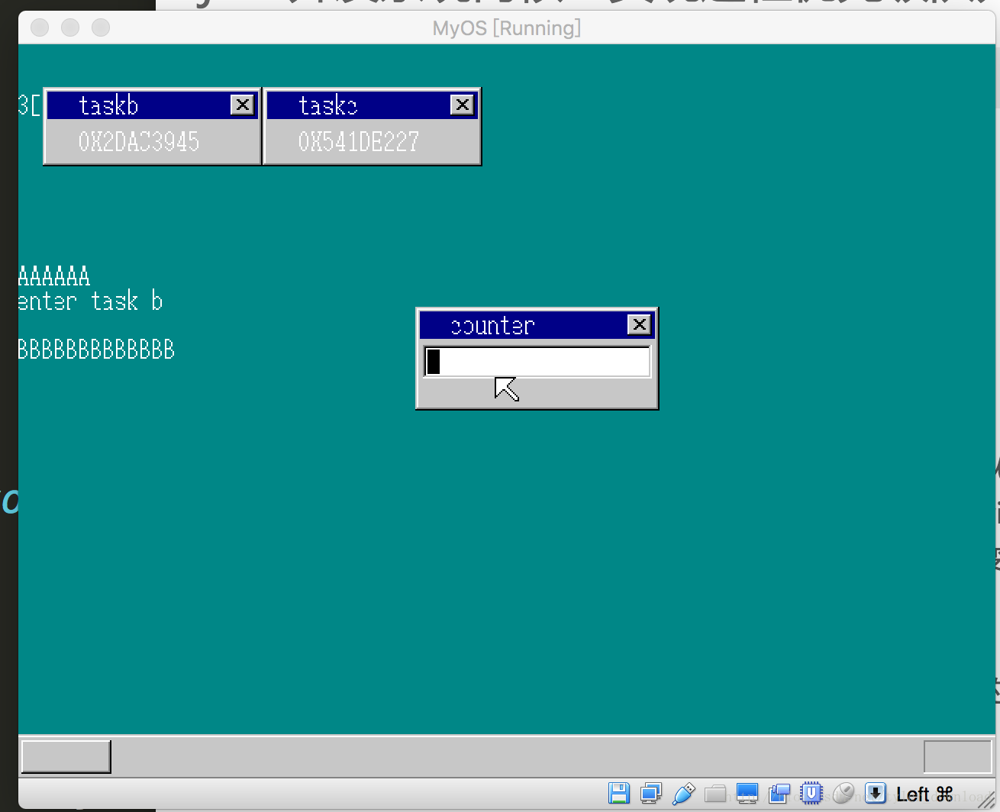

## 实现进程优先级队列


前几节，我们实现了进程的调度，并给每个进程赋予相应优先级，优先级高的进程，能够得到更多的CPU时间。但在演示时，我们发现一个问题，就是，当进程发送切换时，鼠标键盘的响应会被卡死，这是因为响应鼠标键盘事件的进程被调到后台，无法获得CPU运行时间，从而不能处理鼠标或键盘事件。

这种情况对用户来说，是不可接受的。对用户输入给予及时回应，直接关系到用户体验。所以负责相应用户输入的进程，其重要性要比那些只需要在后台运行，不用和用户直接交互的进程高很多。由此，我们需要实现的是，只要用户有输入，那么负责处理用户输入的进程就不能被打断，为了实现这个目的，我们需要实现进程的优先级队列。


如上图，我们把所有进程根据level分成三个队列，进程越重要，它对应的level值越低，这样，当进行进程调度时，进程调度器先查看level等于0的队列是否还有进程，有的话，只执行该队列的进程，如果该队列不止一个进程，那么每个进程根据他们的优先级获得相应的CPU时间。

如果levelw为0的队列没有可调度的进程，那么level为1的队列中的进程才有获得调度的机会，以此类推。

由此，我们看看相关数据结构的定义，首先是multi_task.h:

```
struct TASK {
    int sel, flags;
    int priority;
    int level;
    struct TSS32 tss;
};

#define  MAX_TASKS  5
#define  MAX_TASKS_LV   3
#define  MAX_TASKLEVELS 3

#define  TASK_GDT0  7
#define  SIZE_OF_TASK  120

struct TASKLEVEL {
    int running;
    int now;
    struct TASK *tasks[MAX_TASKS_LV];
};

#define SIZE_OF_TASKLEVEL  (8+ 4*MAX_TASKS_LV)

struct TASKCTL {
    int  now_lv;
    int  lv_change;
    struct TASKLEVEL  level[MAX_TASKLEVELS];
    struct TASK tasks0[MAX_TASKS];
};
```

TASK结构体增加了一个level变量，用于表明进程的重要性。TASKLEVEL对应于上图的进程队列，相同重要性的进程，都存储在对应TASKLEVEL的tasks数组中。

TASKCTL 也就是进程管理器，其存储的不再是进程，而是进程的优先级队列，它要找到重要性最高的进程队列，从中取出进程进行调度。

multi_task.c 需要进行相应改动：

```
struct TASKCTL *get_taskctl() {
    return taskctl;
}

void init_task_level(int level) {
    taskctl->level[level].running = 0;
    taskctl->level[level].now = 0;
    int i;
    for (i = 0; i < MAX_TASKS_LV; i++) {
        taskctl->level[i].tasks[i] = 0;
    }
}
```

init_task_level 对进程优先级队列进行初始化，running表示改对了中有几个进程，now表示队列中，哪个进程正在被调度到前台进行运行。

```
struct TASK  *task_init(struct MEMMAN *memman) {
    int  i;
    ....

    task = task_alloc();
    task->flags = 2;  //active
    task->priority = 100;
    task->level = 0;
    task_add(task);
    task_switchsub();
    ....
}
```

上面代码用于初始化运行CMain函数的进程，它把CMain进程的level设置为0，也就是该进程的重要性最高，只要它不被挂起，那么它始终拥有被调度的权利。task_add会根据进程的重要性，将其加入对应的优先级队列，一旦有新进程加入，task_switchsub 则修改相应调度信息，以便进程调度器做出适当调动。

```
void task_run(struct TASK *task,int level, int priority) {
    if (level < 0) {
        level = task->level;
    }

    if (priority > 0) {
        task->priority = priority;
    }

    if (task->flags == 2 && task->level != level) {
        task_remove(task); //change task flags
    }

    if (task->flags != 2) {
        task->level = level;
        task_add(task);
    }

    taskctl->lv_change = 1;
    return;
} 
```

task_run 的作用是修改进程重要性或优先级，或者把新的进程根据其重要性添加到相应队列。如果进程的重要性有改动，那么通过task_remove把进程从原有的优先级队列中去除，然后再通过task_add将进程添加到对应的队列。

```
void task_switch(void) {
    struct TASKLEVEL *tl = &taskctl->level[taskctl->now_lv];
    struct TASK *new_task, *now_task = tl->tasks[tl->now];
    tl->now++;
    if (tl->now == tl->running) {
        tl->now = 0;
    }

    if (taskctl->lv_change != 0) {
        task_switchsub();
        tl = &taskctl->level[taskctl->now_lv];
    }

    new_task = tl->tasks[tl->now];
    timer_settime(task_timer, new_task->priority);
    if (new_task != now_task && new_task != 0) {
        farjmp(0, new_task->sel);
    }

    return;
}
```

task_switch 被时钟中断调用，它的逻辑发送不小变化。taskctl->now_lv表示当前正则被调度的优先级队列，例如，如果now_lv的值是0，那么表示当前level等于0的队列中的进程才可以获得被调度的机会。task_switch 通过taskctl->now_lv得知哪个进程队列应该被调度，然后从该队列中，取出task对象进行执行。如果有新的进程加入，或有进程的重要性被改变了，那么taskctl->lv_change的值就不等于0。假设当前获得调度机会的是level值为1的队列中的进程，但是有level等于0的进程对象添加到了level等于0的队列中，那么此时，调度算法就会停止从level为1的队列中去调度进程，而是切换到level为0的队列，从中获取要调度的进程。

```
int  task_sleep(struct TASK *task) {
   struct TASK *cur_task = 0;

   if (task->flags == 2) {
       cur_task = task_now();
       task_remove(task);

       if (task == cur_task) {
          task_switchsub();
          cur_task = task_now();

          if (cur_task != 0)
          {
              farjmp(0, cur_task->sel);
          }
       }
   }

   return 0;
}

struct TASK *task_now(void) {
    struct TASKLEVEL *tl = &taskctl->level[taskctl->now_lv];
    return tl->tasks[tl->now];
}

void task_add(struct TASK *task) {
    struct TASKLEVEL *tl = &taskctl->level[task->level];
    tl->tasks[tl->running] = task;
    tl->running++;
    task->flags = 2;
    return;
} 
```

task_sleep 用于删除进程，如果需要杀掉某个进程，那么可以使用该函数剥夺指定进程对象获得调度的权利。task_remove负责把进程从它所在的队列中删除，如果当前被挂起的进程是正在运行的进程，那么task_sleep会选择下一个合适的进程进行调度执行。

task_now 用于返回当前正在被调用的进程对象，task_add把给定进程加入对应的优先级队列。

```
void task_remove(struct TASK *task) {
    int i ;
    struct TASKLEVEL *tl = &taskctl->level[task->level];
    for (i = 0; i< tl->running; i++) {
        if (tl->tasks[i] == task) {
            tl->tasks[i] = 0;
            break;
        }
    }

    tl->running--;
    if (i < tl->now) {
        tl->now--;
    }

    if (tl->now >= tl->running) {
        tl->now = 0;
    } 

    task->flags = 1;

    for (; i < tl->running; i++) {
        tl->tasks[i] = tl->tasks[i+1];
    }

    return;
}

void task_switchsub(void) {
    int i;
    for (i = 0; i < MAX_TASKLEVELS; i++) {
        if (taskctl->level[i].running > 0) {
           break;
        }
    }

    taskctl->now_lv = i;
    taskctl->lv_change = 0;
}
```

task_remove主要负责把进程对象从队列中删除，并修改相应的队列数据。一旦有进程删除或添加，那么进程调度需要作出对应的调整，task_switchsub的作用是根据进程的添加或删除，修改进程调度器的相应信息，进而改变进程调度器的调度行为。

最后是主入口函数CMain也做相应改动：

```
void CMain(void) {
    ....
    for (i = 0; i < 2; i++) {
       ....

       ....
       task_run(task_b[i], 1, (i+1)*5);
    }
    ....
}
```

主要到，我们把运行两个窗体的进程其重要性设置成1，也就是只要运行主入口函数的进程不挂起，那么运行两个窗体的进程就不能得到执行。

本节代码改动虽多，但逻辑简单，理解起来应该不难，经过上面的改动后，系统运行的情况如下：


从上图看出，如果CMain进程运行时，上面两个窗体原来的计数字符串没有显示，这是因为两个窗体的进程得不到调度的机会。由于CMain进程负责相应鼠标键盘，因此，此时我们移动鼠标就不再出现卡顿的情形。

当CMain进程被挂起后，两个窗体的进程获得执行机会，因而窗体中的计算字符串就出现了：



