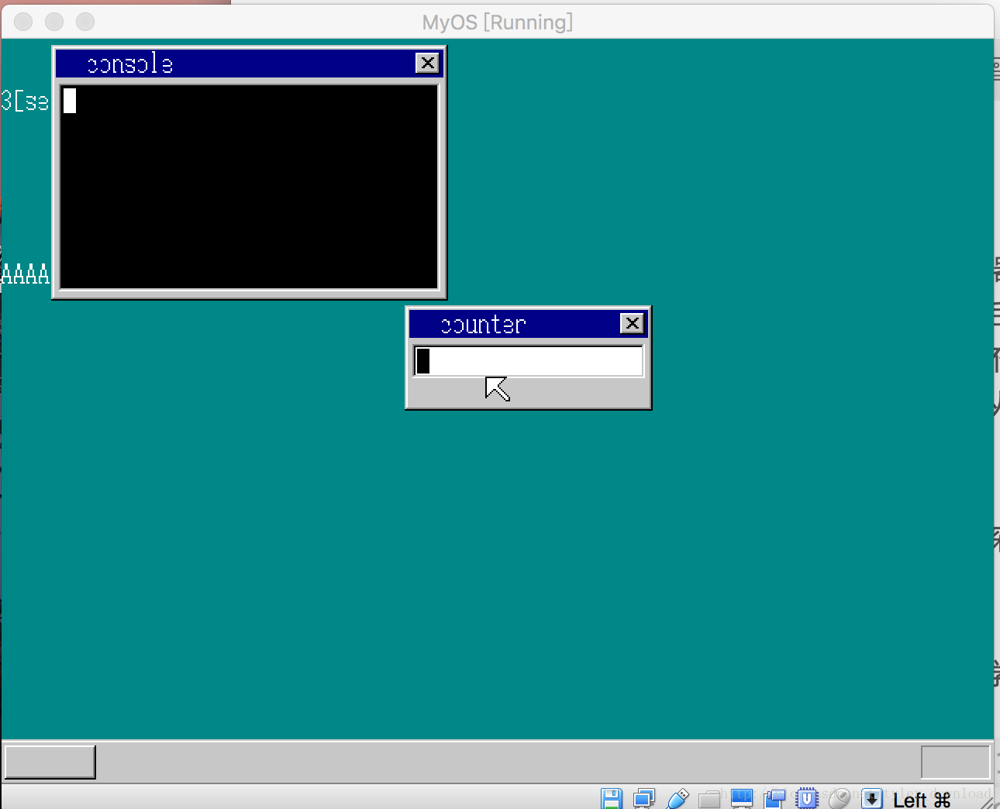

## 实现命令控制台


操作系统有一个重要的应用，就是命令控制台，像Linux系统，命令控制台集合是使用系统的主要工具。本节，我们将为系统开发一个命令控制台，今后我们会为系统开发应用程序，并且不少程序将会通过控制台来运行。

我们的控制台程序将依赖于前面完成的进程机制，主进程绘制出控制台的窗口后，启动一个专有进程，把窗口提交给进程，让新进程来负责更新窗口信息已经响应用户输入，我们看看绘制控制台窗口的代码，在write_vga_desktop.c中：

```
void  launch_console() {
    struct SHEET *sht_cons = sheet_alloc(shtctl);
    unsigned char *buf_cons = (unsigned char *)memman_alloc_4k(memman, 256*165);
    sheet_setbuf(sht_cons, buf_cons, 256, 165, COLOR_INVISIBLE);
    make_window8(shtctl, sht_cons, "console");
    make_textbox8(sht_cons, 8, 28, 240, 128, COL8_000000);

    struct TASK *task_console = task_alloc();
    int addr_code32 = get_code32_addr();
    task_console->tss.ldtr = 0;
    task_console->tss.iomap = 0x40000000;
    task_console->tss.eip =  (int)(console_task - addr_code32);

    task_console->tss.es = 0;
    task_console->tss.cs = 1*8;//6 * 8;
    task_console->tss.ss = 4*8;
    task_console->tss.ds = 3*8;
    task_console->tss.fs = 0;
    task_console->tss.gs = 2*8;
    task_console->tss.esp -= 8;
    *((int*)(task_console->tss.esp + 4)) = (int)sht_cons;
    task_run(task_console, 1, 5);

    sheet_slide(shtctl,sht_cons, 32, 4);
    sheet_updown(shtctl, sht_cons, 1);
}
```

launch_console 先是申请了内存以及获得SHEET图层对象，然后通过相关的窗口绘制函数make_window8 和 make_textbox8 将控制台窗口绘制出来。然后获取一股进程对象，也就是TASK 数据结构，设置相关信息，并把控制台的图层对象设置到新进程的堆栈上，以便进程更新控制台窗口。

调用task_run 运行控制台进程，同时通过sheet_slide 和 sheet_updown将控制台窗口移动到合适位置。

我们看看进程函数的实现：

```
void console_task(struct SHEET *sheet) {

    struct FIFO8 fifo;
    struct TIMER *timer;
    struct TASK *task = task_now();

    int i, fifobuf[128], cursor_x = 8, cursor_c = COL8_000000;
    fifo8_init(&fifo, 128, fifobuf, task);
    timer = timer_alloc();
    timer_init(timer, &fifo, 1);
    timer_settime(timer, 50);

    for(;;) {

        io_cli();
        if (fifo8_status(&fifo) == 0) {
   //         task_sleep(task);
            io_sti();
        } else {
            i = fifo8_get(&fifo);
            io_sti();
            if (i <= 1) {
                if (i != 0) {
                    timer_init(timer, &fifo, 0);
                    cursor_c = COL8_FFFFFF;
                } else {
                    timer_init(timer, &fifo, 1);
                    cursor_c = COL8_000000;
                }

                timer_settime(timer, 50);
                boxfill8(sheet->buf, sheet->bxsize, cursor_c, cursor_x,
                28, cursor_x + 7, 43);
                sheet_refresh(shtctl, sheet, cursor_x, 28, cursor_x+8, 44);
            }
        }

    }
}
```

console_task 是新进程运行的主函数，它启动了一个定时器，这个定时器的作用是在控制台上绘制光标。在主循环里，每当定时器超时后，else 部分的代码会被执行，代码会根据超时时，队列中数值的不同，选取不同的颜色来绘制光标，每次超时时，代码把光标的颜色转回成白色或黑色，从而造成一种光标闪烁的特效。




上面的代码编译后，加载到虚拟机中，效果如下，代码的深入讲解和系统运行时的动态效果，请参看视频。