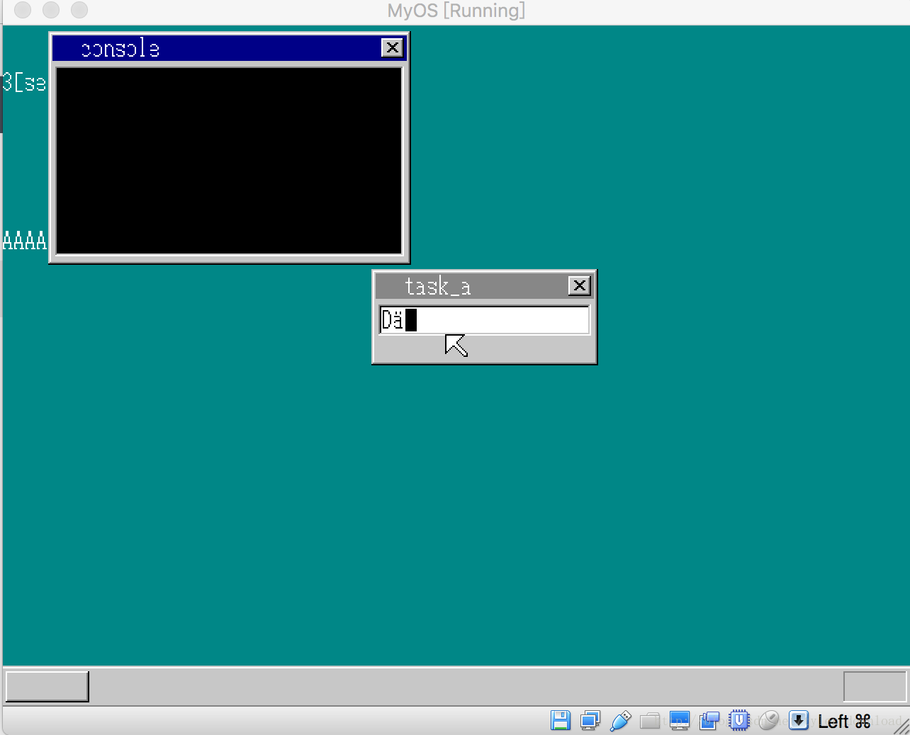

## 使用Tab键进行窗口切换

我们使用操作系统的时候，一个必不可少的功能就是通过Tab间在不同的窗口中来回切换，这种便捷方式使得你不必要挪动鼠标去点击某个窗口，只要不停的按Tab键，直到你的目标窗口被激活为止，一旦窗口被Tab键激活后，对应的窗口会响应你在键盘的输入，我们本节的目的，是在系统中实现这个功能。


从上图我们可以看到，含有文本框的小窗口获得了输入焦点，也就是小窗口的头部是蓝色，表明它处于活跃状态，而后面的命令控制台，其头部是灰色，表明它处于非活跃状态。当完成本节代码后，我们在键盘上按下Tab键，得到的情况如下：



我们看到，原来头部是灰色的控制台变成了蓝色，这意味着它被激活了，而原来是蓝色的Message box ，头部变成了灰色，表示它失去了输入焦点。

实现这个功能不难，大体设想是，我们监听键盘输入，如果当前按下的键盘是Tab键，我们得到当前激活的窗口，把它的头部绘制成灰色，然后找到下一个可以被激活的窗口，然后把它的头部绘制成蓝色。

监听键盘输入在CMain函数，所以我们先从该函数的修改入手：

```
void CMain(void) {
    ....
    int key_to = 0;

    for(;;) {
    ....
    else if (data == 0x0f) {
               if (key_to == 0) {
                   key_to = 1;
                   make_wtitle8(shtctl, shtMsgBox,"task_a", 0);
                   make_wtitle8(shtctl, sht_cons, "console", 1);
               } else {
                   key_to = 0;
                   make_wtitle8(shtctl, shtMsgBox,  "task_a",1);
                   make_wtitle8(shtctl, sht_cons, "console", 0);
               }              

              sheet_refresh(shtctl, shtMsgBox, 0, 0, shtMsgBox->bxsize, 21);
              s
    ....
    }
    ....
}
```

当Tab键被按下时，系统获得的扫描码是0x0f, 收到这个数值，表示系统接收到了Tab键按下的事件，此时它判断当前获得输入焦点的是哪个窗口，如果当前激活的是Message Box 那么我们就把它的头部绘制成灰色，把命令控制台的头部绘制成蓝色。

绘制窗口头部的函数是make_wtitle8，它的函数原型如下：

void make_wtitle8(struct SHTCTL *shtctl, struct SHEET *sht,char *title, char act);

最后一个参数act 决定了窗口的头部是绘制成灰色还是蓝色，如果act = 0那么函数把窗口的头部绘制成灰色，如果act = 1, 那么函数就把窗口的头部绘制成蓝色。我们再看看它的实现：

```
void make_wtitle8(struct SHTCTL *shtctl, struct SHEET * sht,  char *title, char act) {
    static char closebtn[14][16] = {
                "OOOOOOOOOOOOOOO@",
                "OQQQQQQQQQQQQQ$@",
                "OQQQQQQQQQQQQQ$@",
                "OQQQ@@QQQQ@@QQ$@",
                "OQQQQ@@QQ@@QQQ$@",
                "OQQQQQ@@@@QQQQ$@",
                "OQQQQQQ@@QQQQQ$@",
                "OQQQQQ@@@@QQQQ$@",
                "OQQQQ@@QQ@@QQQ$@",
                "OQQQ@@QQQQ@@QQ$@",
                "OQQQQQQQQQQQQQ$@",
                "OQQQQQQQQQQQQQ$@",
                "O$$$$$$$$$$$$$$@",
                "@@@@@@@@@@@@@@@@"
        };

    int x, y;
    char c, tc, tbc;
    if (act != 0) {
        tc = COL8_FFFFFF;
        tbc = COL8_000084;
    } else {
        tc = COL8_C6C6C6;
        tbc = COL8_848484;
    }

    boxfill8(sht->buf, sht->bxsize, tbc, 3, 3, sht->bxsize - 4, 20);
    showString(shtctl, sht, 24, 4, tc , title);

     for (y = 0; y < 14; y++) {
         for (x = 0; x < 16; x++) {
             c = closebtn[y][x];
             if (c == '@') {
                 c = COL8_000000;
             } else if (c == '$') {
                 c = COL8_848484;
             } else if (c == 'Q') {
                 c = COL8_C6C6C6;
             }
             else {
                 c = COL8_FFFFFF;
             }

             sht->buf[(5+y) * sht->bxsize + (sht->bxsize - 21 + x)] = c;
         }

     }

}

```

这部分代码原来是在窗口绘制函数make_window8里面的，现在我们把头部绘制这部分单独拎出来，形成一个独立函数，同时做一些改动。如果输入参数act的值是1，那么把tbc 设置成COL8_000084,这个颜色就是我们上面看到的窗口被激活时，头部显示的深蓝色，如果act的值是0，那么tbc的值转换为COL8_848484这个颜色就是窗口失去输入焦点后对应的灰色。

将上面代码修改编译后，把内核加载到虚拟机，就可以看到相应效果了。更详细的代码讲解和调试演示，请参看视频。
