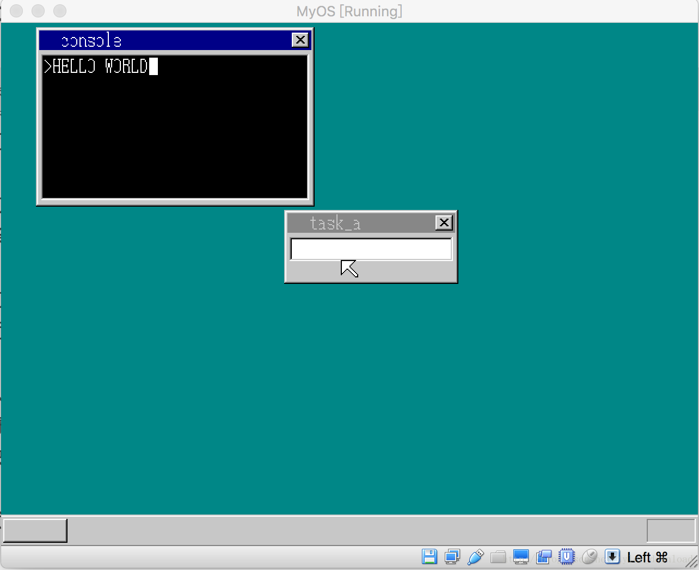

## 实现切换窗口后的键盘输入

我们实现了键盘的输入焦点切换，但尽管控制命令台激活后，如果我们敲击键盘，会发现字符输入的还是前头的Message box.这一节，我们要实现把键盘敲击的内容输入到被切换的窗口。

实现的思路是这样的，我们为每个任务配置一个输入队列，当窗口被激活时，一旦有键盘输入，主进程首先会把键盘数据获取到，然后判断当前被激活的是哪个窗口，然后找到运行窗口所对应的进程对象，通过进程对象获得其对应的输入队列，于是把键盘传过来的信息放入到输入队列中，然后激活对应的进程对象。

为此，我们对代码做如下修改，首先是multi_task.h:

```
struct TASK {
    int sel, flags;
    int priority;
    int level;
    struct FIFO8 fifo;
    struct TSS32 tss;
};
```

上面的改动就是添加了一个队列，用来获取信息输入。接下来修改的是主进程的CMain 函数，一旦键盘事件产生后，CMain会被激活，这时它可以把接收到的字符投入到对应窗口进程的队列中：

```
void CMain(void) {
    ....
    for(;;) {
    ....
    else if (key_to == 0) {
               if (keytable[data] != 0 && cursor_x < 144) {
                   boxfill8(shtMsgBox->buf, shtMsgBox->bxsize, COL8_FFFFFF,cursor_x,
                   28, cursor_x + 7, 43);
                   sheet_refresh(shtctl, shtMsgBox, cursor_x, 28, cursor_x+8, 44);

                   char buf[2] = {keytable[data], 0};
                   showString(shtctl,  shtMsgBox, cursor_x, 28, COL8_000000, buf);
                   cursor_x += 8;

                  stop_task_A = 1;

                  boxfill8(shtMsgBox->buf, shtMsgBox->bxsize, cursor_c, cursor_x,
                  28, cursor_x + 7, 43);
                  sheet_refresh(shtctl, shtMsgBox, cursor_x, 28, cursor_x+8, 44);
              } 
           } else {
              task_sleep(task_a);
              fifo8_put(&task_cons->fifo, data);
           }

       }
    ....
    }
    ....
}
```

如果当前激活的窗口是Message Box 那么字符就直接显示在文本框中，要不然我们把当前主进程挂起，然后把键盘数据通过fifo8_put把数据投入到控制台进程对应的队列中。我们一定要记得把主进程挂起，要不然主进程会一直占据CPU资源，从而控制台进程不能运行，进而无法及时处理键盘数据。

我们再看看控制台进程的改变：

```
void console_task(struct SHEET *sheet) {
    ....
    else {
                if (i == 0x0e && cursor_x > 8) {
                      boxfill8(sheet->buf, sheet->bxsize, COL8_000000, cursor_x,
                28, cursor_x + 7, 43);
                      sheet_refresh(shtctl, sheet, cursor_x, 28, cursor_x+8, 44);

                     cursor_x -= 8;

                     boxfill8(sheet->buf, sheet->bxsize, COL8_000000, cursor_x,
                28, cursor_x + 7, 43);
                     sheet_refresh(shtctl, sheet, cursor_x, 28, cursor_x+8, 44);
                } else {
                           if (cursor_x < 240 &&i< 0x54 && keytable[i] != 0) {
                           boxfill8(sheet->buf, sheet->bxsize, COL8_000000, cursor_x,
                28, cursor_x + 7, 43);
                           sheet_refresh(shtctl, sheet, cursor_x, 28, cursor_x+8, 44);

                           s[0] = keytable[i];
                           s[1] = 0;
                           showString(shtctl, sheet, cursor_x, 28, COL8_FFFFFF, s);
                           cursor_x += 8;
                       }
                }
            }

    ....
}
```

变量i的值就是CMain传进来键盘数据，如果i的值是0x0e，表示键盘按钮是退格键，接收到这个按键时，我们要做的是把光标前面的字符给删除掉。在删除字符时，我们需要注意一点，就是对光标的处理，由于光标效果是通过绘制一个白色方块，然后再绘制一个黑色方块来实现的，如果退格时，光标正好是白色方块，那么我们把光标向前移动一个字符的位置后，就会在光标的原来位置留下一个白色方块，因此在把光标向前移动前，我们先要在光标原来的位置用背景色绘制同等大小的方块，把白色方块给覆盖的，这就是为何在cursor_x -= 8; 这条语句前会有三条用于绘制窗口的语句。

把光标向前移动一个字符的位置后，光标前面的字符就会被光标的方块给覆盖掉，从而实现字符删除的特效。

如果输入的是其他字符，那么同理，先把光标当前的位置用背景色覆盖掉，然后在把字符显示出来，接着把光标向后移动一个字符的位置，在新位置上交替绘制光标方块。

上面的代码完成后，效果如下：


大家可以看到，系统运行后，通过tab把输入焦点切换到后面的控制台，然后点击键盘，键盘对应的字符会出现在命令行窗口上，一旦命令行窗口能接收字符，我们后面就可以在系统上开发其他程序，然后通过命令行窗口来运行。