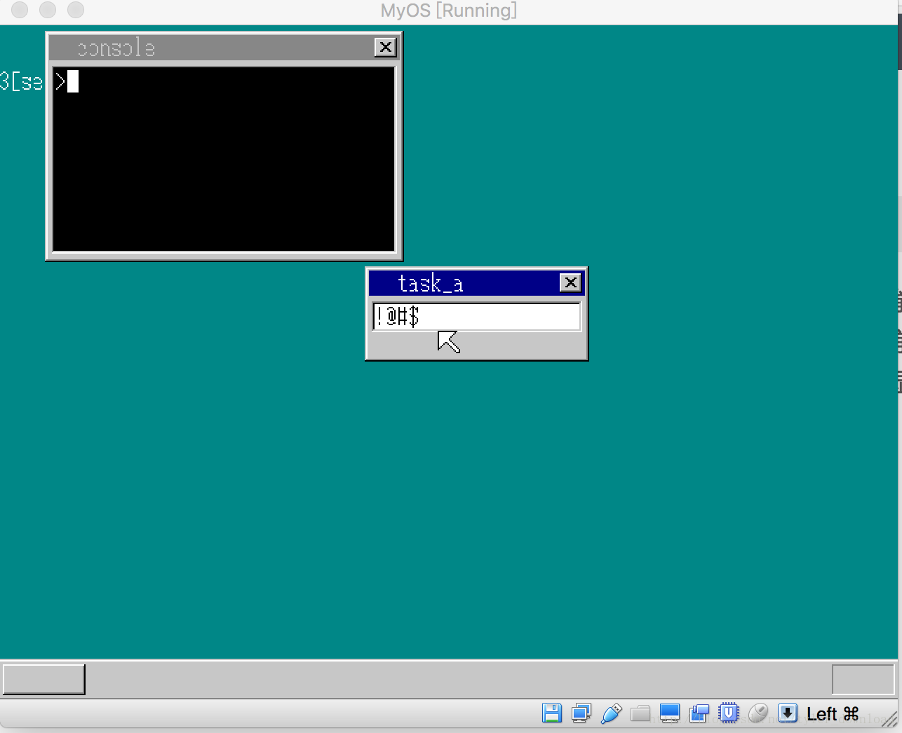

## 实现shift按键效果


前几节，我们花费不少精力在键盘响应的处理之上，到目前为止，我们的内核能够准确的将按键字符合理的显示在指定窗口上。但目前还有一些遗憾，就是当前内核对shift 键的按下不做反应。按理，当shift键按下后，再按数字键1，那么显示的字符应该是”!”而不是“1”，本节我们要处理的就是响应shift键的点击处理，完成本节后，内核效果如下：




我们可以看到，当按下shift键后，再点击数字键1，2，3,显示的不再是数字字符，而是对应的特殊字符.我们看看对应代码的实现，首先需要修改的是write_vga_desktop.c:

```
static char keytable1[0x80] = {
        0,   0,   '!', '@', '#', '$', '%','^', '&', '*', '(', ')', '-', '=', '~', 0,   0,
        'Q', 'W', 'E', 'R', 'T', 'Y', 'U', 'I', 'O', 'P', '`', '{', 0,   0,   'A', 'S',
        'D', 'F', 'G', 'H', 'J', 'K', 'L', '+', '*', 0,   0,   '}', 'Z', 'X', 'C', 'V',
        'B', 'N', 'M', '<', '>', '?', 0,   '*', 0,   ' ', 0,   0,   0,   0,   0,   0,
        0,   0,   0,   0,   0,   0,   0,   '7', '8', '9', '-', '4', '5', '6', '+', '1',
        '2', '3', '0', '.', 0,   0,   0,   0,   0,   0,   0,   0,   0,   0,   0,   0,
        0,   0,   0,   0,   0,   0,   0,   0,   0,   0,   0,   0,   0,   0,   0,   0,
        0,   0,   0,   '_', 0,   0,   0,   0,   0,   0,   0,   0,   0,   '|', 0,   0
    };

int  key_shift = 0;
```

首先我们增加了一个输入表keytable1,已经一个变量key_shift, 当shift键被按下时这个变量的值变为非0，当shift键松开后，该变量的值恢复为0.对应的当shift键按下时，显示键盘字符时使用keytable1表，如果shift键没有被按下，那么使用keytable表。

```
char  transferScanCode(int data) {
    if (data == 0x2a)  {//left shift key down
        key_shift |= 1;
    }

    if (data == 0x36) {
        //right shift key down 
        key_shift |= 2; 
    }

    if (data == 0xaa) {
        //left shift key up
        key_shift &= ~1;
    }

    if (data == 0xb6) {
       //right shift key up
        key_shift &= ~2;
    }

    if (data == 0x2a || data == 0x36 || data == 0xaa || data == 0xb6 || 
        data >= 0x54) {
        return 0;
    }

    char c = 0;

    if (key_shift == 0 && data<0x54 && keytable[data] != 0) {
        c = keytable[data];
    } 
    else if (key_shift != 0 && data < 0x80 && keytable1[data] != 0){
        c = keytable1[data];
    }
    else {
        c = 0;
    }

    return c;
}

```

上面的函数用于处理按键产生的扫描码和断码，当左边的shift键按下时，键盘发出的扫描码是0x2a, 右边的shift键按下时，键盘的扫描码是0x36,当左边的shift按键松开时，键盘发送的断码是0xaa,右边的shift键放开后，键盘发送的断码是0xb6. 一旦左边的shift键按下时，key_shift的值设置为1，右边shift键按下时，key_shift的值为2。当shift按键松开后，key_shift的值变为0.

从代码中也可以看到，如果key_shift的值不等于0，也就是shift键被按下，那么我们到keytable1里面去查找按键对应的字符，如果key_shift值是0，也就是shift键没有被按下，那么我们到 keytable表中去查找按键对应的字符。我们再看看字符是如何显示出来的：

```
void CMain(void) {
....
    for(;;) {
    ....
    else if (key_to == 0) {
               if (transferScanCode(data) != 0 && cursor_x < 144) {
                   boxfill8(shtMsgBox->buf, shtMsgBox->bxsize, COL8_FFFFFF,cursor_x,
                   28, cursor_x + 7, 43);
                   sheet_refresh(shtctl, shtMsgBox, cursor_x, 28, cursor_x+8, 44);
                   char c = transferScanCode(data);
                   char buf[2] = {c, 0};
                   showString(shtctl,  shtMsgBox, cursor_x, 28, COL8_000000, buf);
                   cursor_x += 8;

                   stop_task_A = 1;

                   boxfill8(shtMsgBox->buf, shtMsgBox->bxsize, cursor_c, cursor_x,
                  28, cursor_x + 7, 43);
                  sheet_refresh(shtctl, shtMsgBox, cursor_x, 28, cursor_x+8, 44);
              } 
    }
....
}

void console_task(struct SHEET *sheet) {
....
    for(;;) {
    ....
    else {
                           if (cursor_x < 240  && transferScanCode(i) != 0) {
                           boxfill8(sheet->buf, sheet->bxsize, COL8_000000, cursor_x,
                28, cursor_x + 7, 43);
                           sheet_refresh(shtctl, sheet, cursor_x, 28, cursor_x+8, 44);

                           s[0] = transferScanCode(i);
                           s[1] = 0;
                           showString(shtctl, sheet, cursor_x, 28, COL8_FFFFFF, s);
                           cursor_x += 8;
                       }
       ....
    }
}
```

从上面的代码我们可以看到，无论是控制台窗口还是文本框窗口，在显示字符前，都先调用transferScanCode函数去将键盘发过来的数值进行转换，如果转换的结果不是0，那么将得到的字符显示到窗口中。完成上面代码后，即可得本文开头所描述的运行结果。