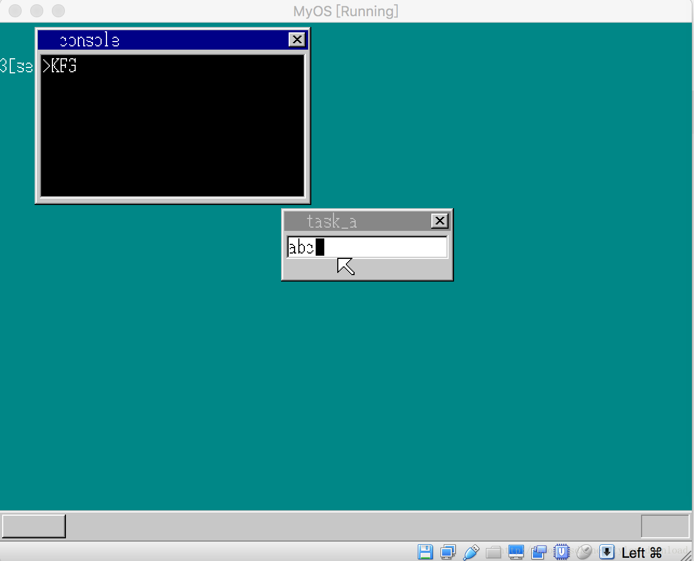

## caps 按键处理


上一节，我们成功实现了对shift按键的处理，这一节，我们看看如何处理caps 按键，当该键按下时，输入系统的字符在大小写间切换。由于我们系统启动后，默认输入是大写字符，完成本节后，我们把系统的默认字符改成小写，按下caps键，系统字符自动切换成大写。

我们先看看完成后的运行结果，启动系统后,输入焦点在文本框中，没有按下caps键时，输入的字符如下：


然后点击tab键，将输入焦点切换到命令行控制台，然后再次点击cpas键，这时输入字符会切换成大写：



当caps键按下时，键盘给系统发过来的扫描码是0x3a, 当该键弹起后，键盘发送过来的断码为0xba, 因此，相应caps按键事件，只要针对这键盘中断发送过来的这两个数值进行对应处理就可。

当前我们键盘事件的分发逻辑是这样的，每次有按键事件产生时，运行CMain的主进程会被激活，该进程会从键盘数据队列中取出按键的扫描码或断码，然后判断，如果当前输入焦点在文本输入框，那么将按键的对应字符显示在文本框内。

如果输入焦点是命令行控制台，那么主进程会把键盘扫描码放入到控制台进程的输入队列，然后挂起自己，把cpu的控制权交给控制台进程。

实际上，并非所有按键的扫描码都需要全部传给控制台进程，对于一些特殊按键，例如shift, caps 等，这些按键主进程自己处理就可以了，不必要传给命令行控制台进程，所有我们添加一个判断按键是否是特殊按键的函数：

```
int isSpecialKey(int data) {
    transferScanCode(data);

    if (data == 0x3a || data == 0xba || data == 0x2a || data == 0x36
       || data == 0xaa || data == 0xb6) {
        return 1;
    }

    return 0;
}
```

当键盘发送过来的数值对应于shift按键的扫描码或断码时(0x2a, 0x36, 0xaa, 0xb6)，或者是caps按键的扫描码或断码(0x3a, 0xa), 那么该函数返回1。

原来我们按键数据的分发存有问题，当按键按下后，键盘中断会被调用，键盘中断会把按键的扫描码发送到键盘数据缓存队列中，一旦键盘数据队列有数据进来后，它会激活主进程。主进程从数据中拿到键盘数据，然后判断当前输入焦点是否在其他进程的窗口，如果输入焦点在命令行控制台的话，主进程会把从队列中获得的键盘数据转发到命令行窗口的进程队列中，然后把自己挂起。

问题在于，按键会产生两个数据，一个是按下时发出的扫描码，另一个是按键弹起后发出的断码。所以处理一次按键事件时，必须同时处理扫描码和断码。但上面的机制导致，一旦按键按下后，主进程只把扫描码发送给目标进程就挂起了，断码没有发送，必须等到下次按键发生后，才能把上次按键的断码发送给目标进程，因而容易引起目标进程对键盘数据的解读错误。

如果大家尝试运行系统，把输入焦点切换到命令行，然后点击caps键，接着再点击其他按键，你就会发现字符无法正确的显示出来，这个现象就是上面所描述的问题导致的。

接下来，我们把所有按键的相应处理集中到一个函数中：

```
char  transferScanCode(int data) {
    if (data == 0x2a)  {//left shift key down
        key_shift |= 1;
    }

    if (data == 0x36) {
        //right shift key down 
        key_shift |= 2; 
    }

    if (data == 0xaa) {
        //left shift key up
        key_shift &= ~1;
    }

    if (data == 0xb6) {
       //right shift key up
        key_shift &= ~2;
    }

    //caps lock
    if (data == 0x3a) {
        if (caps_lock == 0) {
            caps_lock = 1;
        } else {
            caps_lock = 0;
        }
    }

    if (data == 0x2a || data == 0x36 || data == 0xaa || data == 0xb6 || 
        data >= 0x54 || data == 0x3a ) {
        return 0;
    }

    char c = 0;

    if (key_shift == 0 && data<0x54 && keytable[data] != 0) {
        c = keytable[data];
        if ('A' <= c && c <= 'Z' && caps_lock == 0) {
            c += 0x20;
        }

    } 
    else if (key_shift != 0 && data < 0x80 && keytable1[data] != 0){
        c = keytable1[data];
    }
    else  {
        c = 0;
    }

    return c;
}
```

如果caps键没有按下过，那么我们先把字符转换成小写然后在返还给窗口进程，如果按下过，那么直接把大写返回给窗口进程。因此窗口在显示字符前，直接调用该函数即可：

```
void CMain(void) {
    ...
    for(;;) {
    ....
    else if (key_to == 0) {
               if (transferScanCode(data) != 0 && cursor_x < 144) {
                   boxfill8(shtMsgBox->buf, shtMsgBox->bxsize, COL8_FFFFFF,cursor_x,
                   28, cursor_x + 7, 43);
                   sheet_refresh(shtctl, shtMsgBox, cursor_x, 28, cursor_x+8, 44);
                   char c = transferScanCode(data);
                   char buf[2] = {c, 0};
                   showString(shtctl,  shtMsgBox, cursor_x, 28, COL8_000000, buf);
                   cursor_x += 8;

                   stop_task_A = 1;

                   boxfill8(shtMsgBox->buf, shtMsgBox->bxsize, cursor_c, cursor_x,
                  28, cursor_x + 7, 43);
                  sheet_refresh(shtctl, shtMsgBox, cursor_x, 28, cursor_x+8, 44);
              } 
           } else if (isSpecialKey(data) == 0)  {

                 fifo8_put(&task_cons->fifo, data);
                 if (fifo8_status(&keyinfo) == 0) {             
                     task_sleep(task_a);
                 }
           }

       }
    ....
    }
    ...
}
```

上面代码的逻辑是，主进程获得键盘数据后，判断当前输入角度窗口，如果输入窗口是命令行控制台，那么判断当前按键是否是特殊字符，如果是，那么就没必要分发，如果不是，那么把队列中按键的所以数据，也就是扫描码和断码都分发给目标窗口的进程后，再把自己挂起。这么做，我们就能预防前面说过的问题。

命令行控制台窗口的字符显示，也需要调用transferScanCode来获取要显示的字符，代码修改如下：

```
void console_task(struct SHEET *sheet) {
....
    for(;;) {
    ....
    else {
             char c = transferScanCode(i);
             if (cursor_x < 240 && c!=0 ) {
                 boxfill8(sheet->buf, sheet->bxsize, 
                           COL8_000000, cursor_x,
                           28, cursor_x + 7, 43);
                 sheet_refresh(shtctl, sheet, cursor_x, 28, 
                 cursor_x+8, 44);

                 char s[2] = {c, 0};
                 showString(shtctl, sheet, cursor_x, 28, 
                 COL8_FFFFFF, s);
                 cursor_x += 8;
        }
    ....
    }
....
}
```

将上面的代码编译后，系统就可以切换大小写了。如果大家运行上面代码，点击caps键后，大小写确实能正常切换，但有个问题是，caps键点击后，它旁边的指示灯没有亮，如果要点亮指示灯，系统需要向键盘端口写入数据，要做到这点，又需要不少代码量，为了尽量降低代码的复杂性，我没有实现这点，有兴趣的同学可以自己尝试下。
