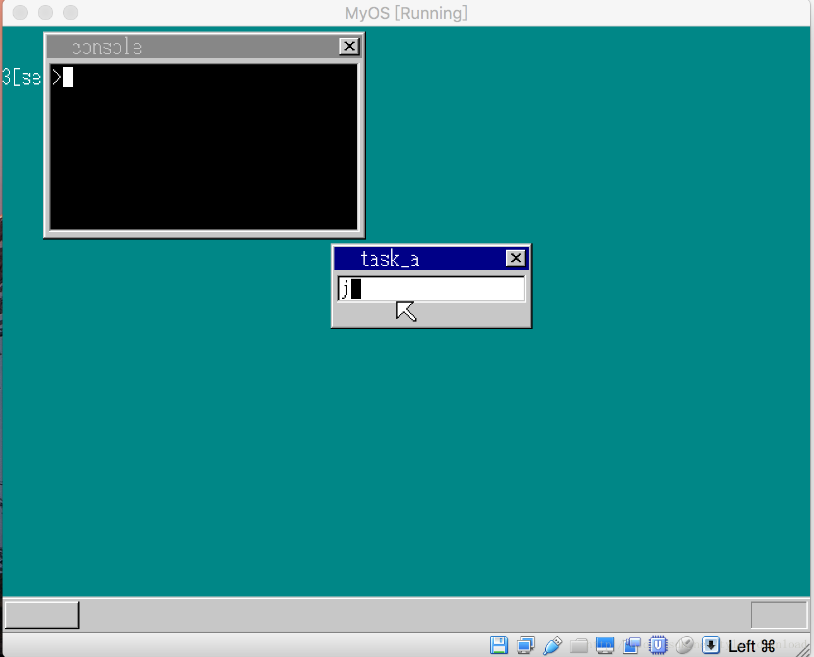
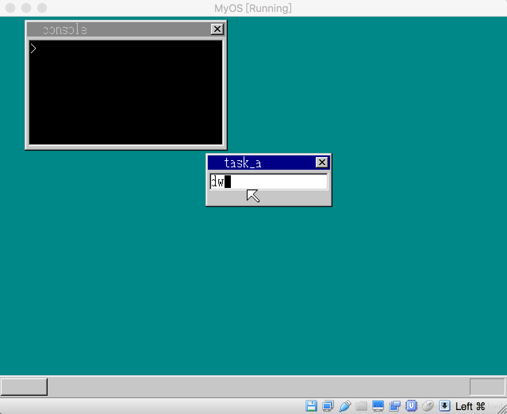

## 进程间的消息通讯


我们顺利的完成了进程间的相互切换，但当前存有的一个问题是，如果我们把输入焦点转移到命令行控制台，然后在通过Tab键，把输入焦点切换回文本框，此时存在一个问题是，命令行控制台的输入指针居然还存在：




出现这种情况的原因是，我们的进程切换实在过于简单除暴，当我们把输入焦点从命令行控制台切换到文本框时，系统强行终止命令行控制台所在进程的运行，并不给它一点反应时间，就如同曾一个人不注意时，将一把刀插入他的心脏，对方连呜呼一声都来不及发出就挂掉了。

由于控制台的光标转换成白色时，它所在的进程突然被挂起，这样的话，控制台的进程来不及对光标进行处理，因此我们就看到即使命令行控制台不处于运行状态，但白色光标仍然挂在窗口上。

真正恰当的做法是，在终止控制台进程前，先通知它，告诉它即将被挂起，然后控制台进程有充分的时间对即将到来的挂起做好准备。在挂起前，控制台可以将窗口上的光标擦除，这样就可以解决上面提到的问题了。

这就涉及到了进程间的通讯，一个进程将信号发送给另一个进程，让对方及时采取某些动作。由于我们在设计时，为每个进程准备了一个接收信息的队列，因此进程间相互发送消息是，可以把消息放入到接收方的队列中，当接收方从队列中获取数据时，就能收到其他进程发送过来的信息，进而及时处理。

我们先定义两个消息，一个消息对应进程终止，一个消息对应进程恢复，这两个消息定义在multi_task.h中，代码如下：

```
#define  PROC_RESUME   0x57
#define  PROC_PAUSE    0x58

void send_message(struct TASK *sender, struct TASK *receiver, int msg);

```

上面代码还定义了进程间发送消息的函数send_message, 第一个输入参数是发送消息的进程对象，第二个参数是接收消息的进程对象，第三个参数是要发送的消息。

在主进程中，当接收到Tab键时，如果是输入焦点是切换到控制台进程，那么主进程就通过send_message给对方进程发送一个PROC_RESUME消息，告诉对方获得了执行权限，如果输入焦点是从控制台进程切换回主进程，那么主进程就给对方发送PROC_PAUSE消息，让对方赶紧为挂起做准备，代码如下：
write_vga_desktop.c

```
void CMain(void) {
....
    for(;;) {
    ....
        if (fifo8_status(&keyinfo) + fifo8_status(&mouseinfo) +
           fifo8_status(&timerinfo) == 0) {
            ....
            else if (data == 0x0f) {
               int msg = -1;

               if (key_to == 0) {
                   key_to = 1;
                   make_wtitle8(shtctl, shtMsgBox,"task_a", 0);
                   make_wtitle8(shtctl, sht_cons, "console", 1);
                   set_cursor(shtctl, shtMsgBox, cursor_x, COL8_FFFFFF);  
                   msg = PROC_RESUME;
               } else {
                   key_to = 0;
                   make_wtitle8(shtctl, shtMsgBox,  "task_a",1);
                   make_wtitle8(shtctl, sht_cons, "console", 0);
                   fifo8_put(&task_cons->fifo, 0x58);
                   msg = PROC_PAUSE;
               }              

              sheet_refresh(shtctl, shtMsgBox, 0, 0, shtMsgBox->bxsize, 21);
              sheet_refresh(shtctl, sht_cons, 0, 0, sht_cons->bxsize, 21);
              send_message(task_a, task_cons, msg);
           }
            ....
        }
    ....
    }
....
}
```

我们再看看send_message的实现，它的逻辑其实很简单，它首先把消息放入到接收进程的数据队列中，一旦进程的数据队列有数据输入时，对应的进程就会被唤起，然后发送进程把自己挂起，将CPU权限转移给接收进程，代码如下：
multi_task.c

```
void send_message(struct TASK *sender, struct TASK *receiver, int msg) {
    fifo8_put(&receiver->fifo, msg);
    task_sleep(sender);
}
```

一旦进程接收到消息后，它会在它的主循环中把消息取出，根据不同消息采取不同操作，例如对应控制台进程，如果接收到挂起消息，那么它应该把光标从窗口上抹掉，然后把控制器重新交还给主进程，如果接收到的是进程恢复消息，那么它可以重新绘制光标，并启动光标计时器，进而实现光标的重新闪动，代码如下：
write_vga_desktop.c:

```
void console_task(struct SHEET *sheet) {
....
    for(;;) {
    ....
        else {
            io_sti();
            i = fifo8_get(&task->fifo);
            if (i <= 1 && cursor_c >= 0) {
                if (i != 0) {
                    timer_init(timer, &task->fifo, 0);
                    cursor_c = COL8_FFFFFF;
                } else {
                    timer_init(timer, &task->fifo, 1);
                    cursor_c = COL8_000000;
                }

                timer_settime(timer, 50);
            }  
            else if (i == PROC_RESUME) {
                cursor_c = COL8_FFFFFF;
                timer_init(timer, &task->fifo, 0);
                timer_settime(timer, 50);
            }
            else if (i == PROC_PAUSE) {
                set_cursor(shtctl, sheet, cursor_x, COL8_000000);
                cursor_c = -1;
                task_run(task_main, -1, 0);
            }
            else if (i == 0x0e && cursor_x > 8) {
                    set_cursor(shtctl, sheet, cursor_x,COL8_000000);
                    cursor_x -= 8;
                    set_cursor(shtctl, sheet, cursor_x, COL8_000000); 
                } 
            else {
                       char c = transferScanCode(i);
                       if (cursor_x < 240 && c!=0 ) {
                           set_cursor(shtctl, sheet, cursor_x, COL8_000000);
                           char s[2] = {c, 0};
                           showString(shtctl, sheet, cursor_x, 28, COL8_FFFFFF, s);
                           cursor_x += 8;
                       }
                }

            if (cursor_c >= 0) {
                 set_cursor(shtctl, sheet, cursor_x, cursor_c);
            } 
    ....
    }
....
}
```

当控制台进程接收到挂起消息是，它调用set_cursor函数把光标绘制成黑色（COL8_000000), 因为控制台窗口的背景是黑色的，把光标设置成黑色，那么就等同与把光标从窗口上抹去了，然后启动主进程，这样就能把CPU控制器交还给主进程。

如果接收到的是进程恢复消息，那么它先用白色去绘制光标，先让光标出现在窗口上，然后启动光标定时器，当定时器触发时，光标闪动的效果就出现了。当上面代码修改后，效果如下，我们可以看到，一旦输入焦点从控制台切换回主进程后，控制台上的光标就会消失了：
