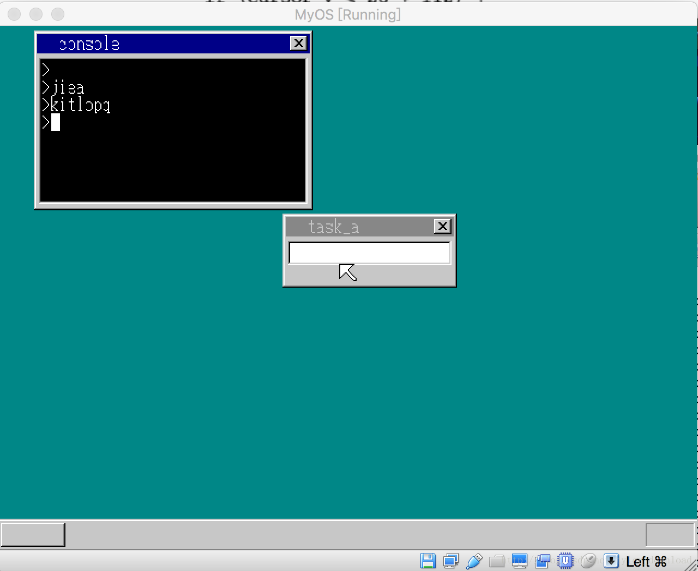

## 实现回车键的处理


在为我们的系统开发应用程序前，还需要完成最后一点扫尾工作，那就是处理回车键。要启动应用程序，一种常用办法是，在命令行控制台中，键入要运行的程序名字，点击回车，然后系统把应用程序加载起来，因此，响应回车键按下消息是系统必不可少的功能。

本节代码完成后，我们的系统运行效果如下：




当我们把输入焦点转移到控制台，然后按下回车，控制台会启动新的一行，此时如果点击字母按钮，那么字母会出现在新起的一行，同时光标会在新启的一行闪烁。

系统能够响应回车键的话，我们就可以实现从控制台启动应用程序，我们先看看本节的实现代码，主要实现都在write_vga_desktop.c中：

```
#define KEY_RETURN  0x1C

void console_task(struct SHEET *sheet) {

    struct TIMER *timer;
    struct TASK *task = task_now();
    int i, fifobuf[128], cursor_x = 16, cursor_c = COL8_000000;
    int cursor_y = 28;

    ....

    for(;;) {
        ....
        else if (i == KEY_RETURN) {

                if (cursor_y < 28 + 112) {
                    set_cursor(shtctl, sheet, cursor_x, cursor_y, COL8_000000);
                    cursor_y += 16;
                    cursor_x = 16;
                    showString(shtctl, sheet, 8, cursor_y, COL8_FFFFFF, ">");
                }
            }
            else if (i == 0x0e && cursor_x > 8) {
                    set_cursor(shtctl, sheet, cursor_x, cursor_y, COL8_000000);
                    cursor_x -= 8;
                    set_cursor(shtctl, sheet, cursor_x, cursor_y, COL8_000000); 
                } 
            else {
                       char c = transferScanCode(i);
                       if (cursor_x < 240 && c!=0 ) {
                           set_cursor(shtctl, sheet, cursor_x, cursor_y,COL8_000000);
                           char s[2] = {c, 0};
                           showString(shtctl, sheet, cursor_x, cursor_y, COL8_FFFFFF, s);
                           cursor_x += 8;
                       }
                }

            if (cursor_c >= 0) {
                 set_cursor(shtctl, sheet, cursor_x, cursor_y, cursor_c);
            } 
      ....
    }

}


void  set_cursor(struct SHTCTL *shtctl, struct SHEET *sheet, int cursor_x, int cursor_y ,int cursor_c) {
    boxfill8(sheet->buf, sheet->bxsize, cursor_c, cursor_x,
               cursor_y, cursor_x + 7, cursor_y + 15);
    sheet_refresh(shtctl, sheet, cursor_x, cursor_y, cursor_x+8, cursor_y + 46);
}

```

我们对代码做的改动有，先定义回车键扫描码的数值0x1C, 当回车键按下后，主进程会把扫描码发送给控制台进程的主函数，在控制台进程主函数中，一旦接受到回车键消息时，把cursor_y的值加上16，也就是一个字符的高度，cursor_y将作为新的显示纵坐标，我们原来显示字符时，纵坐标都是写死的，为28，现在我们把纵坐标改为可变动的情况，一旦受到回车键，系统便知道需要在新的一行显示信息，于是我们让控制台进程在窗口中另起一行，也就是将输入坐标向下移动16个字符的距离，然后无论是字符还是光标，他们的显示都在新坐标下进行。

set_cursor用来绘制光标，原先光标的纵坐标是定死为28的，现在我们把纵坐标当做一个参数来处理，每次窗口想要绘制光标时，需要把光标所在的纵坐标传入。有了上面代码后，我们每次在命令行窗口中点击回车键时，命令行窗口会新起一行，字符和光标都会在新一行中显示。
