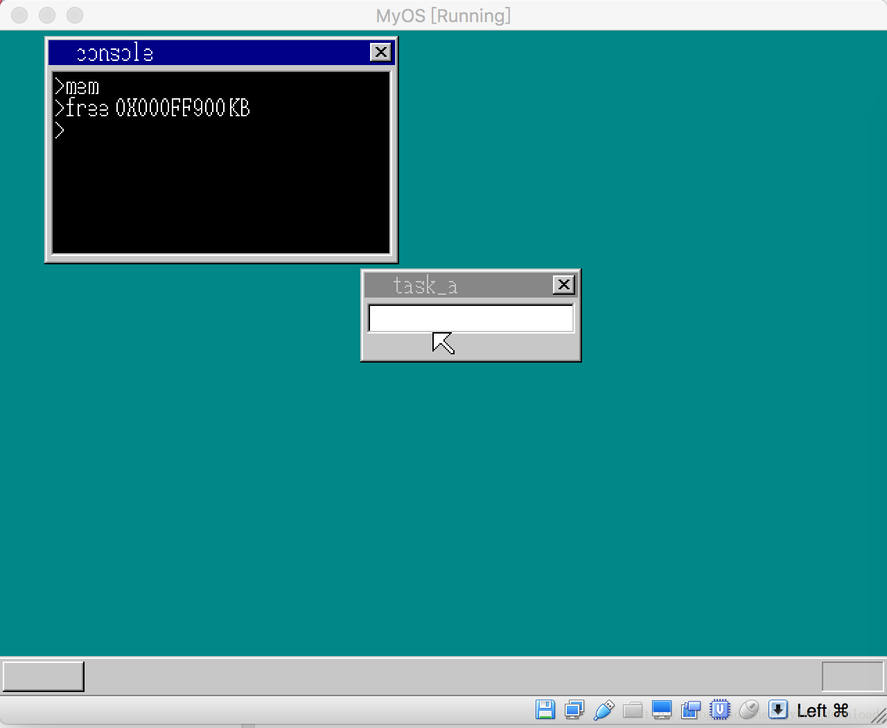
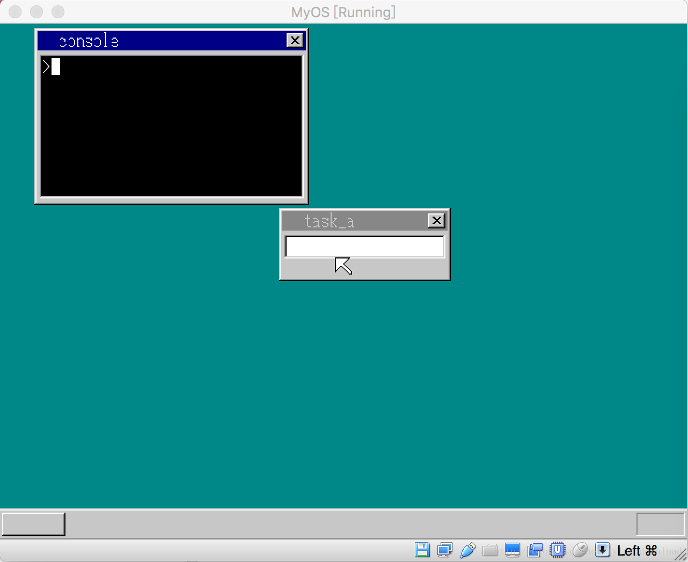

## cls 屏幕清空命令的实现


上节，我们实现了控制台命令mem, 它能显示当前可用内存，本节我们实现另一常用命令叫cls, 该命令的作用是把控制台所以字符全部清空，例如假设当前控制台显示的信息如下：




此时，我们在控制台中输入命令”cls”, 运行后控制台上所有信息将会被清除：



在实现该命令前，我们先实现一个辅助函数，当前，我们判断控制台上输入的字符是否是一个合法命令，使用的是逐个字符匹配，例如判断是否输入了命令, “mem”, 我们原来的做法是：

```
if (cmdline[0] == 'm' && cmdline[1] == 'e' && cmdline[2] == 'm'
&& cmdline[3] == 0)
```

这种做法很不灵活，如果命令字符串含有多个字母，那么怎个if语句就得写得很长，这样的代码是很难维护的，所以，我们要实现一个函数strcmp, 它比较两个
字符串内容是否一样，一样的话返回1，不一样返回0，代码如下：

```
int strcmp(char *src, char *dest) {
    if (src == 0 || dest == 0) {
        return 0;
    }

    int i = 0;
    while (src[i] != 0 && dest[i] != 0) {
        if (src[i] != dest[i]) {
            return 0;
        }

        i++;
    }

    if (src[i] == 0 && dest[i] != 0) {
        return 0;
    }

    if (src[i] != 0 && dest[i] != 0) {
       return 0; 
    }

    return 1;
}

```

有了比较函数后，以后我们用来判断输入字符串是否是合法命令就方便多了。接下来我们要实现cls 命令，该命令的实现很简单，只要把控制台显示区域的所有像素点全部设置成黑色就可以了，代码如下：

```
void console_task(struct SHEET *sheet, int memtotal) {

    struct TIMER *timer;
    struct TASK *task = task_now();
    int i, fifobuf[128], cursor_x = 16, cursor_c = COL8_000000;
    int cursor_y = 28;
    char  cmdline[30];
    int x = 0, y = 0;

    for(...) {
       ....
       else if (i == KEY_RETURN) {
                set_cursor(shtctl, sheet, cursor_x, cursor_y, COL8_000000);
                cmdline[cursor_x / 8 - 2] = 0;
                cursor_y = cons_newline(cursor_y, sheet); 
                if (strcmp(cmdline, "mem") == 1) {
                    char *s = intToHexStr(memtotal / (1024));
                    showString(shtctl,sheet,16,cursor_y,COL8_FFFFFF, "free ");
                    showString(shtctl,sheet,52,cursor_y, COL8_FFFFFF, s);
                    showString(shtctl, sheet, 126, cursor_y, COL8_FFFFFF, " KB");
                    cursor_y = cons_newline(cursor_y, sheet);
                } else if (strcmp(cmdline, "cls") == 1) {
                    for (y = 28; y < 28 + 128; y++)
                      for (x = 8; x < 8 + 240; x++) {
                          sheet->buf[x + y * sheet->bxsize] = COL8_000000;
                      }

                      sheet_refresh(shtctl, sheet, 8, 28, 8+240, 28+128);
                      cursor_y = 28;
                      showString(shtctl, sheet, 8, 28, COL8_FFFFFF, ">"); 
                }

                cursor_x = 16;
            }
       ....
    }
}
```

当控制台收到回车键按钮消息后，检测一下输入字符串是否是”cls”, 如果是的话，它变量控制台显示区域的每个像素，把像素颜色全部设置成黑色，同时把光标闪烁的位置设置为第一行，这样整个窗口清除的效果就产生了。