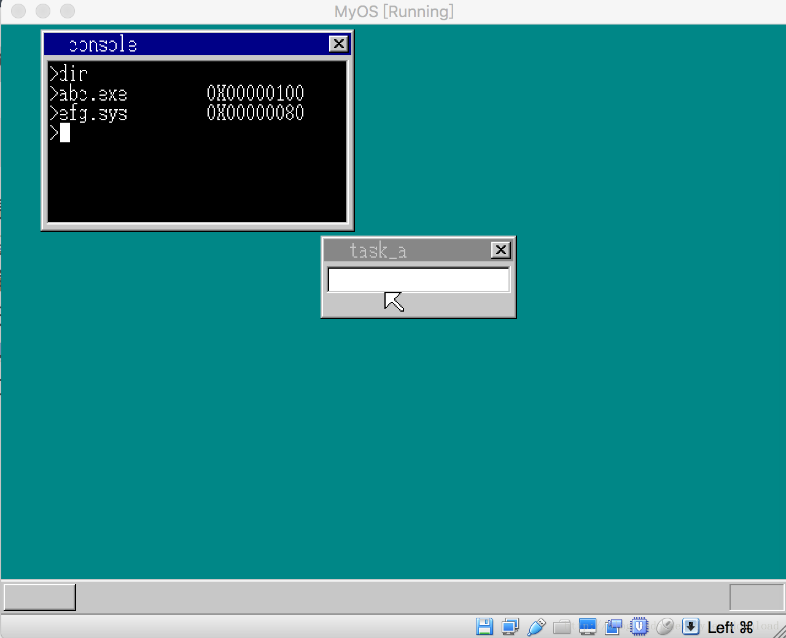
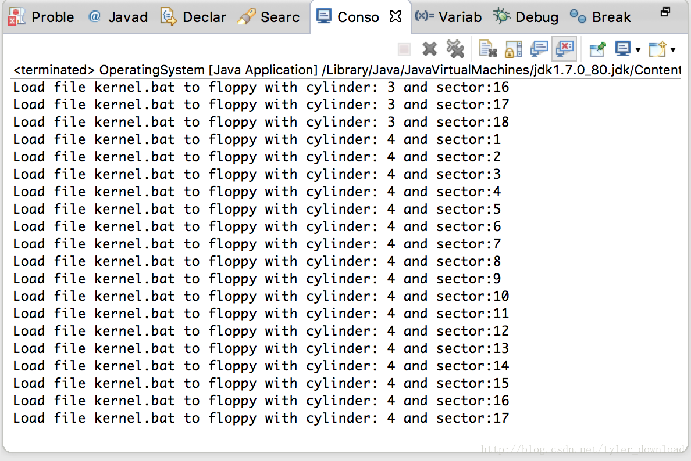

## 实现基于FAT12文件系统的dir命令


本节要实现的控制台命令是dir, 熟悉该命令的同学都了解，它的作用是列举出当前目录下的文件信息。问题在于，我们当前的操作系统根本没有硬盘，更没有文件系统，那么这个命令列举的文件从哪里来呢？由于我们的系统内核是存储在软盘上的，因此，我们直接把软盘当做系统硬盘，该命令列举的是存储在虚拟软盘上的文件。假设我们在虚拟软盘上存储了两个文件，分别为abc.exe, efg.sys,文件的大小分别为256字节和128字节，运行该命令后，控制台显示结果如下图：



我们先看看FAT12文件系统是如何记录文件信息的。每个存储在FAT12系统上的文件都有一个文件目录，用于存储文件的基本信息，这个目录的数据结构如下：

```
struct FILEINFO {
    unsigned char name[8], ext[3], type;
    char  reserve[10];
    unsigned short time, date, clustno;
    unsigned int  size;
};
```

这个结构体的头8个字节对应name,也就是文件名，也就是说存储的文件，它的名称绝不能对于8个字符。接下来三个字节对应的是文件扩展名，第12个字节，也就是type, 它对应的是文件的类型，它的值意义如下：
0x01 只读文件
0x02 隐藏文件
0x04 系统文件
0x08 非文件信息
0x10 目录。

接下来的10字节为保留，这是微软规定的。跟着的两个字节，首先是time 和 date 用于表示文件的生成时间，最后4个字节就是文件的大小。

当前，我们的虚拟软盘所存储的信息，其布局是这样的，最开始的512字节是引导扇区代码，接下来存储的就是系统内核，然后跟着是FAT12文件系统对应的文件目录，也就是上面描述的数据结构，存了几个文件，就有几个FILEINFO数据结构。由此先看看，我们当前的内核到底有多大，这样我们才能计算出文件目录在软盘中的位置，进而确定它加载到内存后，所对应的位置。

运行生成虚拟软盘的java工程，通过输出，我们可以看到，当前系统内核的大小总共是71个扇区，每个扇区大小是512字节，因此内核的总大小是71*512=0x8E00 字节。我们的内核加载到内存时，是从起始地址0x8000开始的，于是内核在内存中的末尾地址就是 0x10E00 = 0x8000 + 0x8E00, 由于我们把文件的目录信息直接跟在内核末尾的，因此文件目录信息的起始地址就是0x10E00.

接着我们看看，文件目录信息是如何写到虚拟磁盘上的：

```
import java.nio.ByteBuffer;


public class FileHeader {
    private byte[] header = new byte[32];

    public void setFileName(String s) {
        int len = s.length() > 8 ? 8 : s.length();
        for (int i = 0; i < len; i++) {
            header[i] = (byte)s.charAt(i);
        }
    }

    public void setFileExt(String s) {
        int len = s.length() > 3 ? 3 : s.length();
        for (int i = 0; i < len; i++) {
            header[8+i] = (byte)s.charAt(i);
        }
    }

    public void setFileType(Byte t) {
        header[11] = t;
    }

    public void setFileTime(byte[] time) {
        header[22] = time[0];
        header[23] = time[1];
    }

    public void setFileDate(byte[] date) {
        header[24] = date[0];
        header[25] = date[1];
    }

    public void setFileClusterNo(byte[] no) {
        header[26] = no[0];
        header[27] = no[1];
    }

    public void setFileSize(int size) {
        byte[] buf = ByteBuffer.allocate(4).putInt(size).array();
        for (int i = 0; i < 4; i++) {
            header[28+i] = buf[3 - i];
        }


    }

    public byte[] getHeaderBuffer() {
        return header;
    }


}

```

一个FileHeader 类用来表示一个文件目录，它对应前头提到的FILEINFO数据结构，它提供了几个接口，用来设置文件名，扩展名等相关信息。

```

public class DiskFileSystem {
    private Floppy floppyWriter;
    private int beginSec;
    private int fileHeaderCount = 0;
    private byte[] buffer = new byte[512];
    private int cylinder = 0;

    public DiskFileSystem(Floppy disk, int  cylinder, int sec) {
        this.floppyWriter = disk;
        this.beginSec = sec;
        this.cylinder = cylinder;
    }

    public void addHeader(FileHeader header) {
        if (fileHeaderCount >= 16) {
            flashFileHeaders();
            fileHeaderCount = 0;
            buffer = new byte[512];
            beginSec++;
        }

        byte[] headerBuf = header.getHeaderBuffer();
        for (int i = 0; i < 32; i++) {
            buffer[fileHeaderCount * 32 + i] = headerBuf[i];
        }

        fileHeaderCount++;
    }

    public void flashFileHeaders() {
        floppyWriter.writeFloppy(Floppy.MAGNETIC_HEAD.MAGNETIC_HEAD_0 , cylinder, beginSec, buffer);
    }
}

```

DiskFileSystem 用于把文件目录结构写入到磁盘的指定地方。该类的初始函数需要传入几个参数，disk 表示虚拟磁盘，cylinder 表示文件目录所要写入的柱面，sec 表示所在柱面的起始扇区。



上图表示的是内核写入到磁盘的情况，可以看到，内核最后写入到虚拟软盘的第4柱面，第17扇区。由于我们的文件目录紧跟着内核存储，因此，我们的文件目录要写入到第4柱面，第18扇区，于是我们在生成虚拟软盘时，在指定位置写下文件目录：

```
 public void makeFllopy()   {
        writeFileToFloppy("kernel.bat", false, 1, 1);

        //test file system

        DiskFileSystem fileSys = new DiskFileSystem(floppyDisk, 4, 18);
        FileHeader header = new FileHeader();
        header.setFileName("abc");
        header.setFileExt("exe");
        byte[] date = new byte[2];
        date[0] = 0x11;
        date[1] = 0x12;
        header.setFileTime(date);
        header.setFileDate(date);
        header.setFileSize(256);
        fileSys.addHeader(header);

        header = new FileHeader();
        header.setFileName("efg");
        header.setFileExt("sys");
        header.setFileSize(128);
        fileSys.addHeader(header);

        fileSys.flashFileHeaders();

        //test file system

        floppyDisk.makeFloppy("system.img");
    }
```

上面代码先创建了两个文件目录，这两个文件名分别为abc.exe 和 efg.sys, 这两个文件是虚拟的，我们只在磁盘上构造它们的目录，在磁盘上并没有这两个文件的实际数据。磁盘上有了文件目录后，我们要编写内核代码，让内核能够读取显示相关信息。

首先在global_define.h添加如下代码：

```
#define  ADR_DISKIMG  0x10E00

struct FILEINFO {
    unsigned char name[8], ext[3], type;
    char  reserve[10];
    unsigned short time, date, clustno;
    unsigned int  size;
};
```

其中ADR_DISKIMG 就是文件目录在内存中的起始地址，FILEINFO对应的就是我们前头提到过的FAT12文件系统对应的文件目录信息。当我们在控制台输入命令dir 后，控制台从指定位置，把FILEINFO结构数据读取出来，并把对应的文件名和文件大小显示出来，代码如下，在write_vga_desktop.c中：

```
void console_task(struct SHEET *sheet, int memtotal) {
....
struct FILEINFO* finfo = (struct FILEINFO*)(ADR_DISKIMG);

    for(;;) {
    ....
    else if (strcmp(cmdline, "dir") == 1) {
                       while (finfo->name[0] != 0) {

                       char s[13];
                       s[12] = 0;
                       int k;
                       for (k = 0; k < 8; k++) {
                           if (finfo->name[k] != 0) {
                               s[k] = finfo->name[k]; 
                           }else {
                               break;
                           }
                       }

                       int t = 0;
                       s[k] = '.';
                       k++;
                       for (t = 0; t < 3; t++) {
                           s[k] = finfo->ext[t];
                           k++;
                       }

                       showString(shtctl, sheet, 16, cursor_y, COL8_FFFFFF, s);
                       int offset = 16 + 8*15;
                       char* p = intToHexStr(finfo->size);
                       showString(shtctl, sheet, offset, cursor_y, COL8_FFFFFF, p);
                       cursor_y = cons_newline(cursor_y, sheet);
                       finfo++;

                      }
    ....
    }
....
}
```

当控制台收到dir命令时，它先从地址ADR_DISKIMG开始，读取第一个文件目录信息，如果文件名的起始第一个字符不是0，那么表明接下来的32字节表示有效的文件目录信息，于是代码先获取文件名，然后获取文件扩展名，最后得到文件大小，然后依次把这些信息显示到控制台上。接着越过32字节，再判断接下来的32个字节是否表示有效的文件目录信息，如果是，再按照原有逻辑，继续显示相关信息。

我们在虚拟软盘中写入了两个文件目录信息，因此运行该命令后，控制台正确显示了相关文件的目录信息。
