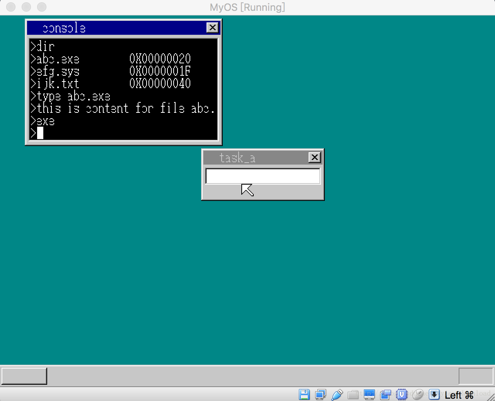

## 实现type命令读取文件内容

上一节，我们通过dir命令，能够列出存储在磁盘上的各个文件，当时我们只是把文件描述信息写入磁盘，但文件的内容并没有实际写入，本节，我们将在磁盘上写入文件的内容，同时实现type命令，通过type,我们可以把对应文件的内容在控制台上显示出来，完成本节代码后，系统运行结果如下：




type 命令后面跟着文件名，例如 type abc.exe 那么文件abc.exe中的内容就会被当成字符串显示在控制台中，根据图中显示，存储在文件abc.exe中的内容是：
“this is content for file abc.exe”

所以要完成type 命令，我们必须搞清楚两个问题，一是如何把文件内容写入磁盘，而是在系统中如何找到文件内容并读取。

从上一节我们知道，当前系统内核编译后，大小是71扇区，由于我们的内核会被复制到内存起始地址0x8000处，71扇区换算成字节就是0x8E00字节，于是内核的末尾处于 0x8000 + 0x8E00 也就是 0x10E00处，我们把文件的目录信息直接跟在内核的末尾，因此文件目录信息的起始地址就是0x1E000, 但这么做有风险，如果我们的内核大小超过71扇区，那么内核就会往下覆盖掉文件目录信息，因此我打算把在文件目录和内核间设置一个缓冲区，这个缓冲区的大小是一个柱面，也就是18扇区，由于内核占据了磁盘1到4这四个柱面，因此我们的文件目录信息就写入到磁盘的第6个柱面，这样的话，用于存储内核的磁盘大小是5个柱面，也就是 512*\18*5 = 0xB400字节，由于在内存中，内核拷贝到0x8000处，因此内核的末尾就在 0xB400 + 0x8000 = 0x13400 处，因此我们的文件目录就存储在内存地址为0x13400处。

我们用一个柱面大小来存储目录，一个柱面大小是 18 * 512 字节，一个文件目录的数据结构大小是 32 字节，因此我们总共可以存储的文件数为 (18 * 512)/32 = 288 个。

文件目录之后，我们就可以直接跟着文件内容了。注意，我们往磁盘写文件时，必须以一个扇区为基础，也就是，即使文件内容只有1字节，那么它也必须占据一个扇区。由于文件目录的起始地址是0x13400, 文件目录占据接下来的18扇区，也就是0x2400大小字节，因此文件内容的起始地址是 0x13400 + 0x2400 = 0x15800 。由此，当内核要读取文件内容时，需要从0x15800开始读取。

我们看看文件的目录结构：

```
struct FILEINFO {
    unsigned char name[8], ext[3], type;
    char  reserve[10];
    unsigned short time, date, clustno;
    unsigned int  size;
};
```

size 表示的是文件大小，clustno 表示的是文件的起始扇区好，假设clustno的值是2，那表示文件内容的起始地址距离文件存储区的起始地址是2个扇区。由于文件存储的起始地址是0x15800, 那么文件内容的起始地址就是 0x15800 + 0x400 (2 * 512) = 0x15C00 处。

于是，当我们从文件目录中读取clustno 就可以算出文件内容在内存中的起始地址，然后再读取size, 我们就可以知道文件的末尾地址。

我们先看看，文件内容是怎么写入虚拟软盘的：

```
import java.nio.ByteBuffer;


public class FileHeader {
    private byte[] header = new byte[32];

    private byte[] content = null;

    private int fileSize = 0;

    public void setFileName(String s) {
        int len = s.length() > 8 ? 8 : s.length();
        for (int i = 0; i < len; i++) {
            header[i] = (byte)s.charAt(i);
        }
    }

    public void setFileExt(String s) {
        int len = s.length() > 3 ? 3 : s.length();
        for (int i = 0; i < len; i++) {
            header[8+i] = (byte)s.charAt(i);
        }
    }

    public void setFileType(Byte t) {
        header[11] = t;
    }

    public void setFileTime(byte[] time) {
        header[22] = time[0];
        header[23] = time[1];
    }

    public void setFileDate(byte[] date) {
        header[24] = date[0];
        header[25] = date[1];
    }

    public void setFileClusterNo(byte[] no) {
        header[26] = no[0];
        header[27] = no[1];
    }

    public void setFileSize(int size) {
        byte[] buf = ByteBuffer.allocate(4).putInt(size).array();
        for (int i = 0; i < 4; i++) {
            header[28+i] = buf[3 - i];
        }

        fileSize = size;
    }

    public int getFileSize() {
        return fileSize;
    }

    public byte[] getHeaderBuffer() {
        return header;
    }

    public void setFileContent(byte[] f) {
        this.content = f;
        setFileSize(f.length);
    }

    public byte[] getFileBuffer() {
        return content;
    }
}

```

FileHeader 原来是用来存储文件目录信息的，现在我加了一个content，用来存储文件内容，setFileContent就是把文件对应的内容设置进来。在主入口函数，我们通过以下代码设置文件信息和内容：

```
public void makeFllopy()   {
        writeFileToFloppy("kernel.bat", false, 1, 1);

        //test file system
        //此处容易出错，一旦内核大小超过6柱面1扇区后，下面的代码将会产生问题
        DiskFileSystem fileSys = new DiskFileSystem(floppyDisk, 6, 1);
        FileHeader header = new FileHeader();
        header.setFileName("abc");
        header.setFileExt("exe");
        byte[] date = new byte[2];
        date[0] = 0x11;
        date[1] = 0x12;
        header.setFileTime(date);
        header.setFileDate(date);
        String s = "this is content for file abc.exe";
        header.setFileContent(s.getBytes());
        fileSys.addHeader(header);

        header = new FileHeader();
        header.setFileName("efg");
        header.setFileExt("sys");
        String s1 = "this is content in file efg.sys";
        header.setFileContent(s1.getBytes());
        fileSys.addHeader(header);

        header = new FileHeader();
        header.setFileName("ijk");
        header.setFileExt("txt");
        header.setFileSize(64);
        fileSys.addHeader(header);

        fileSys.flashFileHeaders();

        //test file system

        floppyDisk.makeFloppy("system.img");
    }
```

从上面代码可以看到，我们写入文件abc.exe 的内容是字符串：
String s = “this is content for file abc.exe”;

接下来我们看看怎么把文件目录和内容写入虚拟软盘：

```

public class DiskFileSystem {
    private Floppy floppyWriter;
    private int beginSec;
    private int fileHeaderCount = 0;
    private byte[] buffer = new byte[512];
    private int cylinder = 0;

    private short  fileClusterNo = 0;  
    private int  fileContentCylinder = 7;
    private int  fileContentSector = 1;

    private static int SECTOR_SIZE = 512;

    public DiskFileSystem(Floppy disk, int  cylinder, int sec) {
        this.floppyWriter = disk;
        this.beginSec = sec;
        this.cylinder = cylinder;
    }

    public void addHeader(FileHeader header) {
        if (fileHeaderCount >= 16) {
            flashFileHeaders();
            fileHeaderCount = 0;
            buffer = new byte[512];
            beginSec++;
        }

        flashFileContent(header);

        byte[] headerBuf = header.getHeaderBuffer();
        for (int i = 0; i < 32; i++) {
            buffer[fileHeaderCount * 32 + i] = headerBuf[i];
        }

        fileHeaderCount++;

    }

    public void flashFileHeaders() {
        floppyWriter.writeFloppy(Floppy.MAGNETIC_HEAD.MAGNETIC_HEAD_0 , cylinder, beginSec, buffer);
    }

    private void flashFileContent(FileHeader header) {
        short sectors = (short) (header.getFileSize() / SECTOR_SIZE + 1);

        byte[] s = new byte[2];
        s[1] = (byte)(fileClusterNo >>8 );
        s[0] = (byte)(fileClusterNo >> 0);
        header.setFileClusterNo(s);

        fileClusterNo += sectors;

        while (sectors > 0) {
            if (fileContentSector >= SECTOR_SIZE) {
                fileContentSector = 1;
                fileContentCylinder++;
            }

            if (header.getFileBuffer() != null) {
                floppyWriter.writeFloppy(Floppy.MAGNETIC_HEAD.MAGNETIC_HEAD_0, fileContentCylinder, fileContentSector, 
                        header.getFileBuffer());    
            }

            fileContentSector++;
            sectors--;
        }
    }
}

```

flashFileContent 是往磁盘中写入文件的内容，fileClusterNo对应着文件目录数据结构的clustno, 从这个值我们就可以算出文件的起始地址，写入磁盘的第一个文件，该值为0, 如果该文件大小为512, 也就是一个扇区，那么下一个文件对应的clustno 就是1, 如果第二个文件的大小也是512，也就是一个扇区，那么第三个文件的对应的clustno就是3，也就是说，在写入当前文件时，前面写入的文件总共占据了n个扇区，那么当前文件目录的clustno就等于n。该函数根据写入的文件扇区数，持续修改fileClusterNo变量，然后把该变量设置为当前文件目录结构的clustno值。然后调用writeFloppy函数把文件内容写入磁盘，由于writeFloppy一次写入512字节，如果文件内容大于512，那么我们需要调用writeFloppy多次写入。

当文件内容写入磁盘，并拷贝到内存后，我们的内核就可以读取显示了，我们看相关代码，write_vga_desktop.c:

```
void console_task(struct SHEET *sheet, int memtotal) {
...
for(;;) {
    ...
    else if (i == KEY_RETURN) {
    ....
    else if (cmdline[0] == 't' && cmdline[1] == 'y' &&
                             cmdline[2] == 'p' && cmdline[3] == 'e') {

                      char name[13];
                      name[12] = 0;
                      int p = 0;
                      for (x = 5; x < 17; x++) {
                          if (cmdline[x] != 0) {
                              name[p] = cmdline[x];
                              p++;
                          } else {
                              break;
                          }
                      }
                      name[p] = 0;


                      finfo = (struct FILEINFO*)(ADR_DISKIMG);
                      while (finfo->name[0] != 0) {
                          char s[13];
                          s[12] = 0;
                          int k;
                          for (k = 0; k < 8; k++) {
                              if (finfo->name[k] != 0) {
                                   s[k] = finfo->name[k];
                               }else {
                                   break;
                               }
                           }

                           int t = 0;
                           s[k] = '.';
                           k++;
                           for (t = 0; t < 3; t++) {
                               s[k] = finfo->ext[t];
                               k++;
                           }


                           if (strcmp(name, s) == 1) {
                               char *p =  FILE_CONTENT_HEAD_ADDR;
                               p += finfo->clustno *DISK_SECTOR_SIZE;
                               int sz = finfo->size;
                               char c[2];
                               int t = 0;
                               cursor_x = 16;
                               for (t = 0; t < sz; t++) {
                                   c[0] = p[t];
                                   c[1] = 0;
                                   showString(shtctl, sheet, cursor_x,
                                       cursor_y, COL8_FFFFFF, c);
                                   cursor_x += 8;
                                   if (cursor_x == 8 + 240) {
                                       cursor_x = 16;
                                       cursor_y = cons_newline(cursor_y, sheet);
                                   }
                               }
                               break;
                           }

                          finfo++;
                      }

                      cursor_y = cons_newline(cursor_y, sheet);  
                      cursor_x = 16;
                  }

    ....
    }
    ...
}
...
}
```

当控制台进程收到回车键后，判断当前输入的命令是不是”type” ，此处我们为什么不适用strcmp 比对字符串呢，这是因为type命令后面会跟着输入参数，所以不适合使用strcmp直接比较。

如果是type 的话，我们接下来获取type 后面跟着的文件名，拿到文件名后，我们遍历文件目录，找到跟给定文件名相同的目录，然后读取该目录的clustno,根据该值我们可以计算出文件内容在内存中的起始位置，根据size,我们可以得知文件的大小。FILE_CONTENT_HEAD_ADDR就是文件内存存储的起始地址，也就是0x15800。

找到起始地址后，我们把文件内容逐个字节读出，然后通过showString显示到控制台窗口里。

完成本节代码后，我们内核就拥有了读取文件信息的能力，那么将来我们可以把应用程序编译后存储在内核中，内核从磁盘上读取应用程序，然后再加载执行。本节内容稍微有点复杂，请参看视频以便获得更详实的讲解和代码演示。
