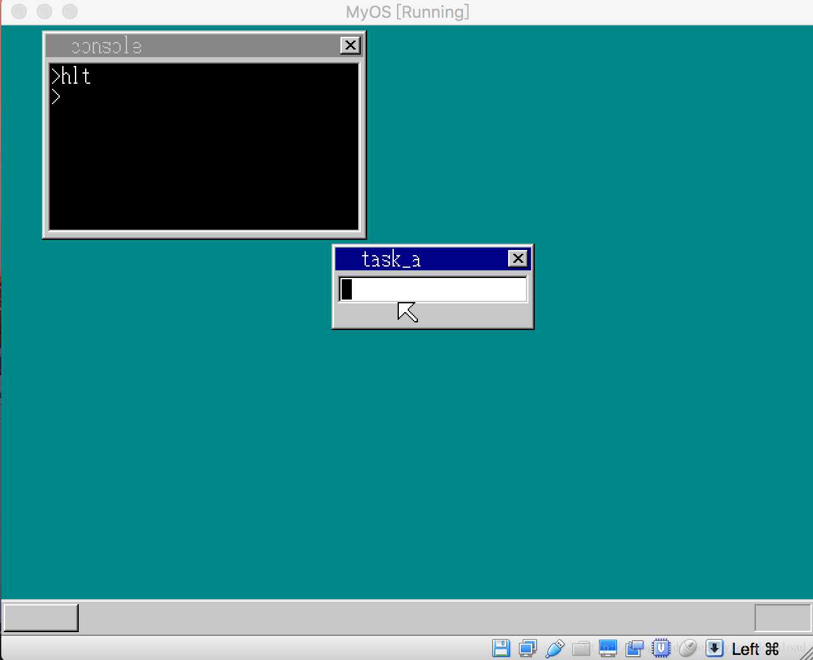
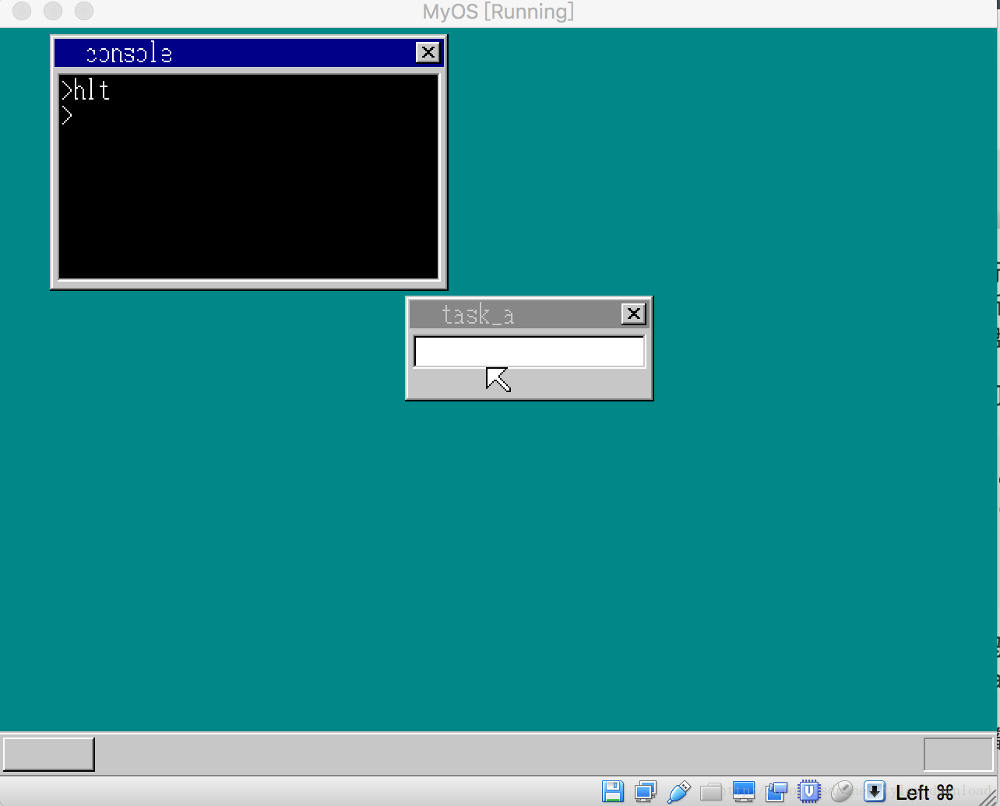

## 运行第一个应用程序

上一节，我们已经能够成功的通过type命令，将文件的内容打印到控制台上。能够读取文件内容是相当重要的一步，试想如果我把一个能运行在我们系统上的应用程序的二进制代码作为一个文件存储在磁盘上，当系统运行时，这些二进制代码能够被系统读取，当系统把这些二进制数据当做代码执行的话，那不意味着，我们的操作系统变成了一个平台，能够运行独立于它的应用程序了吗，我们本节的目的就是构建一个独立于系统内核的最简单的应用程序，然后让这个程序运行在我们的系统内核之上。

首先我们看看这个最简单的程序是怎样的，代码如下：

```
org 0
fin:
   jmp fin
```

上面三行汇编代码逻辑很简单，就是一个死循环， org 0 告诉编译器代码的加载地址是0，如果我们用系统的控制台进程运行这段程序的话，不难预见，控制台进程会被这个死循环程序给”锁死“，也就是运行后，控制台进程将不能再接收任何输入，进入死循环状态。

把上面的代码存成文件hlt.asm 然后使用nasm编译器编译成二进制代码，执行命令: nasm -o hlt.bat hlt.asm，本地目录下会生成二进制文件hlt.bat，查看该文件内容如下：
0xeb 0xfe 0x0a
也就是说，上面的汇编代码被编译成了三个字节，我们把这三个字节当做一个文件的内容，通过java程序写入磁盘，代码如下：

```
FileHeader header = new FileHeader();
        header.setFileName("abc");
        header.setFileExt("exe");
        byte[] date = new byte[2];
        date[0] = 0x11;
        date[1] = 0x12;
        header.setFileTime(date);
        header.setFileDate(date);
        String s = "abc.exe";
        int[] buf = new int[]{ 0xeb, 0xfe, 0x0a};
        byte[] bbuf = new byte[9];
        for (int i = 0; i < buf.length; i++) {
            bbuf[i] = (byte) (buf[i] & 0x0ff);
        }

        header.setFileContent(bbuf);
        fileSys.addHeader(header);
```

上面的代码，我们在上一节讲type命令的时候已经解释过了，这里我们把前面汇编代码编译后的二进制数据作为文件abc.exe的内容，写入到磁盘中，一旦系统内核加载后，这些数据会被拷贝到系统内存里面。

内存中的一段数据，既可以读取，也可以直接让CPU当做代码执行。上一节我们是把加载到内存的数据读取出来，这次，我们把这些数据当做代码来直接执行就可以了。要想实现该功能，我们只要找到这段数据在内存中的位置，然后使用一个段描述符指向这段内存，在描述符中，把这段内存设置成可执行代码段，接着让CPU加载这个段描述符，那么这段数据就会被当成代码给执行起来了。

在C语言实现的内核中，我们增加下面代码，用于加载指定文件的内容，在源代码文件golbal_define.h 中添加下面定义：

```
struct Buffer {
    unsigned char *pBuffer;
    int  length;
};
```

这个结构体中指针pBuffer 指向一块内存地址，这块内存存储着要执行的代码的二进制数据，length表示数据的长度。

在write_vga_desktop.c中添加下面代码：

```
void file_loadfile(char *name, struct Buffer *buffer) {
     struct FILEINFO *finfo = (struct FILEINFO*)(ADR_DISKIMG);
     char *s = memman_alloc(memman, 13);
     s[12] = 0;

     while (finfo->name[0] != 0) {
         int k;
         for (k = 0; k < 8; k++) {
             if (finfo->name[k] != 0) {
                 s[k] = finfo->name[k];
             }else {
                 break;
             }
         }

         int t = 0;
         s[k] = '.';
         k++;
         for (t = 0; t < 3; t++) {

             s[k] = finfo->ext[t];
             k++;
         }


         if (strcmp(name, s) == 1) {
             buffer->pBuffer = (char*)memman_alloc_4k(memman, finfo->size);
             buffer->length = finfo->size;
             char *p =  FILE_CONTENT_HEAD_ADDR;
             p += finfo->clustno * DISK_SECTOR_SIZE;
             int sz = finfo->size;
             int t = 0;
             for (t = 0; t < sz; t++) {
                 buffer->pBuffer[t] = p[t];
             }
             break;             
         }

         finfo++;

    }

    memman_free(memman, s, 13);
}
```

这个函数的逻辑，跟我们上一节讲解如何使用type命令输出文件内容时，如何根据文件名查找文件数据时所讲的算法步骤是一样的，只不过这里多做了一步，那就是找到文件对应的数据后，申请一块大小为4k的动态内存，把文件数据拷贝到内存中。

在console控制台进程的主函数中，我们增加一个命令叫hlt, 这个命令通过上面的函数读取abc.exe中的数据，然后使用一个全局段描述符指向存储这些数据的内存，同时把这块内存的属性设置为可执行代码段，接着让CPU加载这个描述符，进而就能让CPU把abc.exe文件中的数据当做代码执行了，具体实现代码如下：

```
void console_task(struct SHEET *sheet, int memtotal) {
.....
for(;;) {
    .....
    else if (strcmp(cmdline, "hlt") == 1) {
                      struct Buffer buffer;
                      file_loadfile("abc.exe", &buffer);

                      struct SEGMENT_DESCRIPTOR *gdt = 
                            (struct SEGMENT_DESCRIPTOR *)get_addr_gdt();
                      set_segmdesc(gdt+19, 0xfffff, buffer.pBuffer,
                            0x409a);
                      farjmp(0, 19*8);
                      memman_free_4k(memman, buffer.pBuffer, buffer.length);

                  }
    .....
}

.....
}
```

如果控制台进程接收到hlt 命令时，它调用函数file_loadfile把文件abc.exe中的数据加载到一块内存中，这块内存的起始地址对应的就是buffer.pBuffer,然后获得全局描述符表的起始地址，大家如果忘记了全局描述符表的知识，可以翻看早期课程，我们用第19个描述符来指向存储了abc.exe内容的内存，并通过set_segmdesc 函数把这块描述符的起始地址设置成buffer.pBuffer, 内存的长度设置成buffer.length, 这块内存的性质设置成可执行代码段，也就是最后一个参数0x409a所表示的意思，最后通过一个farjmp让cpu加载第19个描述符，由于描述符描述的是可执行代码段，因此cpu会跳转到描述符所指向的起始地址，将该地址起的数据当做代码来执行。

由于我们的”应用程序“执行的是死循环操作，因此控制台进程会被这个循环锁死，使得控制台不再接收键盘信息，代码运行后结果如下：


执行hlt命令后，如果再敲击键盘，控制台窗口将没有任何响应。控制台是被堵死了，但是硬件中断没有，所以如果此时点击tab键，那么输入焦点会从控制台转移到task_a窗口，此时点击键盘，键盘信息会显示到task_a窗口中。

我们把应用程序再改进一下，增添一条指令，cli, 也就是关中断：

```
org 0
cli
fin:
   jmp fin
```

代码编译后的二进制数据如下：
0xfa 0xeb 0xfe 0x0a

所增加的字节0xfa, 对应的就是指令CLI,上面的代码如果执行的话，那么所以硬件中断就会被关闭，于是尽管点击tab键，系统也不会有任何反应了:

