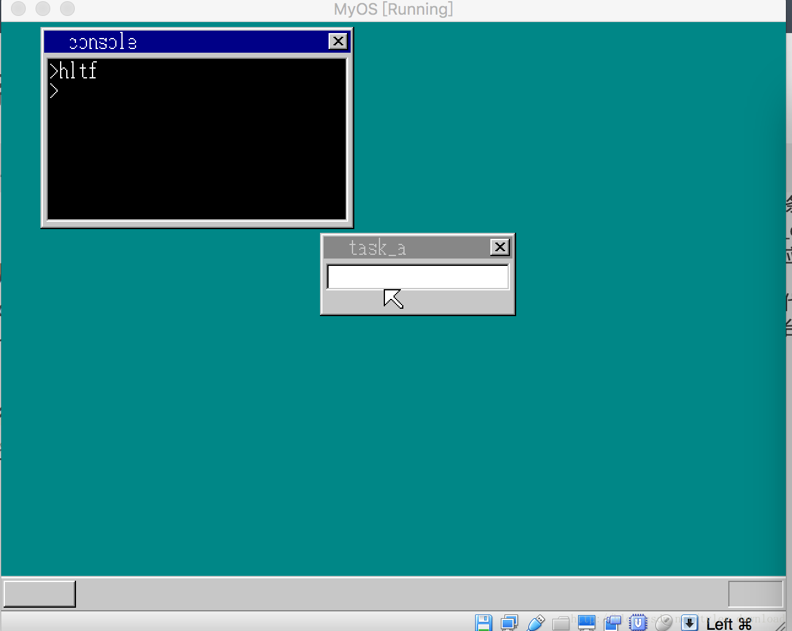

## 实现系统API调用


理解本节需要一些汇编语言知识，如果你汇编不熟，那么照着我的代码敲一遍，编译运行后看输出结果就可以了。

操作系统作为一个计算平台，最重要的功能是支持不同的程序在其之上运行。为此，作为系统，它需要提供一系列接口给应用程序调用，这些接口，我们称之为系统API.

本节的功能，就是从系统内核导出一个接口，最为API,让外部程序调用。我们导出的这个API的功能，是让外部程序能在控制台窗口上显示字符。我们现在内核编写这个接口的功能，然后再把接口开放出来。在内核的C语言部分添加如下代码(write_vga_desktop.c)：

```
struct CONSOLE {
    struct SHEET *sht;
    int cur_x, cur_y, cur_c;
    char s[2];
};

void cons_putchar(char c, char move) {
   set_cursor(shtctl, g_Console.sht, g_Console.cur_x, g_Console.cur_y, COL8_000000);\
   g_Console.s[0] = c;
   g_Console.s[1] = 0;    
   showString(shtctl, g_Console.sht, g_Console.cur_x, g_Console.cur_y, COL8_FFFFFF, g_Console.s);
   g_Console.cur_x += 8;

}
```

CONSOLE 结构体用来对应我们的控制台窗口，sht 对应的是控制台窗口的图层，cur_x, cur_y 表示当前字符所在坐标，cur_c表示当前光标颜色，s[2]用来存储当前在控制台上显示的最好一个字符。

cons_putchar 就是我们想要导出的API接口，它的接收两个参数，第一个是要显示的字符，第二个是光标要移动的次数。如果我们想在当前控制台窗口上显示一个字符’f’, 那么可以通过cons_putchar(‘f’, 1) 来实现。

有了接口后，要想该接口能被外部程序调用，我们需要实现一个机制，那就是获得外部程序调用该接口时传入的参数，同时该接口执行完毕后，要从内核返回调用程序，在内核的汇编代码部分，添加一下代码(kernel.asm)：

```
asm_cons_putchar:
        pop  ax
        push 1
        and  eax, 0xff
        push eax
        call  cons_putchar
        add  esp, 8

        pop  ax
        push 19*8
        push eax
        retf
```

外部程序想要使用cons_putchar 功能时，它不能直接调用cons_putchar, 而是要调用上面asm_cons_putchar , 应用程序把想要输出到控制台的字符压入堆栈，然后再调用asm_cons_putchar, 当asm_cons_putchar 被执行时，它先从堆栈上把外部程序压入堆栈的字符拿到，这也是第一句代码pop ax 的目的，然后先把数值 1 压入堆栈，这个1 对应于cons_putchar 接口的第二个参数move, 然后再把要显示的字符压入堆栈。

你需要知道的是，C语言的参数传递规则是参数从右到左依次压入堆栈，于是如果我们要调用 cons_putchar(‘f’, 1), 那么在汇编代码中，我们先要把数值1压入堆栈，接着再压入字符’f’,然后再调用cons_putchar.

当执行完cons_putchar 函数后，需要把压入堆栈的两个参数抛弃，这也是指令add esp, 8 的作用，esp 寄存器指向堆栈的入口地址，堆栈的增长方向是由高地址向低地址演示， 假设当前esp 的值是10， 如果压入两个4字节的变量，那么esp的值就变成2 = 10 - 8; 当压入的变量不再需要后，让esp 加上8 就可以了。

当API调用完毕后，程序需要从内核返回到应用程序，上面代码中pop ax 它的作用是将应用程序下一条指令的地址拿到，19*8表示的是应用程序代码所对应的全局描述符下标，在上一节我们看到，应用程序的代码从磁盘加载到内存中，然后内核会使用一个全局描述符去指向这段内存，这个描述符的下标就是19,乘以8的作用是将下标值左移三位。

现在我们面临一个问题是，应用程序如何调用asm_cons_putchar函数，因为应用程序的代码是单独编译的，所以应用程序不能直接通过call asm_cons_putchar来调用该函数。由此，我们必须想办法把asm_cons_putchar在内存中的地址给导出来，应用程序要调用该函数时，直接跳转到该地址就可以了。

nasm 编译器给我们提供了一个很好的机制，能帮我们导出代码中每个函数在编译后对应于内存中的所做地址，在kernel.asm文件的最上方添加如下语句：

[map symbols kernel.map]

当内核编译后，在本地目录我们会发现新增一个文件叫kernel.map,打开这个文件就可以看到每个函数对应的内存地址，在我机器上，得到的kernel.map部分内容如下：

```
Real      Virtual   Name
00008344  00008344  LABEL_SEG_CODE32

....

00009FC5  00009FC5  cons_putchar
0000A066  0000A066  cons_newline
...
0000FF40  0000FF40  asm_cons_putchar
```

上面信息的意思是，asm_cons_putchar 函数的内存地址为0x0000FF40。由此，如果应用程序如果想调用cons_putchar, 直接跳到0x0000FF40这个地址就可以了。但在保护模式下，程序跳转的方式必须使用相对寻址，也就是先确定内存所对应的全局描述符，得到描述符对应的入口地址，然后你再提供偏移地址，把这些信息提交给CPU，CPU就会自动跳转到对应地址。

asm_cons_putchar 函数是内核代码的一部分，内核代码的入口地址对应的是LABEL_SEG_CODE32，所以asm_cons_putchar 相对于内核代码段的偏移就是
0x7BFC = 0xFF40 - 0x8344, 同时内核代码所对应的全局描述符下标是1，所以要想执行asm_cons_putchar函数，应用程序必须使用指令:
jmp dword 1*8:0x7BFC。

由此我们接下来看看应用程序的代码实现：

```
[SECTION .s32]
BITS 32
mov  ax, fin
push ax
mov  ax, 'f'
push ax
jmp dword 1*8:0x7BFC

fin:
   jmp fin
```

jmp dowrd 1*8:0x7BFC 作用是调用内核接口asm_cons_putchar, 调用结束后返回的下一条语句是 jmp fin, 所以开头的指令：
mov ax, fin
push ax
作用是把API调用结束后，应用程序下一条语句的地址压入堆栈，以便内核执行完API后，直接返回到应用程序。

mov ax, ‘f’
push ax
这两条语句的作用是，把要显示到控制台的字符通过堆栈传递给内核API, 最后直接跳转到asm_cons_putchar函数的地址，等API执行完毕后，返回应用程序，接着执行语句 jmp fin ， 由此应用程序进入死循环。

上面代码编译运行后，当系统启动后，将输入焦点切换到命令行控制台，输入命令hlt, 你会看到控制台上显示出字符’f’, 然后进入死循环，执行结果如下图所示：




