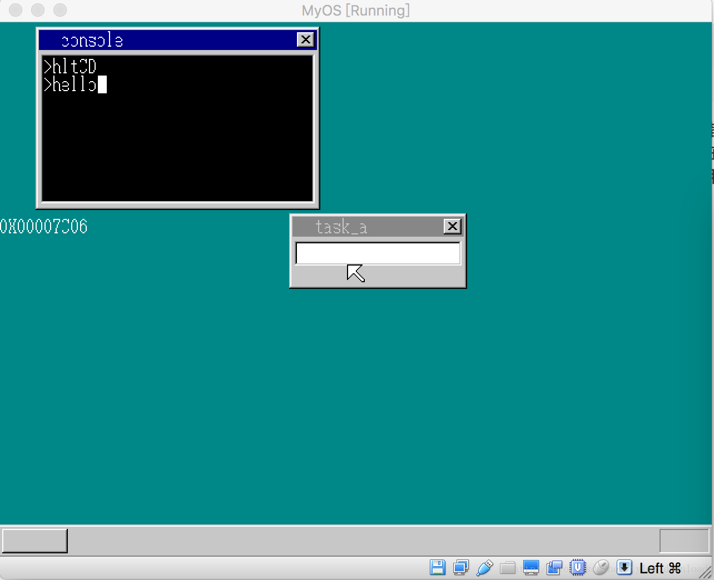

## 实现应用程序和内核间的控制权切换


在上节，我们实现了让第三方应用程序调用系统内核提供的接口，但遗留下的一个问题是，应用程序调用完API后，它自己进入死循环，由于CPU的控制权交给了应用程序，如果它在进入死循环前关闭了硬件中断的话(执行CLI指令），那么整个系统就会被锁死了。

本节，我们看看，应用程序调用完API后，如何将控制权再次归还给系统内核。我们先看看，应用程序是如何被加载的，在内核的C语言部分(write_vga_desktop.c)，在有关控制台的函数里，有如下代码：

```
void console_task(struct SHEET *sheet, int memtotal) {
  ....
  else if (strcmp(cmdline, "hlt") == 1) {
                      struct Buffer buffer;
                      file_loadfile("abc.exe", &buffer);
                      struct SEGMENT_DESCRIPTOR *gdt = 
                            (struct SEGMENT_DESCRIPTOR *)get_addr_gdt();
                      set_segmdesc(gdt+19, 0xfffff, buffer.pBuffer, 0x4098);


                      farjmp(0, 19*8);
                   //  dumpy();
                      int addr = (int*)asm_cons_putchar;
                      addr -= get_code32_addr();
                      char *p = intToHexStr(addr);
                      showString(shtctl, sht_back, 0, 176, COL8_FFFFFF, p);


                      memman_free_4k(memman, buffer.pBuffer, buffer.length);

                  }
  ....
}
```

上面代码中，启动应用程序的语句是farjmp(0, 19*8), 应用程序执行完后，想要将控制权提交给内核，需要让CPU执行farjmp的下一条语句，int addr = (int*)asm_cons_putchar; 我们知道，函数被调用时，在汇编中使用的是call 语句，所以如果你把反汇编都的代码拿来看的话，你会发现farjmp的调用,转换成汇编语言时是 call farjmp。 call指令有个特点，就是它会把当前指令的下一条指令的地址给压入堆栈，于是我们在进入farjmp函数中时，把堆栈上的内容取出来，得到的就是内核调用完应用程序后，下一条指令要执行的地址。

如果我们把这个地址取出来，存放到一个应用程序也可以访问的内存中，那么应用程序执行完自己的功能后，把地址取出来，直接跳转到该地址，那么CPU的控制权就可以交还给内核了。

为此我们看看具体实现，首先需要在程序进入farjmp函数时，获取下一条语句的地址，代码修改如下,在内核的汇编部分kernel.asm中：

```
farjmp:
        xor  eax, eax
        mov  eax, [esp]
        mov  [0x6000], eax
        jmp FAR [esp + 4]
        ret
```

我们先把寄存器eax清零， 当前堆栈指针esp指向的内存，正好存放了调用farjmp时，下一条语句的地址，于是我们把地址的数值读出来，让后存放到内存地址为0x6000的地方，那么应用程序执行完自己的功能后，从内存地址0x6000读出四字节数值，得到的就是内核下一条指令的地址，然后直接跳转就可以把控制全交还给内核了。

由于上面的代码修改后，API asm_cons_putchar 接口的加载地址会改变，通过编译后的kernel.map文件查看，内容如下：

```
00008344  00008344  LABEL_SEG_CODE32
....
0000FF2F  0000FF2F  get_code32_addr
0000FF35  0000FF35  load_tr
0000FF3B  0000FF3B  farjmp
0000FF4A  0000FF4A  asm_cons_putchar
```

原来内核代码段的入口地址不变，还是0x8344, 于是API接口的相对偏移为0xFF4A - 0x8344 = 0x7C06，于是我们的应用程序代码可以修改为如下：

```
[map symbols hlt.map]
[SECTION .s32]
BITS 32
mov  ax, again
push ax
mov  AX, 'C'
push ax     
jmp dword 1*8:0x7C06

again:
mov ax, fin
push ax
mov ax, 'D'
push ax
jmp dword 1*8:0x7C06

fin:
   push 1*8
   mov  eax, [0x6000]
   push eax
   retf


```

第一句指令push again, 告诉内核API执行完毕后，跳转到应用程序的 again处，于是当成员调用接口在控制台上输出一个字符 C 后，控制权从内核返回到应用程序的again处，然后应用程序再次调用API 在控制台窗口上输出字符D,最后再把控制权交还给内核，代码编译运行后情况如下：



从上图可以看到，执行 htl程序后，C D 两个字符显示在控制台上，并且内核收回了CPU 控制权，此时光标能继续在控制台上闪烁，同时，我们可以继续在控制台上输入字符。