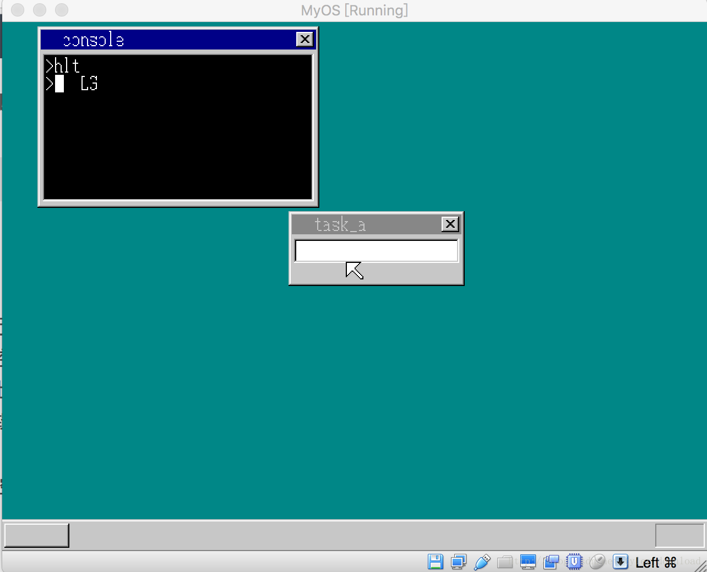

## 像Linux一样使用中断实现内核API


我们当前提供的内核API有个问题，就是每次使用时，需要计算API函数在内核中的位置，一旦内核代码改变，API接口的位置也会改变，同时调用API的应用程序也必须跟着改变，显然这种限制是不可接受的。

为了突破当前缺陷，我们必须想出新的API提供办法。常用的做法是，仿照Linux 将API当做一个中断调用，由此应用程序在使用API时，只需要记住API对应的中断号，然后使用指令int 即可，这样无论API接口位置如何变动，应用程序的代码都不需要重新更改。

由此在系统内核的汇编代码部分做如下修改：

```
LABEL_IDT:
...
.2DH:
    Gate SelectorCode32, AsmConsPutCharHandler,0, DA_386IGate
```

我们在中断向量表中增加了一个.2D号中断，该中断对应的相应函数地址为AsmConsPutCharHandler。

在原来的API接口AsmConsPutChar处增加如下代码：

```
asm_cons_putchar:
AsmConsPutCharHandler equ asm_cons_putchar - $$
        pushad

        push 1 
        and  eax, 0xff
        push eax
        call  cons_putchar
        add  esp, 8

        popad

        iretd
```

首先我们通过把函数入口地址减去段的起始地址，得到函数相对于代码段的偏移，这个偏移的值就是AsmConsPutCharHandler， 其次asmConsPutChar一旦调用是，先执行指令pushad, 该指令的作用是把所有通用寄存器压入堆栈，寄存器跟代码运行的上下文密切相关，如果在调用中断时不包含好通用寄存器，那么从中断返回后，由于寄存器的改变，可能会导致代码逻辑出现错误。在APIZ执行完毕后，执行指令popad,把原先保持起来的寄存器数据重新恢复到对应的寄存器中。

使用中断提供内核接口调用，应用程序在开发逻辑上可以得到极大的简化，以下代码显示了应用程序如何调用内核API在控制台上显示字符：

```
[map symbols hlt.map]
[SECTION .s32]
BITS 32
mov  ax, 'L'
int 02DH
mov  ax,  'G'
int 02DH

retf
```

应用程序只需要把要显示的字符赋值给寄存器ax, 然后出发2d号中断就可以利用内核导出的API,实现在控制台上输出字符的功能。同时应用程序无需估计内核代码修改后，结构API地址会改变的问题，代码只需兼顾自身逻辑，于是相比于前一版本的内核调用，逻辑上得到了很大的简化。

把上面代码编译后，在控制台运行hls命令后，效果如下：



