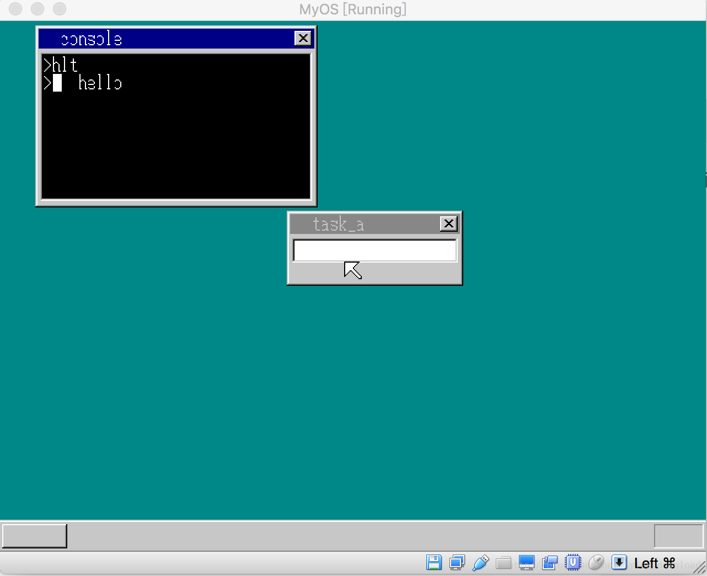

## 使用一个中断实现多个API调用


在上一节，我们实现了通过中断访问内核API的功能，本节，我们进一步改进中断调用内核API的机制。

当前，我们使用一个中断来对应一个API, 问题是内核导出的API不可能只有一个，如果始终保持一个中断对应一个API的话，那么CPU只支持两百多个中断，也就是说，按照上一节的办法，我们内核最多只能导出两百个API, 显然，随着内核功能的增强，导出的API肯定越来越多，最后超出两百多个是肯定的，为了能够支持内核导出足够多的API接口，我们需要对原有机制进行相应修改。

我们修改方式如下，对每个内核API赋予一个编号，应用程序调用某个API时，先将API对应的编号放入AX寄存器，然后触发02Dh号中断，在中断响应程序中，从AX中拿到对应的API编号，根据API编号动态的调用对应的接口。

我们现在内核的C语言部分增加一个在控制台上输出字符串的接口，代码如下：

```
void cons_putstr(char *s) {
    for (; *s != 0; s++) {
        cons_putchar(*s, 1);
    }

    return;
}
```

上面代码从一个地址中拿出字符串中的每个字符，然后调用cons_putchar把字符逐个输出到控制台上。同时我们增加一个API调用的总接口，该接口先读取应用程序给定的API编号，然后根据编号调用不同的内核API,代码如下：

```
void kernel_api(int edi, int esi, int ebp, int esp,
                int ebx, int edx, int ecx, int eax) {

    if (edx == 1) {
        cons_putchar(eax & 0xff, 1);
    }else if (edx == 2) {
        cons_putstr((char*)(buffer.pBuffer + ebx)); 
    }
}


```

该函数的输入参数有8个，分别对应的是所以通用寄存器，其中拥有存储API调用编号的是edx, 如果应用程序给edx赋予数值1，表示它想调用1号内核接口，1好接口对应的API是cons_putchar, 如果edx 的值是2，表示应用程序想调用2号API接口，对应的就是cons_putstr，也就是应用程序想在控制台上输出字符串。

内核部分的API中断响应函数也需要做相应更改，代码如下：

```
asm_cons_putchar:
AsmConsPutCharHandler equ asm_cons_putchar - $$
pushad

    pushad
    call kernel_api
    add esp, 32

    popad
    iretd

```

注意代码中有两次pushad, 第一次是为了保护执行环境，因此将所有通用寄存器存储到堆栈上，第二次是为了把参数传递给函数kernel_api,从上面的代码可以看出，kernel_api需要输入8个四字节整形，对应的就是8个通用寄存器，因此第二次pushad相当于把8个通用寄存器的值压入堆栈，也就是把八个整形参数输入给函数kernel_api.

应用程序的代码也需要做相应修改，具体内容如下：

```
[map symbols hlt.map]
[SECTION .s32]
BITS 32
mov edx, 2
mov ebx, msg
int 02Dh
retf

msg: DB “hello”, 0
```

程序首先把数值2存到寄存器edx,这意味着应用程序想调用2号API,也就是它想在控制台上输出一个字符串，字符串的起始地址是msg, 这个起始地址要存储到寄存器ebx中。

在kernel_api的实现中，它发现edx的值是2时，执行的代码如下：

cons_putstr((char*)(buffer.pBuffer + ebx));

我们知道，ebx对应的是字符串的起始地址，这里要注意的是， ebx存储的msg内存地址是相对于本程序开头的偏移，当应用程序加载到内存后，绝对地址会发生改变，也就是当应用程序加载到内存后msg对应的地址等于它相对于本程序的偏移，加上程序被装入内存时的起始地址。程序加载到内存时的起始地址正好存在在结构体buffer的pBuffer指针中，因此用buffer.pBuffer + ebx 得到的正好是msg在内存中的绝对地址。

上面的代码编译后，加载到虚拟机，执行的结果如下：
