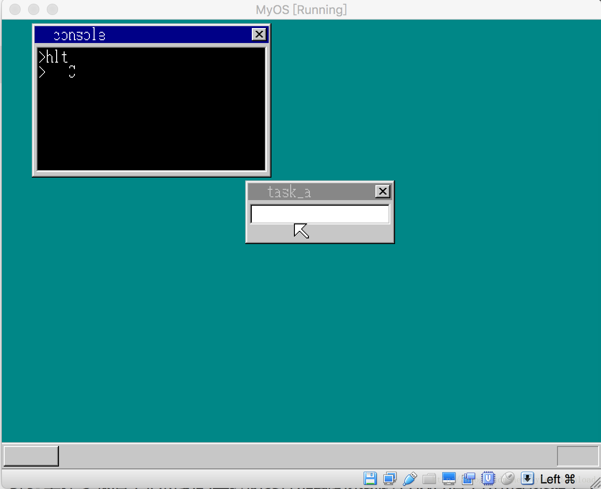

## 使用C语言开发系统应用程序


我们的操作系统通过增添内核接口导出机制后，已经可以作为平台，运行应用程序了，但目前应用程序的开发有一个不足就是，我们只能使用汇编语言开发应用程序，用汇编语言开发程序实在太累了，如果能使用C语言就好了，例如当我们想要开发一个在控制台上输出一个字符的应用程序，如果代码能用C语言这么写就好了(app.c)：

```
void api_putchar(int c);

void main() {
    api_putchar('C');
    return;
}

```

如果上面的代码能编译成二进制文件，并能通过系统加载执行，那么在我们的操作系统上开发应用程序就不必要像以前那么痛苦。我们这一节要做的是，研究如何使用C语言开发运行在我们系统之上的应用程序。

实际上，我们用C语言开发内核的步骤，可以平移到开发应用程序上。我们开发内核时，实际上遵循着的基本逻辑是这样的：用汇编开发底层接口，然后用C语言调用汇编语言导出的接口，实现业务逻辑。然后把C代码编译成二进制文件，接着使用objconv 工具把C语言反编译成汇编语言，下一步就是把原来的用汇编开发的代码跟反编译后得到的汇编代码合二为一，最后用汇编编译器把整合起来的汇编代码编译成一个统一的二进制可执行文件。

我们用C语言开发应用程序也遵循上面的逻辑。首先我们用汇编语言导出内核API接口，用C语言调用汇编语言导出的接口完成业务逻辑的编写，接着把C语言代码编译成二进制，再使用objconv反汇编，最后把两个汇编语言代码合二为一，统一编译成一个可执行的二进制文件。

基于上面的逻辑步骤，我们第一步要做的就是用汇编语言导出api_putchar函数调用的接口，实现代码如下(api_call.asm)：

```
[SECTION .s32]
BITS 32
call main
retf

api_putchar:
  mov edx, 1
  mov al, [esp + 4]
  int 02Dh
  ret

%include "app.asm"
```

我们先看api_putchar部分，前面我们讲过，内核所有api都对应一个编号，向控制台输出一个字符的api编号就是1，要调用对应api时，只要把对应编号放入寄存器edx, 同时把参数提交给指定寄存器，最后调用2D号中断就可以了。

在代码的前面，我们首先执行语句call main, 也就直接调用main函数，这意味着用C语言开发程序时，主入口函数必须是main, 所有C语言开发的程序代码编译成二进制文件后，然后反汇编成汇编程序，反汇编后的程序文件就是app.asm,通过include指令把app.asm的代码整合到api_call.asm中来，最后使用汇编编译器nasm 编译 api_call.asm 所得到的二进制文件就是用C语言开发的应用程序。

因此我们通过以下步骤就可以使用C语言来开发应用程序了：
1， 完成api_call.asm 在里面导出C语言程序所需要使用的接口
2， 使用C语言，通过接口调用完成业务逻辑的开发，例如完成前面所述的app.c
3， 使用命令gcc -m32 -fno-asynchronous-unwind-tables -s -c -o app.o app.c 来编译C语言代码，
4, 使用objconv 反汇编步骤3所得到的二进制文件， ./objconv -fnasm app.o app_u.asm
5，使用我们早先开发的java工具对反汇编得到的app_u.asm进行预处理，去掉app_u.asm 里面一些无用的指令
6，使用nasm编译api_call.asm , nasm -o hlt.bat api_call.asm 得到二进制可执行文件hlt.bat
7, 把hlt.bat的二进制数据加载到系统中执行便是执行了用C语言开发的应用程序。

具体的操作步骤请参看视频，上面的步骤是一系列步骤精简后的过程，更详实的讲解和代码运行调试过程，请参看视频。

经过上述步骤后，把得到的二进制文件加载到系统进行执行后，所得结果如下：




可见运行hlt命令后，C语言开发的程序逻辑被执行，字符C正确的显示到了控制台窗口里，由此可见，经过上述步骤，我们是可以使用C语言在我们的系统内核基础上开发应用程序的。