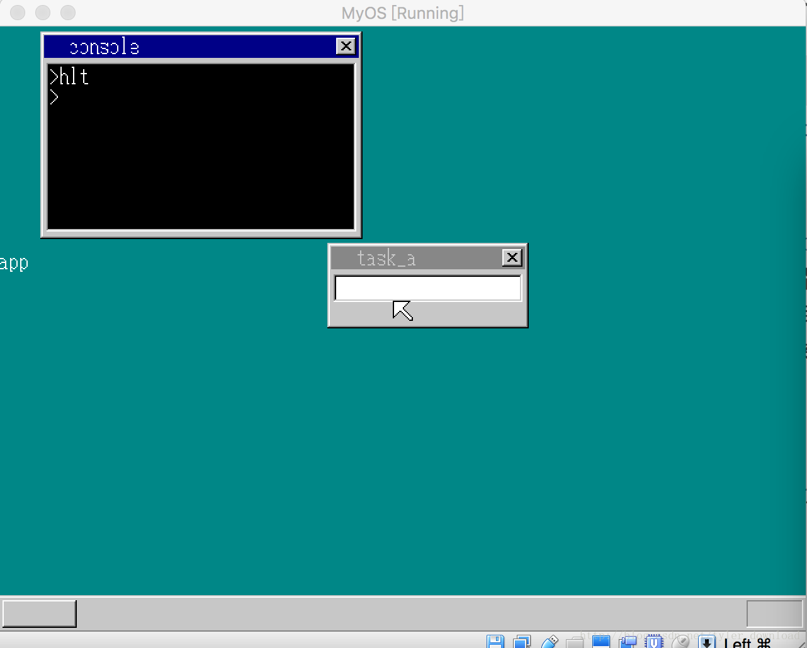

## 应用程序与系统内核的内存隔离


当前，我们可以开发运行在系统上的应用程序了，接下来的问题是如何保护系统内核免受恶意应用程序的危害。恶意程序要想侵犯系统，主要路径有两条，一是让内核执行它的代码，而是修改内核数据，通过修改数据改变内核的行为。我们看看，如何预防恶意程序侵入到系统内核的数据区域中。

无论是内核还是应用程序，他们的内存都分两种，一种叫代码段，也就是有一块专门的内存用来存储程序的指令，另一种叫数据段，也就是有一块专门的内存来存储程序的数据。

前面提到过一种数据结构叫全局描述符，这种数据结构就是用来描述一段内存的作用的，该结构包含以下信息：
1， 内存段的起始地址
2， 内存段的长度
3， 内存段的属性

假设CPU将指向以下的数据读写语句：

```
char* p = 0x100;
*p = 'a';
```

也就是代码想在内存地址为0x100处写入一个字符’a’, 问题在于0x1000并不是内存的绝对地址，它只是相对于数据段的偏移。假设当前用于描述数据段的全局描述符如下：
0： {起始地址: 0x1000, 长度:0x1000, 属性：…}
1 : {起始地址: 0x2000, 长度:0x1000, 属性:…}
2: {起始地址: 0x3000, 长度:0x1000, 属性:…}

当程序执行前面的内存读写指令时，具体写入的地址要看DS段寄存器指向哪个描述符，如果DS的值是0，那么数据段的起始地址是0x1000,那么程序实际写入的内存地址就是0x1100 = 0x1000 + 0x100, 如果DS寄存器的值是1，那意味着数据段的起始地址是0x2000, 于是实际的写入地址就是 0x2100 = 0x2000 + 0x100.

这么看来，要想实现应用程序和内核的内存隔离，就必须使得应用程序运行时，DS寄存器指向的描述符与内核代码运行是DS寄存器指向的描述符不一样，这样一来应用程序在读写数据时就不会污染内核的数据。

基于这个思想，内核在运行应用程序时，只要专门分配一块与内核内存相互隔离的内存作为应用程序的数据段，这样的话就能有效的实现程序与内核的内存隔离，进而能包含内核不受应用程序的入侵。我们先看一段将要运行在内核上的C语言代码开发的应用程序(app.c)：

```
void main() {
    char *p = (char*)(0x100);
    *p = 'a';
    *(p+1) = 'p';
    *(p+2) = 'p';
    *(p+3) = 0;
    return;
}
```

这段程序的目的是把’app’这几个字符写入到地址为0x100的内存中，根据前面的分析，0x100所对应的内存取决于DS寄存器指向的描述符。为了防止应用程序把数据写入到内核内存进而污染内核的数据，我们需要在内核执行上面的程序前，为其指定专门的代码段，因此我们代码改动如下，在write_vga_desktop.c中做如下代码改动：

```
void cmd_hlt() {
    file_loadfile("abc.exe", &buffer);
    struct SEGMENT_DESCRIPTOR *gdt =(struct SEGMENT_DESCRIPTOR *)get_addr_gdt();
    set_segmdesc(gdt+11, 0xfffff, buffer.pBuffer, 0x4098);
    //new memory 
    char *q = memman_alloc_4k(memman, 64*1024);
    set_segmdesc(gdt+12, 64 * 1024 - 1, q ,0x4092);
    start_app(0, 11*8,64*1024, 12*8);
//    farjmp(0, 11*8);
    char *pApp = (char*)(q + 0x100);
    showString(shtctl, sht_back, 0, 179, COL8_FFFFFF, pApp);

    memman_free_4k(memman, buffer.pBuffer, buffer.length);
    memman_free_4k(memman, q, 64 * 1024);
}
```

当我们启动内核，在控制台输入hlt命令后，上面的代码会被执行，它把一个叫abc.exe的程序代码从磁盘上加载到内存，abc.exe对应的就是前面C语言编译成二进制后的指令数据。在启动程序前，也就是执行app.c的代码前，内核先分配一块64k大小的内存，然后用下标为12的全局描述符指向这块内存，然后调用start_app 函数启动应用程序，由于分配的内存块起始地址为q, 因此app.c中对内存地址为0x100处进行读写，根据前面的分析，由于应用程序的内存段起始地址是q,所以应用程序实际写入的内存地址为q + 0x100, 如果我们的理论正确的话，应用程序执行后，在内存q+0x100处对应的数据就是’app’,0。所以内核在执行完应用程序后，把内存为q+0x100出开始的数据通过showString显示到桌面上，如果我们的理论正确，那么字符串app就会出现在系统的桌面上。

我们再看start_app函数的实现，它的实现在kernel.asm中，代码如下：

```
start_app:  ;void start_app(int eip, int cs,int esp, int ds)
    cli
    pushad
    mov eax, [esp+36]  ;eip
    mov ecx, [esp+40]  ;cs
    mov edx, [esp+44]  ;esp
    mov ebx, [esp+48]  ;ds

    mov  [0xfe4], esp
    mov  ds,  bx
    mov  ss,  bx
    mov  esp, edx

    push ecx
    push eax
    call far [esp]

    mov  ax, SelectorVram
    mov  ds,  ax
    mov  esp, [0xfe4]

    mov  ax, SelectorStack
    mov  ss, ax 

    popad
    ret

```

start_app的作用是设置应用程序的内存段，它会把DS寄存器指向内核为应用程序分配的内存，一旦DS寄存器的值变了后，内核的代码就不能被执行了，因为当前内存段是应用程序的，不是内核的内存段，所以我们需要指令cli把中断关闭，避免时钟中断发生。

接着我们需要把输入参数放入到几个寄存器，第一个参数对应的是应用程序在代码段的起始地址，用于我们需要从应用程序的第一条语句开始执行，所以它的起始地址为0，第二个参数对应应用程序代码段的描述符下标，第三个参数是应用程序的堆栈指针，这里需要提一下，程序运行是所使用的内存中，有专门一块用作程序的栈，程序的输入参数和局部变量都需要存储在栈上，由此前面内核分配的64k内存使用情况如下：

```
    start_address(q):   -----------
                                 |
                                 |
                                 |
                                 64K
                                 |
                                 |
                                 | 
 esp->      end_address(q + 64k)---------  

```

esp寄存器的作用是栈指针，它指向应用程序的可用内存底部，它由高向低增长，假设有4字节数据要存入堆栈时，数据会写入到esp指向的内存，然后esp的值减去4。

原来esp指向的是内核的堆栈，当应用程序运行时，它必须指向应用程序的堆栈，所以在改变esp的值之前，需要把它原来的值保存起来，为了方便，我们先把他保存在内存地址为0xfe4的地方，根据我们前面分析，这个地址也是相对地址，绝对地址还得加上内核数据段的起始地址，由于内核数据段的起始地址是0，因此我们实际上是把寄存器esp的值直接存放到了绝对内存地址为0xfe4的地方，接着把ds,ss两个寄存器的值改成内核新分配内存所对应的描述符下标，ss寄存器对于的是堆栈段，这里我们把内存和堆栈都指向同一块内存，当读写数据时，我们从64k内存的低地址向高地址写入，当把数据压入堆栈时，从64k内存的高地址向低地址写入。

由于应用程序代码段描述符和要运行的第一条指令的地址已经存储到ecx,和eax中，把这两个寄存器压入堆栈，然后运行指令call far [esp], 这条指令会把esp指向的内存中，先取出4字节作为代码段描述符下标，再取出4字节数据作为代码段的偏移，也就是把esp指向的内存的4字节数据赋值给寄存器ip, 然后再把接下来的4字节作赋值给寄存器cs,这样CPU就跳转到了应用程序的第一句指令开始执行。

当应用程序执行完后，返回到call语句的下一条语句，这时start_app把内核代码运行时寄存器对应的值给恢复，特别是把内核运行时的堆栈指针重新从内存0xfe4处读回来，于是CPU的控制器就重新归还给内核。

上面的代码运行后，结果如下：



我们看到，应用程序在0x100处写入的数据成功的被内核读到并打印在桌面上，由此证明，我们成功的实现了应用程序内存和内核内存的隔离，这么一来，内核就可以免受应用程序的在内存方面的入侵了。