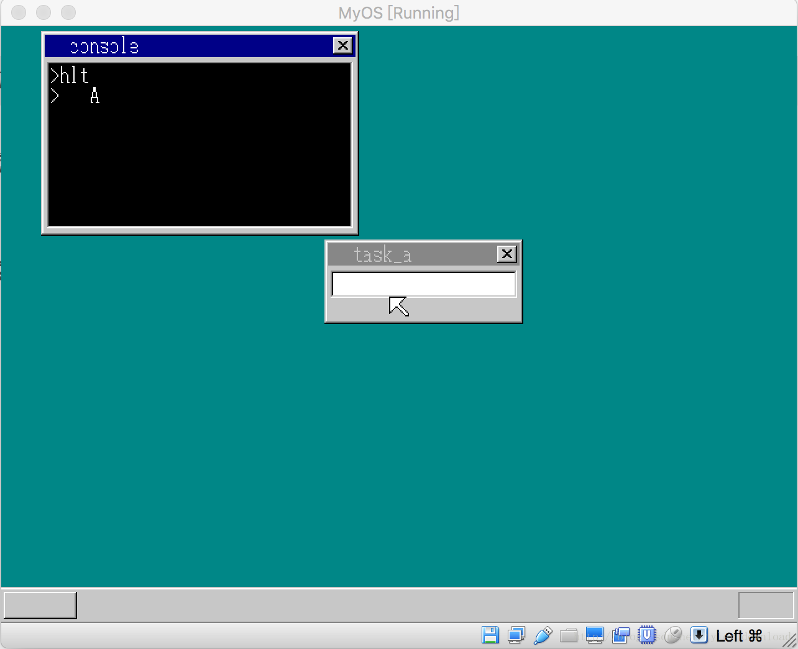

## 实现进程的特权级切换


为了保护系统内核不受恶意程序的破坏，我们原来的做法是专门为应用程序分配单独使用的内存，使得应用程序对数据的读写都限制在内核给他分配的内存段内。程序对内存段的读写，完全是由DS寄存器指向的全局描述符决定的，如果恶意程序通过修改DS寄存器的值，使得它在运行时，让DS寄存器指向内核数据段的全局描述符，那么恶意程序就可以读写内核的数据了，为了防范出现这种情况，我们要做的是让应用程序没有读写段寄存器的权力，因此我们就必须设定应有程序的优先级。

在X86架构下，程序可以分为4个等级，分别是0，1，2，3.级别数越低，它的权限就越高，系统内核是权限最高的，因此它运行的优先级为0，为了防止应用程序作乱，我们在启动它之前，必须把它的优先级设定为最低级，也就是3.

为了让应用程序运行在低特权级上，内核在启动应用程序前，必须把应用程序代码所在的内存段的级别设置为3，在一个级别为3的代码段上运行指令时，如果指令的优先级高于3，例如读写段寄存器等，那么就会触发CPU错误，根据上篇文章讲过的内核异常处理机制，内核就会把应用程序的杀掉。于是我们修改内核启动应用程序的相关代码，在write_vga_desktop.c中：

```
void cmd_hlt() {
file_loadfile("abc.exe", &buffer);
    struct SEGMENT_DESCRIPTOR *gdt =(struct SEGMENT_DESCRIPTOR *)get_addr_gdt();
    set_segmdesc(gdt+11, 0xfffff, buffer.pBuffer, 0x409a + 0x60);
    //new memory 
    char *q = memman_alloc_4k(memman, 64*1024);
    set_segmdesc(gdt+12, 64 * 1024 - 1, q ,0x4092 + 0x60);
    struct TASK *task = task_now();
    start_app(0, 11*8,64*1024, 12*8, &(task->tss.esp0));
    memman_free_4k(memman, buffer.pBuffer, buffer.length);
    memman_free_4k(memman, q, 64 * 1024);
}
```

上面代码跟以前相比，差别在于set_segmdesc调用中，设置内存段属性时，我们多加了0x60,加上0x60的目的是，把该描述符所指向的内存其优先级设置为3.这样一来，应用程序一旦指向高优先级的CPU指令，例如move ds, ax这种读写段寄存器的指令时，就会引发CPU异常。

同时我们通过调用task_now()获得当前正在运行的进程对象，每个进程对象都含有一个TSS数据结构，其内容如下(在multi_task.h中)：

```
struct TSS32 {
    int backlink, esp0, ss0, esp1, ss1, esp2, ss2, cr3;
    int eip, eflags, eax, ecx, edx, ebx, esp, ebp, esi, edi;
    int es, cs, ss, ds, fs, gs;
    int ldtr, iomap;
};
```

TSS结构我们在早前讲到进程切换的章节里有过对它的详细解读，这里我们需要注意它的几个变量：esp0, ss0, esp1, ss1, esp2, ss2。一个进程在运行时，它可以运行在不同优先级下，在不同优先级下运行时，它必须使用不同的堆栈，这些变量就是用于存储不同优先级下对应的堆栈段和堆栈指针的。如果进程要切换到优先级0，那么CPU会自动从esp0和ss0中读取堆栈指针和堆栈内存段的全局描述符，如果进程要从优先级0切换到优先级1，那么我们内核需要自己把对应优先级0的堆栈指针和堆栈段描述符的值存入到esp0和ss0。也就是说如果进程从低优先级切换到高优先级时，CPU会自动帮我们从TSS中读取对应的堆栈段全局描述符和堆栈指针，实现相应的堆栈切换。如果进程从高优先级切换到低优先级时，需要进程自己把高优先级的堆栈段描述符和堆栈指针存储到TSS中的相应位置。

这也是为何我们调用start_app时，要把TSS对应的esp0变量的地址传入，因为start_app要启动一个优先级为3的应用程序，一旦应用程序运行起来时，进程的优先级会从0变为3，因此我们需要把切换前的堆栈指针和堆栈段存储到TSS结构的esp0和ss0中。我们再看看start_app的实现：

```
start_app:  ;void start_app(int eip, int cs,int esp, int ds, &(task->tss.esp0))
    pushad

    mov eax, [esp+52]
    mov [eax], esp
    mov [eax+4], ss

    mov eax, [esp+36]  ;eip
    mov ecx, [esp+40]  ;cs
    mov edx, [esp+44]  ;esp
    mov ebx, [esp+48]  ;ds

    mov  ds,  bx
    mov  es,  bx

    or ecx,3
    or ebx, 3
    push ebx
    push edx
    push ecx
    push eax
    retf

```

esp+52对应的正好是start_app的最后一个参数，也就是&(task->tss.esp0),也就是当前进程含有的TSS结构中，esp0变量的地址。我们把它的地址赋值给寄存器eax, 指令mov [eax], esp 它的作用就是把当前堆栈指针存入TSS结构里的esp0变量，指令mov [eax+4], ss， 它的作用是把当前堆栈段描述符存储到TSS结构的ss0变量。

上面代码中，有两条指令特别值得我们注意，他们是：

```
or ecx, 3
or ebx, 3
```

ecx寄存器存储的是应用程序的代码段，ebx寄存器存储的是应有程序的内存段。我们以前讲过，在把全局描述符赋值给段寄存器时，需要把该描述符对应在全局描述符表中的下标乘以8后再传给段寄存器，为何要乘以8呢？假设某个全局描述符它的下标是1，乘以8相当于左移三位：

```
00000001  ->  00001000
```

左移三位后会在右边空出3个0，这三个0是有专门作用的，前两个0用于表示对应内存段的优先级，也叫请求优先级，当内核要运行应用程序的代码时，我们需要把应用程序代码段赋值给寄存器cs,把应用程序的内存段赋值给ds,如果要把优先级从0切换成3时，我们需要把请求优先级也设置为3，这就是前面两条指令的作用：

```
or ecx, 3
or ebx, 3
```

上面两条指令运行后，最右边的两个0都会变成1，也就是把请求优先级设置成了3。还值得注意的是，以前我们把CPU控制器交给应用程序时，使用的指令是call far，但如果跳转时带有优先级切换，那么CPU就不允许使用call far 或者是jmp far 这两种指令，我也不知道英特尔为何这么设计，要实现从优先级0跳转到优先级3，必须先把优先级3对应的堆栈和堆栈指针压入当前堆栈，然后把优先级3的代码段描述符和IP指针压入堆栈，然后再执行retf命令，这几个步骤对应的正好是最后几条指令：

```
    push ebx
    push edx
    push ecx
    push eax
    retf
```

执行完上面几条指令后，应用程序就可以运行起来了，并且应用程序是运行在优先级为3的条件下，此时应用程序不运行执行任何权限超过3的指令，例如存储段寄存器相关的指令，如果应用程序执行类似指令：move ds, ax时，CPU会产生OD异常，于是根据上一节内容，应用程序会被杀掉。

在应用程序运行过程中，如果它需要调用内核API，也就是需要运行内核代码时，CPU会自动从TSS中读取esp0和ss0两个变量的信息，然后自动把堆栈段和堆栈指针切换到内核原来的堆栈段和堆栈指针，这样可以省却我们大量的麻烦，于是相关代码便可以得到极大的精简，例如实现API调用的02Dh中断的实现如下：

```
asm_cons_putchar:
AsmConsPutCharHandler equ asm_cons_putchar - $$

        push ds
        push es
        pushad
        pusdad

        ;把内存段切换到内核
        mov  ax, SelectorVram
        mov  ds, ax
        mov  es, ax 

        call kernel_api
        cmp eax, 0
        jne end_app

        popad
        pop es
        pop ds
        iretd
end_app:
        mov esp, [eax]
        popad
        ret
```

相比于上个版本，代码精简了很多，那是因为我们不用再考虑应用程序切换到内核时堆栈如何切换，因为CPU已经帮我们处理了。这里我们再看看kernel_api的实现：

```
int* kernel_api(int edi, int esi, int ebp, int esp,
                int ebx, int edx, int ecx, int eax) {
    struct TASK *task = task_now();

    if (edx == 1) {
        cons_putchar(eax & 0xff, 1);
    }else if (edx == 2) {
        cons_putstr((char*)(buffer.pBuffer + ebx)); 
    }else if (edx == 4) {
        return &(task->tss.esp0);
    }

    return 0;
}

```

这里我们增加了一个标号为4的API调用，它只是简单的返回内核存储在TSS结构里的堆栈指针，当调用完kernel_api后，它的返回值会被存储在寄存器eax中，于是API中断发现eax不是0，那意味着eax存储的是内核在切换到应用程序前的堆栈指针，于是它把这个指针的值赋值给堆栈指针寄存器esp，于是语句popad是把堆栈上寄存的所有通用寄存器的数值返回给对应通用寄存器，这条指令对应的指令是start_app调用中的pushad指令，执行完popad指令后，堆栈上存储的是从start_app返回后的下一条指令的地址，因此接下来执行ret指令时，CPU控制权会重现返还给内核。

最后我们再看看有个应用程序代码的修改，在api_call.asm中：

```
[SECTION .s32]
BITS 32
call main
mov  edx, 4  ;返回内核
int  02Dh


api_putchar:
  mov edx, 1
  mov al, [esp + 4]
  int 02Dh
  ret

%include "app.asm"
```

当代码调用完main函数后，也就是应用程序执行完毕后，代码把4赋值给edx寄存器，然后调用api中断，根据前面的分析，中断执行后CPU的控制权就交还给了内核。另外由于应用程序运行在优先级3，它要调用内核中断时，需要使用指令int 02Dh来触发中断，我们必须把02Dh号中断的优先级也设置成3，要不然应用程序就没有资格调用02Dh号中断，于是在kernel.asm中做如下修改：

```
.2DH:
    Gate SelectorCode32, AsmConsPutCharHandler,0, DA_386IGate+0x60
```

像前面说过的一样，加上0x60就是把该中断的优先级设置为3.

完成所有代码修改后，内核运行情况如下：

虽然运行结果与往常一样



但应用程序运行时的优先级已经转变为3，因此应用程序没有了执行高级指令的权限，因此内核得到了进一步的保护。[更详细的讲解和代码调试演示过程，请点击链接](http://study.163.com/provider-search?keyword=Coding迪斯尼)