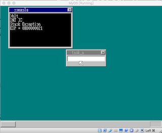
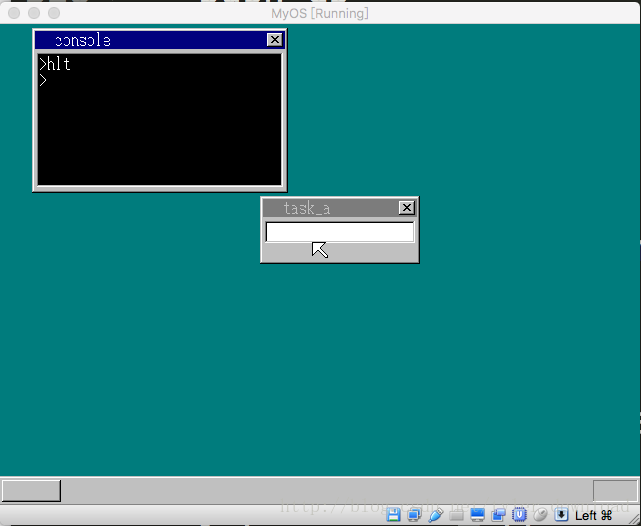
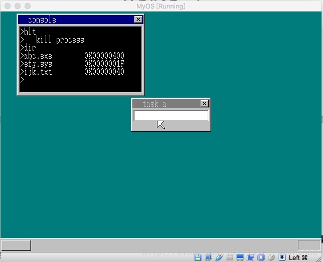

## 防范缓冲区溢出和强杀死循环程序


很多系统或程序之所以被破解被攻击，很大程度上是攻击者利用缓冲区溢出导致的漏洞，例如以下代码：

```
char a[1024];
a[1280] = 'A';
```

由于数组只定义了1024个元素，但使用时却写入到第1280个元素，这种错误往往导致程序内存污染，使得程序在运行时出现意想不到的奔溃。一般而言，当应用程序出现这种错误时，系统是无法捕捉的，但在一些特殊情况，内核可以捕捉到这种情况，以上面代码为例，如果程序的堆栈大小只有1024字节，那么写入第1280字节就会导致堆栈的写入超出范围，进入到程序无法掌控的数据内存，这样就会引发0Ch异常，内核可以捕捉这个异常，从而发现程序出现缓冲区溢出的问题。

我们尝试重现这种现象，在内核代码中，cmd_hlt函数用来启动一个应用程序，我们修改代码，使得应用程序的可用内存以及堆栈缩小为1k:

```
void cmd_hlt() {
    file_loadfile("abc.exe", &buffer);
    struct SEGMENT_DESCRIPTOR *gdt =(struct SEGMENT_DESCRIPTOR *)get_addr_gdt();
    set_segmdesc(gdt+11, 0xfffff, (int) buffer.pBuffer, 0x409a + 0x60);
    //new memory 
    //char *q = (char *) memman_alloc_4k(memman, 64*1024);
    char *q = (char*) memman_alloc(memman, 1024);
   // set_segmdesc(gdt+12, 64 * 1024 - 1,(int) q ,0x4092 + 0x60);
    set_segmdesc(gdt+12, 1024 - 1,(int) q ,0x4092 + 0x60);
    struct TASK *task = task_now();
    task->tss.esp0 = 0;
   // start_app(0, 11*8,64*1024, 12*8, &(task->tss.esp0));
    start_app(0, 11*8, 1024, 12*8, &(task->tss.esp0));
    memman_free_4k(memman,(unsigned int) buffer.pBuffer, buffer.length);
   // memman_free_4k(memman, (unsigned int) q, 64 * 1024);
    memman_free(memman, (unsigned int)q, 1024);

}
```

上面代码给新启动的进程只分配1024字节的可用内存，一旦应用程序如果访问超过1024字节，那么就会引发访问越界的错误。接着我们再看应用程序的实现：

```
void api_putchar(int c);

void main() {
    char b[1024];
    b[1280] = 'A';

    return;
}
```

上面程序定义了一个只有1024个元素的数值，但写入时却写入第1028个元素，由于前面我们在启动程序时，专门只分配1024字节，因此上面对数组的读写就会引发越界错误，进而触发0Ch号中断，该中断是专门针对堆栈访问越界错误的。为了捕捉错误，我们需要在内核中定义和实现0CH号中断，在kernel.asm中，增加对中断的定义：

```
LABEL_IDT:
%rep  12
    Gate  SelectorCode32, SpuriousHandler,0, DA_386IGate
%endrep

.0Ch:
    Gate SelectorCode32, stackOverFlowHandler,0, DA_386IGate

.....
```

上面我们在中断描述符表中增加了0CH号中断，它的响应处理函数是stackOverFlowHandler, 我们看看它的实现：

```
_stackOverFlowHandler:
stackOverFlowHandler equ _stackOverFlowHandler - $$
    sti
    push es
    push ds
    pushad
    mov eax, esp
    push eax
    ;把内存段切换到内核
    mov  ax, SelectorVram
    mov  ds, ax
    mov  es, ax 

    call intHandlerForStackOverFlow

    jmp near end_app
```

它的实现原理跟我们以前实现的异常中断函数逻辑是一样的，在这里我们需要注意一点，当异常中断发生时，CPU会在堆栈上存入一些内容，以便程序分析中断发生的原因，存入的信息有：
esp[0]: EDI
….
esp[7]: EAX
esp[8]: ds
esp[9]: es
堆栈上前八个元素使用指令pushad产生的，第九和第十个元素对应是由语句push ds, push es产生的，接下来的信息则是中断发生时，由CPU存入的：
esp[10]: 错误编号（通常是0，没有意义）
esp[11]: eip (导致异常发送的指令在内存中的地址)
esp[12]: cs (导致异常的代码段描述符)
esp[13]: EFLAGS
esp[14]: esp (异常发生时的堆栈指针)
esp[15]: ss (异常发生时的堆栈段)

我们看看intHandlerForStackOverFlow的实现，它在内核的C语言部分：

```
int* intHandlerForStackOverFlow(int* esp) {
    g_Console.cur_x = 8;
    cons_putstr("INT OC");
    g_Console.cur_x = 8;
    g_Console.cur_y += 16;
    cons_putstr("Stack Exception");
    g_Console.cur_x = 8;
    g_Console.cur_y += 16;
    char *p = intToHexStr(esp[11]);
    cons_putstr("EIP = ");
    cons_putstr(p);
    g_Console.cur_x = 8;
    g_Console.cur_y += 16;
    struct TASK *task = task_now();
    return &(task->tss.esp0);
}
```

上面代码在处理中断时，把导致中断的指令地址在控制台上显示出来，上面代码完成后，编译好内核，运行应用程序后，情况如下：



运行结果显示，导致出现堆栈异常的指令地址在0x21，为了做进一步的分析，我们在api_call.asm的顶部加上指令：
[map symbols app_c.map]
添加这个指令后，再编译一次，这样nasm编译器会把代码的地址输出到app_c.map文件中，打开这个文件，出现以下内容：

```

- NASM Map file ---------------------------------------------------------------

Source file:  api_call.asm
Output file:  hlt.bat

-- Symbols --------------------------------------------------------------------

---- Section .s32 -------------------------------------------------------------

Real      Virtual   Name
0000000C  0000000C  api_putchar
00000018  00000018  main
```

上面的信息显示，程序的主入口函数地址在0x18处，导致异常的语句地址在0x21, 因此语句与入口函数地址main的距离d = 0x21 - 0x18 = 0x9。由于程序的所以代码都会被反汇编到文件app.asm中，我们打开它看看：

```
main:   ; Function begin
        push    ebp                                     ; 0000 _ 55
        mov     ebp, esp                                ; 0001 _ 89. E5
        sub     esp, 1024                               ; 0003 _ 81. EC, 00000400
        mov     byte [ebp+100H], 65                     ; 0009 _ C6. 85, 00000100, 41
        nop                                             ; 0010 _ 90
        leave                                           ; 0011 _ C9
        ret                                             ; 0012 _ C3
; main End of function
```

大家看，距离main入口0x9处的语句是：
mov byte [ebp+100H], 65
65正好是字符’A’的ASCII编码，同时100H = 256，正好就是1280 - 1024的值，所以这条语句其实就是C代码中的：
a[1280] = ‘A’;

由此可见，中断函数输出的地址确实就是导致中断发送的指令的地址。

### 强杀死循环进程
当应用程序出现死循环，如果内核无法进行相应处理的话，整个系统有可能被出问题的程序给锁死，我们看看内核如何处理这样的情况。首先修改应用程序，让它进入一个人为的死循环：

```
void api_putchar(int c);

void main() {
    while(1){}
    return;
}
```

上面代码被内核运行后，会将控制台进程给卡死：




此时无论你怎么点击键盘，控制台都不会有响应的，那内核如何将卡死的程序给终结掉呢？我们可以利用一些中断来处理这个问题，一旦中断发生时，CPU的控制权会交给内核，这时是内核处理死循环进程的好时机。我们知道当EIP寄存器指向某条指令时，该指令才会被CPU执行，程序陷入死循环主要是因为EIP寄存器指向了导致死循环的指令，我们只要把该寄存器指向其他指令，那么就可以破除死循环了，那到底该指向哪条指令呢？将进程加载到内核执行的位于函数cmd_hlt, 在该函数里，它调用start_app启动了应用程序：

```
void cmd_hlt() {
....
 start_app(0, 11*8,64*1024, 12*8, &(task->tss.esp0));
    memman_free_4k(memman,(unsigned int) buffer.pBuffer, buffer.length);
....
}
```

C语言在调用函数时，会把该函数下一条指令的地址压入堆栈，于是start_app的下一条指令的地址就是memman_free_4k这个函数所在的地址，由此我们可以将陷入死循环的EIP指针指向这条指令的地址，从而破除死循环。我们利用键盘中断来转移EIP指针，当键盘输入是shift+control时，我们便将EIP的指针指向memman_free_4k那里。

当我们点击键盘引发键盘中断时，内核的主入口函数就会得到执行，我们可以在主入口函数中判断用户点击的键盘是不是shift+control，如果是的话，我们就修改EPI寄存器，在write_vga_desktop.c的CMain函数做如下修改：

```
void CMain(void) {
....
for(;;) {
....
else if(fifo8_status(&keyinfo) != 0){
           io_sti();
           data = fifo8_get(&keyinfo);
           transferScanCode(data);
         if (data == KEY_CONTROL && key_shift != 0 && task_cons->tss.ss0 != 0 ) {
             cons_putstr("kill process");
             io_cli();
             int addr_code32 = get_code32_addr();             
             task_cons->tss.eip = (int)kill_process - addr_code32;
             io_sti();
         }    
}
```

代码中先从队列中获取键盘发送过来的扫描码，然后调用transferScanCode转换扫描码，接着判断shift和control键是否被同时按下，如果是，那么我们在控制台上输出一条语句”kill procss”，然后把控制台任务对象中的tss结构里面的eip变量设置为(int)kill_process - addr_code32,其中kill_process是函数kill_process的地址，addr_code32是代码段的入口地址，他们相减就得到了kill_process相对于代码段入口地址的偏移。

我们以前讲过，进程切换时，会把相应的TSS结构加载入CPU,CPU会读取TSS结构的内容，并把相关数据加载到寄存器，特别是它会把TSS中eip变量的内容加载到EIP寄存器，上面代码设置了TSS结构的eip变量的内容，使他指向函数kill_process，那么当CPU将主进程切换到控制台进程时，它便会执行函数kill_process,我们看看它的实现：

```
void kill_process() {
    cons_newline(g_Console.cur_y, g_Console.sht);
    g_Console.cur_y += 16;
    asm_end_app(&(task_cons->tss.esp0));
}
```

该函数把tss.esp0变量的地址传给函数asm_end_app,还记得前几节我们讲过，前面我们将进程的优先级切换时，把控制台进程在优先级0时所使用的堆栈指针寄存到了tss结构的esp0变量，start_app函数下一条指令的地址就正好存储在esp0所指向的堆栈上，我们再看看asm_end_app的实现，它实现是在kernel.asm中：

```
asm_end_app:
    mov eax, [esp + 4]
    mov esp, [eax]
    mov DWORD [eax+4], 0
    popad
    ret
```

[esp+4]对应的是调用该函数时的存入参数&(task_cons->tss.esp0)，也就是esp0变量的地址，mov esp, [eax]就是恢复控制台进程在运行应用程序前所使用的堆栈，mov DWORD [eax+4], 0 就是把esp0变量后面的ss0变量的值设置成0, popad对应的是start_app执行时的pushad指令：

```
start_app:  ;void start_app(int eip, int cs,int esp, int ds, &(task->tss.esp0))
    pushad
    ....
```

popad之后，堆栈上存储的正好就是start_app函数下一条指令的地址，ret指令把堆栈上的指令地址加载到EIP寄存器，于是CPU开始从start_app函数的下一条指令开始执行，这样原来死循环的进程就被内核给强杀了。最后我们打开multi_task.c增加一点初始化有关的代码：

```
struct TASK *task_alloc(void) {
    int i;
    struct TASK *task;
    for (i = 0; i < 5; i++) {
    ....
    task->tss.ss0 = 0;
    ....
    }
}
```

完成上面代码后，加载内核到虚拟机，运行应用程序后，控制台出现死循环卡死，然后点击按键shift+control后结果如下：



死循环的程序被强杀，被卡死的控制台恢复响应。