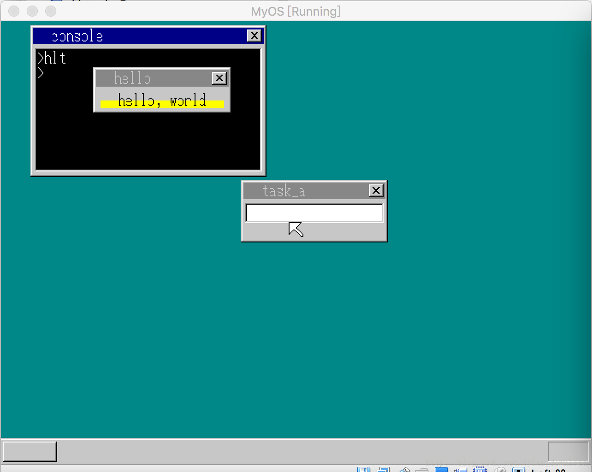
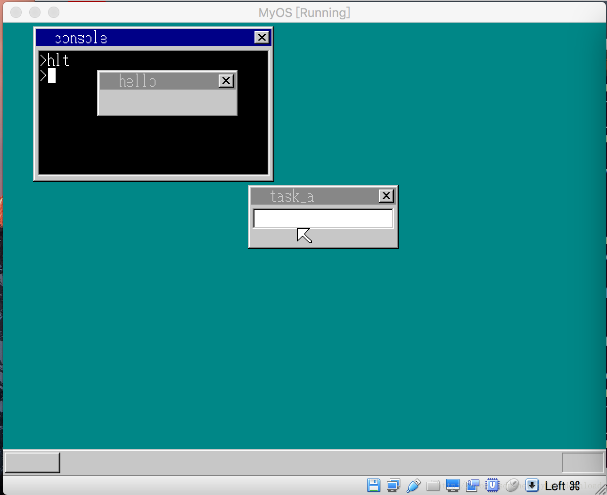

## 实现窗口创建API,由DOS进入windows


前面我们开发的能在内核上运行的应用程序，最多也就在控制台上显示字符或字符串，这种应用程序其水平只能停留在DOS时代，现在我们要开始进入win95时代，让应用程序进入图形图像形态，唯有如此，我们后面才能在内核上开发出更多精彩有趣的应用程序。

我们还是本着由简单到复杂的原则，本节完成的代码使得应用程序能在系统上创建简单的窗口，并且能在窗口上绘制色块和显示字符串，完成本节内容后，系统运行结果如下：



执行应用程序后，界面上生成一个新的窗口，系统提供的API能让应用程序生成窗口外，还能在窗口中央填充一条黄色区域，并且还提供接口，让应用程序在窗口中间输出字符串”hello world”。

首先我们看看如何实现生成窗口的API. 我们在内核中赋予它的编号为5，使用寄存器ebx存储窗口的色素缓冲区地址，esi存储窗口的宽度，edi存储窗口的高度，eax存储窗口的透明色，用ecx存储窗口名称字符串所在地址，最后使用eax存储窗口句柄以便用于后续操作。实现API的汇编代码在app_call.asm中：

```
api_openwin:  ;int api_openwin(char*buf, int xsiz, int ysiz, int col_inv, char*title)
  push edi
  push esi
  push ebx
  mov  edx, 5
  mov  ebx, [esp+16] ;buf
  mov  esi, [esp+20] ;xsiz
  mov  edi, [esp+24] ;ysiz
  mov  eax, [esp+28] ;col_inv
  mov  ecx, [esp+32] ;title
  int  02Dh
  pop  ebx
  pop  esi
  pop  edi
  ret
```

需要强调的是，当前我们的程序架构有一个特点，那就是字符串数据和其他数据有可能存在不同的地方，例如以下程序：

```
void main() {
   int buf[150*50];
   char *p = "hello";
}
```

我们知道，程序的内存分为两部分，一部分为代码段，这部分的内存存储的是程序的代码指令，另一部分是数据段，这部分存储的是程序的数据。结合这个原理，我们知道数组buf肯定存储在程序的数据段，但字符串”hello”作为常量，它会存储在程序的代码段，对此具体的解析，请参看视频。

根据上面原理，我们在实现窗口API时，绘制窗口用的像素缓冲区我们要从应用程序的数据段去获取，输出窗口的标题字符串，或是在窗口中央输出字符时，字符串的读取要从应用程序的代码段去获取，由此我们现在globle_define.h中对Buffer数据结构做一点修改：

```
struct Buffer {
    unsigned char *pBuffer;
    unsigned char *pDataSeg;
    int  length;
};

```

我们给他增加了一个变量pDataSeg，这个变量用来指向应用程序数据段的起始地址，于是cmd_hlt这个用于加载应用程序的函数也做一点小改动：

```
void cmd_hlt() {
....
    char *q = (char *) memman_alloc_4k(memman, 64*1024);
    buffer.pDataSeg = (unsigned char*)q;
    set_segmdesc(gdt+12, 64 * 1024 - 1,(int) q ,0x4092 + 0x60);

....
}
```

在代码中，我们使用pDataSeg指向了应用程序被分配的数据段的起始地址，当内核想读取应用程序的数据时，要从从pDataSeg开始。有了这点知识储备后，我们再来实现对应的窗口API.

我们先在kernel_api中添加第5号API实现，它的作用是生成一个简易窗体，其代码实现如下：

```
int* kernel_api(int edi, int esi, int ebp, int esp,
                int ebx, int edx, int ecx, int eax) {
    struct TASK *task = task_now();
    struct SHEET *sht;
    int  *reg = &eax + 1;

...
    else if (edx == 5) {
        sht = sheet_alloc(shtctl);
        sheet_setbuf(sht, (char*)(ebx + buffer.pDataSeg), esi, edi, eax);
        make_window8(shtctl, sht , (char*)(ecx+buffer.pBuffer), 0);
        sheet_slide(shtctl,sht, 100, 50);
        sheet_updown(shtctl, sht, 3);
        reg[7] = (int)sht;
    }
...
}
```

当内核发现应用程序调用编号为5的API时，它会使用我们以前开发的窗口调用生成窗口，其中sht就是窗口的句柄，同时默认把窗口的左上角定位在(100,50)。这里有个难题就是，如何把生成的窗口句柄返回给应用程序。在C语言程序中，所有函数的返回值都得存放在寄存器eax中，所以我们要想把窗口句柄返回给应用程序的话，就必须把sht的值放入到寄存器eax中，我们分析下，上面代码是如何实现这个功能的。

应用程序的API调用是通过02D号中断实现的，该中断代码如下：

```
asm_cons_putchar:
AsmConsPutCharHandler equ asm_cons_putchar - $$

        push ds
        push es

        pushad
        pushad

        ;把内存段切换到内核
        mov  ax, SelectorVram
        mov  ds, ax
        mov  es, ax 
        mov  gs, ax

        call kernel_api
        cmp eax, 0
        jne end_app

        popad
        popad
        pop es
        pop ds
        iretd
end_app:
        mov esp, [eax]
        popad
        ret

```

注意它执行了两次pushad指令，第一次pushad指令是为了保存各个寄存器的内容，第二次pushad其实是把所有通用寄存器的值作为参数传递给kernel_api,第一次pushad后堆栈上的情况如下：
stack:
edi
esi
ebp
esp
ebx
edx
ecx
eax

第二次执行pushad后，上面寄存器的内存又再次压入堆栈最为Kernel_api的参数，堆栈情况如下：
stack:
edi
esi
ebp
esp
ebx
edx
ecx
eax

reg-> edi
esi
ebp
esp
ebx
edx
ecx
eax <-reg[7]

在代码中有这么一条语句 reg = &eax+1;这条语句使得reg处于上面所示的位置，也就是说他指向了第一次pushad指令执行后压入的寄存器edi的值，于是reg[7]就指向了最底部的eax.所以语句reg[7] = sht; 它的作用就是把sht的值，也就是窗口的句柄存入了堆栈最底部的eax。

kernel_api调用结束后，回到asm_cons_putchar，先是执行了一次popad把堆栈上面存储的内容写回到寄存器，接着又执行了一次popad,这次是把堆栈下面的内容写回到寄存器，注意到我们把窗口句柄的值存入到堆栈下面的eax，当执行popad后，堆栈里面eax的内容会被该指令写入到实际寄存器eax，这样我们就把窗口句柄的值存入到了寄存器eax，于是在应用程序里，通过返回值就可以得到这个句柄了。我们看看如何在C程序中调用API:

```
void api_putchar(int c);
void api_putstr(char *s);
int  api_openwin(char *buf, int xsiz, int ysiz, int col_inv, char *title);
void main() {
    char buf[150 * 50];
    int win;
    win = api_openwin(buf, 150, 50, -1, "hello");

    return;
}
```

代码通过直接调用api_openwin创建一个窗口，它返回一个整形值win,这个值就是窗口的句柄。在kernel_api的实现中，if(edx==5)部分的代码对应的就是api_openwin的实现，此处我们需要注意的是，buf[150*50]这个数组是存储在数据段上的，根据我们前面的描述，它的地址会被存储到寄存器ebx,所以在kernel_api里的语句：
sheet_setbuf(sht, (char*)(ebx + buffer.pDataSeg), esi, edi, eax);
其中buffer.pDataSeg指向数据段的起始位置，ebx存储的是buf数组在数据段中的地址偏移，于是ebx+buffer.pDataSeg对应的就是buf数组在内存中的绝对位置。

此外字符串”hello”是存储在代码段中的，其中buffer.pBuffer指向了代码段的起始位置，根据API的实现描述，寄存器ecx存储了”hello”在代码段中的偏移，因此语句：
make_window8(shtctl, sht , (char*)(ecx+buffer.pBuffer), 0);
中的(ecx+buffer.pBuffer)对应的就是字符串”hello”在内存中的绝对位置。

上面代码完成后，把内核运行起来，指向命令hlt后结果如下：
)

接着我们看看如何在窗口上输出字符串。我们把这个api的编号设置为6，同时寄存器的作用如下：
ebx = 窗口句柄
esi = 字符串在窗口中的起始x坐标
edi = 字符串在窗口中的起始y坐标
eax = 字符的颜色
ecx = 字符的个数
ebp = 字符串的地址

对应的汇编代码实现如下(app_call.asm)：

```
api_putstrwin:   ;void api_putstrwin(int win, int x, int y, int col, int len, char* str)

 push edi
 push esi
 push ebp
 push ebx
 mov  edx, 6
 mov  ebx, [esp+20]  ;win
 mov  esi, [esp+24]  ;x
 mov  edi, [esp+28]  ;y
 mov  eax, [esp+32]  ;col
 mov  ecx, [esp+36]  ;len
 mov  ebp, [esp+40]  ;str
 int  02Dh
 pop  ebx
 pop  ebp
 pop  esi
 pop  edi
 ret
```

在kernel_api中增加标号为6的实现：

```
int* kernel_api(int edi, int esi, int ebp, int esp,
                int ebx, int edx, int ecx, int eax) {
 ....
 else if (edx == 6) {
        sht = (struct SHEET*)ebx;
        showString(shtctl, sht, esi, edi, eax, (char*)(ebp+buffer.pBuffer));
        sheet_refresh(shtctl, sht, esi, edi, esi + ecx*8, edi+16);
    }
....
}
```

最后在C程序中调用对应的API:

```
void api_putchar(int c);
void api_putstr(char *s);
int  api_openwin(char *buf, int xsiz, int ysiz, int col_inv, char *title);
void api_putstrwin(int win, int x, int y, int col, int len, char *str);
void api_boxfilwin(int win, int x0, int y0, int x1, int y1, int col);
void main() {
    char buf[150 * 50];
    int win;
    win = api_openwin(buf, 150, 50, -1, "hello");
    api_putstrwin(win, 28, 28, 0, 12, "hello, world");
    return;
}
```

完成上面代码后，把内核加载运行得到结果如下：


最后我们完成在窗口内进行颜色绘制的API,该API的编号为7，相应寄存器的作用如下：
edx = 7
ebx = 窗口句柄
eax = x0 色块的起始x坐标
ecx = y0 色块的起始y坐标
esi = x1 色块的结束x坐标
edi = y1 色块的结束y坐标
ebp = 色块的颜色

在app_call.asm中对该API的实现如下：

```
api_boxfilwin: ;void api_boxfilwin(int win, int x0, int y0,int x1, int y1, int col)
 push edi
 push esi
 push ebp
 push ebx
 mov  edx, 7
 mov  ebx, [esp+20] ;win
 mov  eax, [esp+24] ;x0
 mov  ecx, [esp+28] ;y0
 mov  esi, [esp+32] ;x1
 mov  edi, [esp+36] ;y1
 mov  ebp, [esp+40] ;col

 int 02DH
 pop  ebx
 pop  ebp
 pop  esi
 pop  edi
 ret
```

同时我们在kernel_api里添加编号为7的代码实现：

```
int* kernel_api(int edi, int esi, int ebp, int esp,
                int ebx, int edx, int ecx, int eax) {
....
else if (edx == 7) {
        sht = (struct SHEET*)ebx;
        boxfill8(sht->buf, sht->bxsize, ebp, eax, ecx, esi, edi);
        sheet_refresh(shtctl, sht, eax, ecx, esi+1, edi+1); 
    }
....
}
```

最后在C语言程序里添加相应的调用：

```
void api_putchar(int c);
void api_putstr(char *s);
int  api_openwin(char *buf, int xsiz, int ysiz, int col_inv, char *title);
void api_putstrwin(int win, int x, int y, int col, int len, char *str);
void api_boxfilwin(int win, int x0, int y0, int x1, int y1, int col);
void main() {
    char buf[150 * 50];
    int win;
    win = api_openwin(buf, 150, 50, -1, "hello");
    api_boxfilwin(win, 8, 36, 141, 43, 3);
    api_putstrwin(win, 28, 28, 0, 12, "hello, world");
    return;
}
```

运行后的结果就是我们最开始看的情景。完成这些代码之后，我们的应用程序水准就正式从DOS时代跃迁到windows时代了，今后我们将基于窗口应用的基础上，开发出更多实用性强大的应用程序。