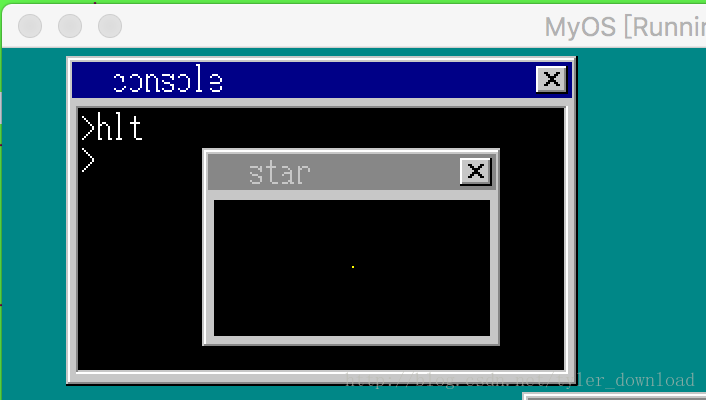
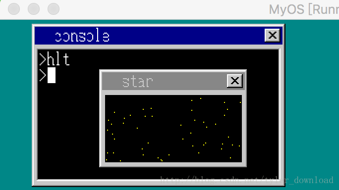
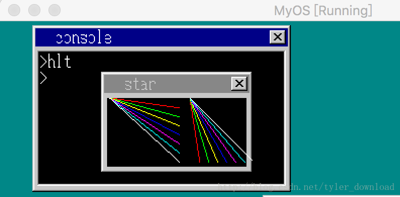

## 实现窗口图形绘制API

为了今后能在系统上开发出更复杂绚丽的图形窗口应用程序，我们需要让内核添加图形图像绘制的API,这样应用程序才可以通过API绘制足够丰富多彩的窗口应用。

任何复杂的图像，都是通过绘制相应的像素点形成的，因此要提供图形绘制API的话，提供画点API是必不可免的。为此，我们在系统内核中提供一个编号为11的API,它的作用是在窗口的指定位置绘制一个点，API的相关配置如下:
EDX = 11
EBX = 窗口句柄
ESI = 点的X坐标
EDI = 点的Y坐标
EAX= 点的颜色

在kernel_api中添加相应的实现代码：

```
int* kernel_api(int edi, int esi, int ebp, int esp,
                int ebx, int edx, int ecx, int eax) {

....
 }else if (edx == 11){
        sht = (struct SHEET*)ebx;
        sht->buf[sht->bxsize * edi + esi] = eax;
        sheet_refresh(shtctl, sht, esi, edi, esi + 1, edi + 1);
    }
....
}
```

在api_call.asm中添加对应的汇编代码：

```
api_point:  ;void api_point(int win, int x, int y, int col)
  push edi
  push esi
  push ebx
  mov  edx, 11
  mov  ebx, [esp+16]  ;win
  mov  esi, [esp+20]  ;x
  mov  edi, [esp+24]  ;y
  mov  eax, [esp+28]  ;col
  int  02Dh
  pop  ebx
  pop  esi
  pop  edi
  ret
```

然后我们在app.c中调用API,在一个窗口上绘制一个亮点：

```
void api_putchar(int c);
void api_putstr(char *s);
int  api_openwin(char *buf, int xsiz, int ysiz, int col_inv, char *title);
void api_putstrwin(int win, int x, int y, int col, int len, char *str);
void api_boxfilwin(int win, int x0, int y0, int x1, int y1, int col);
void api_point(int win, int x, int y, int col);
void api_refreshwin(int win, int x0, int y0, int x1, int y1);
void api_linewin(int win, int x0, int y0, int x1, int y1, int col);

#define _A  214013LL
#define _B  2531011LL
int ran = 23;
int  rand() {
  return ((ran = ran * _A + _B)>>16) & 0x7fff;
}

void main() {
    char buf[160 * 100];
    int win;
    win = api_openwin(buf, 160, 100, -1, "star");
    api_boxfilwin(win, 6, 26, 143, 93, 0);
    api_point(win, 75, 59, 3);

    return;
}
```

上面代码编译，把系统加载运行后，效果如下：




在窗口的中央有一个小黄点。

我们再把画点功能增强一下，多画几个随机点：

```
void api_putchar(int c);
void api_putstr(char *s);
int  api_openwin(char *buf, int xsiz, int ysiz, int col_inv, char *title);
void api_putstrwin(int win, int x, int y, int col, int len, char *str);
void api_boxfilwin(int win, int x0, int y0, int x1, int y1, int col);
void api_point(int win, int x, int y, int col);

#define _A  214013LL
#define _B  2531011LL
int ran = 23;
int  rand() {
  return ((ran = ran * _A + _B)>>16) & 0x7fff;
}

void main() {
    char buf[160 * 100];
    int win;
    win = api_openwin(buf, 150, 100, -1, "star");
    api_boxfilwin(win, 6, 26, 143, 93, 0);
    //api_point(win, 75, 59, 3);
    int i = 0;
    int x = 0;
    int y = 0;
    for (i = 0; i < 50; i++) {
        x = rand() % 137 + 6;
        y = rand() % 67 + 26;
        api_point(win, x, y, 3);
    }


    return;
}
```

代码中的rand()的作用是模拟生成随机数，上面的代码运行后，效果如下：



由于每次画一个点，我们总要刷新窗口，这么做会导致窗口绘制效率的低下，因此我们再做一个API,让它编号为12，专门用来刷新窗口，这样程序可以把所有点都绘制完后，调用该API刷新窗口一次就可以了。API的配置如下：
EDX = 12
EBX = 窗口句柄
EAX = x0
ECX = y0
ESI = x1
EDI = y1

在kernel_api中的实现如下：

```
int* kernel_api(int edi, int esi, int ebp, int esp,
                int ebx, int edx, int ecx, int eax) {
                ....
    else if (edx == 11){
        sht = (struct SHEET*)ebx;
        sht->buf[sht->bxsize * edi + esi] = eax;
//        sheet_refresh(shtctl, sht, esi, edi, esi + 1, edi + 1);
    }
    else if (edx == 12) {
        sht = (struct SHEET*)ebx;
        sheet_refresh(shtctl, sht, eax, ecx, esi, edi);
    }
                ....
}
```

对应的在api_call.asm中汇编代码实现为:

```
api_refreshwin:  ;void api_refreshwin(int win, int x0, int y0, int x1, int y1)
  push  edi
  push  esi
  push  ebx
  mov   edx, 12
  mov   ebx, [esp+16] ; win
  mov   eax, [esp+20] ;x0
  mov   ecx, [esp+24] ;y0
  mov   esi, [esp+28] ;x1
  mov   edi, [esp+32] ;y1
  int   02Dh
  pop   ebx
  pop   esi
  pop   edi
  ret
```

app.c中的实现也相应的做些修改：

```
void api_putchar(int c);
void api_putstr(char *s);
int  api_openwin(char *buf, int xsiz, int ysiz, int col_inv, char *title);
void api_putstrwin(int win, int x, int y, int col, int len, char *str);
void api_boxfilwin(int win, int x0, int y0, int x1, int y1, int col);
void api_point(int win, int x, int y, int col);
void api_refreshwin(int win, int x0, int y0, int x1, int y1);

#define _A  214013LL
#define _B  2531011LL
int ran = 23;
int  rand() {
  return ((ran = ran * _A + _B)>>16) & 0x7fff;
}

void main() {
    char buf[160 * 100];
    int win;
    win = api_openwin(buf, 150, 100, -1, "star");
    api_boxfilwin(win, 6, 26, 143, 93, 0);
    //api_point(win, 75, 59, 3);
    int i = 0;
    int x = 0;
    int y = 0;
    for (i = 0; i < 50; i++) {
        x = rand() % 137 + 6;
        y = rand() % 67 + 26;
        api_point(win, x, y, 3);
    }

    api_refreshwin(win, 6, 26, 154, 90);

    return;
}
```

上面代码运行后，结果跟上次一样，唯一的不同在于，它的效率提高了很多。

最后，我们在添加一个画直线的API，它的编号为13，它的相关配置如下：
EDX = 13
EBX = 窗口句柄
EAX = x0
ECX = y0
ESI = x1
EDI = y1
EBP = 颜色

直线的绘制其实属于计算机图形学的内容，在这里我们直接给出代码，但不对它的原理做太多解释，只要你知道，调用下面的函数能在给定的两个坐标点间绘制直线就可以了，在write_vga_desktop.c中添加下面函数：

```
int api_linewin(struct SHEET *sht, int x0, int y0, int x1, int y1, int col) {
    int i, x, y, len, dx, dy;
    dx = x1 - x0;
    dy = y1 - y0;
    x = x0 << 10;
    y = y0 << 10;

    if (dx < 0) {
        dx = -dx;
    }
    if (dy < 0) {
        dy = -dy;
    }

    if (dx >= dy) {
        len = dx + 1;
        if (x0 > x1) {
            dx = -1024;
        } else {
            dx = 1024;
        }

        if (y0 <= y1) {
            dy = ((y1 - y0 + 1) << 10) / len;
        } else {
            dy = ((y1 - y0 - 1) << 10) / len;
        }
    } else {
        len = dy + 1;
        if (y0 > y1) {
            dy = -1024;
        } else {
            dy = 1024;
        }

        if (x0 <= x1) {
           dx = ((x1 - x0 + 1) << 10) / len;
        } else {
           dx = ((x1 - x0 - 1) << 10) / len;
        }
    }

    for (i = 0; i < len; i++) {
        sht->buf[(y >> 10) * sht->bxsize + (x>>10)] = col;
        x += dx;
        y += dy;
    }
}

int* kernel_api(int edi, int esi, int ebp, int esp,
                int ebx, int edx, int ecx, int eax) {
                ....
                else if (edx == 13) {
        sht = (struct SHEET*)ebx;
        api_linewin(sht, eax, ecx, esi, edi, ebp);
    }
                ....
}
```

在api_call.asm中添加相应的汇编代码：

```
api_linewin:   ;void api_linewin(int win, int x0, int y0, int x1, int y1, int col)
  push edi
  push esi
  push ebp
  push ebx
  mov  edx, 13
  mov  ebx, [esp+20] ;win
  mov  eax, [esp+24] ;x0
  mov  ecx, [esp+28] ;y0
  mov  esi, [esp+32] ;x1
  mov  edi, [esp+36] ;y1
  mov  ebp, [esp+40] ;col
  int  02Dh

  pop  ebx
  pop  ebp
  pop  esi
  pop  edi
  ret
```

接着修改app.c的内容，在里面调用画直线API在窗口上绘制直线：

```
void api_putchar(int c);
void api_putstr(char *s);
int  api_openwin(char *buf, int xsiz, int ysiz, int col_inv, char *title);
void api_putstrwin(int win, int x, int y, int col, int len, char *str);
void api_boxfilwin(int win, int x0, int y0, int x1, int y1, int col);
void api_point(int win, int x, int y, int col);
void api_refreshwin(int win, int x0, int y0, int x1, int y1);
void api_linewin(int win, int x0, int y0, int x1, int y1, int col);

#define _A  214013LL
#define _B  2531011LL
int ran = 23;
int  rand() {
  return ((ran = ran * _A + _B)>>16) & 0x7fff;
}

void main() {
    char buf[160 * 100];
    int win;
    win = api_openwin(buf, 150, 100, -1, "star");
    api_boxfilwin(win, 6, 26, 143, 93, 0);
    //api_point(win, 75, 59, 3);
    int i = 0;

    for (i = 0; i < 8; i++) {
        api_linewin(win, 8, 26, 77, i*9 + 26, i);
        api_linewin(win, 88, 26, i*9+88, 89, i);
    }

    api_refreshwin(win, 6, 26, 154, 90);

    return;
}

```

上面代码编译运行后，效果如下：



我们看到，直线并不是很‘直’，其中的锯齿比较严重，不过属于可以忍受的范围之内。