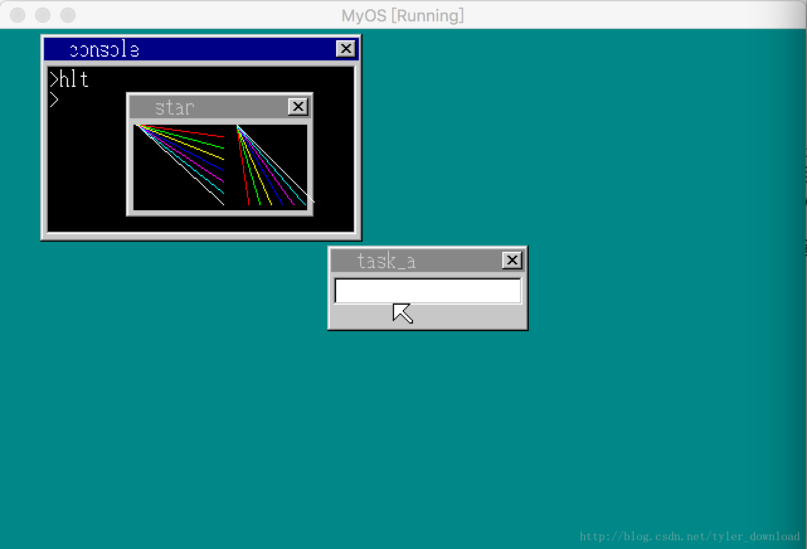
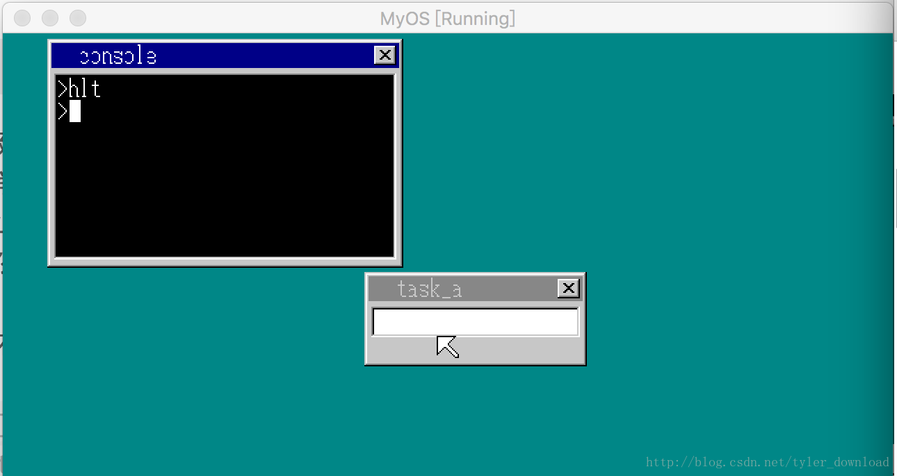

## 键盘和窗口关闭API


在上节，我们成功的运行起了窗口程序，但是生成的窗口无法关闭，本节我们要在内核提供一个关闭窗口的API,还要提供一个键盘消息获取的API,这样应用程序就可以等待一个某个按键，当用户按下按键后，就可以调用窗口关闭API将窗口从桌面上消除。

窗口关闭API的设置如下：
EDX = 14
EBX = 窗口句柄

然后在kernel_api中添加如下代码：

```
int* kernel_api(int edi, int esi, int ebp, int esp,
                int ebx, int edx, int ecx, int eax) {
....
else if (edx == 14) {
        sheet_free(shtctl, (struct SHEET*)ebx);
    }
....
}
```

接着我们在win_sheet.h中增加sheet_free函数的定义：

```
void sheet_free(struct SHTCTL* shtctl,struct SHEET *sht);
```

在win_sheet.c 中增加对它的实现：

```
void sheet_free(struct SHTCTL *shtctl, struct SHEET *sht) {
    if (sht->height >= 0) {
        sheet_updown(shtctl, sht, -1);
    }

    sht->flags = 0;
    return;
}
```

最后我们在api_call.asm中增加代码，把内核API跟应用程序的调用接口衔接起来：

```
api_closewin: ;void api_closewin(int win);
  push ebx
  mov  edx, 14
  mov  ebx, [esp+8]
  int  02Dh
  pop  ebx
  ret
```

完成上面代码后，在应用程序中直接调用api_closewin就可以关闭窗口了，然而如果直接调用的话，窗口便会在桌面上出现后就立马消失，为了能让窗口在桌面上存在一段时间后再关闭，我们可以在内核提供一个键盘消息API,这样应用程序就可以监控按键消息，当用户按下回车键后再调用api_closewin关闭窗口。

键盘API的配置如下：
EDX = 15
EAX = 0 表示键盘没有输入时,API直接返回-1，不休眠
= 1 表示键盘没有输入时进入休眠状态，知道有键盘输入为止
EAX = 输入的键盘字符扫描码

于是我们在kernel_api中添加如下代码：

```
int* kernel_api(int edi, int esi, int ebp, int esp,
                int ebx, int edx, int ecx, int eax) {
....
    else if (edx == 15) {
         handle_keyboard(task, eax, reg);
    }
....
}
```

handle_keyboard用于监控键盘输入，一旦有键盘输入后，将键盘的扫描码放入reg，这样就能把结果返回给用户程序了。它的实现如下：

```
int handle_keyboard(struct TASK *task, int eax, int* reg) {
    int i;
    struct TIMER *timer = g_Console.timer;
    for (;;) {
        if (fifo8_status(&task->fifo) == 0) {
            if (eax != 0) {
               continue;
            } else {
                io_sti();
                reg[7] = -1;
                return 0;
            }

       }

       i = fifo8_get(&task->fifo);
       if (i <= 1) {
           timer_init(timer, &task->fifo, 1);
           timer_settime(timer, 50);
       }else if (i == 2) {
           g_Console.cur_c = COL8_FFFFFF;
       } else {
            reg[7] = i;
            return 0;
       }

    }

    return 0;
}
```

task对应的是控制台进程对象，由于用户程序是由控制台启动的，因此用户程序的进程对象跟控制台是一样的。在死循环里，代码看看控制台进程的队列有没有输入，如果没有输入，并且eax的值是0，那么它直接把-1返回给用户程序，如果eax的值是0，那么循环继续，知道等待到有用户输入为止。

当输入队列返回的值小于2时，那么该值对应的是光标闪烁的消息，用于窗口出现在控制台的上方，所以我们代码中光标的颜色设置成黑色，这样光标就无需在控制台上闪来闪去了。

如果从队列中返回来的值大于2，那表明内核获取了键盘输入，于是我们直接把键盘扫描码放入reg,直接返回给应用程序。接着再api_call.asm中完成相应汇编代码：

```
api_getkey:  ;int api_getkey(int mode)
  mov  edx, 15
  mov  eax, [esp+4] ;mode
  int  02Dh
  ret
```

有了上面的实现后，我们就可以把对这两个API的调用添加到应用程序中，相关代码如下：

```
void api_putchar(int c);
void api_putstr(char *s);
int  api_openwin(char *buf, int xsiz, int ysiz, int col_inv, char *title);
void api_putstrwin(int win, int x, int y, int col, int len, char *str);
void api_boxfilwin(int win, int x0, int y0, int x1, int y1, int col);
void api_point(int win, int x, int y, int col);
void api_refreshwin(int win, int x0, int y0, int x1, int y1);
void api_linewin(int win, int x0, int y0, int x1, int y1, int col);
void api_closewin(int win);
int  api_getkey(int mode);

#define _A  214013LL
#define _B  2531011LL
int ran = 23;
int  rand() {
  return ((ran = ran * _A + _B)>>16) & 0x7fff;
}

void main() {
    char buf[160 * 100];
    int win;
    win = api_openwin(buf, 150, 100, -1, "star");
    api_boxfilwin(win, 6, 26, 143, 93, 0);
    int i = 0;


    for (i = 0; i < 8; i++) {
        api_linewin(win, 8, 26, 77, i*9 + 26, i);
        api_linewin(win, 88, 26, i*9+88, 89, i);
    }

    api_refreshwin(win, 6, 26, 154, 90);

    for(;;) {
        if (api_getkey(1) == 0x1c) {
            break;
        }
    }
    api_closewin(win);    
    return;
}
```

在代码中，我们创建一个窗口后，进入一个死循环，在循环中我们调用api_key获取键盘消息，输入1是为了没有键盘输入时，持续在内核中等待，知道有键盘输入为止，如果有键盘输入，并且其扫描码是0x1C,也就是用户按下了回车键，那么程序结束循环往下走，调用api_closewin将窗口关闭。

上面代码运行后，在控制台中输入hlt，启动应用程序，可以看到有一个窗口出现在桌面上：



此时我们在键盘上按下回车键，你会发现窗口消失了：

