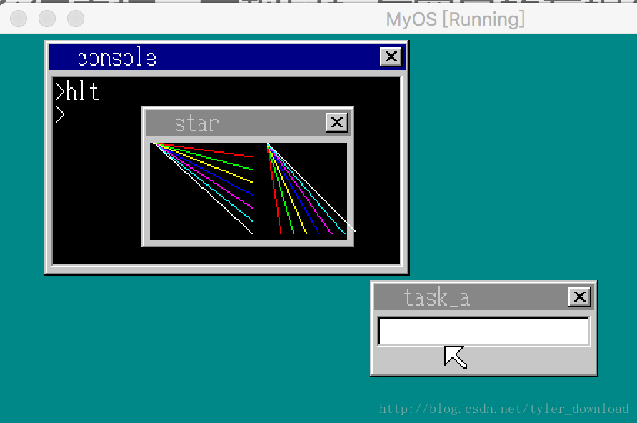
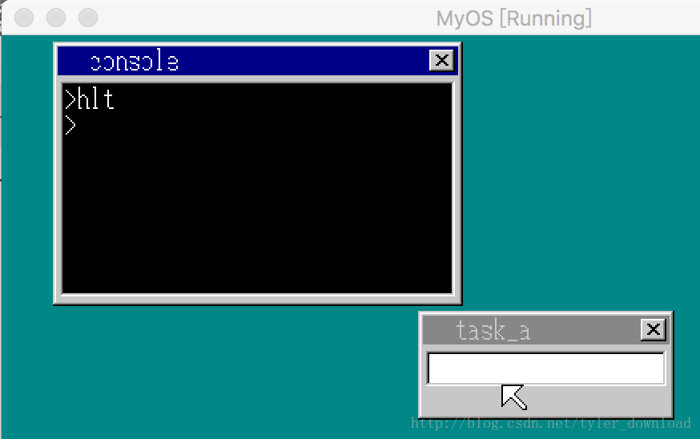
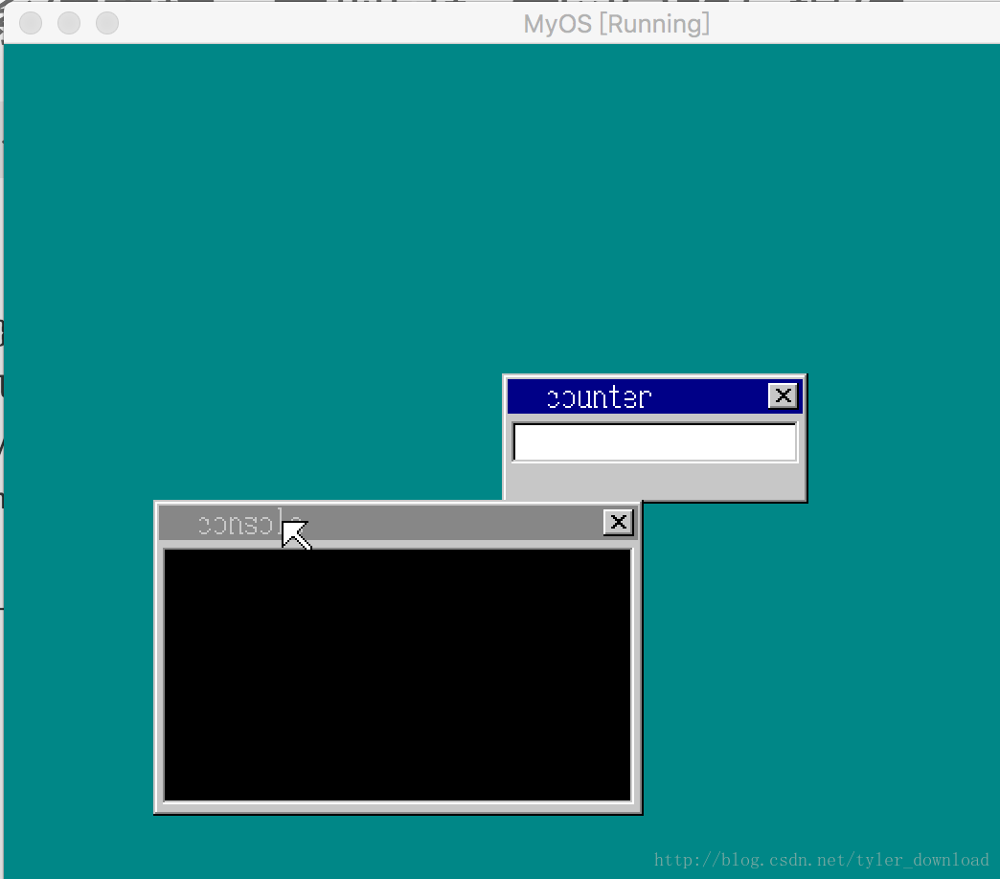
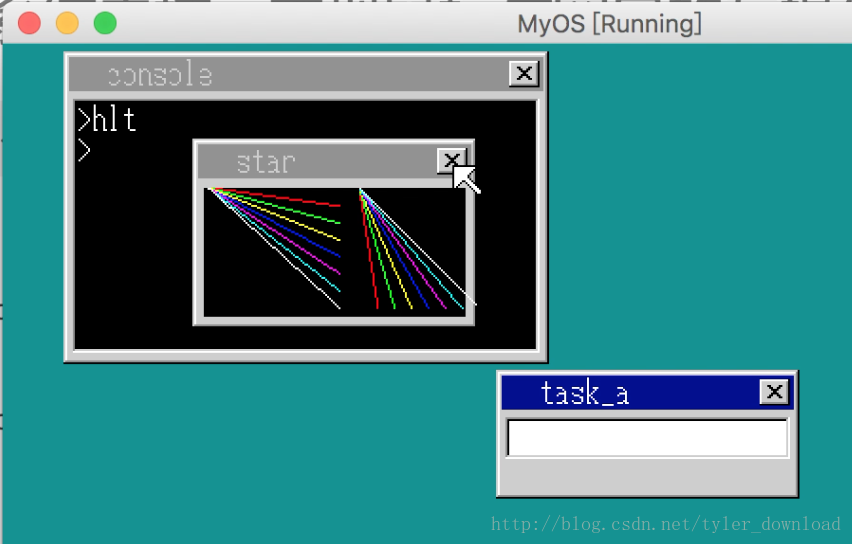
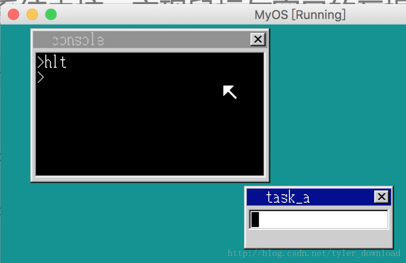

## 实现鼠标与窗口的互操作

内核开发到现在，我们已经可以通过应用程序实现多个窗口的创建。当前存在的问题是，窗口与窗口之间无法相互切换，同时鼠标也无法用来移动窗口，更令人郁闷的是，窗口的右上角有个小叉叉，但是用鼠标去点击时，窗口并没有像设想中的那样关闭掉，本节我们要添加相互功能，让鼠标能够拖拽窗体，并且使得鼠标点击窗口关闭按钮后，窗口能及时消失。

为了调试方便，我们先开发一个小功能，点击一下键盘上的按键‘q’后，系统能把处于最底层的窗口放到最上面，相关实现代码如下,在write_desktop_vga.c中添加如下代码：

```
void CMain(void) {
....
for(;;) {
    if (fifo8_status(&keyinfo) + fifo8_status(&mouseinfo) +
           fifo8_status(&timerinfo) == 0) {
        ....
        if (data == 0x10) {
           sheet_updown(shtctl, shtctl->sheets[1], shtctl->top - 1);
        }
        ....
   }
}
....
}
```

按键q的扫描码是0x10,当主进程接收到按键消息，并且判断按下的就是’q’键，那么它调用sheet_updown函数把处于最底层的窗口挪到倒数第二高的位置，处于最底层的窗口是shtctl->sheets[1], shtctl->sheets[0]对应的是桌面，同时处于处于最高位置的图层必须是鼠标，它对应的高度就是shtctl->top，我们提升窗口的高度时，不可让窗口高过鼠标，要不然鼠标挪如窗口时，窗口会把鼠标给盖住。上面的代码编译进内核，在虚拟机上加载后，运行如下：


启动应用程序时，应用程序窗口会处于控制台窗口之上，此时点击一下键盘上的’q’键，低下的控制台窗口会跳出来覆盖住应用程序窗口：



如果此时你再次点击’q’键，底下的应用程序窗口会重新跳出来，覆盖控制台窗口。接下来我们看看，如何使用鼠标拖拽窗口。要实现窗口拖拽，首先要判断鼠标落在窗体上，而且是落在窗体的非透明区域，并且再判断鼠标是否落在窗口的标题栏，这个个条件满足后，系统开始记录鼠标在窗体标题栏按下左键时所作的位置坐标，当鼠标移动后，系统计算移动后的位置相对于左键按下时位置的偏移，然后把窗体按照偏移进行挪动就可以了。相关代码实现如下，在内核的C语言部分write_vga_desktop.c中，先添加两个全局变量，用于记录鼠标左键按下时的坐标：

```
static int mx = 0, my = 0, mmx = -1, mmy = -1;
....
static struct SHEET *mouse_clicked_sht;
```

有关鼠标的处理，都在函数show_mouse_info里面实现，所以我们要修改该函数的代码：

```
void  show_mouse_info(struct SHTCTL *shtctl, struct SHEET *sht_back,struct SHEET *sht_mouse) {
   ....
   int j; 
   struct SHEET *sht = 0;
   ....
   if (mouse_decode(&mdec, data) != 0) {
         computeMousePosition(shtctl, sht_back, &mdec);
        //挪动鼠标图案
         sheet_slide(shtctl, sht_mouse, mx, my);
         if ((mdec.btn & 0x01) != 0) { 
           //鼠标左键被按下时进入这里
            if (mmx < 0) {
                //遍历所以窗体，看鼠标当前落入哪个窗体区域
                for (j = shtctl->top - 1; j > 0; j--) {
                    sht = shtctl->sheets[j];
                    x = mx - sht->vx0;
                    y = my - sht->vy0;
                    if (0 <= x && x < sht->bxsize && 0 <= y && y < sht->bysize) {
                        if (sht->buf[y * sht->bxsize + x] != sht->col_inv) {
                        //找到包含鼠标的窗体，并且鼠标所在的窗体区域不属于窗体的透明区，那么调整窗体高度，让他显示在桌面上
                            sheet_updown(shtctl ,sht, shtctl->top - 1);
                            if (3 <= x && x <sht->bxsize - 3 && 3 <= y && y < 21) {
                            //如果鼠标落入窗体的标题栏，记录当前鼠标所在坐标，以及当前窗体的句柄
                                mmx = mx;
                                mmy = my;
                                mouse_clicked_sht = sht;
                            }
                            break;
                        }
                    }   
                }
            } else {
                //鼠标挪动后，计算当前位置与鼠标点击时所在位置的偏移，然后根据偏移挪动窗体
                x = mx - mmx;
                y = my - mmy;
                sheet_slide(shtctl, mouse_clicked_sht, mouse_clicked_sht->vx0 + x, mouse_clicked_sht->vy0 + y);
                mmx = mx;
                mmy = my;
            }  
         } else {
           //鼠标左键松开后，把mmx重置为-1
            mmx = -1;
          // showString(shtctl, sht_back, 0, 207, COL8_FFFFFF, "set mmx to -1");
         }
    }
}
```

新增代码的逻辑在注释中已经详细说明了，把上面的代码编译如内核后，运行起来效果如下



以前控制台窗口始终位于桌面的左上角，上面代码完成我，我们可以通过鼠标把控制台窗体拖拽到任何位置。

窗体右上角的叉叉按钮存在了好久了，你是不是一直想去点击一下，以便把窗口关掉呢，接下来，我们完成点击右上角按钮关闭窗体的功能。首先我们把每个窗口句柄跟产生它的进程对象关联起来，现在win_sheet.h和win_sheet.c中添加如下内容：

```
struct SHEET {
    unsigned char *buf;
    int bxsize, bysize, vx0, vy0, col_inv, height, flags;
    struct TASK *task;
};
```

在创建窗体时，把对应的进程对象跟窗口句柄关联起来：

```
struct SHEET *sheet_alloc(struct SHTCTL *ctl) {
    struct SHEET *sht;
    int i;
    for (i = 0; i < MAX_SHEETS; i++) {
        if (ctl->sheets0[i].flags == 0) {
            sht = &ctl->sheets0[i];
            ctl->sheets[i] = sht;
            sht->flags = SHEET_USE;
            sht->height = -1;
            sht->task = task_now();
            return sht;
        }
    }

    return 0;
}
```

鼠标左键点击时，内核需要判断当时鼠标所在位置是否位于右上角按钮内，如果是，那么结束窗口所在进程，并把窗口从桌面上清除，代码如下：

```
void  show_mouse_info(struct SHTCTL *shtctl, struct SHEET *sht_back,struct SHEET *sht_mouse) {
....
if (mouse_decode(&mdec, data) != 0) {
         computeMousePosition(shtctl, sht_back, &mdec);

         sheet_slide(shtctl, sht_mouse, mx, my);
         if ((mdec.btn & 0x01) != 0) { 
         ....
         if (sht->bxsize - 21 <= x && x < sht->bxsize - 5 && 5 <= y && y < 19 && sht->task != 0) {
         //如果鼠标左键点击时，鼠标位于右上角的按钮范围内，则结束窗口对应的进程，同时将窗口从桌面上清除
                                    io_cli();
                                    sheet_free(shtctl, sht);
                                    int addr_code32 = get_code32_addr();
                                    sht->task->tss.eip = (int)kill_process - addr_code32;
                                    io_sti();
                            }
                            break;
         ....
         }
}
....
}
```

完成上面代码，把内核编译加载到虚拟机后，情况如下：




执行应用程序，启动一个窗口，把鼠标挪到窗口的右上角按钮，鼠标左键点击后，窗口会被关闭：




完成这项代码后，系统就可以支持鼠标与窗口的互动了，我们系统的灵活性和丰富性又增强了不少。